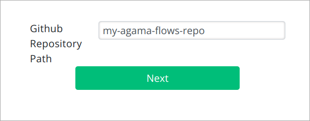
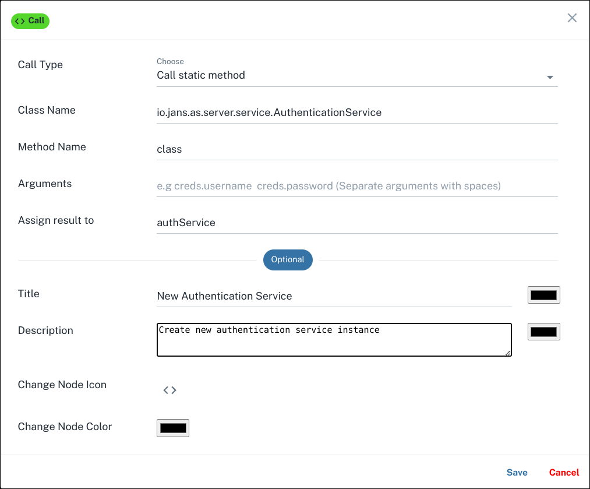
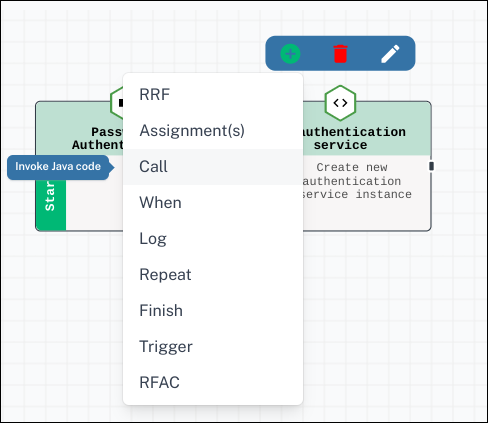
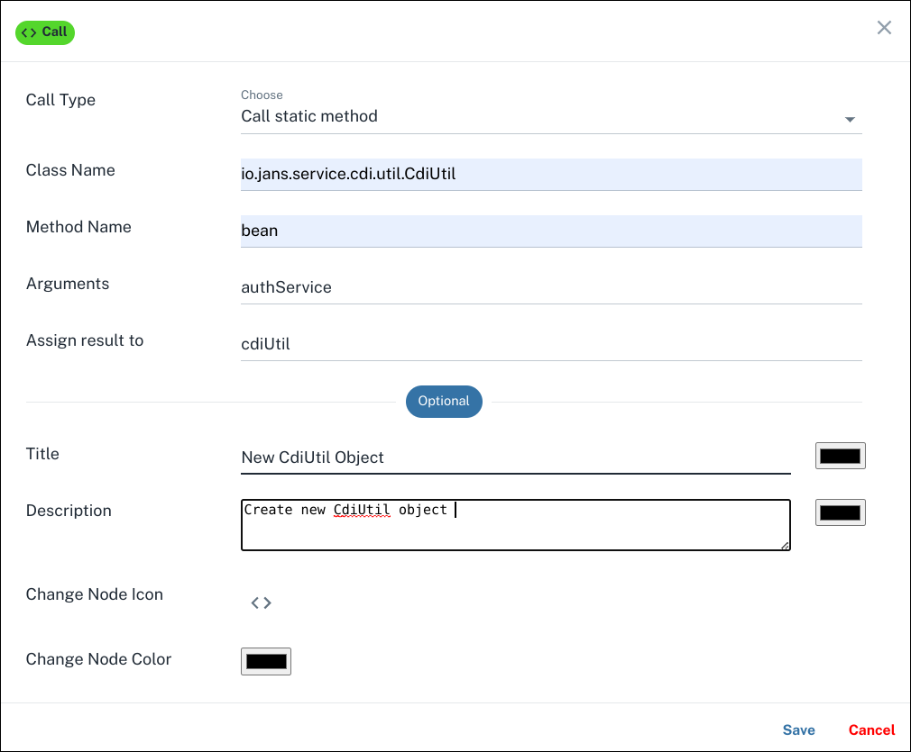
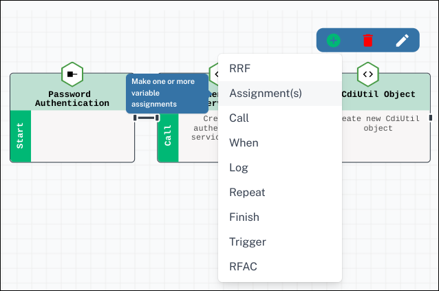
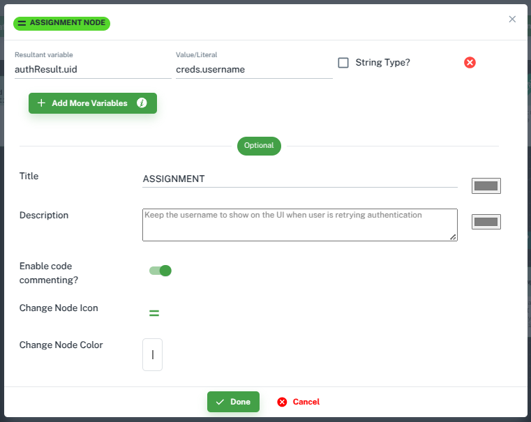
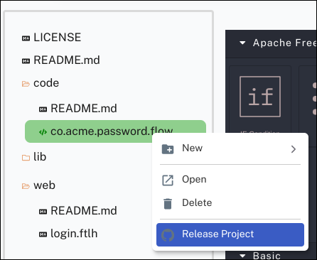
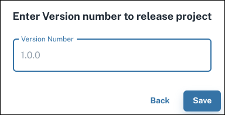

# Quick Start Using Agama Lab

In this quick start guide, we will see how to build, deploy and test a simple password based authentication flow using
Agama and [Agama Lab](https://cloud.gluu.org/agama-lab). 

[Agama Lab](https://cloud.gluu.org/agama-lab) is an online visual editor to build these authentication flows. The flow
built on Agama Lab is packaged as a `.gama` project file. `.gama` package needs to be manually deployed on 
Janssen Server where Agama engine will execute the flow when authentication request is received.

Major Steps involved in this process are:
- Designing a flow using Agama labs
- Enable Agama engine on Janssen Server
- Deploying `.gama` on Janssen Server
- Testing the flow

## Prerequisites

- Janssen Server instance
- A public GitHub repository with at least one prior commit

## Create Agama Project

To design a simple username-password based user authentication [Agama Labs](https://cloud.gluu.org/agama-lab/) follow 
the steps below.

### Design The Flow

#### Log Into Agama Lab

#### Create A Project

1. Use [Agama Lab](https://cloud.gluu.org/agama-lab) online tool to make an agama flow.

    Hit the above URL and you will see a page with Login with GitHub button. Click on it to go to GitHub authentication page.

    

2. Authenticate on GitHub authentication page.

    

3. Input the name of the repository where Agama Lab should commit the project artifacts. Hit `Next`

    

4. Project listing page is shown. All the existing projects for your GitHub user are listed here. Projects can be editted, deleted
from project listing page.

    

5. To create new project, click on the `New Project` button.

    

6. Enter the name and the description for the new project and click `Create` button.
    This will create a new project and it'll be visible on the project listing page.

    


#### Configure The Authentication Flow

Create/import

1. Create Flow File

    Click on :material-arrow-top-right:. 
    This will open flow authering view with a blank canvas. To start creating the flow, we need to create a `Flow File`. To
    do that, 
    
    _Right click on `code` and then `New`. Select `Flow File`_
    
    

2. Give name and description for flow file and then click `Create`

    

3. Newly created flow file has one stage in it by default. Right-clicking on any will allow you to edit the existing 
stage using :material-pencil: and add further stages by clicking :material-plus-circle:

    

   4. Create AuthenticationService [call]() block

      

      

      

   3. Create CdiUtil call block

      
   
      

   4. Create [assignment]() block

      

      

   5. Create [repeat]() block

      

      

   6. Create [RRF]() block

      

      

      Save the flow. 

   7. Create CdiUtil call block

      

      

   8. Create [assignment]() block

      

      

   9. Create conditional [When]() block

      

      

10. Create [finish]() blocks

      
   
      
   
      
   
      

   Complete flow looks like below:

      

11. Generated code

      ```
       Flow co.acme.password
        Basepath ""
       authService = Call io.jans.as.server.service.AuthenticationService#class
       cdiUtil = Call io.jans.service.cdi.util.CdiUtil#bean authService
       authResult = {}
       Repeat 3 times max
         creds = RRF "login.ftlh" authResult
         authResult.success = Call cdiUtil authenticate creds.username creds.password
         authResult.uid = creds.username
         When authResult.success is true
           Finish authResult.uid
       Finish false
      ```

### Design User Interface

In the RRF configuration step in the flow above, we used `login.ftlh` to render the login page elements.
We need to provide `login.ftlh` to the Agama project so that the flow can use it during the flow execution.
Use the steps below to create the page.

1. Create a template file

      

            

2. Use the visual editor

      

      

   ```html
   <!doctype html>
   <html xmlns="http://www.w3.org/1999/xhtml">
       <head>
         <title> Jans Agama Basic Auth flow </title>
       </head>
       <body>
   
         <h2>Welcome</h2>
         <hr />
         
         [#if !(success!true)]
           <p class="fs-6 text-danger mb-3">${msgs["login.errorMessage"]}</p>
         [/#if]
           
         <hr />
         <form method="post" enctype="application/x-www-form-urlencoded">
           
           <div>
               Username: <input type="text" class="form-control" name="username" id="username" value="${uid!}" required>
           </div>
           
           <div>
               Password: <input type="password" class="form-control" id="password" name="password">
           </div>
           
           <div>
               <input type="submit" class="btn btn-success px-4" value="Login">
           </div>
         </form>
       </body>
       <style>
           input {
               border: 1px solid #000000;
           }
       </style>
   </html>
   ```

     

     

3. Customise using CSS and resources

### Release Project To GitHub
  
  This will attemp to create a tag in your repository.
  

  

  

  

## Enable Agama using TUI

- Access TUI
- Make sure Agama engine is enabled ( )

## Deploy Agama Project

!!! Note
    Please ensure that Agama engine and scripts are [enabled](../agama/engine-config.md#engine-availability) in Janssen
    Server deployment

1. Download `.gama` file from GitHub repository
2. Open [TUI](../../config-guide/jans-tui/README.md) using following commands on Janssen Server
     
     ```
     cd /opt/jans/jans-cli
     python3 jans_cli_tui.py
     ```
   
3. Navigate to `Auth Server` > `Agama` > `Upload Project`. Select the `.gama` file to upload.

## Test

1. [Setup](https://github.com/JanssenProject/jans/tree/main/demos/jans-tent) Janssen Tent
2. Change configuration as given below in `config.py`

     ```
     ACR_VALUES = "agama"
     ```

     ```
     ADDITIONAL_PARAMS = {'agama_flow': 'co.acme.password.flow'}
     ```
3. Run Tent test by accessing it via browser

## Importing And Exporting the Flow From Agama Lab
## Notes:

- more details about inputs given on this screen: https://github.com/GluuFederation/private/wiki/Agama-Lab-Quick-Start-Guide#2
  like what are the available values and how to use them
- give a flow chart that depicts auth journey