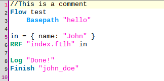

---
tags:
  - administration
  - developer
  - agama
---

# Quick start

In this page a high-level overview of the flow development process is presented. Readers will be able to take a peep at the overall experience through a simple "hello world" example.

## The basics

These are key concepts to keep in mind before starting.

### Enable the engine

Ensure the Agama engine is enabled in your installation. Do the following:

- Enable Agama bridge script. You can find details on how to manage custom scripts in [this](../../config-guide/jans-cli/im/im-custom-scripts.md) page. Here, set property `enabled` to `true` and increase `revision` value by one
- Set `enabled` property in Agama configuration to `true`. This is located in the `agamaConfiguration` section of the [auth server configuration](../../config-guide/jans-cli/im/im-jans-authorization-server.md)

### Flow data

Every flow has some associated information. At minimum this is required:

- Qualified name: The flow identifer. This is normally expressed using an Internet domain reverse notation, e.g. `co.acme.SmsOTP`
- Source code: The flow implementation using Agama DSL

Optional details include:

- Enabled status: Determines if the flow can be launched directly from a web browser
- Display name: A short descriptive name of the flow intended for humans, e.g. "passwordless authentication"
- Description
- Flow author
- Properties: A JSON document often used to supply configuration parameters

More on how to supply this data later.

### Assets

These are elements used to build the user interface such as templates, images, stylesheets, and javascript code.

Templates are written using [FreeMarker Template Language](https://freemarker.apache.org/docs/index.html) (FTL). This is a simple and highly productive language to produce HTML and other forms of output. By convention templates generating HTML markup in Agama have the extension `ftlh`.

In Agama, templates must reside in the filesystem under `/opt/jans/jetty/jans-auth/agama/ftl` directory. All other assets (CSS, JS, etc.) are expected to be under `/opt/jans/jetty/jans-auth/agama/fl`. Later we'll see a flow can designate a given directory for its assets, thus, such directory must be created at both places (inside `ftl` and `fl` folders).

### Java classes

Agama DSL supports calling Java code - it is designed to force developers use Java when tasks cannot be implemented by simple data manipulation or comparison of values. Any public class or interface in the classpath of jans-auth webapp can be used for this purpose. Additionally the classpath can be augmented by uploaded source files on the fly. Click [here](./java-classpath.md) to learn more. 

### Client application

This is the target application that end-users will get access to after a successful authentication. In OpenId Connect terms, a "Relying Party" or RP. It is advisable to have this application ready before proceeding to the next section of this document.

Depending on the tools and acquaintance with OpenId Connect protocol, this may take some time for developers. Note it may also require to apply configurations in the (Janssen) server for this purpose.

A low resistance path we recommend is trying the stripped down [Javascript client example](https://nat.sakimura.org/2014/12/10/making-a-javascript-openid-connect-client/) by Nat Sakimura. Here, the discovery URL is your server's URL. 

Another alternative is trying [mod_auth_openidc](https://github.com/zmartzone/mod_auth_openidc), an Apache 2 server module that implements RP functionality.

## Hello world sample flow

Your first taste of Agama will be through a dummy "hello world" flow. Here, the end-user will be presented a salutation page with a submit button which once pressed, will finish the process. For the sake of simplicity, the user to be authenticated will be a hardcoded one. This way we avoid gathering data at the browser and any other further processing in order to keep the example as short and simple as possible.

!!! Note
    While in most cases flows need to externally "receive" data and configuration parameters to properly drive their behavior, this is not the case here. The flow will only show a static salutation message and will terminate logging in a certain user, if existing.

### Flow code

The [source code](https://github.com/JanssenProject/jans/raw/main/docs/admin/developer/agama/test) (written in agama DSL dialect) is shown below. Note the absence of parenthesis and semicolons - in general the syntax is very lightweight.



A line-by-line description follows:

- Line 2: every flow starts with the `Flow` keyword followed by a qualified name (think of it as the flow identifier)

- Line 3: `Basepath` specifies the directory where the assets of this flow reside. Note this is part of an indented block. There are more directives that may go here but they are beyond scope right now.  `Basepath` is always mandatory.

- Line 4: empty. There can be any number of empty lines in a source file

- Line 5: an assignment to a variable. Agama is dynamically typed and variables are not declared. Here `in` is a map (a collection of key/value pairs). Note its resemblance to JSON. `in` has no special meaning, we could have used `x`, `Soup`, or `whatever_123`.

- Line 6: RRF is used to send a response to the user's browser: it takes the path to a template (`hello/index.ftlh`) and injects a value into it (`in` in this case). The produced (**R**endered) markup is sent (**R**eplied) to the browser. Finally, the result of the interaction of the user with the page can be retrieved (**F**etched), however, this is skipped here because we are no capturing anything at the client side.

- The contents of [index.ftlh](https://github.com/JanssenProject/jans/raw/main/docs/admin/developer/agama/index.ftlh) should be familiar to web developers. The `${...}` notation is used to dynamically insert values in the markup: the text `John` in this case. Expressions like this are integral part of Freemarker. Once form submission occurs, flow execution continues at line 8.

- Line 8: a logging statement. This appends the text `Done!` to the flow's log. The `Log` instruction is pretty versatile; it is used in its simplest form here.

- Line 9: marks the flow ending. `Finish` has several forms but here a shorthand notation is used where we always report a positive success and supply the identifier of a user. If it turns out your local user database contains a user identified by `john_doe`, this will be the subject that will get authenticated by the server, otherwise an error page will be shown.

This flow is extremely static and unrealistic but showcases minimal key elements for flow building. Please **do not** try this flow in any of your production servers.

### Getting an access token

In order to add/modify flows, you will interact with a small REST API which is protected by bearer token. To be able to get tokens, SSH to your server and perform the following steps:

- Run `python3 /opt/jans/jans-cli/config-cli.py`
- In the menu enter to `OAuth` > `OIDC clients` > `Get list of clients`
- Accept the default parameters, for `pattern` enter `config`
- Follow the instructions (in a web browser) to get authorized access
- A list of results will be shown, pick the value in the `inum` column for the client with display name `Jans Config Api Client`
- Choose `back`, and enter to `Get client by inum`
- Enter the collected `inum` and grab the value of `clientSecret` in the resulting JSON document
- Finally, choose `logout and quit`

The collected secret is encoded, run `python3 /opt/jans/bin/encode.py -D <clientSecret>` to decode it.

The following is an example of how to get a token using `curl`. Replace data in the placeholders appropriately:

```
curl -u '<client-inum:client-secret-decoded>'
     -d scope='https://jans.io/oauth/config/agama.write'
     -d grant_type=client_credentials https://<your-host>/jans-auth/restv1/token
```

You can extract the token from the (JSON) response obtained which is a self-explanatory. Add the `-k` switch if your server uses a self-signed certificate.

Tokens are required to have the right scopes depending on the operation to invoke, the following table summarizes this aspect:

|scope|permission allowed|
|-|-|
|`https://jans.io/oauth/config/agama.readonly`|Retrieve flow data|
|`https://jans.io/oauth/config/agama.write`|Create or modify a flow|
|`https://jans.io/oauth/config/agama.delete`|Remove a flow|

You can find [here](https://github.com/JanssenProject/jans/blob/main/jans-config-api/docs/jans-config-api-swagger.yaml) the open API definition of the REST API - locate the endpoints starting with `/jans-config-api/api/v1/agama`.

**Notes**:

- Tokens have expiration time measured in seconds. When expired, you'll have to re-request
- To get a token with more than one scope, supply the required scopes separated by whitespace in the `scope` parameter of the request above
- You don't have to necessarily use the jans-config-api client to get your tokens. Any client, including one registered yourself can be used here as long as it can provide the needed scopes

### Add the flow to the server

The easiest way to create a flow is issuing a POST passing the source code in the payload. For our example, if the flow's source code resides in a file named `flow.txt`, the request would look this way: 

```
curl -k -i -H 'Authorization: Bearer <token>' -H 'Content-Type: text/plain'
     --data-binary @flow.txt https://<your-host>/jans-config-api/api/v1/agama/test
```

(the `-i` switch is useful to check the HTTP headers sent with the response).
 
**Notes:**

- `test` (the qualified named) was supplied as the last component of the URL to send the POST to
- The expected status code of the response is 201 (i.e. created) unless there was some problem to process the request. Particularly, if 401 (unauthorized) was obtained, it means your token is no longer valid
- A successful response contains a summary (in JSON format) of the flow created 

If we had to modify the code of this flow, a similar operation could be used:

```
curl -k -i -H 'Authorization: Bearer <token>' -H 'Content-Type: text/plain'
     -X PUT --data-binary @flow.txt
     https://<your-host>/jans-config-api/api/v1/agama/source/test
```

`/jans-config-api/api/v1/agama/source` is a dedicated endpoint that replaces a flow's code whose name is supplied in the end of the URL.

If things went wrong and you want to start all over again, you can easily remove the flow like this (ensuring the token has the right scope):

```
curl -k -i -H 'Authorization: Bearer <token>' -X DELETE
     https://<your-host>/jans-config-api/api/v1/agama/test
```

The status code of a successful removal is 204 (empty).

To retrieve the flow's data, a request like the below can be used:

```
curl -k -i -H 'Authorization: Bearer <token>'
     https://<your-host>/jans-config-api/api/v1/agama/test
```

Note the source code is not part of the response by default. Append `?includeSource=true` to the URL for the source to be included.


!!! Important  
    There are different, more detailed ways to retrieve, create and update flows but they are regarded in the [Development lifecycle](./lifecycle.md) doc page.


Finally the flow assets must be uploaded. You can SFTP/SCP or use other means to do so. In our example, only two steps are required:

- Create a directory `hello` under `/opt/jans/jetty/jans-auth/agama/ftl`
- Upload the [template](https://github.com/JanssenProject/jans/raw/main/docs/admin/developer/agama/index.ftlh) there

### Craft an authentication request

This section assumes your [client application](#client-application) is ready, or at least you have made the configurations required so that you can trigger an (OpendId Connect) authentication request.

This usually boils down to create and launch a URL looking like `https://<your-host>/jans-auth/restv1/authorize?acr_values=agama&agama_flow=flow-qname&scope=...&response_type=...&redirect_uri=https...&client_id=...&state=...`. You may like to check the [spec](https://openid.net/specs/openid-connect-core-1_0.html) for more details, however, keep in mind that:

- To trigger an Agama flow, the `acr_values` parameter must be equal to `agama`

- The qualified name (identifier) of the flow to trigger is passed using the parameter referenced in property `cust_param_name` of the Agama bridge script. `agama_flow` will work in most cases since this is the default value employed by the Jans installer. For the current example `agama_flow=test` should be fine

!!! Note
    To use a different parameter name ensure to register the given parameter in the [server configuration](../../config-guide/jans-cli/im/im-jans-authorization-server.md) (property `authorizationRequestCustomAllowedParameters`) and update the bridge accordingly

- If the flow to call receives input parameters, their values can be passed in the custom parameter as well. Use a hyphen to separate the flow name and the parameters expressed in JSON object format. For example, if the flow had inputs  `height` and `color`, you can use `test-{"height": 190, "color": "blue"}` for the value of `agama_flow`. Ensure to apply proper URL-encoding beforehand. In this case, the actual value would be `test-%7B%22height%22%3A+190%2C+%22color%22%3A+%22blue%22%7D`. If certain inputs are not provided, `null` values will be assigned for them

### Testing

Launch the authentication request in a web browser - preferably in a private window, a.k.a. incognito. You will be taken to a plain HTML page with a salutation and a "continue" button. After submission, a quick "Redirecting you" page will be shown and you will be taken probably to an error page showing "Unable to determine identity of user". That's expected.

Let's start by changing the salutation. Download the [source code](https://github.com/JanssenProject/jans/raw/main/docs/admin/developer/agama/test) and [template](https://github.com/JanssenProject/jans/raw/main/docs/admin/developer/agama/index.ftlh). In a text editor, modify line 5 of the source by changing the name surrounded  by double quotes to a different word. Save the file and send the update as regarded in [Add the flow to the server](#add-the-flow-to-the-server). 

Wait for one minute. Generate an authentication request again and launch it. You will be able to see the changes. Feel free to edit `index.ftlh` and re-upload - templates changes are picked up immediately.

Now pick an existing username from your user base and alter the flow's code so that such user gets authenticated. Edit line 9 for this purpose, for example, `Finish "admin"`.

If things went fine, after the form submission your browser should have been taken to the `redirect_uri` defined for the authentication request. Depending on how evolved your client application is, it may have created a session for such user and obtained profile data already!.

Logs often bring useful information while testing or troubleshooting. Check this [page](./logging.md) to learn how check the logs. 

## Next steps

We have barely scratched the surface so far. There is lots more to learn in order to unveil the real power of Agama. The following topics may be of your interest:

- [Development lifecycle](./lifecycle.md): a quick reference on how flows can be setup and run. Some of these steps were already performed for Hello World, however they are presented in a more detailed manner there. 

- [DSL basics](./dsl.md): an introduction and quick reference to Agama language

- [Agama logging](./logging.md)

- [Writing UI pages](./ui-pages.md)

- [Flows lifecycle](./flows-lifecycle.md)

- [Engine configuration](./engine-config.md)

- [Sample flows](./samples.md)
