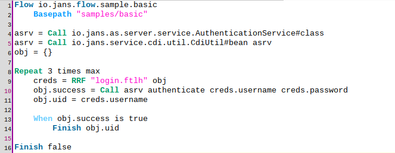

# Sample flows

This page provides some practical flow examples to help readers in their process of learning Agama. It is recommended to visit the quick start [guide](./quick-start.md) first.

## Basic authentication

This is the simplest form of authentication where end-users gain access to a protected resource (e.g. an application) by providing a valid username and password combination. In this example users will be given three attempts at most to supply valid credentials, otherwise an error page will be shown.

### Implementation

- Lines 1-2. Flow declarations for qualified name (`io.jans.flow.sample.basic`) and assets folder (`samples/basic`)

- Lines 4-5. Obtains a reference to the server's CDI bean [`AuthenticationService`](https://github.com/JanssenProject/jans/blob/main/jans-auth-server/server/src/main/java/io/jans/as/server/service/AuthenticationService.java). This object will allow to perform username/password validation. The object's class - `AuthenticationService.class` - is obtained at line 4 and the actual instance is obtained at line 5 by means of lookup carried out by method `bean` of `CdiUtil` class. For more information on the server CDI beans visit [this](TODO) page

- Line 6. Initializes an empty map. It will be passed as data model for the UI page later

- Line 8. Declares that the block of indented statements (lines 9-14) will be executed repeatedly for three times at most

- Line 9. Renders the template `login.ftlh` passing `obj` as data model. The form fields the user will fill at the browser are to be stored at variable `creds`. Find the source code of the template [here](TODO)

- Line 10. Calls the `authenticate` method on `asrv` (the [`AuthenticationService`](https://github.com/JanssenProject/jans/blob/main/jans-auth-server/server/src/main/java/io/jans/as/server/service/AuthenticationService.java) bean) passing the username and password (sent by the user's browser) as parameters. Note the presence of form fields `username` and `password` in the UI template. The boolean value returned by this method is stored in the key `success` of map `obj` and determines if the username and password combination supplied was valid

- Line 11. The username is copied to key `uid` of map `obj`. Note the usage of `uid` in the template: this is used to populate the username field in the case the first authentication attempt is not successful

- Lines 13-14. If the credentials supplied were valid, the flow is finished successfully attaching the username of the user in question. This is needed for the authentication server to determine who is logging in

- Line 16. If this line is reached in a flow execution, it means the three attempts were invalid. In this case the flow is finished with failure

### UI template

Source code of `login.ftlh` can be found [here](TODO). Basically this is 99% HTML markup and will not be  explained here. There are only a couple of things to highlight:

- The conditional `<#if !(success!true)>` (around line 27) is used to determine if an error message should be included in the generated markup. It works this way: if the key `success` exists in this template data model, its value is negated (note the bang character before the left parenthesis) and the `if` condition is evaluated. If non-existing, a `true` value is assumed which is then negated and thus the `if` body will not be evaluated-  

- Expressions of the form `${msgs[...]}` are used to access string messages defined in the server resource bundle. For more information visit ["Writing UI pages"](./ui-pages.md#data-model).

- The expression `${uid!}` (around line 35) is equivalent to `${uid!""}` and evaluates to the value of key `uid`. In case `uid` is not defined, an empty string value is used.

## Email OTP authentication

This is a two-stepped flow where the end-user initially is prompted to enter a username and corresponding password. Upon successful validation and assuming the user has an e-mail designated in his profile, a message with a one-time passcode (OTP) is sent to his inbox. The user is expected to enter the code in the browser to complete the authentication.

### Implementation

!!! Note
    Acquaintance with the basic authentication flow is required to understand this flow

TODO
