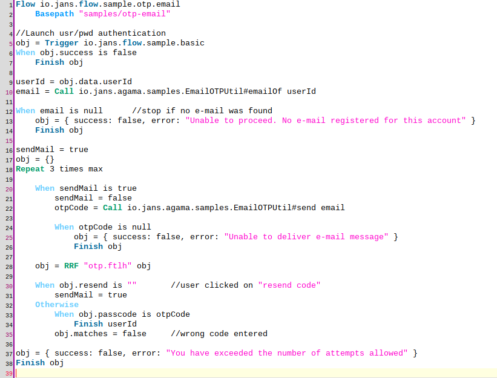
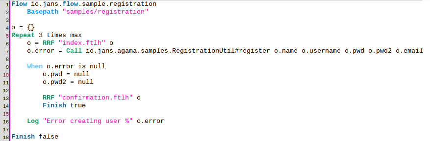
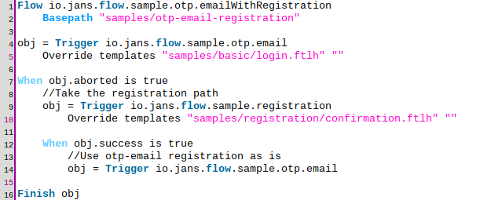

---
tags:
  - administration
  - developer
  - agama
---

# Sample flows

This page provides some practical flow examples to help readers in their process of learning Agama. It is recommended to visit the quick start [guide](./quick-start.md) first.

!!! Warning
    Do not deploy any of these flows to production!

## Basic authentication

This is the simplest form of authentication where end-users gain access to a protected resource (e.g. an application) by providing a valid username and password combination. In this example users will be given three attempts at most to supply valid credentials, otherwise an error page will be shown.

### Implementation

Source code [here](https://github.com/JanssenProject/jans/raw/main/docs/admin/developer/agama/basic/io.jans.flow.sample.basic).

- Lines 1-2. Flow declarations for qualified name (`io.jans.flow.sample.basic`) and assets folder (`samples/basic`)

- Lines 4-5. Obtains a reference to the server's CDI bean [`AuthenticationService`](https://github.com/JanssenProject/jans/blob/main/jans-auth-server/server/src/main/java/io/jans/as/server/service/AuthenticationService.java). This object will allow to perform username/password validation. The object's class - `AuthenticationService.class` - is obtained at line 4 and the actual instance is obtained at line 5 by means of lookup carried out by method `bean` of `CdiUtil` class. For more information on the server CDI beans visit [this](TODO) page

- Line 6. Initializes an empty map. It will be passed as data model for the UI page later

- Line 8. Declares that the block of indented statements (lines 9-14) will be executed repeatedly three times at most

- Line 9. Renders the template [`login.ftlh`](https://github.com/JanssenProject/jans/raw/main/docs/admin/developer/agama/basic/login.ftlh) passing `obj` as data model. The form fields the user will fill at the browser are to be stored at variable `creds`

- Line 10. Calls the `authenticate` method on `asrv` (the [`AuthenticationService`](https://github.com/JanssenProject/jans/blob/main/jans-auth-server/server/src/main/java/io/jans/as/server/service/AuthenticationService.java) bean) passing the username and password (sent by the user's browser) as parameters. Note the presence of form fields `username` and `password` in the UI template. The boolean value returned by this method is stored in the key `success` of map `obj` and determines if the username and password combination supplied was valid

- Line 11. The username is copied to key `uid` of map `obj`. Note the usage of `uid` in the template: this is used to populate the username field in the case the first authentication attempt is not successful

- Lines 13-14. If the credentials supplied were valid, the flow is finished successfully attaching the username of the user in question. This is needed for the authentication server to determine who is logging in

- Line 16. If this line is reached in a flow execution, it means the three attempts were invalid. In this case the flow is finished with failure

### UI template

[`login.ftlh`](https://github.com/JanssenProject/jans/raw/main/docs/admin/developer/agama/basic/login.ftlh) is 99% HTML markup and will not be detailed here. There are only a couple of things to highlight:

- The conditional `<#if !(success!true)>` (around line 27) is used to determine if an error message should be included in the generated markup. It works this way: if the key `success` exists in this template data model, its value is negated (note the bang character before the left parenthesis) and the `if` condition is evaluated. If non-existing, a `true` value is assumed which is then negated and thus the `if` body will not be evaluated 

- Expressions of the form `${msgs[...]}` are used to access string messages defined in the server resource bundle. For more information visit ["Writing UI pages"](./ui-pages.md#data-model)

- The expression `${uid!}` (around line 35) is equivalent to `${uid!""}` and evaluates to the value of key `uid`. In case `uid` is not defined, an empty string value is used

## Email OTP authentication

This is a two-stepped flow where the end-user initially is prompted to enter a username and corresponding password. Upon successful validation and assuming the user has an e-mail designated in his profile, a message with a one-time passcode (OTP) is sent to his inbox. The user is expected to enter the code in the browser to complete the authentication.

### Implementation

!!! Note
    Acquaintance with the basic authentication flow is required to understand this flow

Source code [here](https://github.com/JanssenProject/jans/raw/main/docs/admin/developer/agama/otp-email/io.jans.flow.sample.otp.email).

- Lines 1-2. Flow declarations for qualified name (`io.jans.flow.sample.otp.email`) and assets folder (`samples/otp-email`)

- Line 5. The [basic authentication](#basic-authentication) flow is launched. Its output stored in variable `obj`

- Lines 6-7. If basic authentication didn't succeed, this flows finishes in the same way

- Line 9. The user identifier is grabbed from the basic flow output and stored in `userId`

- Line 10. The e-mail of the user identified by `userId` is obtained by calling method `emailOf` of class `EmailOTPUtil`. Source code [here](https://github.com/JanssenProject/jans/blob/main/docs/admin/developer/agama/otp-email/EmailOTPUtil.java). This time the managed bean [`UserService`](https://github.com/JanssenProject/jans/blob/main/jans-auth-server/server/src/main/java/io/jans/as/server/service/UserService.java) is used. Copy `EmailOTPUtil.java` directly to folder `/opt/jans/jetty/jans-auth/agama/scripts/io/jans/agama/samples` of your server. Alternatively, a Groovy version is available [here](https://github.com/JanssenProject/jans/blob/main/docs/admin/developer/agama/otp-email/EmailOTPUtil.groovy); just copy one of these two files to your server

- Lines 12-14. If the user does not have a designated e-mail address, the flow is finished 

- Lines 16-18. Initializes utility variables and declares that the block of indented statements (lines 20-35) will be executed repeatedly three times at most

- Lines 20-22. Sends a message with a passcode to the e-mail of the user (stored in variable `email`) by calling method `send` of class `EmailOTPUtil`. If delivery was successful this method returns the passcode sent, otherwise `null`. The value is store in `otpCode` variable

- Lines 24-26. If delivery failed, the flow is finished

- Line 28. Renders the template [`otp.ftlh`](https://github.com/JanssenProject/jans/raw/main/docs/admin/developer/agama/otp-email/otp.ftlh) passing `obj` as data model. After form submission, `obj` will have up to two keys: `passcode` and `resend`. The former will hold whatever the user entered in the passcode text field, and the latter will exist if the "resend code" link was clicked

- Line 31. Variable `sendEmail` is set to true if the user clicked on the "resend code" link

- Line 33-35. If the passcode entered in the text field matches the value of the passcode sent in the e-mail (variable `otpCode`) the flow finishes successfully indicating the identity of the user (previously stored in `userId`). Otherwise key `matches` is attached to map `obj` with value `false`. This key is employed in the template (around line 27) to show an error message in case the user entered a wrong code 

- Lines 37-38. If execution reaches this point, it means the form was submitted three times and no matching code was entered. In this case, flow is finished accordingly (failed)

### UI template

[`otp.ftlh`](https://github.com/JanssenProject/jans/raw/main/docs/admin/developer/agama/otp-email/otp.ftlh) is on the same lines of the template used in the basic authentication flow. Here the form has three relevant elements:

- A textfield to enter the passcode (around line 35)

- A standard submission button (around line 41)

- A button with `type=submit` and `id=resend` rendered as a hypertext link (around line 47). Only when the link is clicked, `resend` parameter will be part of the request sent to the server

If the user presses the enter key when the focus is on the text field, the form is submitted by means of the standard submission button.

## Combined registration and authentication flow

In this flow features like [template overrides](./dsl-full.md#template-overrides) and [flow cancellation](./flows-lifecycle.md#cancellation) are leveraged to bring a more sophisticated authentication journey. A description follows:

- A login form (username/password) is shown with an auxiliary link to offer account registration

- If the registration link is clicked, the user is shown a page that prompts personal details in order to create an account

- Upon successful account creation, a "continue to login" page is presented

- The OTP authentication flow of the previous section is reused: a standard login form is shown and then the user is prompted to enter a passcode

### Registration

For the purposes of registration, a small [flow](https://github.com/JanssenProject/jans/raw/main/docs/admin/developer/agama/registration/io.jans.flow.sample.registration) was created:

This flow is pretty simple and we are not going into the details here. Keep in mind the following:

- Upload [`confirmation.ftlh`](https://github.com/JanssenProject/jans/raw/main/docs/admin/developer/agama/registration/confirmation.ftlh) and [`index.ftlh`](https://github.com/JanssenProject/jans/raw/main/docs/admin/developer/agama/registration/index.ftlh) files to folder `/opt/jans/jetty/jans-auth/agama/ftl/samples/registration`

- Copy the file [`RegistrationUtil.java`](https://github.com/JanssenProject/jans/blob/main/docs/admin/developer/agama/registration/RegistrationUtil.java) to directory `/opt/jans/jetty/jans-auth/agama/io/jans/agama/samples`

- Keep this flow disabled. If used standalone, it will finish but no actual person will be authenticated. It is not designed to be used directly but by other flows.

### Main flow

Source code [here](https://github.com/JanssenProject/jans/raw/main/docs/admin/developer/agama/otp-email-registration/io.jans.flow.sample.otp.emailWithRegistration).

This flow is short and powerful. To start it launches the [email OTP authentication](#email-otp-authentication) flow (line 4). However, instead of the `login.ftlh` template used internally by the basic flow, a different version is used (line 5). The new [template](https://github.com/JanssenProject/jans/raw/main/docs/admin/developer/agama/otp-email-registration/login.ftlh) is located in this flow's basepath, i.e. `samples/otp-email-registration`, and the file name does not change.

This new [page](https://github.com/JanssenProject/jans/raw/main/docs/admin/developer/agama/otp-email-registration/login.ftlh) simply adds a small link that reads "Don't have an account?" in a new HTML form. When clicked it will provoke the email-OTP flow to be aborted early and the condition at line 7 will be truthy. If that's not the case, the email-OTP flow will proceed as usual and the current flow will finish in the same way as email-OTP (line 16).

If email-OTP is aborted, the [registration flow](#registration) that we just saw is launched (line 9). Here the template `confirmation.ftlh` is overriden too (line 10). This new [page](https://github.com/JanssenProject/jans/raw/main/docs/admin/developer/agama/otp-email-registration/confirmation.ftlh) changes the label of the button that is shown after an account has been created: originally the text is "Continue" but for the current flow, "Proceed to login" is a better fit.

If the registration flow finishes successfully (line 12), the email-OTP flow is triggered again (line 14) - this time without customizations. Then the user can supply his recently-created credentials to get past the basic authentication stage and finally move to the OTP challenge. Recall that via registration flow the user's e-mail address is already stored in the database.

Finally, the current flow finishes identically as email-OTP did (line 16).
