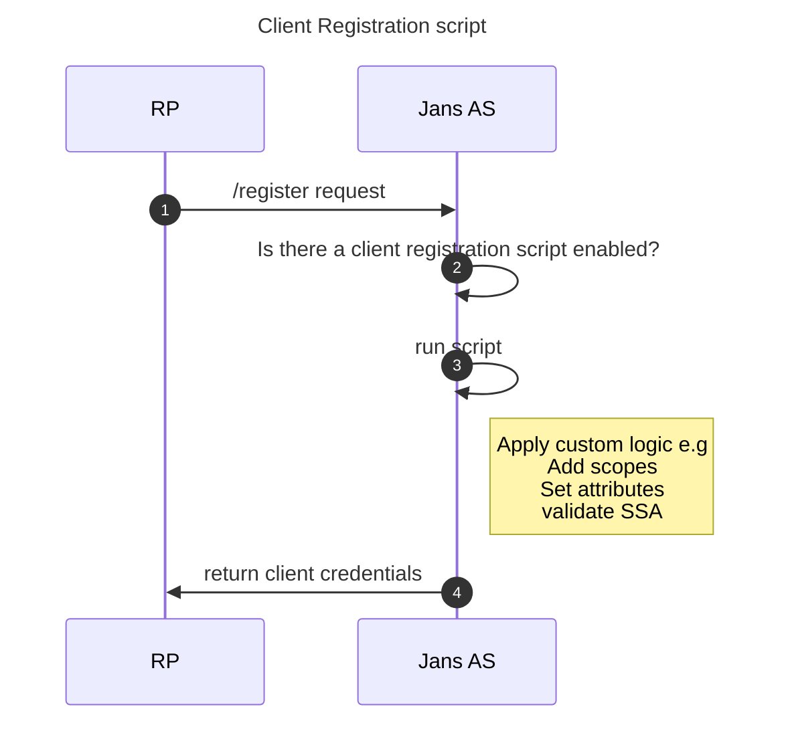

---
tags:
  - administration
  - developer
  - scripts
---

# Client Registration scripts

## Overview
The Jans-Auth server implements the OpenID Connect [Dynamic Client Registration](https://openid.net/specs/openid-connect-registration-1_0.html) specification. This allows developers to register a client with the Authorization Server (AS) without any intervention from the administrator. By default, all clients are given the same default scopes and attributes. Through the use of an interception script, this behavior can be modified. These scripts can be used to analyze the registration request and apply customizations to the registered client. For example, a client can be given specific scopes by analyzing the [Software Statement](https://www.rfc-editor.org/rfc/rfc7591.html#section-2.3) that is sent with the registration request.

## Behavior
By default, Jans server has no dynamic client registration scripts enabled, and all clients are given the same attributes. When a script is added and enabled, the script will run and return a `boolean` after applying logic to the registration request. If `true`, the client is registered and client credentials are returned. Generally, the script is global for all registration requests, and only one script is enabled at a time.

### Registration flow


## Interface
The client registration script implements the [ClientRegistrationType](https://github.com/JanssenProject/jans/blob/main/jans-core/script/src/main/java/io/jans/model/custom/script/type/client/ClientRegistrationType.java) interface. This extends methods from the base script type in addition to adding new methods:

### Inherited Methods
| Method header | Method description |
|:-----|:------|
| `def init(self, customScript, configurationAttributes)` | This method is only called once during the script initialization. It can be used for global script initialization, initiate objects etc |
| `def destroy(self, configurationAttributes)` | This method is called once to destroy events. It can be used to free resource and objects created in the `init()` method |
| `def getApiVersion(self, configurationAttributes, customScript)` | The getApiVersion method allows API changes in order to do transparent migration from an old script to a new API. Only include the customScript variable if the value for getApiVersion is greater than 10 |

### New methods
| Method header | Method description |
|:-----|:------|
|`def createClient(self, context)`| Called when the dynamic client registration request is received. |
|`def updateClient(self, context)`|  Called when the PUT method is called on registration endpoint to update client details.  |
|`def getSoftwareStatementHmacSecret(self, context)`| Returns secret key which will be used to validate Software Statement if HMAC algorithm is used (e.g. HS256, HS512) |
|`def getSoftwareStatementJwks(self, context)`| Returns JWKS which will be used to validate Software Statement if keys are used (e.g. RS256) |
|`def modifyPutResponse(self, responseAsJsonObject, executionContext)`| Modifies the response from the PUT request to registration endpoint |
|`def modifyReadResponse(self, responseAsJsonObject, executionContext)`| Modifies the response from the GET request to registration endpoint |
|`def modifyPostResponse(self, responseAsJsonObject, executionContext)`| Modifies the response from the POST request to registration endpoint |

### Objects
| Object name | Object description |
|:-----|:------|
|`customScript`| The custom script object. [Reference](https://github.com/JanssenProject/jans/blob/main/jans-core/script/src/main/java/io/jans/model/custom/script/model/CustomScript.java) |
|`configurationAttributes`| `configurationProperties` passed in when adding custom script. `Map<String, SimpleCustomProperty> configurationAttributes` |
|`SimpleCustomProperty`| Map of configuration properties. [Reference](https://github.com/JanssenProject/jans/blob/main/jans-core/util/src/main/java/io/jans/model/SimpleCustomProperty.java) |
|`context`| [Reference](https://github.com/JanssenProject/jans/blob/main/jans-auth-server/server/src/main/java/io/jans/as/server/service/external/context/DynamicClientRegistrationContext.java) |
|`responseAsJsonObject`| Java JSONObject. [Reference](https://docs.oracle.com/javaee/7/api/javax/json/JsonObject.html) |
|`executionContext`| [Reference](https://github.com/JanssenProject/jans/blob/main/jans-auth-server/server/src/main/java/io/jans/as/server/model/common/ExecutionContext.java) |


## Common Use Case: Adding scopes defined in the script configuration parameters

### Script Type: Python

```python
from io.jans.model.custom.script.type.client import ClientRegistrationType
from io.jans.service.cdi.util import CdiUtil
from io.jans.orm.util import StringHelper, ArrayHelper
from io.jans.as.server.service import ScopeService

import json

class ClientRegistration(ClientRegistrationType):
    def __init__(self, currentTimeMillis):
        self.currentTimeMillis = currentTimeMillis

    def init(self, customScript, configurationAttributes):
        print "Client registration. Initialization"
        
        if (not configurationAttributes.containsKey("scope_list")):
            print "Client registration. Initialization failed. Scope List not defined."
            return False
        else: 
            self.scope_list = configurationAttributes.get("scope_list").getValue2() 
            
        print "Client registration. Initialized successfully"
        return True   

    def destroy(self, configurationAttributes):
        print "Client registration. Destroy"
        print "Client registration. Destroyed successfully"
        return True   

    def createClient(self, context):
        scopeService = CdiUtil.bean(ScopeService)
        currentScopes = client.getScopes()
        for newScope in self.scope_list:
            foundScope = scopeService.getScopeById(newScope)
            if foundScope is None:
                print "Client Registration. New scope(s) not found."
                return False
            newScopes = ArrayHelper.addItemToStringArray(currentScopes, foundScope.getDn())

        client.setScopes(newScopes)
        return True

    def updateClient(self, context):
        print "SSA Client registration. UpdateClient method"
        pass

    def getApiVersion(self):
        return 11

    # Returns secret key which will be used to validate Software Statement if HMAC algorithm is used (e.g. HS256, HS512). Invoked if oxauth conf property softwareStatementValidationType=SCRIPT which is default/fallback value.
    def getSoftwareStatementHmacSecret(self, context):
        pass

    # Returns JWKS which will be used to validate Software Statement if keys are used (e.g. RS256). Invoked if oxauth conf property softwareStatementValidationType=SCRIPT which is default/fallback value.
    def getSoftwareStatementJwks(self, context):
        pass

    
    def modifyPutResponse(self, responseAsJsonObject, executionContext):
        return False

    def modifyReadResponse(self, responseAsJsonObject, executionContext):
        return False

    def modifyPostResponse(self, responseAsJsonObject, executionContext):
        return False
```

### Script Type: Java

```java
import io.jans.as.common.model.registration.Client;
import io.jans.as.persistence.model.Scope;
import io.jans.as.server.service.ScopeService;
import io.jans.as.server.service.external.context.DynamicClientRegistrationContext;
import io.jans.model.SimpleCustomProperty;
import io.jans.model.custom.script.model.CustomScript;
import io.jans.model.custom.script.type.client.ClientRegistrationType;
import io.jans.orm.util.ArrayHelper;
import io.jans.service.cdi.util.CdiUtil;
import org.json.JSONArray;
import org.slf4j.Logger;
import org.slf4j.LoggerFactory;

import java.util.Map;

public class ClientRegistration implements ClientRegistrationType {
    private static final Logger log = LoggerFactory.getLogger(ClientRegistration.class);

    JSONArray json_array = null;

    @Override
    public boolean init(Map<String, SimpleCustomProperty> configurationAttributes) {
        if (!configurationAttributes.containsKey("scope_list")) {
            log.info("Client registration. Initialization failed. Scope List not found.");
            return false;
        }
        String scope_list = configurationAttributes.get("scope_list").getValue2();
        json_array = new JSONArray(scope_list);
        return true;
    }

    @Override
    public boolean init(CustomScript customScript, Map<String, SimpleCustomProperty> configurationAttributes) {
        log.info("Client registration. Initialization.");
        log.info(configurationAttributes.toString());
        if (!configurationAttributes.containsKey("scope_list")) {
            log.info("Client registration. Initialization failed. Scope List not found.");
            return false;
        }
        String scope_list = configurationAttributes.get("scope_list").getValue2();
        json_array = new JSONArray(scope_list);
        return true;
    }

    @Override
    public boolean destroy(Map<String, SimpleCustomProperty> configurationAttributes) {
        log.info("Client registration. Destroy.");
        return true;
    }

    @Override
    public int getApiVersion() {
        return 11;
    }

    @Override
    public boolean createClient(Object context) {
        log.info("Client registration. CreateClient method");
        DynamicClientRegistrationContext regContext = (DynamicClientRegistrationContext) context;
        Client client = regContext.getClient();
        ScopeService scopeService = CdiUtil.bean(ScopeService.class);

        String[] currentScopes = client.getScopes();
        String[] newScopes = currentScopes.clone();

        for (int i = 0; i < json_array.length(); i++) {
            String scopeName = (String) json_array.get(i);
            Scope foundScope = scopeService.getScopeById(scopeName);
            if (foundScope == null) {
                log.info("Client registration. Scope not found");
                return false;
            }
            newScopes = ArrayHelper.addItemToStringArray(newScopes, foundScope.getDn());
        }

        client.setScopes(newScopes);
        log.info("Client registration. Scopes added.");

        return true;
    }

    @Override
    public boolean updateClient(Object context) {
        return true;
    }

    // This method needs to be overridden if client is providing an SSA with HMAC
    @Override
    public String getSoftwareStatementHmacSecret(Object context) {
        return "";
    }

    // This method needs to be overridden if client is providing an SSA and RS256 validation
    @Override
    public String getSoftwareStatementJwks(Object context) {
        return "";
    }

    @Override
    public String getDcrHmacSecret(Object o) {
        return "";
    }

    @Override
    public String getDcrJwks(Object o) {
        return "";
    }

    @Override
    public boolean isCertValidForClient(Object o, Object o1) {
        return false;
    }

    @Override
    public boolean modifyPutResponse(Object responseAsJsonObject, Object executionContext) {
        return true;
    }

    @Override
    public boolean modifyReadResponse(Object responseAsJsonObject, Object executionContext) {
        return true;
    }

    @Override
    public boolean modifyPostResponse(Object responseAsJsonObject, Object executionContext) {
        return true;
    }
}

```

### Sample Scripts
- [OpenBanking](../../../script-catalog/client_registration/OpenBanking/)