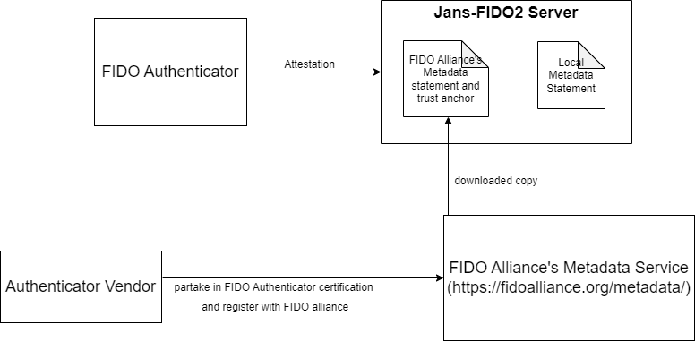

---
tags:
  - administration
  - fido2
  - metadata Service
  - attestation
---

### Metadata Service:

The metadata service is a centralized, trusted database of FIDO authenticators. It is used by the Relying Party to validate authenticators i.e. attest the genuine-ness of a device. If implemented in organizations like government, federal agencies, banking and healthcare organizations for example) and/or organizations handling sensitive data (media companies, R&D institutions, corporations, etc), this information can help protect organizations against security vulnerabilities.

### 1. Local metadata service:
Janssen's FIDO server has a [configuration parameter](./config.md) called `serverMetadataFolder` which by default points to a directory location `/etc/jans/conf/fido2/server_metadata` where the administrator can (obtain from a vendor and ) place authenticator metadata in json format.

Example of authenticator metadata:
```
{
			"aaguid": "83c44309-....-8be444b573cb",
			"metadataStatement": {
				"legalHeader": "Submission of this statement and retrieval and use of this statement indicates acceptance of the appropriate agreement located at https://fidoalliance.org/metadata/metadata-legal-terms/.",
				"aaguid": "83c44309-....-8be444b573cb",
				"description": "Just an example",
				"authenticatorVersion": 448962,
				"protocolFamily": "fido2",
				"schema": 3,
				"upv": [
					{
						"major": 1,
						"minor": 0
					},
					{
						"major": 1,
						"minor": 1
					}
				],
				"authenticationAlgorithms": [
					"ed25519_eddsa_sha512_raw",
					"secp256r1_ecdsa_sha256_raw"
				],
				"publicKeyAlgAndEncodings": [
					"cose"
				],
				"attestationTypes": [
					"basic_full"
				],
				"userVerificationDetails": [
					[
						{
							"userVerificationMethod": "passcode_external",
							"caDesc": {
								"base": 64,
								"minLength": 4,
								"maxRetries": 8,
								"blockSlowdown": 0
							}
						},
						{
							"userVerificationMethod": "presence_internal"
						}
					],
					[
						{
							"userVerificationMethod": "passcode_external",
							"caDesc": {
								"base": 64,
								"minLength": 4,
								"maxRetries": 8,
								"blockSlowdown": 0
							}
						}
					],
					[
						{
							"userVerificationMethod": "fingerprint_internal",
							"baDesc": {
								"selfAttestedFRR": 0,
								"selfAttestedFAR": 0,
								"maxTemplates": 5,
								"maxRetries": 5,
								"blockSlowdown": 0
							}
						},
						{
							"userVerificationMethod": "presence_internal"
						}
					],
					[
						{
							"userVerificationMethod": "none"
						}
					],
					[
						{
							"userVerificationMethod": "fingerprint_internal",
							"baDesc": {
								"selfAttestedFRR": 0,
								"selfAttestedFAR": 0,
								"maxTemplates": 5,
								"maxRetries": 5,
								"blockSlowdown": 0
							}
						}
					],
					[
						{
							"userVerificationMethod": "presence_internal"
						}
					]
				],
				"keyProtection": [
					"hardware",
					"secure_element"
				],
				"matcherProtection": [
					"on_chip"
				],
				"cryptoStrength": 128,
				"attachmentHint": [
					"external",
					"wired"
				],
				"tcDisplay": [],
				"attestationRootCertificates": [
					"MII....psmyPzK+Vsgw2jeRQ5JlKDyqE0hebfC1tvFu0CCrJFcw=="
				],
				"icon": "data:image/png;base64,iVBORw0KGgoAAAA....k5+36hF7vXAAAAAElFTkSuQmCC",
				"authenticatorGetInfo": {
					"versions": [
						"FIDO_2_0",
						"FIDO_2_1_PRE",
						"FIDO_2_1"
					],
					"extensions": [
						"credProtect",
						"hmac-secret",
						"largeBlobKey",
						"credBlob",
						"minPinLength"
					],
					"aaguid": "83c.....73cb",
					"options": {
						"plat": false,
						"rk": true,
						"clientPin": true,
						"up": true,
						"uv": false,
						"pinUvAuthToken": true,
						"largeBlobs": true,
						"ep": false,
						"bioEnroll": false,
						"userVerificationMgmtPreview": false,
						"authnrCfg": true,
						"credMgmt": true,
						"credentialMgmtPreview": true,
						"setMinPINLength": true,
						"makeCredUvNotRqd": false,
						"alwaysUv": true
					},
					"maxMsgSize": 1200,
					"pinUvAuthProtocols": [
						2,
						1
					],
					"maxCredentialCountInList": 8,
					"maxCredentialIdLength": 128,
					"transports": [
						"usb"
					],
					"algorithms": [
						{
							"type": "public-key",
							"alg": -7
						},
						{
							"type": "public-key",
							"alg": -8
						}
					],
					"maxSerializedLargeBlobArray": 1024,
					"forcePINChange": false,
					"minPINLength": 4,
					"firmwareVersion": 328965,
					"maxCredBlobLength": 32,
					"maxRPIDsForSetMinPINLength": 1,
					"preferredPlatformUvAttempts": 3,
					"uvModality": 2,
					"remainingDiscoverableCredentials": 25
				}
			},
			"statusReports": [
				{
					"status": "FIDO_CERTIFIED_L1",
					"effectiveDate": "2021-08-06",
					"url": "www.yubico.com",
					"certificationDescriptor": "An example",
					"certificateNumber": "FIDO2.....001",
					"certificationPolicyVersion": "1.3",
					"certificationRequirementsVersion": "1.4"
				},
				{
					"status": "FIDO_CERTIFIED",
					"effectiveDate": "2021-08-06"
				}
			],
			"timeOfLastStatusChange": "2021-08-16"
		}
```


### 2. Metadata service for authenticators approved by [FIDO Alliance (MDS3)](https://fidoalliance.org/metadata/)

Metadata entries for trusted authenticators registered with FIDO Alliance can be found on - https://fidoalliance.org/certification/fido-certified-products/





Draw.io reference for image:
```
<?xml version="1.0" encoding="UTF-8"?>
<mxfile host="app.diagrams.net" modified="2022-11-03T13:17:35.619Z" agent="5.0 (Windows NT 10.0; Win64; x64) AppleWebKit/537.36 (KHTML, like Gecko) Chrome/106.0.0.0 Safari/537.36 Edg/106.0.1370.52" etag="MPAHjBuOoBSpVro-BGSI" version="20.5.1" type="google"><diagram id="An1oD0C01MiJfx2t8ul6" name="Page-1">7Vlbc6M2FP41nrYPyXAx2Hl07HUv052kdWe7fVRAAU0EokLEdn/9noOEsQBnva6ZnZ3ZJ3M+ISG+79yEJ/4y2/0sSZG+FzHlE8+JdxN/NfE8158F8IPIXiOzYKqBRLLY3NQCG/YfNaBj0IrFtLRuVEJwxQobjESe00hZGJFSbO3bngW3n1qQhPaATUR4H/2bxSrV6DxwWvwXypK0ebLrmJGMNDcboExJLLZHkP9u4i+lEEpfZbsl5Uhew4uetz4xetiYpLk6Z0L6cRW7f/0ZB+E2cD9U+8dy+ceNUeeV8Mq88G8kL2/Wv64eEN9Q+Uql2b/aN6SUW5ZxkoN1/yxyZVRz52Cb9ahUdHdyo+7h9cFvqMioknu4xUyY+oYx4zJzY25b/g9Yesx9aEBiNE8OS7e0wIVh5gtY8nssIUGALDhnJI/oDyUY76kiMVGk5ooomuH7wm7yGJ1WVqW2olQMMJqSAi9zoZDVbcoU3RQkQmwLkQVYqjKOLMPlE4leEimqPH6oFGc5NXhM5MsDzGIKqXNuneBcRU47x0mZvMBSaRr0VLoL+iLNg5E0mvY0+l1AGNu6bFpdvn0B3FlHgbCnwGxAgdlYCsx6CvRYpnm8wKQMVsRJWbLI5rWmlOJDnJO5hca9jH0ZjUc8BQPppMEk5USxV/uZQ+SZJzwKVsf9zqbbiORNO0mqFJWMqJl0nL7fXsf1O+soIhOqeuvUSh5e+nJxwy9NgVg6GISPF3KFEQM5L0zw6sdUKSzeC9yjt35msSBmjVshE9zdYZX1Tz0Xsl3kM3E6QnUKHLs6+d655amr/NUCbz4QeJp1fH+LvvDfSjQDN2XNDOjguF6xq+lpxhuxoGPJuSBIOPZYBWw2JBmynD+Vhb6R6wlr/TA9rycbEK5sbQhnSY6JAIiHHsO/R1kYpOyFGchYHOP0e0lhp+SpXgpFL9DJaxKD+0mwwrUqJUqjM5ilkuKFLgWHSospXXcqjPMuNL57eGHfPVxvwD1G8467/+8d8xPe0aSASqVAD2insLU5zyEujmPvOkK5ri3UoXE/Fmo2FMfeWEo1OxqvggI3cv/RDNbGP3WfEjTmanc8uNo31o4pnObeOk5obD0TD3jabqeicTzzkUoGDGGQ19gZddxAuji+RZlpzXX1+1z9+lo9gD/r1Iy7C5uAqddZqJs1Ru4CXHd0D208zfKyt33siv5091XdZN6pHe6lbtI5QfdOxmO7iTdeR7JQiuLxmon8e+9hlzS/W9L8fkkb6kxHaz3c/oeTq/UenabD+QB559vpPuzDnD/UJA4pNR9Nqf7nk6tFLLCiyAvFLUDIOsNNoxNhBD6jeRTZ7amxe+7QX9UkTViJEYzUAXOH1ZsT5fcU0el65x3PG/q4OlTiLvi2Cmb7dVuXlvY/Av/dJw==</diagram></mxfile>
```

Janssen's FIDO2 server -

1.  Downloads, verifies and caches metadata BLOBs from the FIDO Metadata Service.
1.  Re-downloads the metadata BLOB when it expires.
1.  Provides trust root certificates for verifying attestation statements during credential registrations.


### 3. Skip metadata validation
Metadata validation is recommended but not mandatory as per FIDO2 specifications. As per the current implementation, there is no provision in the jans-fido2 server to turn this feature off. However, the intention is to implement it in the future.

### References:

1. https://fidoalliance.org/announcing-the-new-streamlined-and-simplified-metadata-service-for-authenticator-vendors-and-customers/
