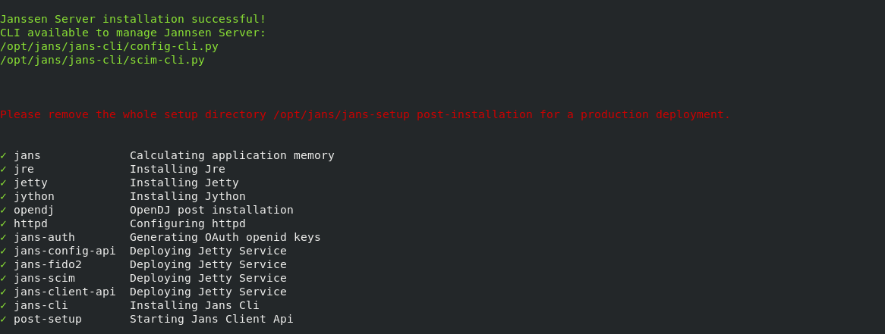

---
tags:
- administration
- installation
- vm
- RHEL
- CentOS
---

# Red Hat EL Janssen Installation

Before you install, check the [VM system requirements](vm-requirements.md).

## Supported versions
- Red Hat Enterprise Linus 8 (RHEL 8)
- CentOS 8
## Disable SELinux
You can disbale SELinux temporarly by executing `setenforce 0`. To disable permanently edit file `/etc/selinux/config`.

## Install the Package


- Download the release package from the Github Janssen Project
  [Releases](https://github.com/JanssenProject/jans/releases)

```
wget https://github.com/JanssenProject/jans/releases/download/vreplace-janssen-version/jans-replace-janssen-version-el8.x86_64.rpm -P ~/
```

- Verify integrity of the downloaded package using published `sha256sum`.

    Download `sha256sum` file for the package

    ```shell
    wget https://github.com/JanssenProject/jans/releases/download/vreplace-janssen-version/jans-replace-janssen-version-el8.x86_64.rpm.sha256sum -P ~/
    ```

    Check the hash if it is matching.

    ```shell
    sha256sum -c jans-replace-janssen-version-el8.x86_64.rpm.sha256sum
    ```

    Output similar to below should confirm the integrity of the downloaded package.

    ```text
    <package-name>: OK
    ```
  
- Install the package

```
yum install ~/jans-replace-janssen-version-el8.x86_64.rpm
```

## Run the setup script

- Run the setup script in interactive mode:

```
sudo python3 /opt/jans/jans-setup/setup.py
```

The installer should confirm successful installation with a message similar
to the one shown below:



See more detailed [instructions](../setup.md) on the setup script if you're
confused how to answer any of the questions, for details about command line
arguments, or you would prefer to use a properties file instead of
interactive mode.

## Verify the Installation

After the successful completion of setup process, [verify the system health](../install-faq.md#after-installation-how-do-i-verify-that-the-janssen-server-is-up-and-running).

## Red Hat / Centos Un-installation

Removing Janssen is a two step process:

1. Delete files installed by Janssen
1. Remove and purge the `jans` package

* Use the command below to uninstall the Janssen server

```
python3 /opt/jans/jans-setup/install.py -uninstall
```

Console output like below will confirm the successful uninstallation of the Janssen Server

```
This process is irreversible.
You will lose all data related to Janssen Server.


Are you sure to uninstall Janssen Server? [yes/N] yes

Uninstalling Jannsen Server...
Removing /etc/default/jans-config-api
Stopping jans-config-api
Removing /etc/default/jans-scim
Stopping jans-scim
Removing /etc/default/jans-fido2
Stopping jans-fido2
Removing /etc/default/jans-auth
Stopping jans-auth
Removing /etc/default/jans-client-api
Stopping jans-client-api
Stopping OpenDj Server
sh: 1: /opt/opendj/bin/stop-ds: not found
Executing rm -r -f /etc/certs
Executing rm -r -f /etc/jans
Executing rm -r -f /opt/jans
Executing rm -r -f /opt/amazon-corretto*
Executing rm -r -f /opt/jre
Executing rm -r -f /opt/node*
Executing rm -r -f /opt/jetty*
Executing rm -r -f /opt/jython*
Executing rm -r -f /opt/opendj
Executing rm -r -f /opt/dist
Removing /etc/apache2/sites-enabled/https_jans.conf
Removing /etc/apache2/sites-available/https_jans.conf

```

* Remove the linux package

Use the command below to remove and purge `jans` package

```
yum remove jans.x86_64
```

Successful removal will remove the Janssen Server package along with
the removal of all the unused dependencies.
