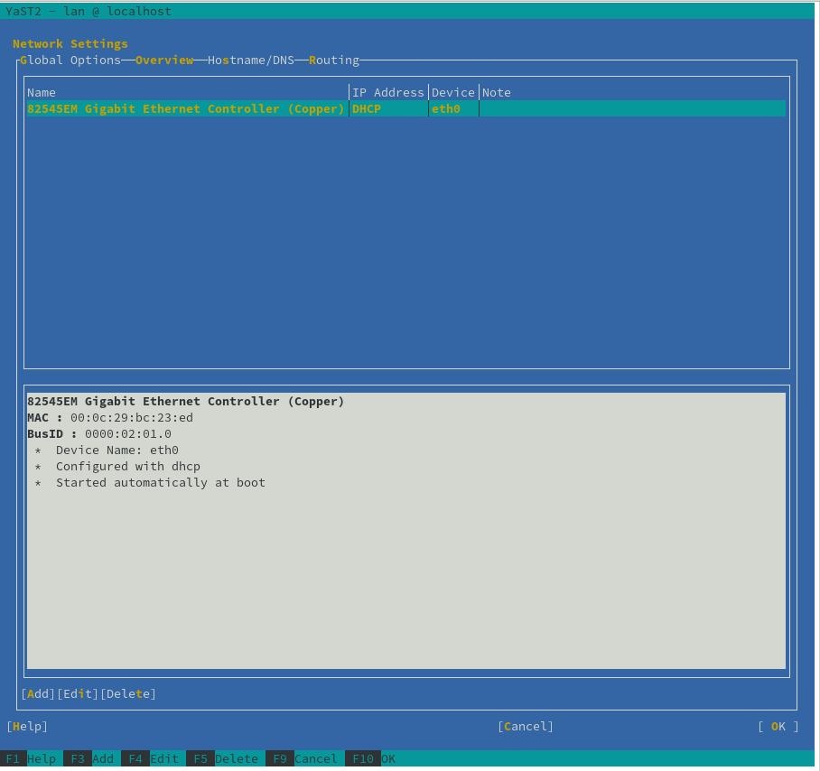
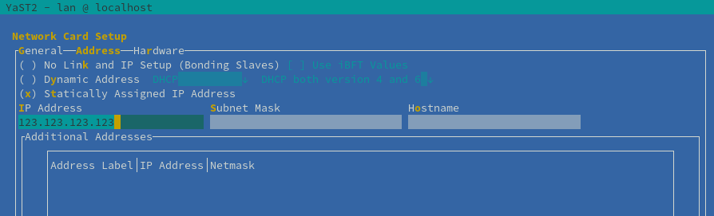

---
tags:
  - administration
  - installation
  - vm
---

# VM System Requirements

Janssen Server can be installed on any of the supported operating systems mentioned below:

- Ubuntu (versions: 20.04)
- SUSE Linux Enterprise Server (versions: 15)
- RedHat Enterprise Linux (versions: 7,8)

## Hardware Requirements

Janssen Server needs below-mentioned minimal resources on VM when data store is installed separately on a different VM.
Requirements for VM hosting the data store (i.e LDAP, RDBMS, etc.) can vary based on size data and type of data store.

### Development and Test Environments
- 4 GB RAM
- 2 CPU
- 20 GB Disk

### Production Environments
- 8 GB RAM
- 4 CPU
- 4 GB swap space
- 50 GB Disk

## VM Setup Guidelines

- Required ports should be open. Refer to [Port Setup](#port-setup) section for OS specific steps.
- Janssen Server must be deployed on a server or VM with static IP address. Refer to [Configure Static IP Address](#configure-static-ip-address) section for OS specific steps.
- Static IP address should resolve to a hostname. `localhost` is not supported. Refer to [Hostname Setup](#port-setup) section for OS specific steps.
- For local testing and development purposes, VM can be setup using VMWare Workstation player
- Janssen Server requires setting the `file descriptors` to 65k. Take guidance from steps listed [here](https://gluu.org/docs/gluu-server/4.4/installation-guide/#file-descriptors-fd)

## Port Configuration

Janssen Server requires following ports to be open for incoming connections

| Port | Protocol | Notes           |
|------|----------|-----------------|
| 80   | TCP      | Forwards to 443 |
| 443  | TCP      | apache2/httpd   |
| 22   | TCP      | ssh             |


### Ubuntu

Ensuring above ports are open on an Ubuntu system can be done by following below mentioned steps:

1. To check the status of these ports in Ubuntu, use the following commands (other OS have similar commands)

  ```
  ufw status verbose
  ```

2. If the status is found to be inactive, enable it using 

  ```
  ufw enable
  ```

3. The default for ufw is to deny incoming and allow outgoing. To reset your setting to default :

```
ufw default deny incoming
ufw default allow outgoing
```

4. Reset ufw

```
ufw reset
```

5. If for any reason the ports are closed, allow connections by:

```
ufw allow <port>
```

Ports 443, 80, and 22 must be accessible.

### SLES and RHEL

SUSE Linux Enterprise Server and Red Hat Enterprise Linux use `Firewalld` to controll network access. Use commands below to configure ports.

1) Get zone for the network interface

```text
firewall-cmd --get-zone-of-interface=<your-network-interface>
```

2) Add port

```text
firewall-cmd --permanent --add-port 443/tcp
```

3) Restart firewalld

```text
systemctl stop firewalld
systemctl start firewalld
```

## Static IP Address Configuration

Janssen Server must be deployed on a server or VM with static IP address.

This section describes steps required to set static IP for supported platforms. Commands and steps mentioned here might have changed at the time of use, if so please refer to respective OS documentation for most up-to-date steps to setup static IP. 

First, Select the network interface for which static IP needs to be set. On any Linux based OS platform, run command below:

```text
ip link
```

Above command shows lists all the existing network interfaces in format below:

```text
1: lo: <LOOPBACK,UP,LOWER_UP> mtu 65536 qdisc noqueue state UNKNOWN mode DEFAULT group default qlen 1000
    link/loopback 00:00:00:00:00:00 brd 00:00:00:00:00:00
2: enp4s0: <BROADCAST,MULTICAST,UP,LOWER_UP> mtu 1500 qdisc fq_codel state UP mode DEFAULT group default qlen 1000
    link/ether 8c:8c:aa:6a:bf:b5 brd ff:ff:ff:ff:ff:ff
```

here we are going to configure the `enp4s0` network interface.

### Ubuntu 

Steps listed below show how to set up static IP address on an Ubuntu Server.

1) Locate the configuration file

Network interface configuration can be changed using `YAML` configuration files located under

```text
/etc/netplan
```

Above directory will contain one or more `YAML` files. Open the file that has configuration for `enp4s0` network 
interface. Create one if it doesn't exist.

2) Update the configuration

Set the yaml file configuration as shown in example below. Values for gateway, nameservers should be set 
appropriately. `addresses` should be set to desired static IP.

```text
network:
  version: 2
  renderer: networkd
  ethernets:
    enp4s0:
      dhcp4: no
      addresses:
        - 192.168.123.212/24
      gateway4: 192.168.123.1
      nameservers:
          addresses: [8.8.8.8, 1.1.1.1]
```

3) Apply the change

```text
sudo netplan apply
```

4) Verify the new configuration

```text
ip addr show dev enp4s0
```
Newly assigned IP address can be seen in the output

### SUSE Linux Enterprise Server

SLES provides [YaST](https://yast.opensuse.org/) tool to manage the system configuration. YaST is a 

1) Open YaST

```text
yast
```

2) Navigate to `System` -> `Network Settings` and select the network interface that needs to be set to static IP. 



3) Hit `F4` to enter edit mode as shown in the image below. Select `Statically Assiged IP Address` instead of `DHCP`. Also provide required details for `IP address`, `Subnet Mask` and `Hostname`.



### RedHat Enterprise Linux

RHEL provides `Nmcli` tool to configure and manage network.

1) Set IP address for selected network interface

```text
nmcli con mod enp4s0 ipv4.addresses <static-IP>/24
```

2) Set appropriate gateway

```text
nmcli con mod enp4s0 ipv4.gateway <gateway-IP>
nmcli con mod enp4s0 ipv4.method manual
```

3) Configure DNS

```text
nmcli con mod enp4s0 ipv4.dns "<dns-IP>"
```

4) Reload configuration

```text
nmcli con up enp4s0 
```

5) See configuration being reflected at

```text
cat /etc/sysconfig/network-scripts/ifcfg-enp4s0
```

## Hostname Configuration

IP can be mapped to a hostname(FQDN) using entries into `/etc/hosts` file. Run command below to configure a hostname for IP address.

```text
vi /etc/hosts
```

Make an entry similar to one below in this file. IP should be a static IP assigned to the server or VM.

```text
192.168.0.1 jans.op.io
```

## File Descriptor Configuration (FD)

Janssen Server requires setting the `file descriptors` to 65k. Follow the steps below to set value for file descriptors. These steps are applicable to SUSE Linux Enterprise, Ubuntu Server and RedHat Enterprise Linux.

First, check the current file descriptor limit using command below. If the existing FD limit is higher than 65535, then continue with the same.

```text
# cat /proc/sys/fs/file-max
```

In case existing FD limit is less than 65535, then follow the steps below to set the value.

1) Set soft and hard limits by adding the following lines in the `/etc/security/limits.conf` file

```text
* soft nofile 65535
* hard nofile 262144
```

2) Add the following lines to `/etc/pam.d/login` if not already present

```text
session required pam_limits.so
```

3) Increase the FD limit in `/proc/sys/fs/file-max`

```text
echo 65535 > /proc/sys/fs/file-max**
```

4) Use the `ulimit` command to set the FD limit to the hard limit specified in `/etc/security/limits.conf`. If setting to hard limit doesn't work, then try to set it to soft limit.

```text
ulimit -n 262144
```

5) Restart the system