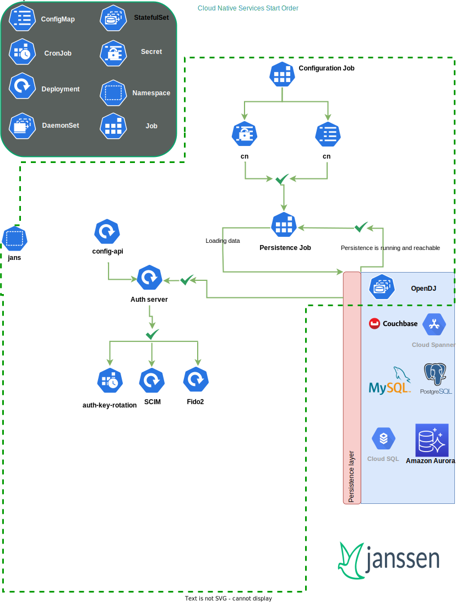

---
tags:
  - administration
  - kubernetes
  - operations
  - start-order
---

## Service Start Order

## Network traffic between Jans services

1. **Database Access:** all Jans services require access to the database.

2. **Pod-2-Pod Communication:** Jans services communicate with each other as depicted.
   
    Most of this communication is external. Meaning it goes through the FQDN, instead of using the internal Kubernetes service address.
    For example, a service would call the well-known for auth-server `https://FQDN/.well-known/openid-configuration`.
   
    We recommend to only keep the `.well-known` endpoints public and protect the rest.