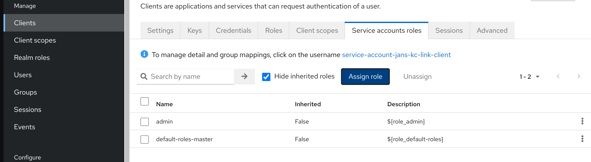
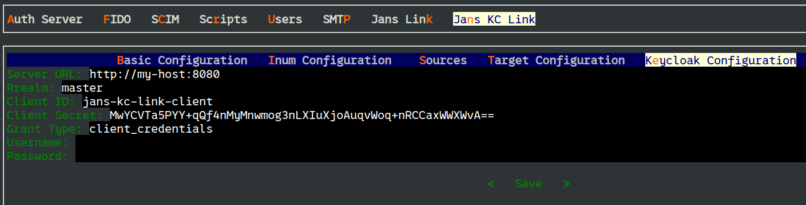
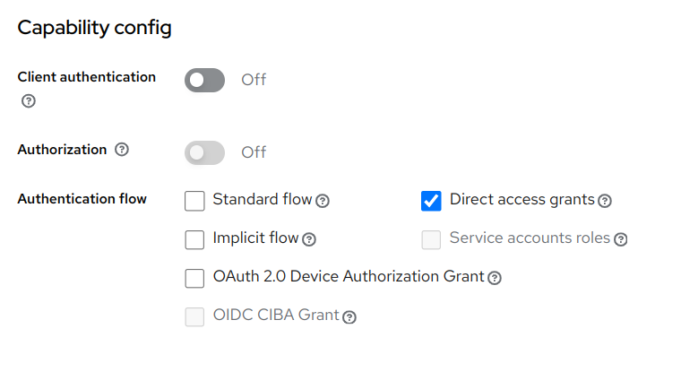
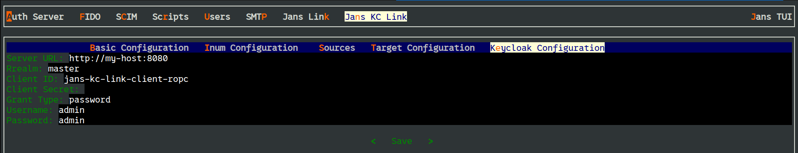
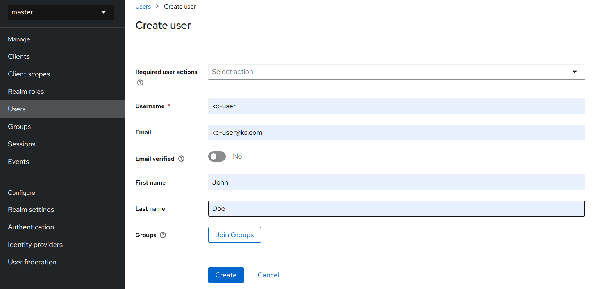
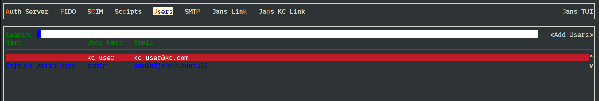

---
tags:
  - administration
  - link
  - keycloak
---

# Jans Keycloak Link

The Jans Keycloak Link is a [Jans Link](README.md) module that provides
synchronization services to update the Janssen User Store from an external
Keycloak instance.

Jans Keycloak Link accesses Keycloak data via Keycloak API. A new 
client needs to be created on Keycloak in order to authorize Jans Keycloak Link
for API access. The client can be configured to use one of the two
authentication mechanisms:

- [Client Credentials Grant](#using-client-credentials-grant)
- [Resource Owner Password Credentials Grant](#using-resource-owner-password-credentials-grant)

## Using Client Credentials Grant

### Create Client on Keycloak

- Create a new OpenId Connect client from Keycloak administration console
- Configure this client as having `confidential` access type by enabling `client
  authentication`
- Enable `Service Accounts Enabled` flag, which enables client credentials grant
  
- Go to the tab `Service accounts roles`, assign role `admin` to the client using
  `Assign role` button
  
- Keep a note of the client ID and client secret. This detail will be required 
  to be added to the Janssen server

### Configure Jans Keycloak Link Module

On the Janssen server, Jans Keycloak Link module configuration needs to be
updated to be able to connect with Keycloak server.

- Using [TUI](../config-guide/config-tools/jans-tui/README.md), update the
  Jans KC Link module configuration. Navigate to 
  `Jans KC Link` -> `Keycloak Configuration`,  and configure following 
  parameters:
  - `Server URL`: Keycloak Server URL
  - `Realm`: Keycloak Realm
  - `Client ID`: ID of the newly created client on Keycloak
  - `Client Secret`: Client secret of the Keycloak client
  - `Grant Type`: Set this as _client_credentials_
  
  
- [Test](#test-the-integration) the integration

## Using Resource Owner Password Credentials Grant

!!! Note
Use of this grant type is generally discouraged and [removed from OAuth
2.1](https://datatracker.ietf.org/doc/html/draft-ietf-oauth-v2-1-07#name-differences-from-oauth-20).

### Configure Client on Keycloak

- Create a new OpenId Connect client from Keycloak administration console
- Configure this client as having `direct access grant`
  
- Create a user in the Keycloak server. The user should have permission to
  access Keycloak API in the Keycloak. For the instructions in this document,
  We will use the default Keycloak user which is `admin`.

### Configure Jans Keycloak Link Module

On the Janssen server, Jans Keycloak Link module configuration needs to be
updated to be able to connect with Keycloak server.

- Using [TUI](../config-guide/config-tools/jans-tui/README.md), update the
  Jans KC Link module configuration. Navigate to
  `Jans KC Link` -> `Keycloak Configuration`,  and configure following
  parameters:
  - `Server URL`: Keycloak Server URL
  - `Realm`: Keycloak Realm
  - `Client ID`: ID of the newly created client on Keycloak
  - `Grant Type`: Set this as _password_
  - `Username`: Set this as _admin_
  - `Password`: Password of _admin_ user
  
  
- [Test](#test-the-integration) the integration

## Test The Integration

To check if the integration is working, you can create a user on Keycloak server.
This user should reflect in Janssen Server after the polling interval has passed.

Use [TUI](../config-guide/config-tools/jans-tui/README.md) to see the list of
available users in Janssen Server.

## Want to contribute?

If you have content you'd like to contribute to this page in the meantime, 
you can get started with 
our [Contribution guide](https://docs.jans.io/head/CONTRIBUTING/).
