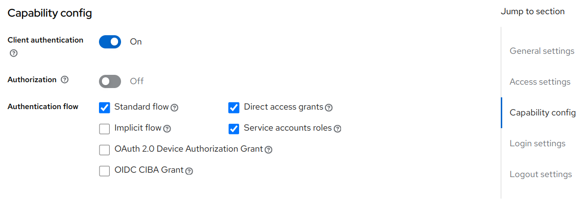

---
tags:
  - administration
  - link
  - keycloak
---

# Jans Keycloak Link

The Jans Keycloak Link is a [Jans Link](README.md) module that provide 
synchronization services to update the Janssen User Store from an external 
Keycloak instance.

Jans Keycloak Link integration with external Keycloak involves following 
configuration steps. 

## Configure Client on Keycloak

Jans Keycloak Link accesses Keycloak data via Keycloak API. A new `confidential`
client needs to be created on Keycloak in order to authorise Jans Keycloak Link
for API access.

### Using Client Credentials Grant

- Create a new OpenId Connect client from Keycloak administration console
- Configure this client as `confidential` access type by enabling `client 
  authentication`
- Enable `Service Accounts Enabled` flag, which enables client credentials grant
  
- Note the client ID and client secret. This detail will be required to be added
  to the Janssen server

### Using Resource Owner Password Credentials Grant

!!! Note
      Use of this grant type is generally discouranged and [removed from OAuth
      2.1](https://datatracker.ietf.org/doc/html/draft-ietf-oauth-v2-1-07#name-differences-from-oauth-20).


- Create a new OpenId Connect client from Keycloak administration console
- Configure this client as `confidential` access type by enabling `client
  authentication`

  
- Create a user in the Keycloak server. The user should have permissions to 
  access Keycloak API in the Keycloak. For the instructions in this document,
  We will use the default Keycloak user which is `admin`.    

## Configure Jans Keycloak Link Module 

On the Janssen server, Jans Keycloak Link module configuration need to be
updated to be able to connect with Keycloak server. Configuration parameters
change depending on the type of grant used by the client configuration on
the Keycloak server. 

If the Keycloak client uses [Client Credentials Grant](#using-client-credentials-grant)
use the following steps to configure Jans Keycloak link.

- Encode the client secret with jans command 
  ```shell
  /opt/jans/bin/encode.py {String to encrypt}
  ```
- Add these values to

  TODO: Here we need to list steps that will update the janssen data store with
  keycloak configuration as below (described in this [comment](https://github.com/JanssenProject/jans/issues/6280#issuecomment-1765091635))
  and taken implemented by [this issue](https://github.com/JanssenProject/jans/issues/7667)

```json
"keycloakConfiguration": {
		"serverUrl": "keycloak-server-url",
. 		"realm": "keycloak-realm",
 		"clientId": "id-of-client-on-keycloak",
 		"clientSecret": "{encoded-client-secret}",
 		"grantType": "client_credentials",
 		"username": "",
 		"password": ""
 	}
```

If the Keycloak client uses [Resource Owner Password Credentials Grant](#using-resource-owner-password-credentials-grant)
use the following steps to configure Jans Keycloak link.

- Encode the user password with jans command
  ```shell
  /opt/jans/bin/encode.py {String to encrypt}
  ```
- Add these values to

  TODO: Here we need to list steps that will update the janssen data store with
  keycloak configuration as below (described in this [comment](https://github.com/JanssenProject/jans/issues/6280#issuecomment-1765091635))
  and taken implemented by [this issue](https://github.com/JanssenProject/jans/issues/7667)

```json
"keycloakConfiguration": {
 		"serverUrl": "keycloak-server-url",
 		"realm": "keycloak-realm",
 		"clientId": "id-of-client-on-keycloak",
 		"clientSecret": "",
 		"grantType": "password",
 		"username": "admin",
 		"password": "{check above step 4}"
 	}
```

## Want to contribute?

If you have content you'd like to contribute to this page in the meantime, you can get started with our [Contribution guide](https://docs.jans.io/head/CONTRIBUTING/).