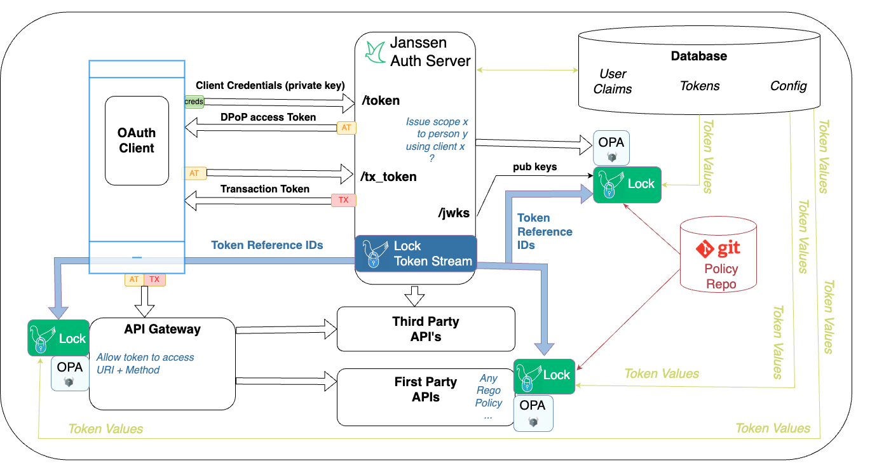

---
tags:
  - administration
  - lock
  - authorization
  - OPA
  - open policy agent
  - PDP
  - PEP
---

# Jans Lock Overview

Jans Lock enables domains to enforce policies based on real time OAuth data.  
The Lock Client pushes token data from Auth Server to
[OPA](https://openpolicyagent.org), enabling authorization based on real time
information from the OAuth infrastructure. In order to use Jans Lock, admins
will have to do a few things:

  * [Enable the Lock Token Stream in Auth Server](./lock_token_stream.md)
  * [Configure a Lock Client](./lock_client.md)
  * [Author Rego policies based on OAuth token data](./lock_opa_policies.md)

The Lock Client is a helper demon that calls the OPA API to update it with
the latest data, policies, and public keys. The Lock Client consumes updates
from an Auth Server Token Stream websocket, which contains the reference ids of
any new or revoked tokens. Lock retrieves the data (i.e. token value) for a
given token reference id from the database service.

This architecture results in the best of three worlds. First, authorization
is fast, because OAuth access and transaction tokens are in OPA's memory--no
introspection is needed. Second, admins get the power of Rego to express complex
policies based on any combination of data present in the token or context. Third,  
domains can publish central data for local decision making, for example
information about how the end user authenticated.

The Auth Server Lock Token Stream is highly confidential. The Lock Client must
present a valid OAuth access token in order to receive updates from the Lock
Token Stream. Domains should Lock Clients to trusted first party services that
use a private network. Each Lock Client uses OAuth dynamic client registration
with a software statement to enable asymmetric client authentication
and the use of DPoP access tokens.

Lock Clients download token data directly from the local persistence service.
This design minimizes the network and compute load on Auth Server. Lock Clients
also retrieve the latest policies from Git and the latest keys from a list of
OpenID Providers.

The diagram below illustrates a Jans Lock topology where OPA is used to
control course grain authorization in an API gateway, fine grain authorization
in First Party API code, and the issuance of access token scopes.

