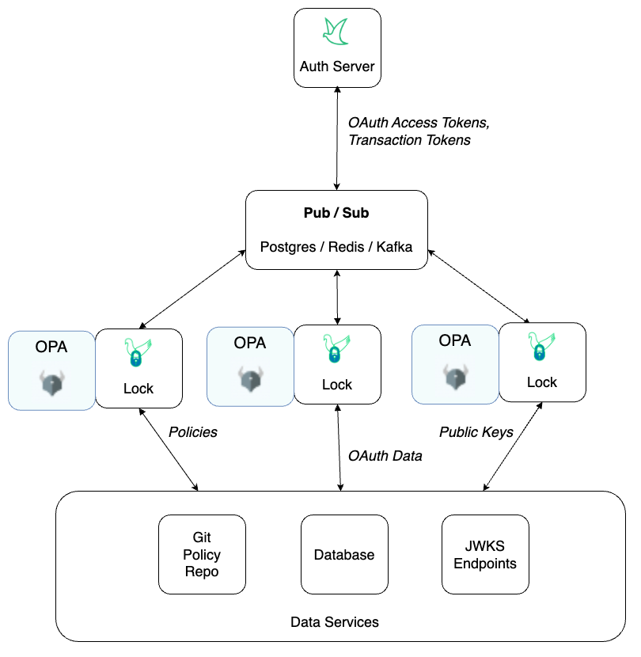
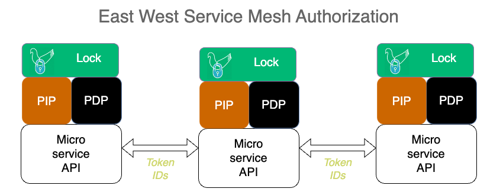

---
tags:
  - administration
  - lock
  - authorization
  - OPA
  - open policy agent
  - PDP
  - PEP
---

# Jans Lock Overview

Lock enables domains to enforce policies based on real time OAuth data. Lock
pushes token data from Auth Server to [OPA](https://openpolicyagent.org), enabling
authorization based on real time information from the OAuth infrastructure. In
order to use Lock, admins will have to do a few things:

  * [Enable Lock in Auth Server](./lock_token_stream.md)
  * [Configure a Lock client instance](./lock_client.md)
  * [Author Rego policies based on OAuth token data](./lock_opa_policies.md)

Lock is a helper demon that calls the OPA API to update it with the latest
data, policies, and public keys. Lock consumes updates from an Auth Server token
stream, which contains the reference ids of any new or revoked tokens. Lock
retrieves the data (i.e. token value) for a given token reference id from the
database service.

This architecture results in the best of three worlds. First, authorization is  
fast, because OAuth access and transaction tokens are in OPA's memory--no introspection
is needed. Second, admins get the power of Rego to express complex policies based
on any combination of data present in the token or context. Third, domains can
publish central data for local decision making, for example information about
how the end user authenticated.

The Auth Server Lock token stream is highly confidential. Lock must present a
valid OAuth access token to Auth Server in order subscribe to the token
stream. Domains should only use Lock for trusted first party services with
a private network. Each Lock client instance uses OAuth dynamic client
registration with a software statement to enable asymmetric client
authentication and the use of DPoP access tokens.

Lock client instances download token data directly from the local persistence
service. This design minimizes the network and compute load on Auth Server. Lock
can also retrieve Rego policy updates and JWKS keys.

The diagram below illustrates a Jans Lock topology where OPA is used to
control course grain authorization in an API gateway, fine grain authorization
in First Party API code, and the issuance of access token scopes.

This authorization model is also useful for East-West service mesh authorization
because it avoids the "hairpin" inefficiency of routing all traffic through
and API gateway (which is better for North-South web ingress). TLS is required
to protect the bearer token. MTLS is even better.

