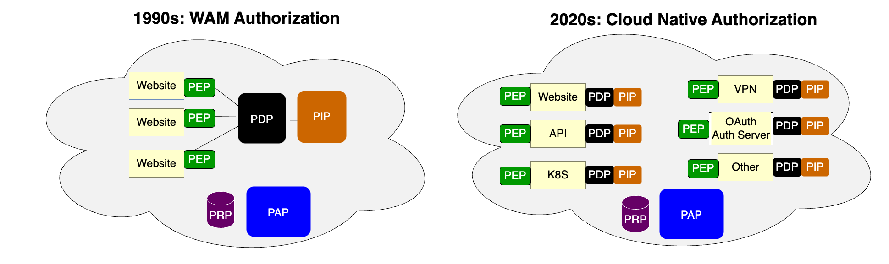
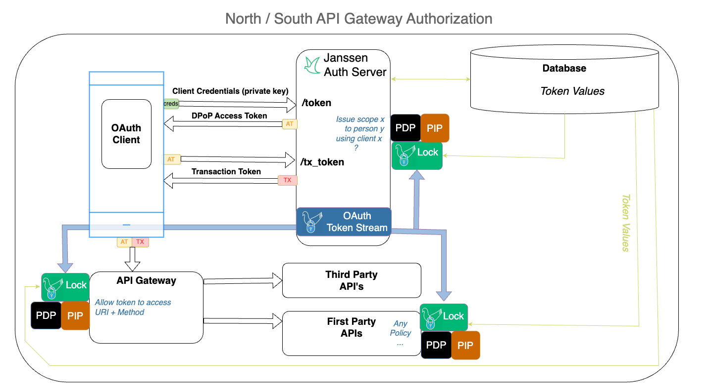

---
tags:
  - administration
  - lock
  - authorization
  - OPA
  - open policy agent
  - PDP
  - PEP
  - authz
---

# Jans Lock Overview

At a high level, Jans Lock enables domains to enforce security policies based on
real time OAuth data.

The PDP can make a blazingly fast decision if it has **in RAM** all the
necessary data, policies, and keys. But how can we keep all that rapidly
changing OAuth token data in RAM? This is especially challenging if we have a
distributed network of APIs, with each microservice deploying the PDP as a
encapsulated "sidecar". Lazy loading of token data by the PDP via OAuth
introspection or database access is not performant enough for real-time
transactional authorization.

Like a messaging client, a Lock Client gets update messages from Auth Server
for each OAuth token update event. A message contains the reference id of the
token, which enables the Lock Client to retrieve the token data from the
database, and push it into the PDP's memory or cache. You could say that Lock
aggressively initializes the PDP with token data. A Lock Client can also push
policies and keys into a PDP (if necessary).

## Definitions: Authz Components

Centralized policy management is a best practice for authorization for distributed
networks. If security policies are buried in the code of numerous applications,
they are hard to inventory and harder to update. For decades, application
security architects have conceptualized distributed authorization in line with
[RFC 2409](https://datatracker.ietf.org/doc/html/rfc2904#section-4.4)
and [XACML](https://docs.oasis-open.org/xacml/3.0/xacml-3.0-core-spec-cos01-en.html),
which describe several common components:

|Abbr.	| Term | Description |
| ----- | :--: | ----------- |
| PDP	| Policy Decision Point	|  Service which evaluates access requests against authorization policies before issuing access decisions |
| PEP	| Policy Enforcement Point | Service, website or API which queries the PDP for authorization |
| PAP	| Policy Administration Point	|  User interface where admins manage authorization policies |
| PIP	| Policy Information Point | The "data" about people, clients and resources |
| PRP	| Policy Retrieval Point | Repository where policies are stored |

## Lock Design Goal

In the old days of "WAM" (web access management), each web server would query
a centralized PDP over the network. This is ok for course grain authorization.
But for fine grain authorization, it is too slow--each decision requires a round
trip HTTP request/response. A more performant design is to move the PDP to the
edge of the network. Policy definition and administration is still a centralized
activity. Once a policy is defined, it can be executed anywhere on the network.
Although multiple PDP instances exist, they must provide the same access control
decisions given the same inputs.

Another critical optimization was to move the PIP to the edge, so the PDP
has all the data it needs to make a decision. This aligns with a principle that
each microservice has all logic and data encapsulated into a single
deployment unit.

## Choose your PDP or use OPA

Lock has a plugin architecture to support different PDP solutions. Janssen
provides a default PDP: [OPA](https://openpolicyagent.org), a
[CNCF](https://cncf.io) governed project. OPA is a popular PDP, whose adoption
grew significantly in response to the need for granular policies for Kubernetes
access control. If you have a different PDP, you can write a
[Lock PDP Plugin](./lock_pdp_plugin.md).

## Get Started

The Jans Lock solution pushes OAuth token data from Auth Server to a PDP,
enabling authorization based on real time information from the OAuth
infrastructure. In order to use Lock, admins will have to do a few things:

  * [Enable Lock in Auth Server](./lock_auth_server_config.md)
  * [Configure a Lock Client instance](./lock_client_config.md)
  * [Configure A PDP](./lock_opa.md)

The Auth Server token stream contains only the reference ids of new, updated, or
revoked tokens. Lock retrieves the data (i.e. token value) for a given token
reference id from the database service. This design minimizes the traffic on the
message queue and leverages cloud database topologies. Lock Clients can
optionally retrieve policies from Github or public keys from one or more JWKS
endpoints.

This architecture results in the best of three worlds. First, authorization is  
blazing fast, because OAuth access and transaction tokens are in OPA's memory--
no introspection is needed. Second, admins can use their PDP to express
complex policies based on any combination of data present in the token or
context. Third, domains can publish central data for local decision making, for
example information about how the end user authenticated.

The Auth Server Lock token stream is highly confidential. Lock must present a
valid OAuth access token to Auth Server in order subscribe to the token
stream. Domains should only use Lock for trusted first party services with
a private network. Each Lock Client instance uses OAuth dynamic client
registration with a software statement to enable asymmetric client
authentication and DPoP access tokens.

The diagram below illustrates a Jans Lock topology where the OPA PDP is used to
control course grain authorization in an API gateway, fine grain authorization
in First Party API code, and the issuance of access token scopes.

This authorization model is also useful for East-West service mesh authorization
because it avoids the "hairpin" inefficiency of routing all traffic through
and API gateway (which is better for North-South web ingress). TLS is required
to protect the bearer token. MTLS is better if the extra effort for additional
transport security is justified.

[Next](./lock_auth_server_config.md)
