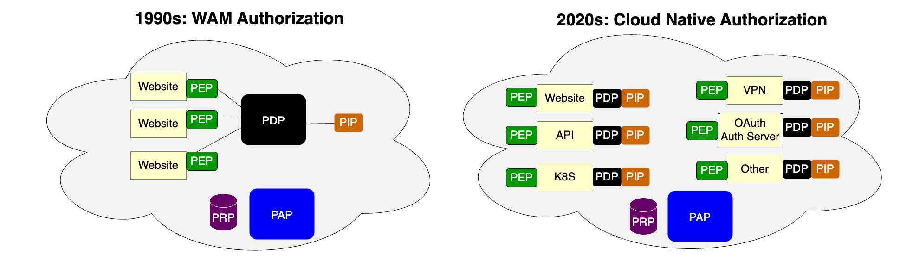

---
tags:
  - administration
  - lock
  - authorization
  - OPA
  - open policy agent
  - PDP
  - PEP
---

# Jans Lock Overview

Jans Lock enables domains to enforce access policies based on real time OAuth
data.

Centralized policy management is a best practice for authorization for distributed
networks. If security policies are buried in the code of numerous applications,
they are hard to inventory and harder to update. For decades, application
security architects have conceptualized distributed authorization in line with
[RFC 2409](https://datatracker.ietf.org/doc/html/rfc2904#section-4.4)
and [XACML](https://docs.oasis-open.org/xacml/3.0/xacml-3.0-core-spec-cos01-en.html),
which describe several common components:

|Abbr.	| Term | Description |
| ----- | :--: | ----------- |
| PDP	| Policy Decision Point	|  Service which evaluates access requests against authorization policies before issuing access decisions |
| PEP	| Policy Enforcement Point | Service, website or API which queries the PDP for authorization |
| PAP	| Policy Administration Point	|  User interface where admins manage authorization policies |
| PIP	| Policy Information Point | The "data" about people, clients and resources |
| PRP	| Policy Retrieval Point | Repository where policies are stored |

In the old days of "WAM" (web access management), each web server would query
a centralized PDP over the network. This is ok for course grain authorization.
But for fine grain authorization, it is too slow--each decision requires a round
trip HTTP request/response. A more performant design is to move the PDP to the
edge of the network. Policy definition and administration is still a centralized
activity. Once a policy is defined, it can be executed anywhere on the network.
Although multiple PDP instances exist, they must provide the same access control
decisions given the same inputs.

Another critical optimization was to move the PIP to the edge, so the PDP
has all the data it needs to make a decision. This aligns with a principle that
each microservice is well-encapsulated--all logic and data is encapsulated into
a single deployment unit.

To empower this cloud native authorization pattern, Janssen leverages a
component governed under the Linux Foundation: [OPA](https://openpolicyagent.org),
a project at the [CNCF](https://cncf.io). OPA is a popular PDP, whose popularity
grew significantly in response to the need for granular policies for Kubernetes
access control. The Jans Lock solution pushes token data from Auth Server to OPA,
enabling authorization based on real time information from the OAuth
infrastructure. In order to use Lock, admins will have to do a few things:

  * [Enable Lock in Auth Server](./lock_token_stream.md)
  * [Configure a Lock client instance](./lock_client.md)
  * [Author Rego policies based on OAuth token data](./lock_opa_policies.md)

Lock is a helper demon that calls the OPA API to update it with the latest
data, policies, and public keys. Lock consumes updates from an Auth Server token
stream, which contains the reference ids of any new or revoked tokens. Lock
retrieves the data (i.e. token value) for a given token reference id from the
database service.

This architecture results in the best of three worlds. First, authorization is  
fast, because OAuth access and transaction tokens are in OPA's memory--no introspection
is needed. Second, admins get the power of Rego to express complex policies based
on any combination of data present in the token or context. Third, domains can
publish central data for local decision making, for example information about
how the end user authenticated.

The Auth Server Lock token stream is highly confidential. Lock must present a
valid OAuth access token to Auth Server in order subscribe to the token
stream. Domains should only use Lock for trusted first party services with
a private network. Each Lock client instance uses OAuth dynamic client
registration with a software statement to enable asymmetric client
authentication and the use of DPoP access tokens.

Lock client instances download token data directly from the local persistence
service. This design minimizes the network and compute load on Auth Server. Lock
can also retrieve Rego policy updates and JWKS keys.

The diagram below illustrates a Jans Lock topology where OPA is used to
control course grain authorization in an API gateway, fine grain authorization
in First Party API code, and the issuance of access token scopes.

This authorization model is also useful for East-West service mesh authorization
because it avoids the "hairpin" inefficiency of routing all traffic through
and API gateway (which is better for North-South web ingress). TLS is required
to protect the bearer token. MTLS is even better.

