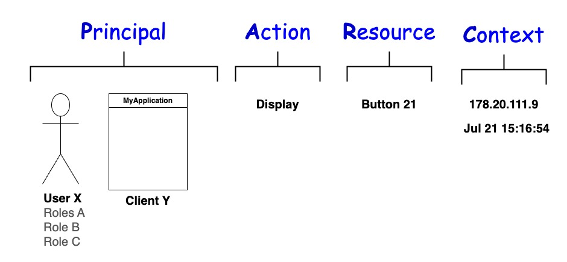

---
tags:
  - administration
  - lock
  - authorization / authz
  - Cedar
  - Cedarling
---

## Cedarling Authorization

The Cedarling is a local, autonomous Policy Decision Point, or "PDP". It runs as a local 
WebAssembly ("WASM") component--you can call it directly in the browser from a JavaScript 
function. With each authorization call, the Cedarling has all the policies and data it 
needs to make a fast, local decision. The Cedarling's authorization function is *deterministic*.
The Cedarling always returns either `permit` or `forbid`. You will never get an error 
indicating a network timeout, or a divide by zero error. It is also very fast.


In a JavaScript browser framework, the Cedarling loads its policy store during initialization, as a 
static JSON file or fetched via REST. Developers may consider the Cedarling policy store as part of 
the code. Having the policies in one file makes it easier to audit the security features and 
controls of an application. It facilitates creation of complex contextual policies without 
cluttering application code with lots of `if` - `then` statements. Importantly, the Cedarling creates an 
audit log of all decisions by an application to allow or forbid actions. In an enterprise deployment, 
this audit log is sent for central archiving.

Where does the Cedarling get the data for policy evaluation? The data is contained in OAuth and 
OpenID JWTs that are sent as part of the authorization request to the Cedarling. This makes sense, 
because most modern applications rely on a federated identity provider or "IDP". The Cedarling assumes 
the use of OAuth and OpenID Connect--sorry SAML geeks. 


Two JWT tokens in particular are typical: (1) an OpenID Connect id_token and (2) an OAuth access 
token. The Cedarling can trust the id_token and access token to extract the User, 
Role and Client pricipals. The tokens also contain other interesting contextual data. An OpenID 
Connect id_token JWT is a record of an authentication event that tells you who authenticated, when 
they authenticated, how they authenticatated, and other claims like the subject's Roles. An OAuth 
Access Token JWT can tell you information about the software that obtained the the JWT, its extent 
of access as defined by the OAuth Authorization Server (*i.e.* the values of the `scope` claim), or 
other claims--domains frequently enhance the access token to contain business specific data needed 
for policy evaluation.

The Cedarling, as its name suggests, enables you to define the security rules for your application 
in [Cedar](https://www.cedarpolicy.com/en) policy syntax. Cedar was invented by Amazon for their 
[Verified Permission](https://aws.amazon.com/verified-permissions/) service. It uses the **PARC** 
syntax: **P**rincipal, **A**ction, **R**esource, **C**ontext.  Principal-Action-Resource is typical
for most authorization solutions. For example, you may have a policy that says *Admins* can *write*
to the *config* folder. In this example, the *Admin* Role is the Principal, *write* is the Action,
and the *config* folder is the Resource. The Context is used to specify information about the
enivironment, like the time of day or network address.

The Cedarling authorizes a person using a certain piece of software to do something. From 
a logical perspective, `person_allowed AND client_allowed` must be `True`. While this seems pretty
simple, a person may be either explicitly allowed or have a role that enables access. For example, 
`person_allowed` may be equal to `True` if `user=mike OR role=SuperUser`. 



The Action, Resource and Context is sent by the application in the authorization request. This 
is where developers need to map security in their application to actions and resources. For 
example, in the diagram above the application may have a policy that restricts access to Button 21 
to users with the Admin Role during business hours when they are not using a VPN. 

## Cedarling Token Validation

The Cedarling can validate the signatures of the JWTs for developers, by setting the `SIGNATURE_VALIDATION` 
environment variable to `True`. For testing, developers can set this property to `False` and submit
an unsigned JWT. Or developers may prefer to validate the signatures in code. 

On initiatilization, the Cedarling downloads the public keys of the Trusted IDPs specified in the 
Cedarling policy store. Because all JWT's have an `iss` claim, this is used to deterimne which keys 
to use for token signature validation. 

In an enterprise deployment, the Cedarling can also check if a JWT has been revoked. The Cedarling
uses a mechanism described in the [OAuth Status Lists](https://datatracker.ietf.org/doc/draft-ietf-oauth-status-list/)
draft. This might be handy for use cases where a token revocation needs to be communicated 
immediately, such as an account takeover situation, or an implementation of a one-time transactions
in a cluster of web servers. Jans Auth Server supports the [Global Token Revocation](https://datatracker.ietf.org/doc/draft-parecki-oauth-global-token-revocation/) OAuth draft. This is how a client can inform the OAuth Server that a given token should be revoked. 


## Policy Authoring 

The eaisest way to author your policy store is to use the Policy Designer in [Agama Lab](https://cloud.gluu.org/agama-lab). This tool helps you define the policies, schema and trusted IDPs and
to publish a policy store to Github. 

## Testing the Cedarling

To call the Cedarling from your JavaScript application

```
input = { 
           "access_token": ["..."], 
           "id_token": "...", 
           "userinfo_token": ["..."], 
           "tx_token": ["..."],
           "resource": "ChessApp",
           "action": "Execute",
           "context": {
                       "ip_address": "54.9.21.201",
                       "network_type": "VPN",
                       "user_agent": "Chrome 125.0.6422.77 (Official Build) (arm64)",
                       "time": "1719266610.98636",
                      }
         }

decision_result = authz(input)

```

## Cedarling Bootstrap Properties

* **`CEDARLING_APPLICATION_NAME`** : Human friendly identifier for this application

* **`CEDARLING_LOCK`** : Enabled | Disabled. If Enabled, the Cedarling will connect to the Lock Master for policies, and subscribe for SSE events. 

* **`CEDARLING_POLICY_STORE_URI`** : Location of policy store JSON, used if policy store is not local, or retreived from Lock Master.

* **`CEDARLING_LOCK_MASTER_CONFIGURATION_URI`** : Required if `LOCK` == `Enabled`. URI where Cedarling can get JSON file with all required metadata about Lock Master, i.e. `.well-known/lock-master-configuration`.

* **`CEDARLING_LOCK_SSA_JWT`** : SSA for DCR in a Lock Master deployment. The Cedarling will validate this SSA JWT prior to DCR.

* **`CEDARLING_POLICY_STORE_ID`** : The identifier of the policy stored needed only for Lock Master deployments.

* **`CEDARLING_LOG_LEVEL`** : Controls the verbosity of Cedar logging.

* **`CEDARLING_AUDIT_LOG_INTERVAL`** : How often to send log messages to Lock Master (0 to turn off trasmission)

* **`CEDARLING_AUDIT_HEALTH_INTERVAL`** : How often to send health messages to Lock Master (0 to turn off transmission)

* **`CEDARLING_AUDIT_TELEMETRY_INTERVAL`** : How often to send telemetry messages to Lock Master (0 to turn off transmission)

* **`CEDARLING_DYNAMIC_CONFIGURATION`** : Enabled | Disabled, controls whether Cedarling should listen for SSE config updates

* **`CEDARLING_GET_TOKEN_STATUS_LIST_UPDATES`** : Whether the Cedarling should register for SSE updates for Lock Master deployments.

* **`CEDARLING_SIGNATURE_ALGORITHMS_SUPPORTED`** : ....

* **`CEDARLING_SIGNATURE_VALIDATION`** : Enabled | Disabled 

* **`CEDARLING_REQUIRE_AUD_VALIDATION`** : Enabled | Disabled. Controls if Cedarling will discard id_token without an access token with the corresponding client_id.

