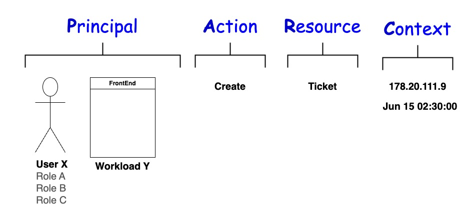
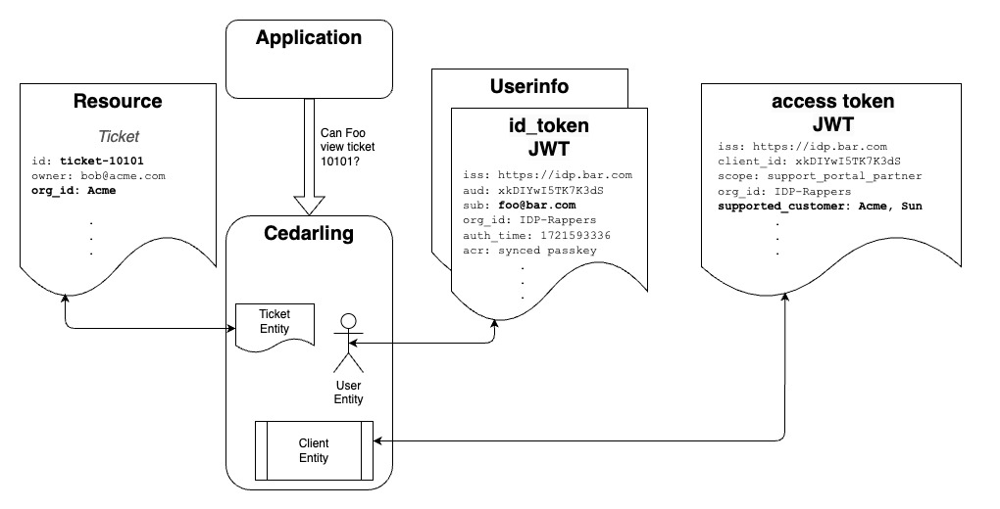

---
tags:
  - administration
  - lock
  - authorization / authz
  - Cedar
  - Cedarling
---

## What is Cedar

[Cedar](https://www.cedarpolicy.com/en) was invented by Amazon for their 
[Verified Permission](https://aws.amazon.com/verified-permissions/) service. Cedar enables 
developers to create complex, contextual policies without cluttering application code with lots 
of `if` - `then` statements. Externalizing policies also makes it easier to audit the security 
controls and decisions of an application.  

Cedar is a deterministic policy engine--if the schema and policies are validated, the engine will 
always return `allow` or `deny` for an authorization request. Cedar uses the **PARC** syntax: 
**P**rincipal, **A**ction, **R**esource, **C**ontext. For example, you may have a policy that says
*Admins* can *write* to the */config* folder. The *Admin* Role is the Principal, *write* is the 
Action, and the */config* folder is the Resource. The Context is used to specify information about
the enivironment, like the time of day or network address. Cedar is a compromise: it's less reductive 
then RBAC but still deterministic; at the same time, it's less flexible then a full programming 
language, but still expressive.



## What is the Cedarling

The Cedarling is a performant local authorization service that runs the Rust Cedar Engine. 
Cedar policies and schema are loaded at startup from a locally cached "Policy Store". In simple 
terms, the Cedarling returns the answer: should the application allow this action on this resource
given these JWT tokens. "Fit for purpose" policies help developers build a better user experience. 
For example, why display form fields that a user is not authorized to see? The Cedarling is a more 
productive and flexible way to handle authorization. 

In addition to authorization, the Cedarling can perform two more important jobs: (1) it can 
validate JWT tokens; (2) it can create an audit log of all authorizations permitted and denied.

### Authorization 

The Cedarling runs in the browser as a WebAssembly ("WASM") component, in a mobile application, 
or in the cloud. Although it runs at the edge--even embedded in a JavaScript browser application--
the Cedarling is not just for front end security. Developers can use it for backend applications
and even API gateways--multilayered security is best.

The Cedarling provides RBAC out-of-the-box. Developers can also express a variety of policies 
beyond the limitations of "person with role has access". For example, you can allow access only to
users who authenticate with a certain type of passkey or incorporate a fraud score to elevate 
security for riskier transaction. These policies are easily and rapidly evaluated by the Cedarling.

Architecturally, the Cedarling is an autonomous Policy Decision Point, or "PDP". The Cedarling 
rapidly evaluates authorization requests because it has all the policies and data it needs to make
a local decision. A key feature of the Cedarling is to log all `allow` or `deny` decisions returned
to the application. In an enterprise deployment, this audit log is sent for central archiving.


The Cedarling loads its Policy Store during initialization as a static JSON file or fetched via HTTPS. 
The Policy Store contains the Cedar Policies, Cedar Schema, and optionally, a list of the Trusted IDPs. 
Developers may consider the Cedarling Policy Store as part of the code. While there is some core schema,
developers will frequently need to add actions and resources that are specific for their application. 
For example, a developer writing a support ticket application might want to define an action called 
"Close" or "Reply", and an entity type called "Ticket". 

Where does the Cedarling get the data for policy evaluation? Or in Cedar jargon, where do the 
entities come from? The application request includes the Resource data--remember the application 
is asking if it can perform a certain action on a certain resource. The Principal entities are 
derived from the JWTs--the combined OpenID id_token and  Userinfo tokens enable the Cedarling to 
create a User and Role entities; the OAuth access token is used to create a Client entity.



The id_token JWT represents a user authentication event. The access token JWT represents a 
client authentication event. These tokens contain other interesting contextual data. An OpenID 
Connect id_token tells you who authenticated, when they authenticated, how they authenticatated, 
and optionally other claims like the User's roles. An OAuth access token  can tell you information 
about the software that obtained the JWT, its extent of access as defined by the OAuth Authorization Server 
(*i.e.* the values of the `scope` claim), or other claims--domains frequently enhance the access token to
contain business specific data needed for policy evaluation.

The Cedarling authorizes a person using a certain piece of software. From a logical perspective, 
`person_allowed AND client_allowed` must be `True`. A person may be either explicitly allowed, or 
have a role that enables access. For example, `person_allowed` is `True` if 
`user=mike OR role=SuperUser` and application is from `org_id=Acme`. 

The JWT's, Action, Resource and Context is sent by the application in the authorization request. For 
example, this is a sample request from a hypothetical JS application:

```
input = { 
           "access_token": "eyJhbGc....", 
           "id_token": "eyJjbGc...", 
           "userinfo_token": "eyJjbGc...",
           "tx_token": "eyJjbGc...",
           "action": "View",
           "resource": {"Ticket": {
                                  "id": "ticket-10101", 
                                  "owner": "bob@acme.com", 
                                  "org_id": "Acme"
                                  }
                        },
           "context": {
                       "ip_address": "54.9.21.201",
                       "network_type": "VPN",
                       "user_agent": "Chrome 125.0.6422.77 (Official Build) (arm64)",
                       "time": "1719266610.98636",
                      }
         }

decision_result = authz(input)
```

### JWT Validation

Optionally, the Cedarling can validate the signatures of the JWTs for developers. To enable this, 
set the `CEDARLING_JWT_VALIDATION` bootstrap property to `True`. For testing, developers can set 
this property to `False` and submit an unsigned JWT, for example one you generate with 
[JWT.io](https://jwt.io). 

If token validation is enabled, on initiatilization the Cedarling downloads the public keys of 
the Trusted IDPs specified in the Cedarling policy store. The Cedarling uses the JWT `iss` 
claim to determine the right keys for validation.

In an enterprise deployment, the Cedarling can also check if a JWT has been revoked. The Cedarling
checks the status following a mechanism described in the 
[OAuth Status Lists](https://datatracker.ietf.org/doc/draft-ietf-oauth-status-list/)
draft. Enforcing the status of tokens helps limit the damage of account takeover--i.e. to immediately 
recursively revoke all the tokens issued to an attacker. Domains may want to use Token Status also to 
implement single-transaction tokens; for example, a token that is good for one and only one wire 
transfer.

Here is a summary of the ways the Cedarling may validate a JWT, depending on your bootstrap properties:
* Validate signature from Trusted Issuer 
* Discard id_token if `aud` does not match access_token `client_id` 
* Discard Userinfo token not associated with a `sub` from the id_token
* If Cedarling is Locked, check token status
* Check access token and id_token `exp` and `nbf` claims if time sent in Context


### Audit Logs

The audit log contain a record of all a Cedarling's decisions and token validations. In an enterprise
deployment, logs are sent to the Lock Server `/audit` endpoint for central archiving.

## Cedarling Policy Store

By convention, the filename is `cedarling_store.json`. It contains all the data the 
Cedarling needs to evaluate policies and verify JWT tokens:

1. Cedar Schema - Base64 encoded human format
2. Cedar Policies - Base64 encoded human format
3. Trusted Issuers - See below syntax

The JSON schema looks like this:

```
{
    "app_id": "...",
    "policies": "...",
    "schema": "...",
    "trusted_idps": [...]
}
```

### Trusted Issuer Schema

* **`name`** : String, no spaces
* **`description`** : String
* **`openid_configuration_endpoint`** : String with `https` url of `.well-known` for domain.
* **`access_tokens`** : Object with claims:
  * `trusted`: `True | False` 
* **`id_tokens`** : Object with claims: 
  * `trusted`: `True | False`
  * `principal_identifier`: the token claim used to identify the User entity (in SAML jargon it's
  the "NameID format"). This claim is optional--it may be present in the Userinfo token. Defaults to `sub`. 
  * `role_mapping`: A list of the User's roles
* **`userinfo_tokens`** :
  * `trusted`: `True | False`
  * `principal_identifier`: the token claim used to identify the User entity (in SAML jargon it's
  the "NameID format"). This claim is optional--it may be present in the Userinfo token. Defaults to `sub`. 
  * `role_mapping`: A list of the User's roles
* **`tx_tokens`** :
  * `trusted`: `True | False`

Non-normative example:
```
[
{"name": "IDP1", 
 "description": "Acme IDP", 
 "openid_configuration_endpoint": "https://acme.com/.well-known/openid-configuration",
 "access_tokens": {"trusted": True}, 
 "id_tokens": {"trusted":True, "principal_identifier": "email"},
 "userinfo_tokens": {"trusted": True, "role_mapping": ["hr-admin", "staff"]},
 "tx_tokens": {"trusted": True}
},
{IDP-2},
{IDP-3}...
]
```

### Policy and Schema Authoring

You can hand create your Cedar policies and schema in [Visual Studio](https://marketplace.visualstudio.com/items?itemName=cedar-policy.vscode-cedar). Make sure you run the cedar command line tool to validate both your 
schema and policies. The eaisest way to author your policy store is to use the Policy Designer in 
[Agama Lab](https://cloud.gluu.org/agama-lab). This tool helps you define the policies, schema and
trusted IDPs and to publish a policy store to a Github repository.


## Cedarling Properties

These Bootstrap Properties control default application level behavior.

* **`CEDARLING_APPLICATION_NAME`** : Human friendly identifier for this application

* **`CEDARLING_POLICY_STORE_URI`** : Location of policy store JSON, used if policy store is not local, or retreived from Lock Master.

* **`CEDARLING_JWT_VALIDATION`** : Enabled | Disabled 

* **`CEDARLING_JWT_SIGNATURE_ALGORITHMS_SUPPORTED`** : ....

* **`CEDARLING_REQUIRE_AUD_VALIDATION`** : Enabled | Disabled. Controls if Cedarling will discard id_token without an access token with the corresponding client_id.

* **`CEDARLING_ROLE_MAPPING`** : Default: `{"id_token": "role", "userinfo_token": "role"}` but the role may be sent as an access token, or with a different identifier. For example, for Ping Identity, you might see `{"userinfo_token": "memberOf"}`.

* **`CEDARLING_LOG_LEVEL`** : Controls the verbosity of Cedar logging.

The following bootstrap properties are only needed for enterprise deployments.

* **`CEDARLING_LOCK`** : Enabled | Disabled. If Enabled, the Cedarling will connect to the Lock Master for policies, and subscribe for SSE events. 

* **`CEDARLING_LOCK_MASTER_CONFIGURATION_URI`** : Required if `LOCK` == `Enabled`. URI where Cedarling can get JSON file with all required metadata about Lock Master, i.e. `.well-known/lock-master-configuration`.

* **`CEDARLING_LOCK_SSA_JWT`** : SSA for DCR in a Lock Master deployment. The Cedarling will validate this SSA JWT prior to DCR.

* **`CEDARLING_POLICY_STORE_ID`** : The identifier of the policy stored needed only for Lock Master deployments.

* **`CEDARLING_AUDIT_LOG_INTERVAL`** : How often to send log messages to Lock Master (0 to turn off trasmission)

* **`CEDARLING_AUDIT_HEALTH_INTERVAL`** : How often to send health messages to Lock Master (0 to turn off transmission)

* **`CEDARLING_AUDIT_TELEMETRY_INTERVAL`** : How often to send telemetry messages to Lock Master (0 to turn off transmission)

* **`CEDARLING_DYNAMIC_CONFIGURATION`** : Enabled | Disabled, controls whether Cedarling should listen for SSE config updates

* **`CEDARLING_GET_TOKEN_STATUS_LIST_UPDATES`** :  Enabled | Disabled, controls whether Cedarling should listen for SSE OAuth Status List updates


