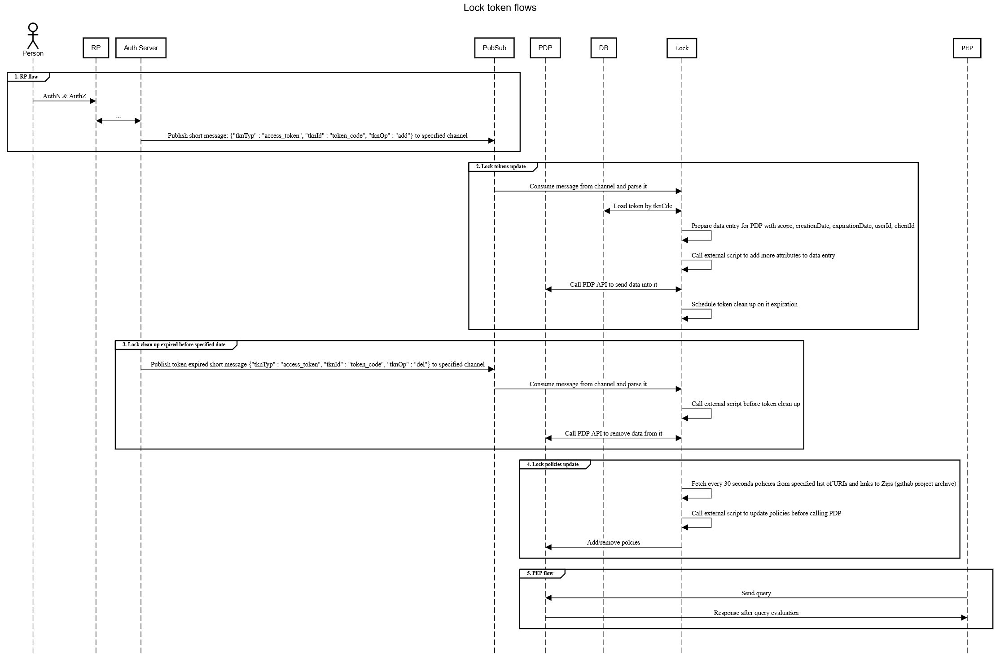

---
tags:
 - administration
 - lock
 - opa
---

## Jans Lock Token Stream Service

To enable Jans Auth PubSub messages 2 configuration should be configured:
  * Lock messaging connection details
  * Jans Auth messaginbg configuration
  
It's possible to modify them with jans-config-api.

First configuration Jans stores in `ou=configuration,o=jans` entry. This is reusable configuration. Other application which uses `jans-core-message.jar` library also should use it.
Default configuration after CE install when messaging API is not enabled:

```
jansMessageConf:
{
  "messageProviderType": "DISABLED",
  "postgresConfiguration": {
    "connectionUri": "jdbc:postgresql://localhost:5432/postgres",
    "dbSchemaName": "public",
    "authUserName": "postgres",
    "authUserPassword": "",
    "messageWaitMillis": 100,
    "messageSleepThreadTime": 200
  },
  "redisConfiguration": {
    "servers": "localhost:6379"
  }
}
```

It has 2 section for PostgreSQL (`postgresConfiguration`) and Redis (`redisConfiguration`) connection details.

`messageProviderType` can have 3 values: DISABLED, REDIS, POSTGRES

Full list of properties defined in jans-config-api-swagger.yaml.

You can configure these properties in the TUI `Auth Server > Messages` section.


Second configuration is needed for Jans Auth. In current version Jans Auth calls message API after access_token persistence/removal from/to DB from `GarntService`. Jans Messages API library provides generic API to hide actual PubSub messages publishing/receiving implementation.

This is default configuration after server install:

```
    "lockMessageConfig": {
        "enableTokenMessages" : false,
        "tokenMessagesChannel": "jans_token"
    }
```
First property control sending messages to PubSub server. Second one `tokenMessagesChannel` specify channel name to send token messages.

You can configure there properties in TUI `Auth Server > Properties` section.


The format of messages which Jans Auth issue is JSON. And it has minimum data for quick processing. Here is message pattern:

```
{"tknTyp" : "access_token", "tknId" : "token_identifier", "tknOp" : "add/del"}
```

Note: For demo purposes in Jans CE with PostgreSQL and Lock server selected to install messages enabled by default.


List of Lock flows:


[Link](https://sequencediagram.org/index.html#initialData=C4S2BsFMAIBkHsDGBrax7MgO2gM3PAO4DOAUKQIaLoBO0ACpDcfFqQA4U2iIidbBoAJXocuPPhQHQAggFdgAC2gBlJgDcmY7iF79B9OQCMVx7RP0MAIqM469UwVYBC5XK2C4KAWxDgAntDerPDkAOY08HLs0ACMAHTC9HgEhKSMzKwAtAB8IgBcsgqKAHLQAGRFSgBapCIAPLnySqoaTIXxnaTNymo0mjS5hibGhcPgIMTKU-DcQZDExBRhkIUA3gBEwMhYACr+7BvQhRtUiAvEAPromFgbADTQWzsAkgAmRyc32JeI8G+QB5PbZYADyh2OTwobw+AF80PBoMR2JBeLgQJA3tBEIopFhIOBSNg3uFItFoAAmRIIFAI27EaDRN4UYCQdLGUxGXI05CFADCrGIcm8MBFi2WMFwkW82NxWHx4GgUixdmIMDApB5jRyLkKCGhdOw0CMgRBfIBmqQyG1PLGNEgdhgzOAFGg2GANEC7jo9Bs0EIYGmfxRj0Q9pZIFYVhZkEekAAHuwQDQI1GY485GqaO9QxN3e9LSgbVb+RRwIqE6yaFgy0iw3xBOglTCgrMYCyPSAjAoFgjoM7Xe7PYXrUMbKXy9ZkjJ6C8+2qsFiB9AQAJERqtdyS6ocZi5FBDThEFApIyYqwV4IE0mU6BWETF6SojEAMzUq3Yk84cnX5OY42QN6MDIqiIDov+zpsj0rT9EwQwcqMDDGBMUyHm6iZ-liMxzGKSwrNAmwgvsEInGcFzXBg2BAs8WDvJ8wKUVgvz-ICjw0eC9EbAC4AbPCTYgWiGJYjieIEuyIxcjktrQAKWBCiK8zivhUrwDKInygSSqLtAqrqsAI7FigE4VvGVY1oqxD1uwghGIBbZocekCntEBljvQxlTrIs59vawSaP2LKuipMoasST7kgALO+tLsPAEy8L2TIxq5UnbgAYpAwA4m6AyBC+AAMSKoqwbwMrF8UYgywVIiign-ihgjwLg0AAKpCC8DLKtAExYMgDJNtUfAMgAFGEgYUEYOmRAAVqighcDiICaAAlCl0l8mWJlmbWlk0A2fZJayOlxbolUAUB2KbauYRTiObmFDIMIAPS+fA-nlQlZBhaQETPtAACsiT0AAosk+BEOkoP3a02kAI5yEw-jpDYQyg4UQgLLFcntrgVbQPDiM5WWcipmwxJAA)


Code:

```
title Lock token flows

actor Person
participant RP
participant Auth Server
participant PubSub
participant PDP
participant DB

fontfamily mono

group 1. RP flow
Person->RP: AuthN & AuthZ
RP<->Auth Server: ...
Auth Server->PubSub: Publish short message: {"tknTyp" : "access_token", "tknId" : "token_code", "tknOp" : "add"} to specified channel
end

group 2. Lock tokens update
PubSub->Lock: Consume message from channel and parse it
Lock<->DB: Load token by tknCde
Lock<->Lock: Prepare data entry for PDP with scope, creationDate, expirationDate, userId, clientId
Lock<->Lock: Call external script to add more attributes to data entry
Lock<->PDP: Call PDP API to send data into it
Lock<->Lock: Schedule token clean up on it expiration
end

group 3. Lock clean up expired before specified date
Auth Server->PubSub: Publish token expired short message {"tknTyp" : "access_token", "tknId" : "token_code", "tknOp" : "del"} to specified channel
PubSub->Lock: Consume message from channel and parse it
Lock<->Lock: Call external script before token clean up
Lock<->PDP: Call PDP API to remove data from it
end

group 4. Lock policies update
Lock<->Lock: Fetch every 30 seconds policies from specified list of URIs and links to Zips (githab project archive)
Lock<->Lock: Call external script to update policies before calling PDP
Lock->PDP: Add/remove polcies
end

group 5. PEP flow
PEP->PDP: Send query
PDP->PEP: Response after query evaluation
end
```
