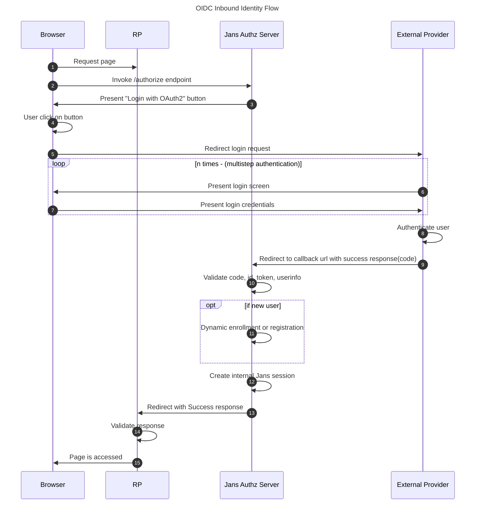

## Overview

In this tutorial, we will see how you can integrate any inbound external oauth2 provider authentication in the Janssen server. If you are looking for social login support then check out [passport](../recipes/passportjs.md) module for that.

We will use [interception authentication script](../../script-catalog/person_authentication/oidc/oidc-jans-script.py) which is a [PersonAuthenticationType](https://github.com/JanssenProject/jans/blob/main/jans-core/script/src/main/java/io/jans/model/custom/script/type/auth/PersonAuthenticationType.java) script for whole flow. Currently, It supports `Authorization Code Flow` and `client_secret_post` token endpoint auth method.

## Authentication Flow

You can add any external OAuth2 server authentication option and provision authenticated users to your Janssen server A.K.A. Inbound-identity.



## Prerequisites

- The [external oauth2 server authentication script](../../script-catalog/person_authentication/oidc/oidc-jans-script.py)
- External OAuth2 Provider credentials: you can choose any external OP server that follows OAuth2 standards and authentication features.  
- RP application: This is your application that will be used by your users and where you want to add this auth feature.

## Configure Janssen server

### 1. Add Custom Script

   - Create `cs.json` with the contents of a CUSTOM script.

   - Edit the `cs.json` file's contents to reflect the addition of the oidc custom script.

      - Populate the `script` field with `oidc-jans-script.py` script. [Download `oidc-jans-script.py` script from here.](../../script-catalog/person_authentication/oidc/oidc-jans-script.py)

      - This script needs to accept one property `oidc_creds_file`. which is a JSON file with your external oauth2 server details:

         ```
         // oidc_creds_file: /opt/oidc.json
         {
         "op_server": "https://your.external.oauth2.server",
         "client_id": "xxxxxxxxxxxxxxxx-xxxxx-external-oauth2",
         "client_secret": "xxxxxxxxxxxxxx-xxxxx-external-oauth2",
         "authorization_uri": "https://your.external.oauth2.server/xx/xxxx",
         "token_uri": "https://your.external.oauth2.server/oauth/xx/xxx",
         "userinfo_uri": "https://your.external.oauth2.server/xxx/xxx",
         "redirect_uri": "https://your.jans.server/jans-auth/postlogin.htm",
         "scope": "openid profile email",
         "auto_redirect": false,
         "title": "Login with OAuth2"
         }
         ```

         | Property | Description |
         |----------|-------------|
         | op_server | Your external OAuth2 server FQDN |
         | client_id | Client id of your external OAuth2 server |
         | client_secret | Client secret of your external OAuth2 server |
         | authorization_uri | Authorization endpoint of your external OAuth2 server |
         | token_uri | Token endpoint of your external OAuth2 server |
         | userinfo_uri | Userinfo endpoint of your external OAuth2 server |
         | redirect_uri | Sample: `https://<your.jans.server>/jans-auth/postlogin.htm`, This is redirect URL where your OAuth2 server redirect back with `code`. Use this same URL to configure `redirect urls` at your external OAuth2 server.|
         | scope | OAuth scopes |
         | auto_redirect | If true, it will automatically redirect to external OAuth2 server otherwise you will get one button on jans login page.|
         | title | This property is used to set text for a button which is shown on jans login page |

      - `name` field should reflect the use case i.e. `oidc`
      - `script_type` field should be `PERSON_AUTHENTICATION`
      - `cs.json` example:

         ```
         {
           "dn": null,
           "inum": null,
           "name": "oidc",
           "aliases": [],
           "description": "OIDC Inbound custom script",
           "script": "_file /root/oidc-jans-script.py",
           "scriptType": "PERSON_AUTHENTICATION",
           "programmingLanguage": "JYTHON",
           "moduleProperties": {
             "value1": null,
             "value2": null,
             "description": null
           },
           "configurationProperties": [
             {
               "value1": "oidc_creds_file",
               "value2": "/opt/oidc.json",
               "description": "External server details",
               "hide": true
             }
           ],
           "level": "integer",
           "revision": 0,
           "enabled": true,
           "scriptError": {
             "raisedAt": null,
             "stackTrace": null
           },
           "modified": false,
           "internal": false
         }
         ```

   - Add the custom script
      ```
      /opt/jans/jans-cli/config-cli.py --operation-id post-config-scripts --data /tmp/cs.json
      ```
         
### 2. Login Page Setup

- OIDC Script needs a login page
- Download [oidc-jans-login.xhtml from here](../../script-catalog/person_authentication/oidc/oidc-jans-login.xhtml) 
- Place it here `/opt/jans/jetty/jans-auth/custom/pages/auth/oidc/`. If folders are not there then create them in the same order. Rename it to `oidc.xhtml`.
- Restart jans-auth server `service jans-auth restart`
- Check [here](https://jans.io/docs/admin/developer/customization/customize-web-pages) for more details on custom login page.

Now `oidc` script is an available authentication mechanism for your Janssen Server. This means that using OpenID Connect `acr_values`, applications can now request your external auth server for authentication.

!!! Note To make sure `oidc` script has been enabled successfully, you can check your Janssen Server's OpenID Connect configuration by navigating to the following URL: `https://<hostname>/.well-known/openid-configuration`. Find `acr_values_supported:` and you should see `oidc`.

## Test with RP Client

RP(Relying party) is an application that will be used by your users when you want to add authentication and protect resources. Once you initiate auth request from your RP Application make sure to add `acr_values=oidc` in the request. `acr_values` is your script name as configured above.
