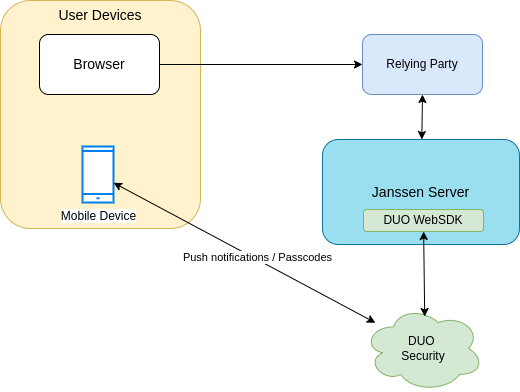

# Implement Two-Step Authentication Using Janssen Server and Duo Security

This document explains how to use Janssen Server Duo interception script to configure a two-step authentication process with username and password as the first step, and Duo as the second step. 

[Duo Security](https://duo.com/) is a SaaS authentication provider that supports multi-factor authentication including push-approvals, passcode, SMS-OTP etc. Duo provides web SDK via which clients like Janssen Server can integrate with Duo Security services. 



  
## Prerequisites
- An account with Duo Security  
- User being authenticated will need to download the Duo mobile app
- Janssen Server with [Casa integrated](../integration/casa.md) 

## Enable Janssen Server Interception Script for Duo
- Go to Janssen Server installation
- Get `duo_web` python library using commands below
```shell
cd /opt/jans/python/libs
wget https://raw.githubusercontent.com/GluuFederation/community-edition-setup/master/static/auth/lib/duo_web.py
sudo systemctl restart jans-auth
```
- Use `jans-cli` to enable Duo script using instructions [here](../../admin/config-guide/jans-cli/im/im-custom-scripts.md#update-custom-scripts). Set the `enabled` property for Duo script to `true`
- Confirm that the script has been marked enabled in [CLI script listing](../../admin/config-guide/jans-cli/im/im-custom-scripts.md#get-list-of-custom-scripts). Alternatively, access Janssen Server's OpenID Connect configuration endpoint at URL below. In the response JSON, find `duo` listed under `acr_values_supported`
  ```
  https://jans-server-name/jans-auth/.well-known/openid-configuration
  ```

## Configuring Duo credentials
- In order to connect to Duo Security via web SDK, Janssen Server Duo interception script needs to be provided with credentials as below:
    - ikey (integration key): Obtained from Duo security account
    - skey (secret key): Obtained from Duo security account
    - akey: Is an random alphanumeric key that need to be generated by following the instructions under `Generate an akey` section [here](https://duo.com/docs/duoweb-v2)
- Provide these values to the script by editing the placeholder JSON file located at `/etc/certs/duo_creds.json` on Janssen Server. Replace placeholders with actual values and save the file. Sample contents of `duo_creds.json` is shown below:
  
```json
  {"ikey": "replace-ikey-value", "skey": "replace-skey-value", "akey": "replace-akey-value"}
```

## Configuring Custom Script Properties

- There are two mandatory properties that Janssen Server Duo interception script requires
    - `duo_creds_file` : Path to the file where values for ikey, skey and akey are stored. For example, `/etc/certs/duo_creds.json`
    - `duo_host` : Name of the host supplied by the Duo Security for your web-sdk to connect. For example: `api-random.duosecurity.com`
  
      [Update the custom script](https://jans.io/docs/admin/config-guide/jans-cli/cli-custom-scripts/#update-an-existing-custom-script) using `jans-cli` to set values for these two properties. 
      
<!--       There are other optional properties that you can set as per the requirements. Find complete list [here](TODO) -->

## Install Casa Duo plugin
Follow [these instructions](https://gluu.org/docs/casa/plugins/duo/#add-the-plugin-to-casa) to install Casa Duo plugin 

## Make Duo Default Authentication Method
Change the default authentication method to `duo` using Jans-CLI by following [these](../config-guide/jans-cli/cli-default-authentication-method.md#update-default-authentication-method) steps.   

## Test
- After installing Casa Duo plugin, option to enable Duo as an authentication method would become available on Casa administration console under `Enabled Authentication Methods`.
- Administrator can enable Duo Security as authentication method by checking the box and clicking on `Save`
- At this point, any user can log into Casa and configure Duo as authentication method for individual's account using [these steps](https://gluu.org/docs/casa/plugins/duo/#testing)
- During the next login attempt, user will be first presented with login/password authentication, if successful, Duo authentication screen will be presented.


