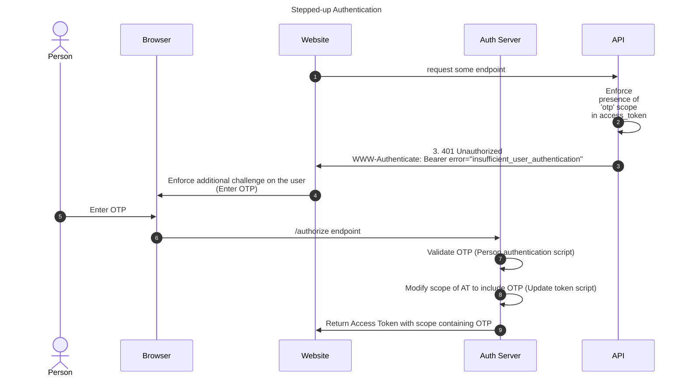
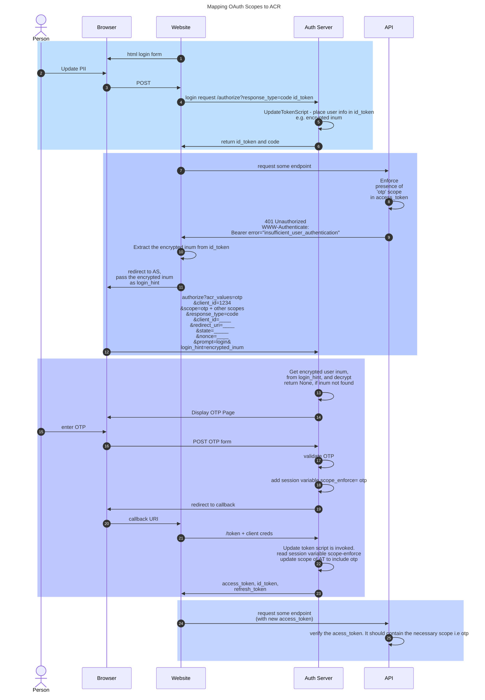

---
tags:
  - administration
  - recipes
  - stepped-up authentication
  - Update token
  - modify access token
  - scope
---
### Stepped up authentication use case
When a user is challenged to produce an additional authentication when a certain API is accessed by the client does not have the needed scope.



### Implementation details 


### Steps 1-6:

1. The client should be configured to return id_token (hybrid flow)
3. Update token script should be updated to return encrypted inum in id_token.
```

   def modifyIdToken(self, jsonWebResponse, context):
        print "Update token script. Modify idToken: %s" % jsonWebResponse
        sessionIdService = CdiUtil.bean(SessionIdService)
        session = sessionIdService.getSessionByDn(context.getGrant().getSessionDn()) # fetch from persistence
        userService = CdiUtil.bean(UserService)
        user_name = session.getSessionAttributes().get("auth_user")                
        foundUser = userService.getUserByAttribute("uid", user_name)        
        userInum = foundUser.getAttribute("inum") 
        print userInum
        encryptedInum = CdiUtil.bean(EncryptionService).encrypt(userInum)
        print encryptedInum 
        #custom claim in id_token
        jsonWebResponse.getClaims().setClaim("someFancyName", encryptedInum)
        #print "Update token script. After modify idToken: %s" % jsonWebResponse
        #jsonWebResponse.getClaims().setClaim("someFancyName", "madhu")
        return True
```

### Step 7-12:
1. call /authorize endpoint with login_hint=encrypted_inum
2. Instead of login_hint, the implementation can use `id_token_hint` in the request parameter or jwe `request` object in the request parameter containing all the parameters that will identify the user and his session. 

### Step 13-20:
1. Extract user info from `login_hint`, `id_token_hint` or `request`-jwe.
```
 def prepareForStep(self, configurationAttributes, requestParameters, step):
        print "OTP test. Prepare for steps %s" %step
        if (step ==1):
            try:
                userService = CdiUtil.bean(UserService)
                
                encryptedInum  = ServerUtil.getFirstValue(requestParameters, "login_hint")

                identity = CdiUtil.bean(Identity)
                print encryptedInum  
                
                inum = CdiUtil.bean(EncryptionService).decrypt(encryptedInum)
                foundUser = userService.getUserByInum(inum )
                print  foundUser
                username = foundUser.getUserId()
                print "username is %s " % username
                identity.setWorkingParameter("uusername", username )
                return True
            except:
                print "OTP. Exception: '%s'" % (sys.exc_info()[1])
                return False

        else:
            return False
```
2. Validate user otp
3. "enforce_scope=otp", add to session

```
def authenticate(self, configurationAttributes, requestParameters, step):
        print("OTP, authentication for step %s" %step)
        authenticationService = CdiUtil.bean(AuthenticationService)
        identity = CdiUtil.bean(Identity)
        userService = CdiUtil.bean(UserService)
        username =  identity.getWorkingParameter("username")
        print username 

        #Here we set hard coded otp
        otp = '12345'           
        inputOtp = ServerUtil.getFirstValue(requestParameters, "loginForm:otpCode")
        print("Client end otp %s " %inputOtp)
        print("Server end otp %s" %otp)
        if otp == inputOtp:            
            print "OTP Authenticated"
            print CdiUtil.bean(SessionIdService).getSessionId()
            authenticationService.authenticate('username')
            # adding to session
            identity.setWorkingParameter("enforce_scope","otp")
            return True
        else:
            print("Wrong otp")
            return errorMessage("Wrong otp entered")
            return False

```

### Step 22: 

```
    def modifyAccessToken(self, accessToken, context):

        #read from session
	sessionIdService = CdiUtil.bean(SessionIdService)
	sessionId = sessionIdService.getSessionByDn(context.getGrant().getSessionDn()) # fetch from persistence

        enforce_scope = sessionId.getSessionAttributes().get("enforce_scope ")
	if enforce_scope not None:
               context.overwriteAccessTokenScopes(accessToken, Sets.newHashSet("existingScope1", "existingScope2", "mynewscope"))
```


### Update token script
```
from io.jans.as.server.service import AuthenticationService
from io.jans.as.server.service import UserService
from io.jans.as.server.service import SessionIdService
from io.jans.as.server.util import ServerUtil
from io.jans.service.cdi.util import CdiUtil
from io.jans.as.service.common import EncryptionService
from io.jans.model.custom.script.type.token import UpdateTokenType

class UpdateToken(UpdateTokenType):
    def __init__(self, currentTimeMillis):
        self.currentTimeMillis = currentTimeMillis

    def init(self, customScript, configurationAttributes):
        print "Update token script. Initializing ..."
        print "Update token script. Initialized successfully"

        return True

    def destroy(self, configurationAttributes):
        print "Update token script. Destroying ..."
        print "Update token script. Destroyed successfully"
        return True

    def getApiVersion(self):
        return 11

    
    def modifyIdToken(self, jsonWebResponse, context):
        print "Update token script. Modify idToken: %s" % jsonWebResponse
        sessionIdService = CdiUtil.bean(SessionIdService)
        session = sessionIdService.getSessionByDn(context.getGrant().getSessionDn()) # fetch from persistence
        userService = CdiUtil.bean(UserService)
        user_name = session.getSessionAttributes().get("auth_user")                
        foundUser = userService.getUserByAttribute("uid", user_name)        
        userInum = foundUser.getAttribute("inum") 
        print userInum
        encryptedInum = CdiUtil.bean(EncryptionService).encrypt(userInum)
        print encryptedInum 
        #custom claim in id_token
        jsonWebResponse.getClaims().setClaim("someFancyName", encryptedInum)
        #print "Update token script. After modify idToken: %s" % jsonWebResponse
        #jsonWebResponse.getClaims().setClaim("someFancyName", "madhu")
        return True

    def modifyAccessToken(self, accessToken, context):

        #read from session
        sessionIdService = CdiUtil.bean(SessionIdService)
        sessionId = sessionIdService.getSessionByDn(context.getGrant().getSessionDn()) # fetch from persistence

        enforce_scope = sessionId.getSessionAttributes().get("enforce_scope")
        if enforce_scope is not  None:
            context.overwriteAccessTokenScopes(accessToken, Sets.newHashSet("openid", "profile", "otp"))
        
        return True
            
    def modifyRefreshToken(self, refreshToken, context):
        return True

    def getRefreshTokenLifetimeInSeconds(self, context):
        return 0

    def getIdTokenLifetimeInSeconds(self, context):
        return 0

    def getAccessTokenLifetimeInSeconds(self, context):
        return 0
```

### OTP script

```
from io.jans.as.server.util import ServerUtil
from io.jans.service.cdi.util import CdiUtil
from io.jans.as.server.security import Identity
from io.jans.model.custom.script.type.auth import PersonAuthenticationType
from io.jans.as.server.service import AuthenticationService
from io.jans.as.server.service import UserService
from io.jans.as.server.service import SessionIdService
from org.jans.as.server.service import CookieService
from javax.faces.application import FacesMessage
from org.gluu.jsf2.message import FacesMessages
from org.gluu.jsf2.service import FacesService
from io.jans.util import StringHelper
from java.util import Arrays

import java
import sys

def errorMessage(errorInfo):
    facesMessages = CdiUtil.bean(FacesMessages)

    facesMessages.setKeepMessages()
    facesMessages.clear()
    facesMessages.add(FacesMessage.SEVERITY_ERROR, errorInfo)
    return False

class PersonAuthentication(PersonAuthenticationType):
    def __init__(self, currentTimeMillis):
        self.currentTimeMillis = currentTimeMillis

    def init(self, customScript,  configurationAttributes):
        print "OTP test. Initialization"
        self.auth_user = None
        self.isUserAuthenticated = False
        self.isValidOtp = False
        print "OTP test. Initialized successfully"
        return True   

    def destroy(self, configurationAttributes):
        print "OTP test. Destroy"
        print "OTP test. Destroyed successfully"
        return True

    def getAuthenticationMethodClaims(self, requestParameters):
        return None

    def getApiVersion(self):
        return 11

    def isValidAuthenticationMethod(self, usageType, configurationAttributes):
        return True

    def getAlternativeAuthenticationMethod(self, usageType, configurationAttributes):
        return None

    def authenticate(self, configurationAttributes, requestParameters, step):
        print("OTP test, authentication for step %s" %step)
        authenticationService = CdiUtil.bean(AuthenticationService)
        identity = CdiUtil.bean(Identity)
        userService = CdiUtil.bean(UserService)
        username =  identity.getWorkingParameter("uusername")
        print "username is %s " , username 
        if(username  is not None):
            userAuthenticated = authenticationService.authenticate(username)
            print("User present in session")

            if(not userAuthenticated):
                print ("Not authenticated")
                return False        

        #Here we set hard coded otp
        otp = '12345'           
        inputOtp = ServerUtil.getFirstValue(requestParameters, "loginForm:otpCode")
        print("Client end otp %s " %inputOtp)
        print("Server end otp %s" %otp)
        if otp == inputOtp:            
            print "OTP Authenticated"
            print CdiUtil.bean(SessionIdService).getSessionId()
            authenticationService.authenticate('username')
            identity.setWorkingParameter("enforce_scope","otp")
            return True
        else:
            print("Wrong otp")
            return errorMessage("Wrong otp entered")
            return False


    def prepareForStep(self, configurationAttributes, requestParameters, step):
        print "OTP test. Prepare for steps %s" %step
        if (step ==1):
            try:
                userService = CdiUtil.bean(UserService)
                
                encryptedInum  = ServerUtil.getFirstValue(requestParameters, "login_hint")

                identity = CdiUtil.bean(Identity)
                print encryptedInum  
                
                inum = CdiUtil.bean(EncryptionService).decrypt(encryptedInum)
                foundUser = userService.getUserByInum(inum )
                print  foundUser
                username = foundUser.getUserId()
                print "username is %s " % username
                identity.setWorkingParameter("uusername", username )
                return True
            except:
                print "OTP. Exception: '%s'" % (sys.exc_info()[1])
                return False

        else:
            return False

    def getExtraParametersForStep(self, configurationAttributes, step):
        return Arrays.asList("username", "enforce_scope")
        
    def getCountAuthenticationSteps(self, configurationAttributes):
        return 1

    def getPageForStep(self, configurationAttributes, step):
        print("Get page for step %s" %step)
        if( step==1 ) :
                return "/auth/otp/otplogin.xhtml"
        else:
            return ""

    def getNextStep(self, configurationAttributes, requestParameters, step):
        return -1

    def getLogoutExternalUrl(self, configurationAttributes, requestParameters):
        print "Get external logout URL call"
        return None

    def logout(self, configurationAttributes, requestParameters):
        print"logout"
        return True

    
```
