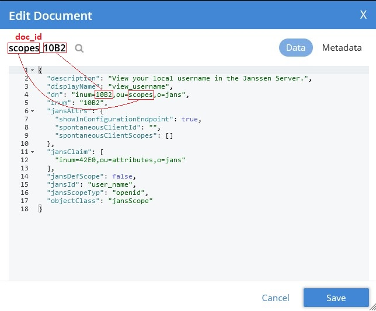
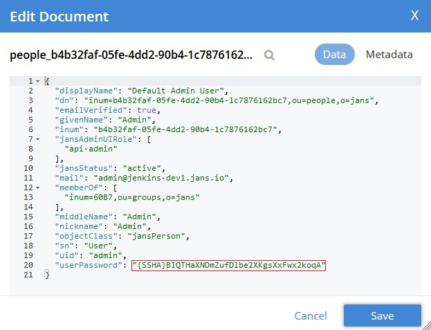
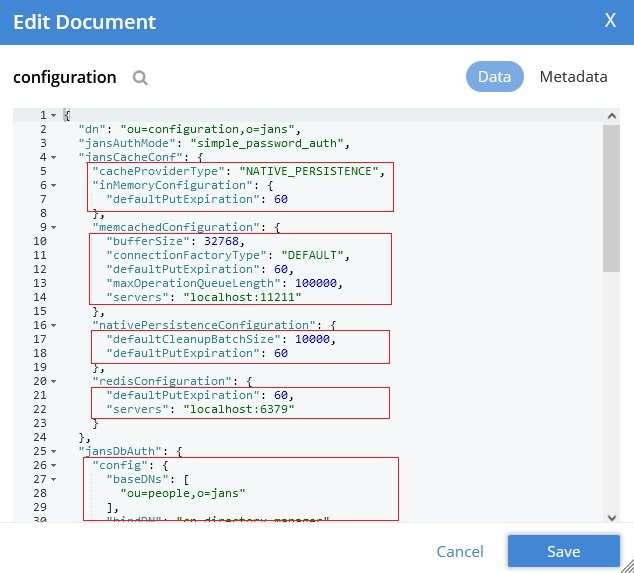

---
tags:
  - administration
  - reference
  - database
---

# Couchbase ORM persistence layer

The recommended Couchbase version is 7.x or newer. This DB should be installed before installing Jans.
After running Jans setup administrator should provide user/password with role which allow to create buckets and import initial data and configuration.

During installation setup generates default **/etc/jans/conf/jans-couchbase.properties** and creates required buckets in DB with initial data set.


## Configuration properties

List of specific for Couchbase default setting from `jans-couchbase.properties`:

```
servers: localhost

# The connect timeout is used when a Bucket is opened.
# If you feel the urge to change this value to something higher, there is a good chance that your network is not properly set up.
# Connecting to the server should in practice not take longer than a second on a reasonably fast network.
# Default SDK connectTimeout is 10s
connection.connect-timeout: 10000

# Enable/disable DNS SRV lookup for the bootstrap nodes
# Default dnsSrvEnabled is true
connection.dns.use-lookup: false

# Key/value timeout
# Default SDK kvTimeout is 2500ms
connection.kv-timeout: 5000

# Query timeout
# Default SDK queryTimeout is 75s
connection.query-timeout: 75000

# Configures whether mutation tokens will be returned from the server for all mutation operations
# Default mutationTokensEnabled is true
# connection.mutation-tokens-enabled: false

# At startup when connection error is occurred persistence layer can make another attempt to open buckets.
# Before make next try it pause process for 5 second. If after that total connection time is less than specified
# in property above new attempt will be executed
connection.connection-max-wait-time: 20000

# Default scan consistency. Possible values are: not_bounded, request_plus, statement_plus
connection.scan-consistency: not_bounded

# Disable scan consistency in queries. Default value: false
# connection.ignore-attribute-scan-consistency: true

# Try to execute query with scan consitency specified in connection.scan-consistency first.
# On failure execute query again with scan consistency specified in attributes defintions. Default value: true
# connection.attempt-without-attribute-scan-consistency: false

# Enable scopes support. Default value: false
# connection.enable-scope-support: true

# Disable mapping to short attribute names. Default value: false
# connection.disable-attribute-mapping: true

# Credentials for access Couchbase DB
auth.userName: admin
auth.userPassword: encrypted_password

# List of used buckets
buckets: jans, jans_user, jans_site, jans_cache, jans_token, jans_session

# Mapping entries to buckets
bucket.default: jans
bucket.jans_user.mapping: people, groups, authorizations
bucket.jans_site.mapping: cache-refresh
bucket.jans_cache.mapping: cache
bucket.jans_token.mapping: tokens
bucket.jans_session.mapping: sessions

# User password hashing method
password.encryption.method: SSHA-256

# SSL connection trust store
ssl.trustStore.enable: true
ssl.trustStore.file: /etc/certs/couchbase.pkcs12
ssl.trustStore.pin: encrypted_password
ssl.trustStore.type: pkcs12

tls.enable: false

```

The rest of properties are static for all other supported DB:

```
binaryAttributes=objectGUID
certificateAttributes=userCertificate
```

## `doc_id` building rules

In order to support transparency for end applications and allow data migration from one DB to another ORM requires `DN` attribute in each entry. This attribute it also uses to build `doc_id`. Here is example of this `DN` -> `doc_id` conversion:



In order to build unique document identifier ORM uses another unique attribute `DN`. `doc_id` is concatenated RDN list in reversed order. To join them ORM uses `_` character. The root RDN is excluded.
if entry has `DN` with only root RDN for it `doc_id` is `_`.

# Buckets mapping

Couchbase supports few buckets types. Also each bucket can be tuned for specific task. For example for token operations application need fast access to such entries.


ORM allows to split data by bucket with mapping specified in `bucket.<bucket_name>` properties. The list of allowed buckets which ORM can use should be specified in `buckets` property. Property `bucket.default` is mandatory because it's specify bucket which ORM should use if not mapping specified for entry.

ORM uses next rule to determine in which bucket it should store entry:

1. Get list of RDN from entry `DN`.
2. Use second RDN from list in mapping rule.
3. Iterate trough `bucket.<bucket_name>` property value and check if it in list
4. If ORM not find `bucket_name` in previous step it uses bucket specified in `bucket.default` property value.

## Data mapping rules

ORM uses JSON types to store data in entries. Since there is no date time support in JSON it uses Couchbase compatible format ISO-8601. Example:


For user password field ORM on persist/update operations automatically create hash. On authentication ORM compares hashes.



ORM also uses Couchbase sub-document API to store attributes defined in java beans with `@JsonObject` annotation.



# Java examples

This example shows how to use ORM. It opens connection to Couchbase DB and add user entry to it:

```
    public static void main(String[] args) {
        // Create Couchbase entry manager
        CouchbaseEntryManager couchbaseEntryManager = createCouchbaseEntryManager();

        // Create and fill user bean
        SimpleUser newUser = new SimpleUser();
        newUser.setDn(String.format("inum=%s,ou=people,o=jans", System.currentTimeMillis()));
        newUser.setUserId("sample_user_" + System.currentTimeMillis());
        newUser.setUserPassword("test");
        newUser.getCustomAttributes().add(new CustomObjectAttribute("jansAddres", Arrays.asList("London", "Texas", "New York")));
        newUser.getCustomAttributes().add(new CustomObjectAttribute("jansGuid", "test_value"));
        
        // Call ORM API to store entry
        couchbaseEntryManager.persist(newUser);
        
        couchbaseEntryManager.destroy();
    }

    public static CouchbaseEntryManager createCouchbaseEntryManager() {
        CouchbaseEntryManagerFactory couchbaseEntryManagerFactory = new CouchbaseEntryManagerFactory();
        couchbaseEntryManagerFactory.create();
        Properties connectionProperties = getSampleConnectionProperties();

        CouchbaseEntryManager couchbaseEntryManager = couchbaseEntryManagerFactory.createEntryManager(connectionProperties);

        return couchbaseEntryManager;
    }

    private static Properties getSampleConnectionProperties() {
        Properties connectionProperties = new Properties();

        connectionProperties.put("couchbase#servers", "localhost");
        connectionProperties.put("couchbase#auth.userName", "admin");
        connectionProperties.put("couchbase#auth.userPassword", "secret");

        connectionProperties.put("couchbase#connection.dns.use-lookup", "false");
        
        connectionProperties.put("couchbase#buckets", "jans, jans_user, jans_site, jans_cache, jans_token, jans_session");

        connectionProperties.put("couchbase#bucket.default", "jans");
        connectionProperties.put("couchbase#bucket.jans_user.mapping", "people, groups, authorizations");
        connectionProperties.put("couchbase#bucket.jans_site.mapping", "cache-refresh");
        connectionProperties.put("couchbase#bucket.jans_cache.mapping", "cache");
        connectionProperties.put("couchbase#bucket.jans_token.mapping", "tokens");
        connectionProperties.put("couchbase#bucket.jans_session.mapping", "sessions");

        connectionProperties.put("couchbase#password.encryption.method", "SSHA-256");

        connectionProperties.put("couchbase#binaryAttributes", "objectGUID");
        connectionProperties.put("couchbase#certificateAttributes", "userCertificate");

        return connectionProperties;
    }
```

More Couchbase ORM examples is in [this](https://github.com/JanssenProject/jans/tree/main/jans-orm/couchbase-sample/src/main/java/io/jans/orm/couchbase) sample module.
