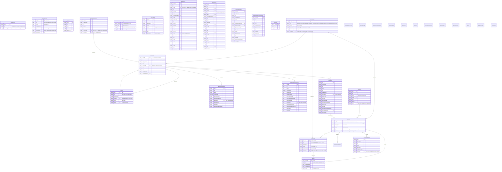

---
tags:
  - administration
  - reference
  - database
---

```mermaid
erDiagram
    jansAppConf {
        string doc_id PK ""
        string ou  "casa,jans-conf-api,jans-scim, jans-fido2"
        string jansConfDyn "json configuration for the app"
    }

    jansPerson {
        string doc_id PK "eg - username1 username2"
        string dn "eg: inum=username1,ou=person,o=jans"
        string displayName
        string inum
        string memberOf FK "JSON array of dn from jansGrp"
        string mail
        string uid
        string userPassword
        string jansAdminUIRole FK "...."
    }
jansPerson ||--o{ jansGrp: belongs-to
jansGrp ||--o{ jansPerson : contains

jansGrp {
    string doc_id PK "60B7"
    string dn "inum=60B7,ou=groups,o=jans"
    string displayName
    string member FK "json array of dn from jansPerson"
    string inum "inum=60B7"
    string owner FK "dn from jansPerson"

}

jansCustomScr {
    string doc_id PK "eg : 031C-4A65"
    string dn "inum=031C-4A65, ou=script,o=jans"
    string inum "same as doc_id"
    string displayName
    string jansScr "the entire script content"
    string jansScrType "person_authentication,update_token"
    boolean jansEnabled "0/1"
}

jansScr {
    string doc_id PK
    string dn
    string inum
    string jansScr
    string jansScrTyp
}
jansFido2AuthnEntry {
    string doc_id	PK 	
    string dn
    string jansId
    datetime creationDate
    string jansSessStateId
    string jansCodeChallenge
    string personInum FK "inum from jansPerson"
    string jansAuthData
    string jansStatus
    string jansCodeChallengeHash
}
jansPerson ||--o{ jansFido2AuthnEntry : contains
jansFido2RegistrationEntry {
    string doc_id	PK
    string dn
    string jansId
    datetime creationDate
    string displayName
    string jansSessStateId
    string jansCodeChallenge
    string jansCodeChallengeHash
    string jansPublicKeyId
    string personInum	FK "inum from jansPerson"
    string jansRegistrationData
    string jansDeviceNotificationConf
    string jansCounter
    string jansStatus

}
jansPerson ||--o{ jansFido2RegistrationEntry : contains

jansClnt {
    string doc_id PK "fd46d193-bca6-4343-b49f-6e0b020197c3"
    string dn "inum=fd46d193-bca6-4343-b49f-6e0b020197c3,ou=clients,o=jans"
    string displayName "some name"
    string inum "same as doc_id"
    string jansScope FK "json array containing inum values from jansScope"
    string jansClaim FK "json array containing inum from jansAttr"
}
jansClnt ||--o{ jansScope : contains
jansClnt ||--o{ jansSectorIdentifier : contains

jansClnt ||--o{ jansAttr : contains

jansClntAuthz ||--|{ jansClnt : linked-with
jansClntAuthz ||--|{ jansPerson : linked-with
jansClntAuthz ||--|{ jansScope : linked-with


jansClntAuthz{
    string doc_id PK "86ff3d19-4885-4f36-b536-17efcc802a27_2000.efad6d0e-c17b-4694-aedf-b322d10476ce"
    string dn "jansId=86ff3d19-4885-4f36-b536-17efcc802a27_2000.efad6d0e-c17b-4694-aedf-b322d10476ce,ou=authorizations,o=jans"
    string jansId "same as docId"
    string jansClntId FK "JSON array of 1 or more client-s doc_id"
    string jansUserId FK "doc_id from jansPerson"
    string jansScope FK "JSON array of 1 or more scopes from jansScope"
}
jansScope{
    string doc_id PK "1200.ABCB46"
    string dn "inum=1200.ABCB46,ou=scope,o=jans"
    string displayName
    string inum "same as doc_id"
    string jansScopeTyp "openid, oauth"
    string jansClaim FK "JSON array of 0 or more inums from jansAttr"
}
jansScope ||--o{ jansAttr : mapped-to

jansAttr{
    string doc_id PK "11AA"
    string dn "inum=11AA,ou=attributes,o=jans"
    string displayName
    string jansAttrName
    string inum "same as doc_id"

}
jansCache {
    string doc_id PK "7934d59de2bd01746b7"
    string uuid "same as doc_id"
    string dn "uuid=7934d59de...,ou=cache,o=jans"
    string dat "rO0ABXNyAB......."
}
jansSectorIdentifier{

}
jansCibaReq{
    string doc_id	PK
    string dn
    string authReqId	FK ""
    string clnId	FK ""

    string usrId FK "doc_id from jansPerson"
    datetime creationDate
    datetime exp
    string jansStatus	"active or inactive"

}

jansToken ||--o{ jansClnt : mapped-to

jansToken{
    string doc_id PK
    string dn
    string usrId FK "doc_id from jansPerson"
    string ssnId FK ""
    string uuid
    string tknCde
    string clnId FK "JSOn array containing dn of jansClnt"
    }

jansUmaPCT {
   string doc_id	PK

   string dn
   string clnId	FK "json array of multiple inums from jansClnt"
   string iat
   string tknCde FK ""
   string ssnId	FK
   string jansClaimValues	FK ""
   string dpop
   string authzCode
   string grtId	FK "... from jansGrant"
   string grtTyp
   string jwtReq
   string nnc
   string scp	FK ""
   string tknTyp
   string usrId	FK "doc_id from jansPerson"
   string jansUsrDN	FK "dn from jansPerson"
   strin acr
   string uuid
   string chlng
   string chlngMth
   string clms
   string attr	FK ""
   string tknBndCnf


}
jansUmaRPT {
string doc_id	PK
    string dn
    string clnId	FK ""
    string tknCde	FK ""
    string usrId	FK "doc_id from jansPerson"
    string ssnId	FK ""
    string jansUmaPermission	FK ""
    string uuid
    string dpop
    string authzCode
    string grtId	FK ""
    string grtTyp	FK ""
    string jwtReq
    string nnc
    string scp	FK ""
    string tknTyp
    string jansUsrDN	FK "doc_id from jansPerson"
    string acr
    string chlng
    string chlngMth
    string clms FK ""
    string attr	FK ""
    string tknBndCnf
}
jansUmaResource {
    string doc_id	PK
    string objectClass
    string dn
    string displayName
    string inum
    string owner	FK ""
    string jansAssociatedClnt	FK ""
    string jansUmaScope	FK ""
    string jansFaviconImage
    string jansGrp	FK ""
    string jansId
    string jansResource
    string jansRevision
    string jansTyp
    string jansScopeExpression
    string description

}
jansUmaResourcePermission {
    string doc_id	PK
    string dn
    string exp
    string del
    string jansUmaScope
    string jansConfCode
    string jansResourceSetId
    string jansAttrs
    string jansTicket
    string jansStatus

}

jansGrant {
    string doc_id PK
    string dn
    string grtId
}
jansPerson ||--o{ jansSessId : has
jansSessId ||--|{ jansClnt : associated-with
jansSessId {
    string doc_id	PK
    string objectClass
    string dn
    string jansId
    string sid
    string creationDate
    string jansUsrDN FK "dn from jansPerson"
    string authnTime
    string jansState
    string jansSessState
    string jansPermissionGranted
    string jansAsJwt
    string jansJwt
    string jansPermissionGrantedMap
    string jansInvolvedClnts	FK ""
    string jansSessAttr

}
jansClnt ||--o{ jansSectorIdentifer : contains
jansPairwiseIdentifier }o--|| jansPerson : linked-with

jansSectorIdentifer {
    string doc_id	PK
    string objectClass
    string dn
    string jansId
    string description
    string jansRedirectURI
    string jansClntId	FK "json array of multiple inums from jansClnt"

}

jansPairwiseIdentifier{
    string doc_id	PK
    string objectClass
    string dn
    string jansId
    string jansSectorIdentifier	FK ""
    string jansClntId FK "json array of multiple inums from jansClnt"
    string jansUsrId FK "doc_id from jansPerson"
}


jansAdminConfDyn {

}
jansStatEntry{

}
jansDeviceRegistration{}
jansInumMap{}
jansMetric{}
jansPar{}
jansPassResetReq{}
jansPushApp{}
jansPushDevice{}
jansRp{}
rpExpiredObject{}
jansAgama{}


```
