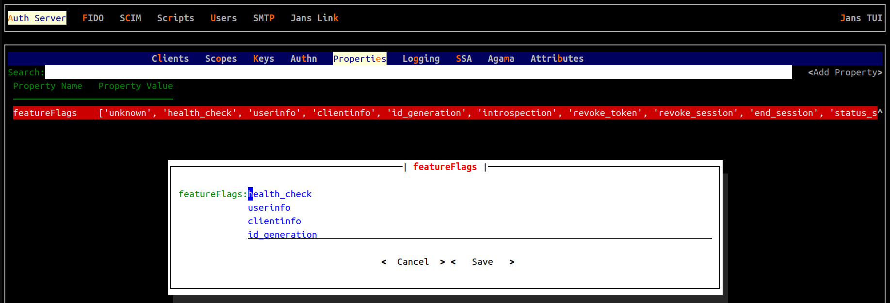

---
tags:
  - administration
  - auth-server
  - reference
  - feature-flags
---

# Feature Flags

Janssen Server provides feature flags that the administrator can use to enable or disable the entire feature. For
example, many endpoints exposed by Janssen Server can be disabled by the administrator using feature flags.

Navigate through the left navigation panel to see the complete list of feature flags available in Janssen Server.

## Using Feature Flags

An administrator can enable or disable feature flags using [TUI](../../../config-guide/config-tools/jans-tui/README.md). New value
of the feature flag will be dynamically loaded at an interval of 30 seconds.

### Updating Feature Flags Using TUI

1. Open TUI as instructed [here](../../../config-guide/config-tools/jans-tui/README.md)
2. Navigate to `Auth Server`->`Properties`
3. In the `Search` box, type `featureflags` and hit enter. Result should show 
   `featureFlag` property. Hitting enter will open a dialogue box where it is
   possible to edit feature flags list
4. Add or Remove the feature flags as needed
5. Select `Save`
6. Wait for 30 seconds and changes should be effective

### Updating Feature Flags Using CLI

!!! Contribute
If you’d like to contribute to this document, get started with the [Contribution Guide](https://docs.jans.io/head/CONTRIBUTING/#contributing-to-the-documentation)
