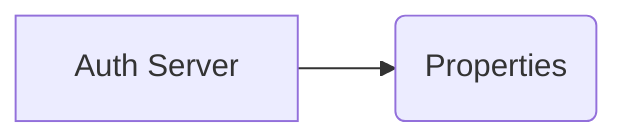
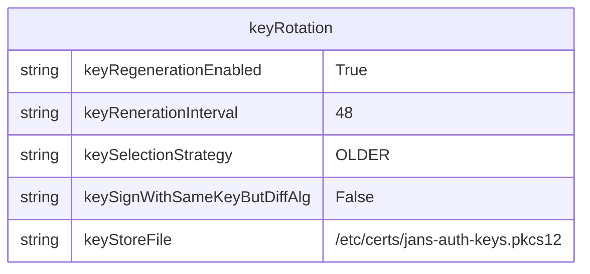

---
tags:
  - administration
  - vm
  - operations
---

# Managing Key Rotation


"Key-rotation" is a standard procedure for all OpenID Connect deployment. "Key-rotation" means replacing existing signing key with newer cryptographic key. For Janssen server, that specific cryptographic key is `jans-auth-keys.pkcs12`. 

There are two possible ways to manage key rotation:
- built-in key rotation
- external key rotation

For VM by default built-in key rotation is on.

Key alias or `kid` has following format (example `connect_76297462-a3f8-498e-afc2-670285292553_sig_rs256`):

```
<operation_type>_<guid>_<use>_<algorithm>
```

- operation_type - specifies operation type of the key, possible values:
  - connect - used for OpenID Connect - usually expirable key
  - ssa - used for SSA - usually with very big expiration date (almost non-expirable)
  - all - key can be use for both `connect` and `ssa` 
- guid - unique identifier
- use - use purpose, possible values are `sig` for signature and `enc` for encryption  
- algorithm - algorithm use with given key
  - in signature case it can be `RS256`, `RS384`, `RS512`, `ES256`, `ES384`, `ES512`, `PS256`, `PS384`, `PS512`
  - in encryption case case it can be `RSA1_5`, `RSA-OAEP`

Key rotation means that new keys are generated and old one are removed for given algorithm (full replacement).  

Keys are stored in:  
- key store file (specified by `keyStoreFile`)
- on persistence level jwks representation of the key are stored in `jansConfWebKeys` attribute of `jansAppConf` entity

It's important to note that key inside key store file must have representation in jwks and vice versa. It must be always in sync otherwise AS will throw error.

Configuration properties related to key store file:
- `keyStoreFile` - The Key Store File (JKS or PKCS12)
- `keyStoreSecret` - The Key Store password


## Built-in key rotation

`jans-auth-server` has [KeyGeneratorTimer](https://github.com/JanssenProject/jans/blob/70a566b67f660750bf742f19ee127f79b2db8930/jans-auth-server/client/src/main/java/io/jans/as/client/util/KeyGenerator.java) 
which is responsible for key rotation. Built-in rotation can be switch on/off via `keyRegenerationEnabled` AS configuration property (by setting `true` or `false` value).






Configuration properties relation to built-in rotation:
- `keyRegenerationEnabled` - boolean value specifying whether to turn on (`true` value) or off (`false` value) built-in key rotation
- `keyRegenerationInterval` - the interval for key regeneration in hours
- `keyAlgsAllowedForGeneration` - List of algorithm allowed to be used for key generation

Expiration date during built-in rotation is set as `now` + `keyRegenerationInterval`.

## External key rotation

External rotation means that keys are rotated by script. In this case `keyRegenerationEnabled` must be set to `false` value.
Script can be scheduled to run periodically. Such script must invoke `KeyGenerator` class from `jans-auth-client-jar-with-dependencies.jar` which will keep keys in key store and in AS persistence consistent. 
See [Key Generation](../auth-server/crypto/key-generation.md) page for more details how to generate keys externally.

```commandLine
/opt/jre/bin/java -Dlog4j.defaultInitOverride=true -cp /opt/dist/jans/jans-auth-client-jar-with-dependencies.jar io.jans.as.client.util.KeyGenerator -keystore /etc/certs/jans-auth-keys.p12 -keypasswd <Password> -sig_keys RS256 RS384 -enc_keys RSA1_5 RSA-OAEP -key_ops_type ALL -dnname "CN=jansAuth CA Certificates" -expiration 2 > /etc/certs/jans-auth-keys.json
```

## Useful references

- [Key Generation](../auth-server/crypto/key-generation.md)


