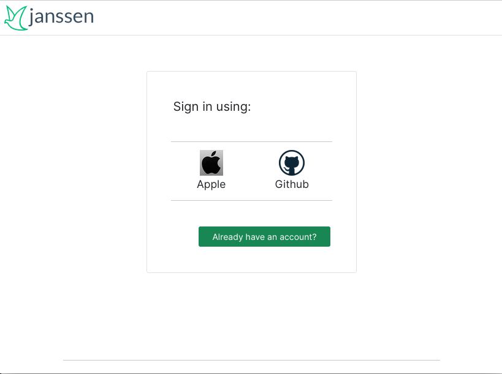
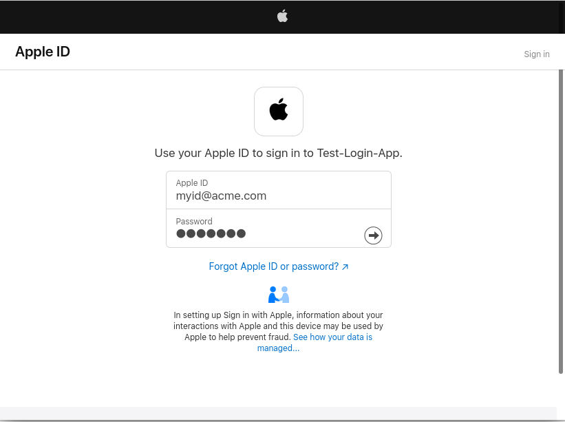

# Inbound identity with Agama

Using Agama administrators can delegate authorization to external services like social sites and enterprise access management solutions, e.g. Microsoft Entra ID, Oracle Access Management, etc. In a typical setting users are presented a login form with a "Sign in with..." button for authentication to take place at a given 3rd party in order to get access to a target application.

This process is usually referred to as "inbound identity". In this document the steps required to setup inbound identity in your Janssen server are presented.

## Requisites

- A Janssen server with config-api installed
- Starter knowledge of [OAuth2](https://www.ietf.org/rfc/rfc6749)/[OpenId Connect](https://openid.net/developers/how-connect-works/) and the Java programming language

## Terminology

- Provider: An external identity provider, often a social site. Every provider is associated with a unique identifier

- Provider preselection: A process that designates the provider to employ for authentication without the end-user  making a explicit decision, i.e. without a "Sign in with" button. Here the provider may be inferred from contextual data elicited at earlier stages, for instance.

## Scope

There is a great amount of different mechanisms providers may employ to materialize the authentication process. The current offering in Agama is focused on OAuth2-compliant providers (includes OpendId Connect), more specifically those supporting the `code` authorization grant. This does not mean other grants or even different protocols such as SAML cannot be supported, however organizations would have to engage in extra development efforts in this case.

If the providers of interest already support the `code` authorization grant, the amount of work is significantly reduced.

## Flows involved

### Provider

For every provider to support there has to be an Agama flow that must:

- Redirect the browser to the provider's site for the user to enter his login credentials
- Return profile data of the given user

To facilitate administrators' work, the following providers are already implemented:

- Apple
- Facebook, Github, Google (through the "Generic provider" flow)

### Main flow

The actual process of inbound identity occurs here. This flow is already [implemented](https://github.com/JanssenProject/jans/raw/main/docs/agama-catalog/jans/inboundID/project/code/io.jans.inbound.ExternalSiteLogin.flow) and ready to use. The following is a summary of the steps involved:

1. A provider selection page is displayed. The list includes all (*enabled*) providers defined in the configuration of this flow. Additionally an option to use an existing local account is displayed (i.e. no inbound identity)

1. The flow associated to the selected provider is launched. Actually, if the main flow was passed a provider identifier as parameter, step 1 is skipped and the given flow is launched directly  

1. If the flow triggered at step 2 did not finish successfully, the main flow finishes likewise. Else, the profile data returned is transformed using the applicable attribute mapping for the provider. More on attribute mappings [here](#attribute-mappings)

1. If the resulting profile data lacks a value for e-mail, and the provider was configured to require it, a form is displayed where the user can enter his e-mail address

1. User provisioning takes place, in other words, a local user entry is created in the Janssen server database. If an entry already exists, it is updated as long as the provider is configured to allow so

1. The flow finishes successfully and the user gets access to the target application

Note the above design does not involve communication protocols. It is responsability of the concrete provider flow how to implement this aspect. The main flow can remain unmodified regardless of any change in existing flows or when new ones are added. 

Feel free to modify this flow or create one based on it if customizations are required.

## Deployment

To start, ensure the Agama engine and bridge are enabled. More info [here](https://docs.jans.io/head/admin/developer/agama/engine-bridge-config/#availability).

### Add agama-inbound jar

Let's add the required libraries to the authentication server:

- Visit [this](https://maven.jans.io/maven/io/jans/agama-inbound/) page, navigate to the folder matching your Janssen server version, and download the jar file
- SSH to the server. Transfer the file to directory `/opt/jans/jetty/jans-auth/custom/libs`
- Restart the server, e.g. `systemctl restart jans-auth`

### Make a `gama` archive

[gama files](https://docs.jans.io/head/agama/gama-format/) are deployable units in the Agama engine. To create one, simply zip the contents of [project](./project) subdirectory. The resulting archive must have three folders at top-level: `web`, `lib`, and `code`. The file extension does not matter in the end.

To quickly collect the contents of `project`, you can do the following:

```
git clone --depth 1 https://github.com/JanssenProject/jans.git
cd jans/docs/agama-catalog/jans/inboundID/project
```

### Deploy the archive

Transfer the archive to your server, and then run `/opt/jans/jans-cli/jans_cli_tui.py`. Follow the prompts and then enter the Agama menu (`Alt + m`). Using you keyboard TAB key, highlight the button "Upload", and press ENTER. Browse and select the file. 

Wait 30 seconds and press the `d` key. This will show the result of the deployment. Ensure no errors are reported.

## Configuration handling

### Collect providers configurations

For every provider collect OAuth 2.0 configurations - or OpenId Connect if supported. Instructions to do this vary across different social sites. For the case of Facebook, for instance, this is approximately what needs to be done:

- Login to Facebook and [register](https://developers.facebook.com/docs/development/register) as developer
- Create an application with Facebook login capabilities
- In the Facebook login settings add `https://<your-host>/jans-auth/fl/callback` as a valid OAuth redirect URI
- Finally grab the app Id and secret from the app settings page

For Apple, some guidelines are included at the end of this document.

### Supply configurations

Still in TUI, press the `c` key and then choose to export the sample configurations locally. Inspect the generated file. It provides "dummy" placeholders to supply the actual configurations.

The configuration is held in a JSON object whose keys are identifiers of identity providers. The associated value for a key is a JSON object itself and follows the structure represented by [this](https://github.com/JanssenProject/jans/blob/main/jans-auth-server/agama/inboundID/src/main/java/io/jans/inbound/Provider.java) Java class.

This is an example of a configuration for a couple of identity providers:

```
{

"github": {
  "flowQname": "io.jans.inbound.GenericProvider",
  "displayName": "Github",
  "mappingClassField": "io.jans.inbound.Mappings.GITHUB",
  "oauthParams": { ... }
},

"google": {
  "flowQname": "io.jans.inbound.GenericProvider",
  "displayName": "Google",
  "mappingClassField": "io.jans.inbound.Mappings.GOOGLE"
  "enabled": false,
  "skipProfileUpdate": true,
  "oauthParams": { ... }
}

}
```

The table below explains the meaning of properties:

|Name|Description|Mandatory|
|-|-|-|
|`flowQname`|The qualified name of the Agama flow associated to this provider (must exist in `code` directory)|Yes|
|`displayName`|Short name of the provider (will be shown in the selector page)|Yes|
|`oauthParams`|The actual OAuth configuration for the given provider. See below|Yes|
|`openIdParams`|OpenId connect configuration. See notes below|No|
|`mappingClassField`|The qualified name of the [attribute mapping](#attribute-mappings) for this provider|Yes|
|`logoImg`|Relative path to the logo image (will be shown in the selector page)|No|
|`enabled`|A boolean value indicating whether this provider can be shown (and triggered) from the main flow or not. Default value is `true`|No|
|`skipProfileUpdate`|Determines if profile data should not be updated for a user if an entry already exists locally for him. Default value is `false`|No|
|`cumulativeUpdate`|When `true`, existing value(s) of an attribute are preserved when the incoming profile data already contains value(s) for such attribute, otherwise its values are replaced by the incoming ones entirely. Default value is `false`|No|
|`requestForEmail`|Whether to prompt the user to enter his e-mail if the data supplied by the identity provider does not contain one. Default value is `false`|No|
|`emailLinkingSafe`|Determines if an existing account with the same e-mail of the user about to be provisioned can be treated as the same person|No|

**Notes:**

- `logoImg` path is relative to the base path of the main flow, i.e. `inboundID`
- Set `emailLinkingSafe` to true only if you trust the provider, i.e. the incoming e-mail data is securely verified. For security, never set it to `true` when `requestForEmail` is also `true`

Property `oauthParams` adheres to the following structure:

|Name|Description|
|-|-|
|`authzEndpoint`|The authorization endpoint as in section 3.1 of [RFC 7649](https://www.ietf.org/rfc/rfc6749)| 
|`tokenEndpoint`|The token endpoint as in section 3.2 of [RFC 7649](https://www.ietf.org/rfc/rfc6749)|
|`userInfoEndpoint`|The endpoint where profile data can be retrieved. This is not part of the OAuth2 specification|
|`clientId`|The identifier of the client to use, see section 1.1 and 2.2 of [RFC 7649](https://www.ietf.org/rfc/rfc6749). This client is assumed to be *confidential* as in section 2.1|
|`clientSecret`|Secret associated to the client|
|`scopes`|A JSON array of strings that represent the scopes of the access tokens to retrieve|
|`redirectUri`|Redirect URI as in section 3.1.2 of [RFC 7649](https://www.ietf.org/rfc/rfc6749)|
|`clientCredsInRequestBody`|`true` indicates the client authenticates at the token endpoint by including the credentials in the body of the request, otherwise, HTTP Basic authentication is assumed. See section 2.3.1 of [RFC 7649](https://www.ietf.org/rfc/rfc6749)|
|`custParamsAuthReq`|A JSON object (keys and values expected to be strings) with extra parameters to pass to the authorization endpoint if desired|
|`custParamsTokenReq`|A JSON object (keys and values expected to be strings) with extra parameters to pass to the token endpoint if desired|

Edit the properties you consider relevant for every provider. Generally, from the above table, the first six are the only needed.

Section `openIdParams` can be used when the provider supports OpenId Connect too. This will reduce considerably the amount of properties you will need to supply in section  `oauthParams`. Here's the structure:

|Name|Description|
|-|-|
|`host`|The URL of the provider, e.g. `https://may.hem`|
|`useDCR`|If the provider supports _dynamic client registration_ set this to `true`. It will be a time saver|
|`useCachedClient`|Once client registration occurs for the first time, no more registration attempts will be made until the client is about to expire. Set this to `false` to force registration every time authentication is about to take place|

When providing `openIdParams`, the `host` will be used to grab the endpoints mentioned in the `oauthParams` section automatically, namely, authorization, token, and userInfo endpoints.  When `useDCR` is set to `true`, a client will be registered so there is no need to supply `clientId` and `clientSecret`. Under these circumstances, most of times only `scopes` will be needed under the `oauthParams` section.

#### Attribute mappings

This is the process through which the raw user profile data received by an identity provider is transformed into an object suitable for being stored in the Janssen's user database. Here, developers have the opportunity to "map" or "transform" the incoming data to one compatible with the data types, formats, and names required by the database.

As an example suppose a provider returned the following:

```
{
  "id": dfsg2-3bui2.2.5+ld1,
  "email": "moe@doedoe.co",
  "last_name": "Doe",
  "first_name": "Moe"
}
```

None of this attributes exist in Janssen; database adheres to LDAP naming. Conformant names would be `uid`, `mail`, `sn`, and `givenName`. Also, let's assume you want to set `displayName` to a string composed by the first and last names separated by a white space. Writing a mapping is required.

A mapping is implemented in Java in the form of a `java.util.function.UnaryOperator<Map<String, Object>>`, that is, a function that takes a `Map<String, Object>` as input and returns a `Map<String, Object>` as result. Several examples are provided [here](https://github.com/JanssenProject/jans/blob/main/jans-auth-server/agama/inboundID/src/main/java/io/jans/inbound/Mappings.java). 

Note property `mappingClassField` of every provider defined in the main flow points to the fully qualified name of a mapping. Not all mappings have to belong to the same class.

### Import configurations

Once the JSON file you have been editing is ready, hit `c` key again in TUI. This time choose to import the configuration and select the file.

## Test

Launch the main flow (learn about this topic [here](https://docs.jans.io/head/admin/developer/agama/jans-agama-engine/#launching-flows)). If everything was setup correctly, a screen with a "Sign in using" heading will be shown and next to it links to the providers sites. When clicking on a link, the browser will be taken to the given website for authentication. A prompt for consent of release of personal information may appear as well. Finally, the browser is returned back to your server and then to the target application as described [earlier](#main-flow). 

## How to add another provider?

**Note**: If you want to integrate Apple Sign In, skip this section: guidelines are included at the end of this document.

In practice most identity providers adhere to the OAuth2 `code` grant and require configurations similar to the sample provided. Follow these steps: 

1. In your local machine, create a new project with the required layout: directories `web`, `code` and `lib`
1. Place the logo inside `web`
1. If an [existing](https://github.com/JanssenProject/jans/blob/main/jans-auth-server/agama/inboundID/src/main/java/io/jans/inbound/Mappings.java) attribute mapping cannot be reused, [implement](#writing-your-own-mapping) one for this provider and put the source (Java/Groovy) in `lib` directory 
1. Create the archive and deploy it in the server using TUI
1. Include the configuration for the new provider in the main's flow (`io.jans.inbound.ExternalSiteLogin`) config, for instance:

```
"new-provider-ID": {
  "flowQname": "io.jans.inbound.GenericProvider",
  "displayName": "...",
  "mappingClassField": "Qualified name of the attribute mapping",
  "logoImg": "path to the logo image relative to the base path of the main flow (you can use things like ../)"
  "oauthParams": { ... }
}
```

Do your tests. If you consider the "generic" provider flow does not cope, add a new flow to the recently created project (in folder `code`) to better suit the provider requirements. Redeploy and test again.

## Writing your own mapping

Ensure you went through [this](#attribute-mappings) already. Some important considerations:

- A mapping has to be declared as a public field in a public class
- Several providers can use the same mapping

While working on a mapping, having to pack the class in a jar file, uploading it to the server, and then restarting  every time a modification is made can be a big burden. To avoid this you can place the source (java) file in the `lib` directory of your project and leverage hot reloading. Ensure to create the usual directory hierarchy in `lib` corresponding to your class package. 

A "template" for quickly start writing a mapping is already [available](https://github.com/JanssenProject/jans/blob/main/jans-auth-server/agama/inboundID/CustomMappings.java.txt). Save with `.java` extension and edit the body of the lambda expression. 

<!--
Also you have to update the main flow as follows:

- Add an instruction like `Call io.jans.inbound.CustomMappings#class` at the beginning of the provider flow body (`.flow` file) for the class to be effectively reloaded when the file is modified
- Set `mappingClassField` to `io.jans.inbound.CustomMappings.SAMPLE_MAPPING` for the provider of interest. You may like the idea of using a different name for the field - update the java file accordingly

From there onwards, you only need to re-upload the file as many times as needed.
-->

If you use `DEBUG` level in your server, you will see in the log the result of the mapping every time it is applied. Check for a message like "Mapped profile is".

## Appendix: integrating "Sign In With Apple"

Integrating this provider requires a good amount of work. In the following we provide a summary.

Ensure you have an Apple developer account to start. [This tutorial](https://github.com/ananay/apple-auth/blob/master/SETUP.md) does a great job at explaining the necessary steps. As you go with it, please collect the following elements:

- A service ID
- A team ID
- A key ID and a key file 

You will be prompted to provide a domain name and a return URL. Provide `<your-jans-host>` and `https://<your-jans-host>/jans-auth/fl/callback` respectively, ensuring the changes are effectively saved in the developer's portal.

The configuration for this provider would look like: 

```
"apple": {
  "flowQname": "io.jans.inbound.Apple",
  "displayName": "Apple",
  "mappingClassField": "io.jans.inbound.Mappings.APPLE",
  "logoImg": "apple.png",
  "oauthParams": {
      "authzEndpoint": "https://appleid.apple.com/auth/authorize",
      "tokenEndpoint": "https://appleid.apple.com/auth/token",
      "clientId": "<SERVICE ID>",
      "key": "<ONE-LINER CONTENTS OF KEY FILE>",
      "keyId": "<KEY ID>",
      "teamId": "<TEAM ID>",
      "scopes": ["email", "name"],
      "custParamsAuthReq": { "response_mode": "form_post" },
      "clientCredsInRequestBody": true
  }
}
```

For `key`, remove the lines regarding begin/end of the private key entirely. Also remove any line breaks: a one-liner is required.

### Expected journey

The accompanying images illustrate the steps end-users will go through when using the inbound identity flow taking the Apple route:

1. Initial provider selector page

    

1. Prompt for credentials at Apple website

    

1. Prompt for a second factor, e.g. SMS (optional)

    

1. Prompt for browser trust

    

1. Prompt before returning to original site

    

Finally, the user should land at the target application.
