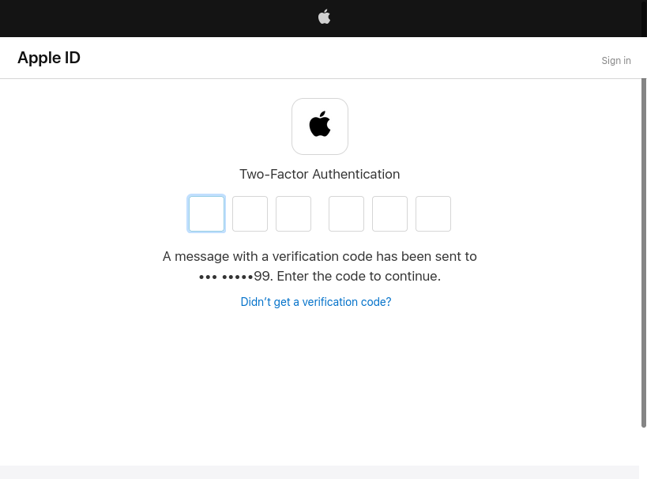
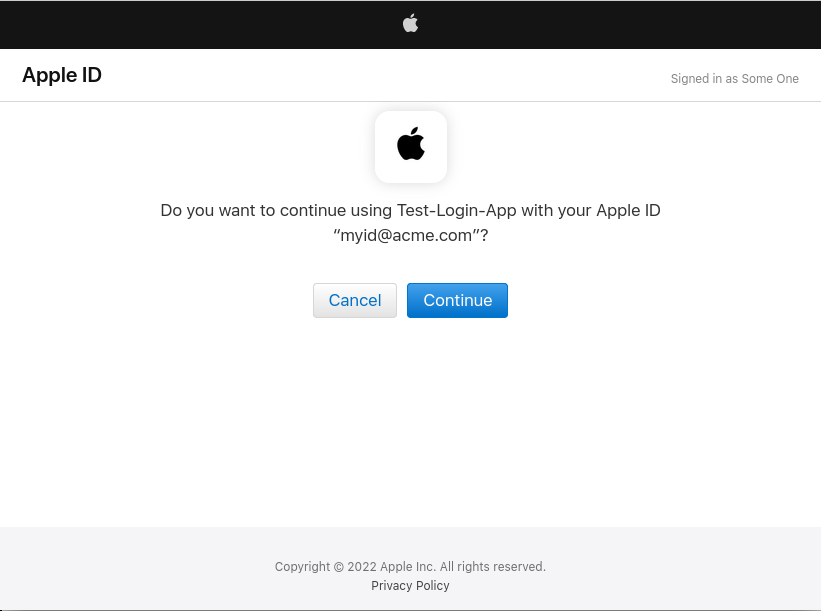

# The "Sign In With Apple" Agama flow

To deploy this flow, a number of configurations are required. Ensure you have an Apple developer account to start. [This tutorial](https://github.com/ananay/apple-auth/blob/master/SETUP.md) does a great job at explaining the necessary steps. As you go with it, please collect the following elements:

- A service ID
- A team ID
- A key ID and a key file 

You will be prompted to provide a domain name and a return URL. Provide `<your-jans-host>` and `https://<your-jans-host>/jans-auth/fl/callback` respectively, ensuring the changes are effectively saved in the developer's portal.

Please follow the [inbound identity guide](../README.md) **entirely** before proceeding.

## Flow and assets

Find this flow source code [here](https://github.com/JanssenProject/jans/raw/replace-janssen-version/docs/script-catalog/agama/inboundID/apple/io.jans.inbound.Apple). Copy the [logo](https://github.com/JanssenProject/jans/raw/replace-janssen-version/docs/script-catalog/agama/inboundID/apple/apple.png) to your server at `/opt/jans/jetty/jans-auth/agama/fl/inboundID` directory, if desired.

## Supply configurations

Create a JSON document using the below as a guide:

```
{
  "authzEndpoint": "https://appleid.apple.com/auth/authorize",
  "tokenEndpoint": "https://appleid.apple.com/auth/token",
  "clientId": "<SERVICE ID>",
  "key": "<ONE-LINER CONTENTS OF KEY FILE>",
  "keyId": "<KEY ID>",
  "teamId": "<TEAM ID>",
  "scopes": ["email", "name"],
  "custParamsAuthReq": { "response_mode": "form_post" },
  "clientCredsInRequestBody": true
}
```

For the `key`, remove the lines regarding begin/end of the private key entirely. Also remove any line breaks: a one-liner is required. 

Use the crafted JSON content to parameterize this flow, as in [Set configuration parameters](../README.md#set-configuration-parameters).

Then use the below to [parameterize the main flow](../README.md#parameterize-the-main-flow):

```
"apple": {
  "flowQname": "io.jans.inbound.Apple",
  "displayName": "Apple",
  "mappingClassField": "io.jans.inbound.Mappings.APPLE",
  "logoImg": "apple.png"
}
```

## Expected journey

The accompanying images illustrate the steps end-users will go through when using the inbound identity flow taking the Apple route:

1. Initial provider selector page

    

1. Prompt for credentials at Apple website

    

1. Prompt for a second factor, e.g. SMS (optional)

    

1. Prompt for browser trust

    

1. Prompt before returning to original site

    

Finally, the user should land at the target application.
