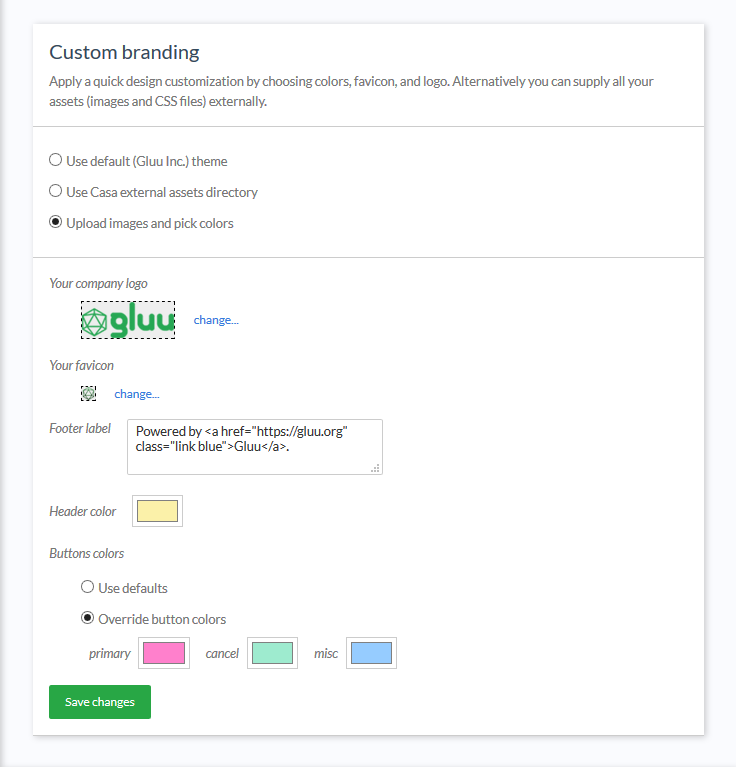

---
tags:
  - Casa
  - administration
  - admin console
---

# Admin Console

This document reviews the available options for configuring Casa. All configuration changes applied via the admin console take effect immediately with no restart or other actions required.

## Authentication methods

Here you can choose the type of 2FA credentials you want to support in Casa. Every authentication method is represented by a widget you can enable or disable. Administrators can arrange widgets according to perceived "strength" order, that is, methods considered safer than others can be placed on top of the list. This ordering has two practical consequences:

- When a user has 2FA turned on, he will be prompted safer methods first when authenticating. However, if the user has already chosen a preferred method in his dashboard, the prompt favors his choice

- In the user's dashboard enrolling options are presented following the defined order

Widgets shown vary according to plugins installed. In a fresh installation, the following are supported out-of-the-box:

- OTP via SMS
- TOTP/HOTP: mobile OTP apps and hard tokens (cards, key fobs, dongles, etc.)
- FIDO devices
- [Super Gluu](https://docs.gluu.org/head/supergluu/) for push notifications 

To add more authentication methods, please check the developer [guide](../developer/add-authn-methods.md).

## Password settings

In this section, administrators may configure:

- The ability for users to reset their password from inside Casa
- Apply the rules defined for the `userPassword` attribute (length and regular expression) in Casa

## Reset to password authentication

If a user is locked out for any reason (e.g. lost device, etc.), an admin can navigate
to `Reset to password authentication` in the admin console to turn 2FA off for them. Type the username (or part of) in
the text field and then press search. Once the user has been located, click the checkbox and click the
`Reset to password` button. The row will become disabled, and a success message will be displayed.

## Branding

Most organizations will want to custom brand Jans Casa. Follow our guide to learn more
about [custom branding Casa](./custom-branding.md).

## Plugins

Through an easy-to-use screen, administrators can easily manage installed plugins and add new ones.

## Logging

Application logs are useful sources of information to diagnose anomalies and understand possible causes of errors
if presented. Casa uses the Log4J2 logging framework for this. The severity level for logs can be modified at runtime
and requires no restart. For more information about logging, check the [FAQ entry](./faq.md#where-are-the-logs).

 

## CORS domains

If a given plugin exposes one or more web services that are to be consumed from within a web browser, you can whitelist the origin domains from which consumption can takes place.

## 2FA settings

!!! Warning  
    This feature is only if the [2FA settings plugin](../plugins/2fa-settings.md) is installed

In the 2FA settings screen, an admin can:

- Specify the minimum number of credentials a user **must** enroll before 2FA can be turned on
- Determine whether 2FA should be automatically enabled upon credential enrollment
- Whether users can turn 2FA on and off their own
- Whether users can choose a preferred authentication method
- Choose from a few predefined policies for when 2FA should be prompted.

To reduce the chance of lockouts, we recommend setting a minimum of two (2) strong credentials.

Predefined 2FA policy options include:

- Enforce strong authentication for every login attempt
- Prompt for 2FA when users' location is unrecognized
- Prompt for 2FA when users' device is unrecognized
- Allow the user to set their own strong authentication policy

The default policy is to enforce 2FA for every login attempt. If the admin opts to allow users to manager their own
policy, a new widget will appear in the user-facing dashboard as described in
the [user guide](../user-guide.md#2fa-settings-and-trusted-devices).

In addition, the plugin exposes an API to programmatically manipulate these settings.
