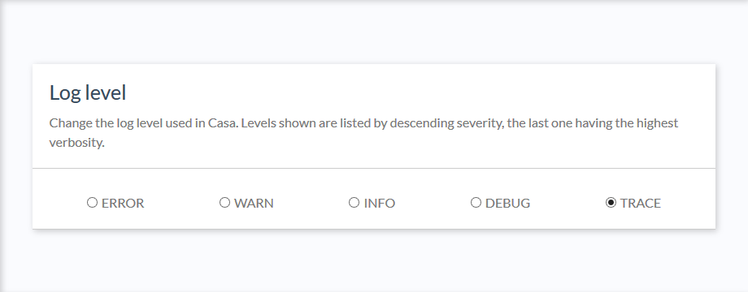
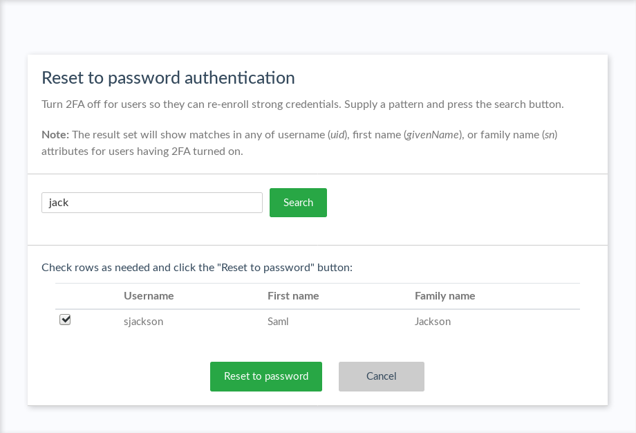

---
tags:
  - Casa
  - administration
  - admin console
---

# Admin Console

The sections below document the admin console that is available to Jans Casa administrators after installation.
Many of the settings are configured during initial setup. Once Casa and Janssen Server are properly configured, follow
the [enable methods section below](#enabled-methods) to "set up" Casa.

All configuration changes applied via the admin console take effect immediately with no restart or other actions
required.

## Enabled Methods

Updates need to be made in both the Janssen Server and Jans Casa to get Jans Casa operational.

### Enable Authentication Scripts (Janssen Server)

The Janssen Server uses interception scripts to implement user
authentication. For each type of 2FA credential that should be manageable in Jans Casa, the corresponding authentication
script **must be** enabled in Janssen Server.

To enable authentication methods in Janssen Server, open TUI (connect to your server and run `python3 /opt/jans/jans-cli/jans_cli_tui.py`), follow the prompts, and navigate to the _scripts_ tab. There, search for the  script matching the type of 2FA credential you want to support, e.g. `fido2`, `super_gluu`, `otp`, `twilio_sms`, etc. Press enter to open the script details page. Select the "Enabled" field and press space (an asterisk will be displayed). Finally, press the "save" button.

### Configure Casa

Once the applicable interception scripts are enabled in Janssen Server, a Jans Casa admin can enable 2FA mechanisms in
the `Enable methods` interface. Check the box for each type of authentication method users should be able to
self-service in Jans Casa. You can assign the handler [plugin](#plugins) for each method. Choose "System" to use the
default implementation provided by the application.

The System plugin supports several authentication methods:

- OTP SMS
- OTP (handling mobile apps and hard tokens)
- FIDO security keys
- [Super Gluu](https://super.gluu.org/)

In their home page, users will see widgets for every available method. These widgets are listed in decreasing order of
ACR level. That is, the first method shown will be that with the highest level assigned in its corresponding
interception script, and therefore the most secure.

### Testing

A recommended practice is to enable one script in the Janssen Server (like OTP), then enable the associated method in Jans Casa.
Test and confirm that enrollment and authentication is working as expected, then continue adding other desired 2FA
methods. In an incognito browser, employ a user other than `admin` to test enrollments each time a new method is added.
This will prevent the `admin` user from being accidentally locked out.

## 2FA settings

!!! Warning  
This feature is only available through the [2FA settings plugin](../plugins/2fa-settings.md).

In the 2FA settings, an admin can:

- Specify the minimum number of credentials a user **must** enroll before 2FA can be turned on
- Determine whether 2FA should be automatically enabled upon credential enrollment
- Whether users can turn 2FA on and off their own
- Whether users can choose a preferred authentication method
- Choose from a few predefined policies for when 2FA should be prompted.

To reduce the chance of lockouts, we recommend setting a minimum of two (2) strong credentials.

Predefined 2FA policy options include:

- Enforce strong authentication for every login attempt
- Prompt for 2FA when users' location is unrecognized
- Prompt for 2FA when users' device is unrecognized
- Allow the user to set their own strong authentication policy

The default policy is to enforce 2FA for every login attempt. If the admin opts to allow users to manager their own
policy, a new widget will appear in the user-facing dashboard as described in
the [user guide](../user-guide.md#2fa-settings--trusted-devices).

In addition, the plugin exposes an API to programmatically manipulate these settings.

## Pass reset config

An admin
can give users the ability to reset their password from inside Casa. To enable the password reset functionality,
navigate to `Pass reset config` and click the toggle to `ON`.

## Branding

Most organizations will want to custom brand Jans Casa. Follow our guide to learn more
about [custom branding Casa](./custom-branding.md).

## Logging

Application logs are useful sources of information to diagnose anomalies and understand possible causes of errors
if presented. Casa uses the Log4J2 logging framework for this. The severity level for logs can be modified at runtime
and requires no restart. For more information about logging, check the [FAQ entry](./faq.md#where-are-the-logs).

## Reset to password authentication

If a user is locked out for any reason (e.g. lost device, etc.), an admin can navigate
to `Reset to password authentication` in the admin console to turn 2FA off for them. Type the username (or part of) in
the text field and then press search. Once the user has been located, click the checkbox and click the
`Reset to password` button. The row will become disabled, and a success message will be displayed.

