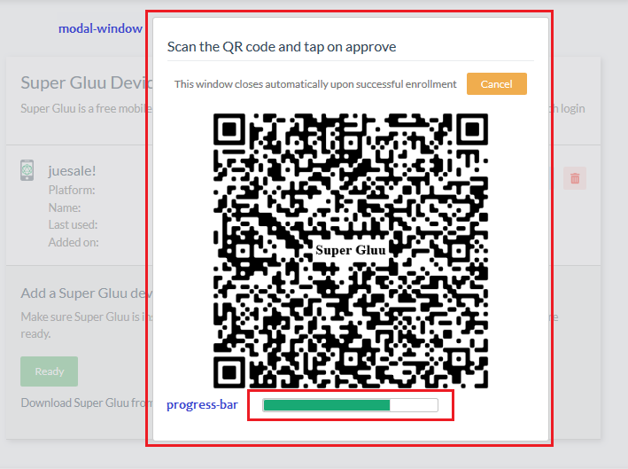

---
tags:
- Casa
- administration
- custom branding
- brand
---

# Custom branding

In Casa, administrators can supply their own logo and favicon to better match the organization's look and feel. If you want to apply more advanced customizations, adding the custom branding plugin is the way to go.

!!! Note  
    This page covers customizations available through the [custom branding plugin](../plugins/custom-branding.md). It is assumed you have already added it to your Casa installation.  

The plugin allows administrators to easily alter the appearance of Casa. There are two ways to tweak the design: a quick point-and-click set of changes that you can preview immediately, or a lower-level approach that allows you to supply your own CSS file and images (this is known as external assets directory usage). 

## Quick design customization

Click on `Custom branding` in the admin console, and choose `Upload images and pick colors`. With this branding alternative, you can apply some visual changes effortlessly with zero CSS coding. You can:

* Supply your company logo and favicon
* Choose the background color for the page header
* Choose button colors
* Edit the footer text


Once you supply your files, color values, and footer text, click on `Save` and see the changes take immediately by navigating to a different page or opening a new browser tab. Repeat the process till you get the combination that best matches your organization's look and feel.

With "Primary buttons" we refer to the vast majority of buttons that trigger some action such as saving, updating or accepting - whether in the user pages or the admin UI itself. "Cancel" covers undo, close or cancel, while "Misc" is for anything not fitting any of the previous usages.

You can choose "Use defaults" if you feel comfortable with the [Bootstrap-like](https://getbootstrap.com/docs/5.0/components/buttons/) colors offered in Jans Casa.

## Using the external assets directory

!!! Note  
    Intermediate-level knowledge of CSS is required for this task.  

### Background

Casa's UI design is driven by one CSS stylesheet and a few images. Specifically, Casa leverages the following UI frameworks:

* [ZK](http://books.zkoss.org/zk-mvvm-book/10.0/)
* [Tachyons 4.11](http://tachyons.io)
* [Font Awesome 5.12](https://fontawesome.com)

Particularly, ZK's default theme CSS file was disabled to offer a higher degree of flexibility in design. This enables Tachyons to claim control over style rules applied to HTML markup.

### External assets directory

In the `/opt/jans/jetty/casa/static` folder, you can place your own version of the main stylesheet and images Casa uses. No other stylesheet should be overriden.

To start, log in to the Janssen Server and do the following:

```
cd /opt/jans/jetty/jans-casa/static
jar -xf ../webapps/jans-casa.war images styles/gluu/style.css  
```

This will copy the files you can edit later (these are the original versions provided out of the box in Casa).

If you place additional files in this directory, ensure ownership is set to recursive. For instance, you can:

```
$ chown -R jetty:jetty /opt/jans/jetty/jans-casa/static/
```

### Enable and apply your customizations

In the admin console, navigate to `Custom branding` > `Use Casa external assets directory`. From that point on, your installation is reading relevant files from the `static` directory.

!!! Note  
    In CSS, the rules' order of appearance is important. For all Casa pages, style.css is loaded first, then tachyons.css. This means rules for Tachyons have higher priority unless `!important` is used.  
    
The main stylesheet (`style.css`) is located at `/opt/jans/jetty/jans-casa/static/styles/gluu` if you have followed the instructions above.

Here are some tips for applying your customizations:

- Get acquainted with functional CSS. This is the approach followed in Casa. [Here](https://www.smashingmagazine.com/2013/10/challenging-css-best-practices-atomic-approach/), [here](https://css-tricks.com/lets-define-exactly-atomic-css/), and [here](https://johnpolacek.github.io/the-case-for-atomic-css/) you can find useful introductory material.

- Inspect the DOM tree generated for application pages and determine the CSS selectors you need to edit or things you have to add in order to alter the appearance. Use your web browser's facilities to inspect web page composition: this is usually part of any browser's developer toolbar. Moreover, they allow you to change styles on the fly so you can play a lot before applying the real changes.

- Don't override rules that are already defined in Tachyons. Conversely, ZK rules (which are prefixed with `z-`) are safe to be re-defined since ZK CSS isn't included.

- In most circumstances, your work will come down to editing existing rules in `style.css`. HTML markup will show rules (in the `class` attribute) prefixed with `cust-` that are apparently not defined anywhere. These rules are intended to give admins the opportunity to add their design tastes. The following is a list of custom selectors you can add to `style.css`. Names are in general self-explanatory, the images below help clarify more.

    - cust-menu-item  
    - cust-content-heading  
    - cust-sections-wrapper  
    - cust-section  
    - cust-panel  
    - cust-modal-window  
    - cust-edit-button  
    - cust-link-button  
    - cust-delete-button  
    - cust-primary-button  
    - cust-cancel-button  
    - cust-misc-button  
    - cust-text-input  
    - cust-progress-bar  
   




### Viewing your changes

There is no need to restart the application for the changes to take effect. However, most static files are cached by browsers, so you will need to open a fresh private browsing (incognito) session.

If you tried the above and still don't see changes, try hitting the resource URL directly in a new browser tab. For example, to load the `style.css` file in your browser, visit `https://<host-name>/casa/custom/styles/gluu/style.css`. That way, you can determine if your changes are there.

### Reverting to Default Theme

If for any reason you wish to restore the default theme, select "Use default (Gluu Inc.) theme" in the admin dashboard.

### Examples

Here are solutions for common use cases:

#### Use a different logo

Just replace `images/logo.png` (relative to the `static` directory) with your own image.

#### Use a Different Favicon

Replace `images/favicon.ico` with your own image.

#### Change the Font Used in Text

The vast majority of text that appears in the application uses the same font. To set the default font, locate at the bottom of `style.css` a declaration like `@import url('https://fonts.googleapis.com...` and point to one of your choosing. Check out this [page](https://developers.google.com/fonts/docs/getting_started) to learn more about Google fonts.

Then, scroll down and modify the `html` and `body` selectors appropriately with the font you picked.

If you want to use your own fonts instead of Google's, you can use `@font-face` for this purpose. Copy your `ttf`, `woff`, `svg` or `eot` files somewhere in the `static` directory and link them appropriately.

To use the more classical fonts like "Helvetica", "Arial", etc., simply update `html` and `body` selectors passing the `font-family` name.
