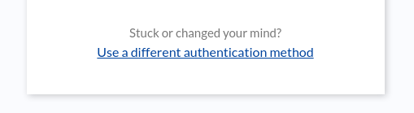
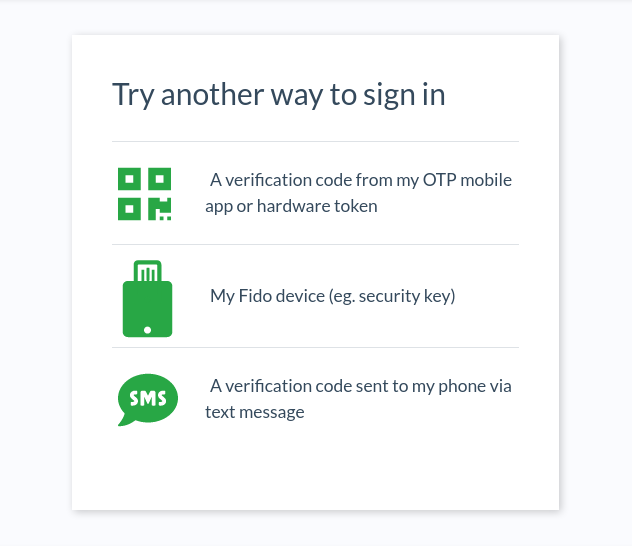

---
tags:
  - Casa
  - developer guide
---

# Onboarding custom authentication methods

Out-of-the-box Casa supports some useful authentication methods for a secure, pleasant authentication experience. Adding more authentication mechanisms is possible and requires certain development effort. In this guide we summarize the steps required to do so and give you some useful pointers to start your coding journey.

Supporting a new authentication mechanisms consists of two tasks: coding an Agama flow and creating a plugin that contributes an authentication method. The former has to do with the authentication flow the user experiences (to access Casa or other apps), while the latter with the credential enrollment process.

## Agama flow

!!! Note
    Acquaintance with Agama [framework](../../agama/introduction.md) and Agama project [management](../../janssen-server/config-guide/auth-server-config/agama-project-configuration.md) is required

### About Casa authentication flow

Authentication in Casa is implemented through an Agama project called _casa_ - in TUI you can see it listed in the Agama management screen. As a first step, the user is requested to enter the username and password combination, then depending on how the application is configured, personal user settings,  and access policies defined, a second factor may be requested.

The _casa_ project allows to onboard new types of second factors (authentication mechanisms) and also provides a user experience that supports backtracking: if a user is asked to present a specific credential and that credential is not currently available or is not working, he can choose an alternative method for authentication where a different type of credential will be prompted. Users can backtrack several times.

### Flow requisites

To code the flow corresponding to the authentication method to add, you can use the Agama project found  [here](https://github.com/JanssenProject/jans/tree/vreplace-janssen-version/jans-casa/plugins/samples/sample-cred/agama#readme) as a canvas. Ensure the following conditions are met so that it properly integrates in the main Casa flow:

The flow will be passed an Agama _map_ containing information of the person attempting the authentication. This input parameter will contain at least three keys: `uid`, `inum`, and `name`. `uid` and `inum` map directly to attributes stored in the user's profile and are never empty, `name` is a displayable name which may come from attribute `givenName` or `displayName`. All values are _strings_.

The flow should terminate with a `true` outcome if the user successfully passes the challenge, presents the expected credential, etc. In any other case, `false` must be returned and an optional error message can be included for the caller flow (`io.jans.casa.authn.main`) to show it in the screen. Any additional data attached in the `Finish` instruction will not be processed. 

If for some reason your flow crashes, the corresponding exception will be printed to the logs, the caller will continue running, and the browser taken to the [selector page](#the-selector-page) where an error message will be displayed.

Note your project may contain more flows to serve as utilitarians or simply to break down the authentication flow into smaller, more manageable pieces.

### About templates

Regarding UI templates, it is recommended to re-use a couple of Freemarker macros available in the _casa_ project. This will allow your flow's UI to have the same look-and-feel of flows bundled out-of-the box, like OTP and fido. Additionally this will allow to properly incorporate backtracking. Import the `commons` template in your UI page:

```
<#import "../kz1vc3/commons.ftlh" as com>
```

Copy the above line of code in the first line of your templates, preferably. Note you may need to add extra `../` fragments in the path to `commons.ftlh` depending on the directory level where your template resides inside the `web` subdirectory of your Agama project.

Then call the `main` macro and supply your markup, like this:

```
<@com.main>
    <!-- your markup here -->
<@com.main>
```

The above will generate a page incorporating the required CSS files and will render the header and footer appropriately while leaving your content in the center of the page. The _casa_ project makes heavy use the Tachyons CSS. You may like to use those for building templates instead of incorporating yet another styling framework.

It is highly recommended to include the following near the bottom of your markup (still inside the `main` call block): 

```
<@com.alternative />
```

This will render a form with a text and a link that will allow users to "escape" from your flow and take another route, i.e. to backtrack:



Then, in your flow's code, you handle the escape this way:

```
data = RRF "mytemplate.ftlh" ...

When data.skipped is ""
    Finish false
```

The above means your flow can finish with `false` not only if the authentication did not succeed but also when users wants to backtrack.

#### The selector page

When backtracking, a selector page is shown where all available methods for the given user are displayed - sorted by strength. From here, the user can take another route to be challenged for an alternative credential.



Every element in the list has an icon and descriptive text associated. These elements are configurable and for the case of adding an authentication method, both icon and text should be supplied. To do so, locate in TUI the _casa_ Agama project. See how the flow `io.jans.casa.authn.main` has a `selector` section in its configurations. This is a dictionary (JSON object) where keys are qualified names of flows and values are dictionaries at the same time - this where you can provide the required info.

For example, if your authentication method is backed by a flow `com.acme.authn.food`, the _casa_ project configuration may look like

```
{
    "io.jans.casa.authn.main": {
        "selector": {
            "com.acme.authn.food": {
                "icon": "<i class='fas fa-pizza-slice'></i>",
                "text": "A sentence describing what the user is supposed to present in the next screen"
            },
            ...
        }
    },
    ...
}
```

Alternatively, a pointer to a localized message can be used instead of `text`. This is the recommended practice if [localization/internationalization](../../janssen-server/developer/agama/advanced-usages.md#localization-and-internationalization) is relevant. In this case, something like the below will work:

```
            ...
            "com.acme.authn.food": {
                "icon": "<i class='fas fa-pizza-slice'></i>",
                "textKey": "foodAuth.methodTitle"
            }
            ...
```

as long as the message key `foodAuth.methodTitle` is defined in the project's `labels.txt` file, or elsewhere in another project. Note `textKey` takes precedence over `text` when rendering the page. 

Both `icon` and `textKey` (or `text`) may contain HTML markup. In this example we are using the font awesome library available in the selector page for rendering a nice [icon](https://fontawesome.com/v5/search?q=pizza&o=r&m=free) but we could have used any other thing here like an `img` tag, for instance.

Ensure to properly escape double quotes if necessary. Also make the markup a one-liner: JSON strings cannot span several lines.


### Recommended practices

!!! Note
    Ensure to go through [this](../../janssen-server/developer/agama/agama-best-practices.md) page before proceeding

#### Config settings

Use a single place to store configuration settings for your authentication method. The most convenient place is in the Agama project itself. You may have configs associated to each flow in your project and they can be accessed directly in your flows code. Additionally, they can be easily read from your plugin's Java code this way:

```
ips = io.jans.casa.misc.Utils.managedBean(IPersistenceService.class);
JSONObject p = ips.getAgamaFlowConfigProperties("flow qname");
```

Out-of-the-box methods in Casa employ this strategy. Also when you do this, every time a change in project configuration is detected, your Java code gets notified: a call to method `reloadConfiguration` of your extension is issued, see class `SampleCredentialAuthnMethod` in the [sample credential](#enrollment-plugin) plugin.
 
#### Retries

Giving the user only one chance to pass an authentication challenge is unfair. Code your flow so users have a couple of opportunities to fail before finishing with `false` as outcome. Agama's `Repeat` directive helps you cover this case.


### Key questions

As you try to assemble your project, you will come up with some design decisions, for instance: 

- How to model and store credentials associated to the authentication method? 
- What kind of parameters are relevant for the authentication method?
- What's the algorithm for authenticating users once they have supplied a valid username/password combination?

Depending on the answers, you may like to start instead with plugin development first. This is not always the case though, however, getting your hands on the plugin might help unclutter the path.

## Enrollment plugin

Coding a Casa plugin is mainly a Java development task. You can use the "Sample credential" [plugin](https://github.com/JanssenProject/jans/tree/vreplace-janssen-version/jans-casa/plugins/samples/sample-cred#readme) as a template to start the work. Ensure you have:

- A Jans Server installation that includes Jans Casa - prefer a VM environment over the CN edition for development purposes. Also, you'll need a way to connect to your server via SSH

- A copy of the Jans repository (a shallow clone of `main` branch is OK): https://github.com/JanssenProject/jans
 
### Plugin deployment

Start with deploying the plugin to get acquainted with the process:

1. In the local development machine, `cd` to `./jans/jans-casa/plugins/samples/sample-cred`
1. Run `mvn -Dmaven.test.skip package`. This may take several minutes (lots of network requests). Once you get it done, the next time you can add the `-o` switch (offline mode) for faster results
1. A `target` folder with a couple of jar files in it will be generated

Access Casa admin console and in the plugins page, upload the file suffixed with `jar-with-dependencies.jar`. After one minute approximately, visit the "Authentication methods" page, check the "Favorite color" widget, and click on "Save". Then logout.

Login again, this time with a non administrative account. In the landing page (user's dashboard), an item labeled "Your favorite color" will be shown on the left (under the "2FA credentials" heading). Also, a panel in the central area of the page will be added in accordance. 

Click on "Your favorite color" and you'll land a page to let Casa know what your favorite color is!. This color will be used as a second factor for authentication. Ensure you have enabled another method such as OTP so you can enroll an additional credential in order to be able to active 2FA for this account.

### Study the sample project

Now it's time for you to go through the project folder checking one file at a time. Most of files contain comments that explain the purpose of things.

Ensure you make a deep inspection of file `./src/main/resources/assets/user/cred_details.zul`. It contains the markup of the page you visited earlier.

Make an excursion to interface `AuthnMethod` found in `shared` maven module. Note it brings a couple of default methods. Class `SampleCredentialAuthnMethod` implements this interface.

### Editing the project

Modifying the project may require you to edit files mainly with `.java`, `.zul`, or `.properties` extensions. Most Java classes used in this plugin can be found in:

- The repository you cloned earlier
- The [ZK framework](https://www.zkoss.org) documentation
- Standard Java SE API docs

You can remove the plugin and add it as many times as you like - no restarts are needed unless things go really weird. You can do so either via the admin console or by dropping/removing the file directly in the filesystem (the path is `/opt/jans/jetty/jans-casa/plugins`).

### Page tweaks

If you alter a `.zul` file and then package and redeploy the plugin, you will most probably not see any change taking effect in the UI page. This is because the ZK framework caches the `.zul` pages by default for a very long period. To change this behavior do the following:

1. Connect to your VM and `cd` to `/opt/gluu/jetty/jans-casa/webapps`
1. Extract ZK descriptor: 
    ```
    # jar -xf jans-casa.war WEB-INF/zk.xml
    ```    
1. Locate XML tag `file-check-period` and remove it including its surrounding parent `desktop-config`
1. Save the file and patch the application war:
    ```
    # jar -uf jans-casa.war WEB-INF/zk.xml
    ```
1. Restart casa (e.g. `systemctl casa restart`)

From now on, any template change will take effect after 5 seconds.
