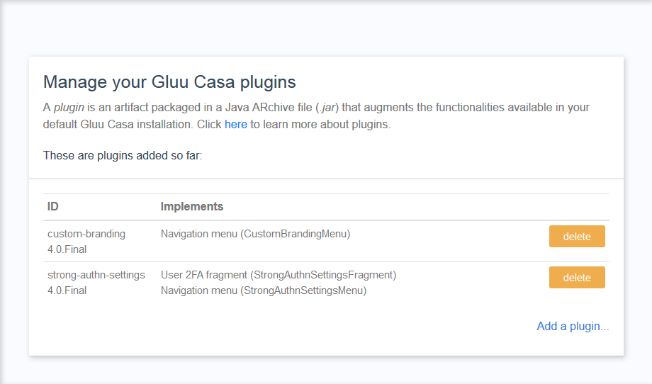
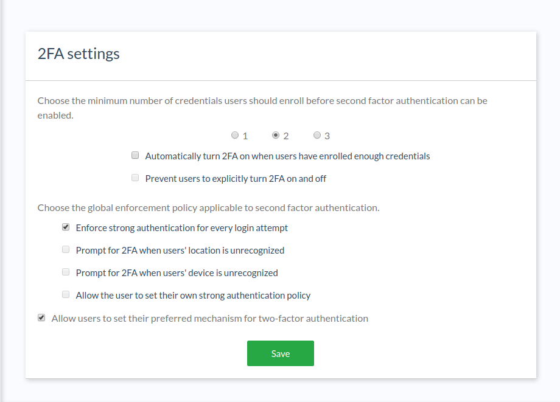

---
tags:
- Casa
- 2FA
---

# 2FA Settings Plugin

This plugin allows administrators to configure how and when 2FA is applied. Admins may:

1. Specify the minimum number of credentials users must enroll before 2FA can be used
1. Allow 2FA to be automatically enabled upon credential enrollment
1. Prevent users to turn 2FA on and off their own
1. Allow users to choose a preferred method of authentication

When (2) is not used, option (3) is disabled. This is the default behavior exhibited in Casa where users explicitly enable or disable 2FA usage.

When (2) is active, 2FA is turned on as soon as the user enrolls a credential and the minimum required is fulfilled. Bear in mind:

- Automatic enablement happens only via GUI: enrollments made using the API will have to turn 2FA on by means of the API itself
- Plugins attaching authentication methods to Casa have to explicitly call method `notifyEnrollment` of `SndFactorAuthenticationUtils` upon successful enrollments (see the javadocs).

Also, 2FA is automatically turned on upon login for users with enough credentials registered and not having 2FA turned on yet.

With (4) users may choose a preferred type of credential. This means that when requested for a second factor, a credential of such "preferred" type will be prompted first instead of the credential considered the "strongest". The strength associated to a method is equal to the numeric level assigned to the custom script that represents the method.

For more restrictive scenarios, administrators have the option to remove the 2FA switch (3) from the user's dashboard.

Additionally this plugin allows to:

- Choose from a set of predefined policies for when 2FA should be prompted:
 
    - Always (at every login attempt)
    - When user's location is unrecognized
    - When user's device is unrecognized
    - Users can define their own policy (based on the above)
  
- Set how long a location or device can be deemed as recognized
    
Moreover, when administrators allow users to set their own strong authentication policy, users can:

- View the list of physical devices they have used to login (e.g. PC, tablet, phone)
- View the time and location (city) associated to the last login event
- Remove a device from the list (eg. when it should not be considered trustworthy anymore)

A device/location is considered trustworthy when the user has presented a strong credential in order to login to Casa in such device/location. Subsequent login attempts from trustworthy (recognized) device/locations will not require them to present a second factor.

## Requirements

- The plugin jar file must match the version of your Janssen Server installation.
    
## Installation

1. [Download the plugin](https://maven.jans.io/maven/io/jans/casa/plugins/strong-authn-settings/replace-janssen-version/strong-authn-settings-replace-janssen-version-jar-with-dependencies.jar)

1. Log in to Casa using an administrator account

1. Navigate to `Administration console` > `Casa plugins`

    

1. Click on `Add a plugin...` and select the plugin jar file

1. Click on `Add` 

## How to use

For administrators, a new link labeled "2FA settings" appears in the dashboard menu to access the function.

For regular users, proper details appear in the widget where 2FA is turned on.

## API

Configurations provided by this plugin can also be applied by means of the API exposed for this purpose. A formal description of the API can be found in this [swagger](https://raw.githubusercontent.com/JanssenProject/jans/vreplace-janssen-version/jans-casa/plugins/strong-authn-settings/src/main/resources/assets/2fa-admin-api.yaml) file. Note all endpoints are protected by tokens which must have the `https://jans.io/casa.config` OAuth scope.
