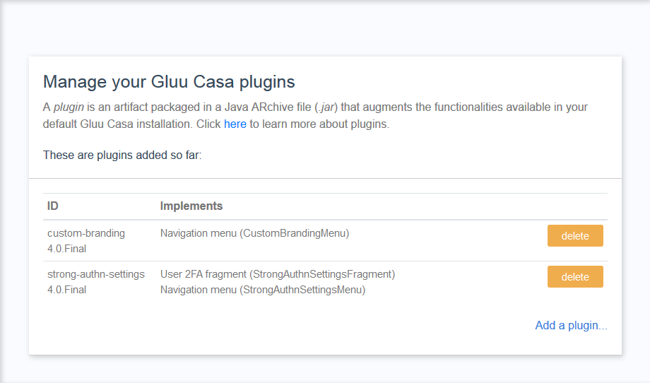

---
tags:
- Casa
- OTP
---


# E-mail OTP Plugin

## Overview 

With this plugin, administrators can onboard a new type of authentication factor consisting of one-time passcodes (OTP) delivered to the user's inbox.

This plugin simply shows a list of the already registered e-mail addresses of the user in the UI of Casa, however the accompanying Agama project contributes a new option in the authentication experience where the user is prompted to enter an OTP delivered to one of his e-mail addresses, if any. 

By adding the plugin and the corresponding Agama project to your server, all users having at least one e-mail address in his profile (database attribute `mail`) will be given the option to get a passcode delivered and then prompted for such as a form of 2FA. 

## Requirements

The SMTP configuration must be previously populated in the Jans Server. For this purpose you can use an administrative tool like TUI. Visit the SMTP section and fill the values requested. Ensure to run and pass the test presented before proceeding. Then, restart the authentication server.

## Installation

### Plugin

1. Download the plugin [jar](https://maven.jans.io/maven/io/jans/casa/plugins/email_2fa/replace-janssen-version/email_2fa-replace-janssen-version-jar-with-dependencies.jar) file

1. Login to Casa using an administrative account

1. Visit `Administration console` > `Casa plugins`

    

1. Click on `Add a plugin...` and select the plugin file

1. Click on `Add` and wait for one minute

1. Visit the `Authentication methods` section of the admin console. Tick the `Registered e-mails` widget, drag it to the desired position, and finally hit `Save`

### Agama project

1. Download the project [archive](https://maven.jans.io/maven/io/jans/casa/plugins/email_2fa/replace-janssen-version/email_2fa-agama-replace-janssen-version-project.zip)

1. Deploy the project onto the server - you can use TUI for this task

1. Parameterize the project - you can use the project's sample configuration as a guide. The below summarizes the properties used:

    - `otp_length`: Number of digits the OTPs will have (passcode length)
    - `otp_lifetime`: Passcode expiration in minutes
    - `subject`: Subject to use in e-mail messages. You can use `%s` as a placeholder to insert the value of the generated OTP
    - `message`: Body of e-mail messages. You can use `%s` as a placeholder to insert the value of the generated OTP. Basic HTML markup is supported; ensure to properly escape characters like double quotes - keep in mind this is JSON content  

1. Parameterize the `casa` project: in the `casa` project configuration, locate the `selector` section under `io.jans.casa.authn.main` flow and add an entry with key `io.jans.casa.authn.emailotp`. Assign an icon and a pointer to a short descriptive text. Example:

    ```
    ...
    "io.jans.casa.authn.emailotp": {
        "icon": "<i class='fas fa-envelope' data-fa-transform='shrink-1'></i>",
        "textKey": "email2fa.selector_text"
    }
    ...
    ```

## Test

1. Create one or more testing users with real e-mail addresses associated to their accounts

1. Log into casa with such users and enroll some credential, like a passkey, SuperGluu, etc. Then turn 2fA for them.

1. Logout and login again. A new option for receiving OTPs via e-mail will be presented


## User guide

Using the plugin is straightforward and does not require further explanation.
