---
tags:
- Casa
- user guide
---

# Jans Casa User Guide

Jans Casa ("Casa") is a self-service web portal for managing account security preferences. The primary use-case for Casa is self-service 2FA, but other use cases and functionalities can be supported via Casa plugins. The options displayed in the user portal will always depend upon which settings have been enabled by the administrator. 

## Sign in for the first time

To log in to Casa, navigate to `https://<yourdomain>/jans-casa`.

If you have an existing account, sign in with your standard username and password.

## Credential Dashboard

The credential dashboard displays widgets for each type of supported 2FA credential (e.g. U2F keys, OTP apps, etc.). Each widget includes summary details of enrolled credentials and a button to add / change credentials.

To manage existing credentials and enroll new credentials, click the `Manage` button: 

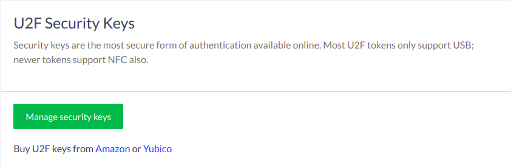

## 2FA overview

### Turn 2FA on/off

After the minimum number of credentials have been enrolled (as specified by the system admin), 2FA can be turned on by clicking the switch in the Second Factor Authentication widget: 

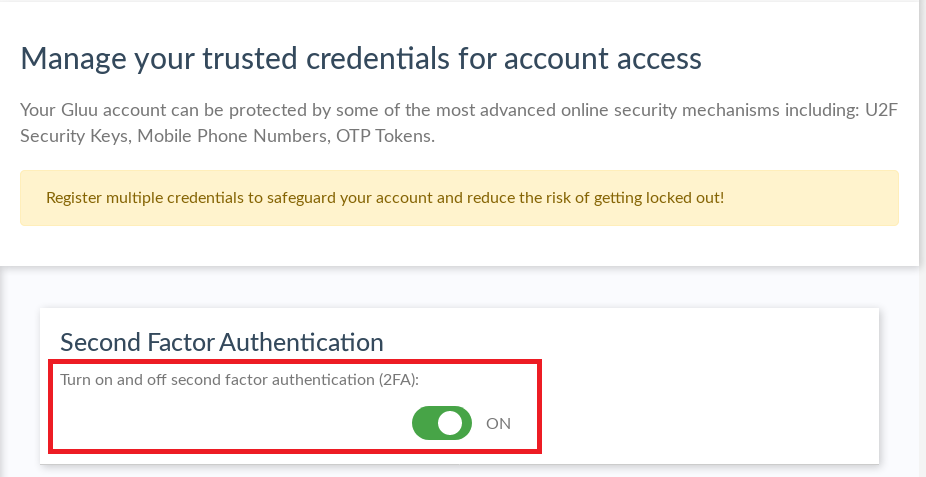

If the switch is not visible, your administrator may have configured the system so that 2FA is turned on automatically when enough credentials are available.

When prompted for 2FA, the specific credential to be prompted first varies depending on the priority of credentials established by the administrator and the user's preferred method, if set.

If at any time the credential prompted is unavailable, you have the option to present any other previously enrolled 2FA credential type.

To turn off 2FA, click again the switch. 

### 2FA settings and trusted devices

If enabled by the system administrator, you can set your own policy for when 2FA is enforced. To manage your settings, after enrolling credentials and turning on 2FA, click the `Manage your 2FA settings` button in the Preferred Authentication Mechanism widget. 

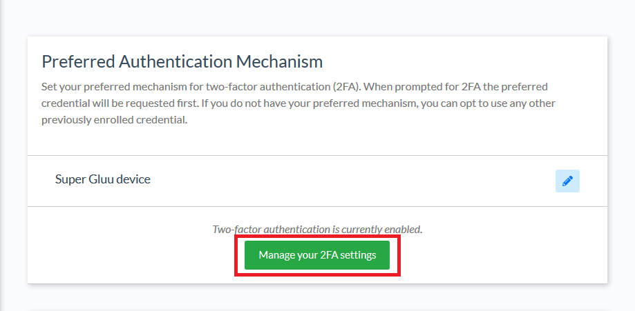

By default, you will be able to choose from a few 2FA policies:

- Always (upon every login attempt)
- If the location (e.g. city) detected in the login attempt is unrecognized
- If the device used to login is unrecognized

If you opt for 2FA based on location, device, or both, a new widget will appear to display your trusted devices. 

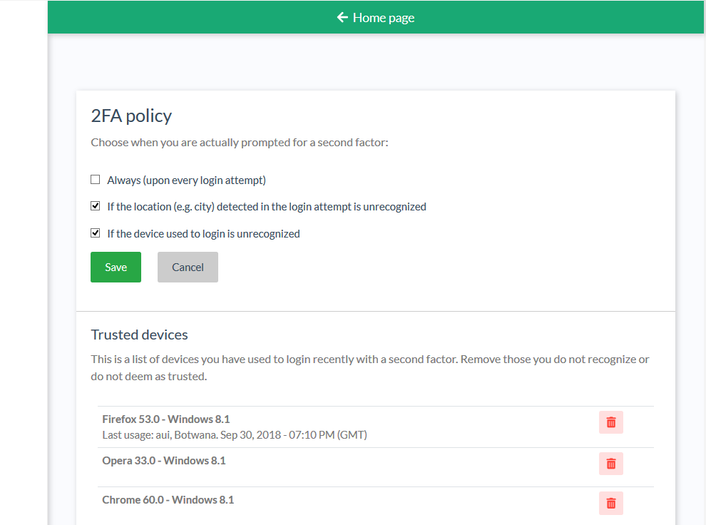

### 2FA best practices

Depending on the device used to get access, some credentials are more convenient to use than others. For instance, security keys may not be compatible with mobile phones or certain browsers.

**To reduce the chance of account lockout**, enroll at least two different _types_ of 2FA credentials -- e.g. one security key and one OTP app; or one OTP app and one SMS phone number, etc. This way, regardless which device you're using to access a protected resource, you will have a usable option for passing strong authentication. 

## 2FA credential details & enrollment

The details page provides additional information about each enrolled credential, for instance its name and date of enrollment. Nicknames can be edited, credentials can be deleted and new credentials can be enrolled and nicknamed. 

Depending on administrator configurations, some of the below sections may nor may not be available, or sections not listed here may appear.

!!! Warning  
    When a credential is deleted, it cannot be recovered. Deleting credentials may result in 2FA being turned off. 

### FIDO 2 security keys

To add a new FIDO 2 credential, navigate to `2FA credentials` > `Security Keys`. Insert the fido key and click `Ready`. Casa will prompt to press the button on the key.

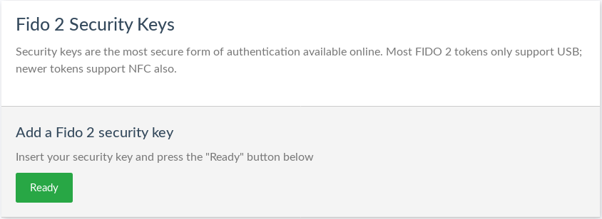

Add a nickname and click `Add`. Once added, the new device will appear in a list on the same page. Click the pencil to edit the device's nickname or the trashcan to delete the device.

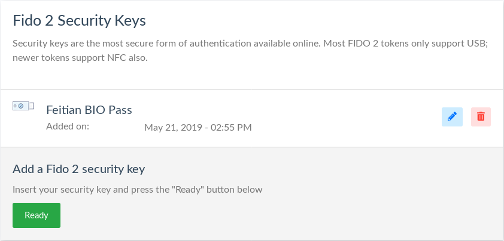

### Super Gluu Devices

To add a new Super Gluu device, navigate to `2FA credentials` > `Super Gluu Devices`.

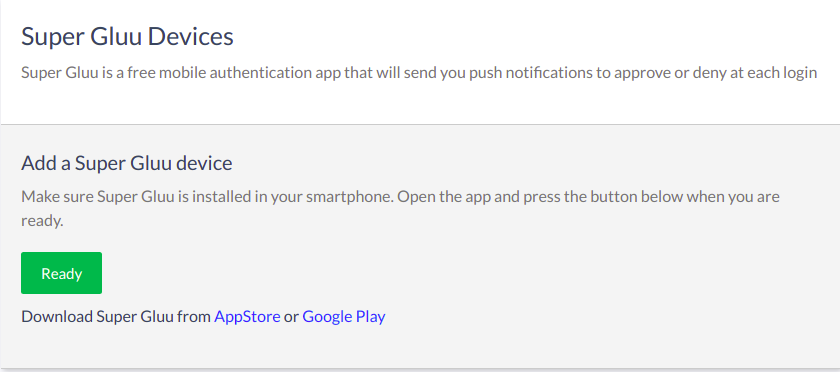

The Super Gluu enrollment QR code will pop up. Scan it in the Super Gluu app and approve the enrollment.

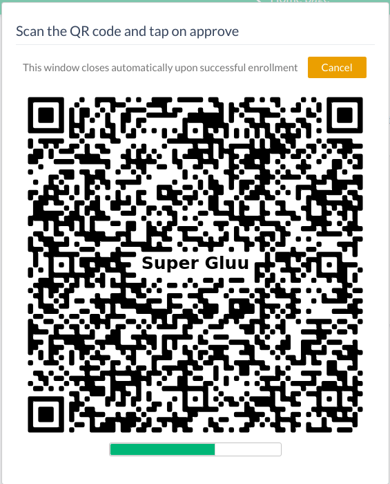

Add a nickname for the device and click `Add`.

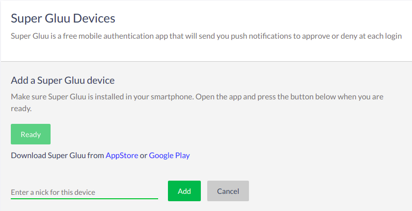

Once it's added, the new device will appear in a list on the same page. Click the pencil to edit the device's nickname or the trashcan to delete the device.

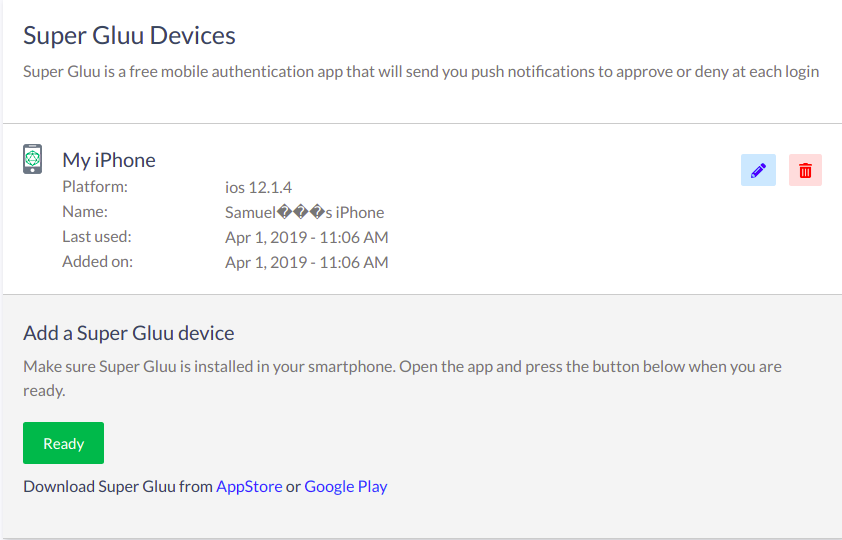

### OTP Tokens

To add a new OTP token, navigate to `2FA credentials` > `OTP Tokens`.

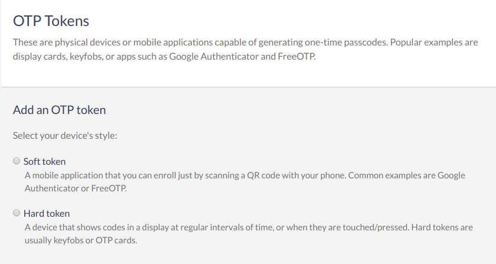

To add a soft OTP token, choose the `Soft token` option and follow the same steps as [Super Gluu](#super-gluu-devices).

For a hard token, choose the `Hard Token` option.

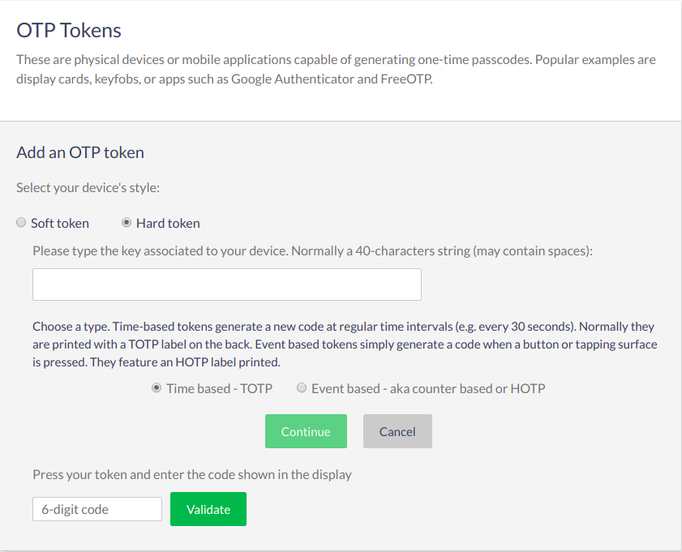

Add the key associated with the device and the 6 digit code. Add a nickname for the device and click `Add`.

Once it's added, the new device will appear in a list on the same page. Click the pencil to edit the device's nickname or the trashcan to delete the device.
    
### Mobile Phone Numbers

To add a new mobile phone number for one-time passcodes, navigate to `2FA credentials` > `Mobile Phone Numbers`.

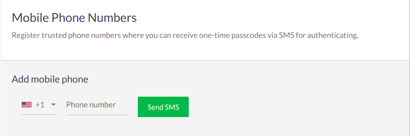

Enter a phone number and click 'Send SMS' to get the passcode. Enter the code received, nickname the mobile number, and click `Add`.

Once it's added, the new mobile number will appear in a list on the same page. Click the pencil to edit the mobile number's nickname or the trashcan to delete the mobile number.
    
## Password Reset

If enabled by the system administrator, Casa can also be used to change your password. 

Navigate to the `Password Reset` widget. Enter your current and new passwords, then click `Change password`.

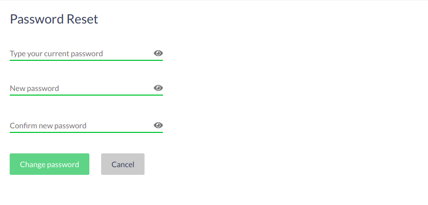

## Consent Management

If the administrator has enabled the `Consent Management` plugin, it will appear in the navigation menu for all users. 

New entries are added automatically whenever the user is prompted for, and authorizes the release of their personal data to an application accessed using their Janssen Server account.   

### Revoking consent
When a previously granted consent decision is revoked, the user will be re-prompted to authorize release of their data if/when they attempt to access the application again. 
