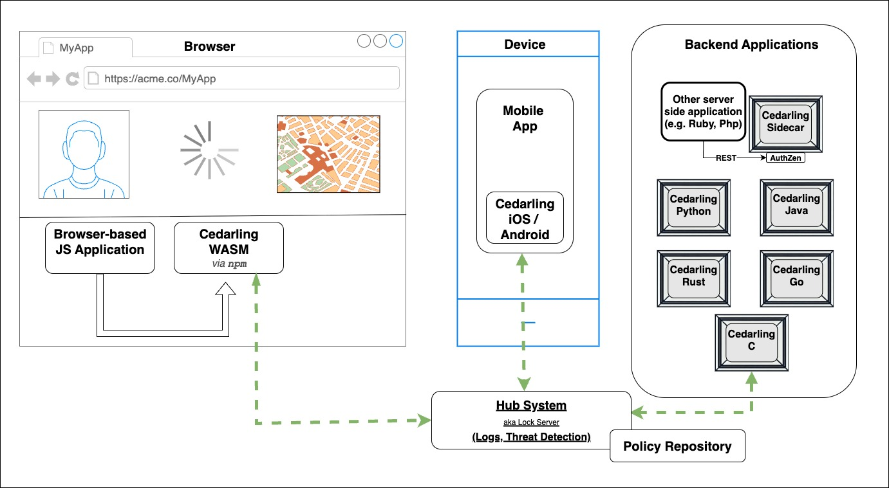
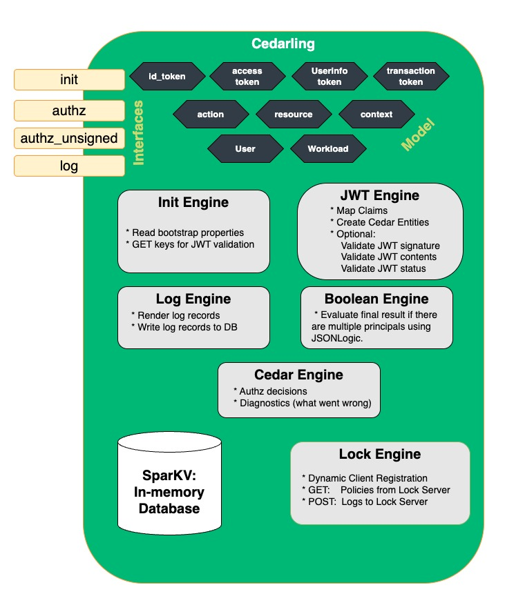
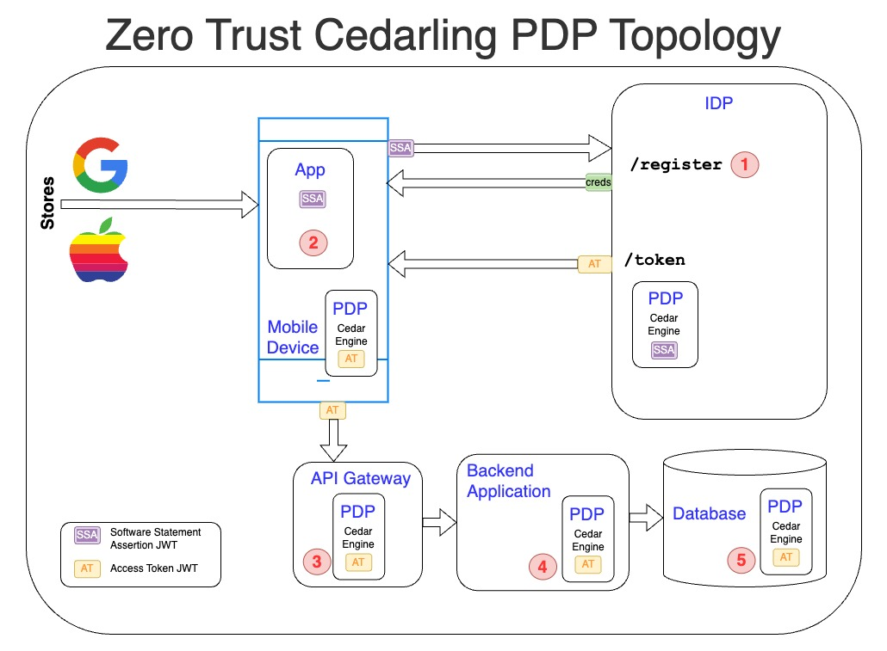

---
tags:
 - administration
 - lock
 - authorization / authz
 - Cedar
 - Cedarling
---

# An Overview of The Cedarling

The Cedarling, powered by the Rust Cedar engine, provides a fast, embeddable, and 
self-contained solution for policy-based authorization, designed for both client-side and 
server-side enforcement. This makes it particularly well-suited for latency-sensitive 
environments like databases, browser-based applications, mobile apps, API gateways, and 
embedded devices. At less than 2M in size, it's small enough to load into your browser or 
mobile application. When embedded, the Cedarling avoids slow cloud policy decisions, 
enabling sub-millisecond performance. The Cedarling never fetches data to make a 
decision--this is a performance killer and would make the PDP unreliable. The application 
must fetch all data and tokens before it makes an authorization request. 

The Cedarling can be:

* Embedded in browsers using the WASM npm package
* Embedded in mobile apps using the iOS or Android SDKs
* Integrated into backend services using the Java, Go, Rust, Python, or C SDKs
* Deployed as a sidecar
* Deployed as a centralized cloud PDP service

The Cedarling is not merely a library--it is an embeddable Policy Decision Point (PDP), 
which includes an in-memory cache to enable efficient logging. It connects to a Policy 
Repository to obtain its policies. Enterprises may also want to connect the Cedarling to a 
hub system to send its audit logs--a record of every decision to allow or deny access to a 
capability. From the hub system, enterprises can perform threat detection and stream the 
logs to a SIEM or ITDR.

The supports JWT validation and claims mapping through some of its authorization 
interfaces. We call this Token Based Access Control--where developers present a collection 
of tokens to obtain authorization to a capability. JWTs provide trusted contextual 
information to the Cedarling.  The payload of a JWT token is a JSON document, and 
frequently a complex string, like a URI. Through the use of regular expressions, 
developers can parse strings and map them to Cedar entities. This provides a mechanism to 
map data from trusted issuers to Cedar policies.

!!! tip "About Cedar"

    [Cedar](https://www.cedarpolicy.com/en) is a policy syntax invented by Amazon and used by 
    its [Verified Permission](https://aws.amazon.com/verified-permissions/) service. Cedar 
    policies enable developers to implement fine-grain access control and externalize 
    policies. Cedar is a CNCF candidate project. To learn more about why the design of Cedar 
    is **intuitive**, **fast** and **safe**, check out this [article](https://aws.amazon.com/blogs/security/how-we-designed-cedar-to-be-intuitive-to-use-fast-and-safe/) 
    or watch this [video](https://www.youtube.com/watch?v=k6pPcnLuOXY&t=1779s)

    If you're wondering how Cedar compares to Rego or OpenFGA, read this 
    [white paper](https://arxiv.org/pdf/2403.04651).

    These Cedarling docs assume you have a basic understanding of Cedar policy syntax and 
    language features.

On initialization, the Cedarling loads a "policy store" -- a set of policies, a schema, 
and a list of trusted token issuers. Policy stores are application-specific, meaning each 
store does **not** contain all policies and schema for all applications in your domain. 
Each policy store has unique policies and a schema needed only for one specific 
application.

### Cedarling Interfaces

At a high level, developers interact with the Cedarling using four core interfaces:

* **Initialization** (`init`) – Loads the policy store and retrieves configuration 
  settings.
* **Authorization** (`authz`) – Evaluates policies by sending a bundle of JWTs to 
  specify the principal.
* **Authorization** (`authz_unsigned`) – Evaluates policies with an application-asserted 
  principal.
* **Logging** (`log`) – Retrieves decision and system logs for auditing. 

Developers call the `init` interface on startup of their application, causing the 
Cedarling to read its [bootstrap properties](./cedarling-properties) and load its 
[policy store](./cedarling-policy-store). If configured for JWT validation, the Cedarling 
will fetch the most recent issuer public keys and metadata.

The standard `authorize` method answers the question: "Is this action, on this resource, 
given this context, allowed with these JWTs?". The Cedarling returns the 
decision--*allow* or *deny*. If denied, the Cedarling returns "diagnostics"--additional 
context to clarify why the decision was not allowed. During `authz`, the Cedarling can 
perform two more important jobs: (1) validate JWT tokens; (2) log the resulting decision. 

The `authorize_unsigned` variant is used when JWTs have already been validated by the 
application, or when working with non-token based principals. It follows the same 
evaluation logic but skips JWT validation steps.

The `log` interface enables developers to retrieve decision and system logs from 
Cedarling's in-memory cache. See the Cedarling [log](./cedarling-logs) documentation for 
more information. 

### Cedarling Components

The following diagram is a high-level picture of the Cedarling components:

* **Cedar Engine** a recent release of the Rust Cedar Engine, thanks to Amazon.
* **SparKV** is an in-memory key-value store that supports automatic expiration of data.
* **Interfaces** perform actions described above
* **JWT Engine** is used to validate JWT signatures, JWT content (e.g., `exp`), and to 
  check if the JWT token is revoked (using the Status List JWT) 
* **Lock Engine** is used for enterprise deployments to load the Policy Store from a 
  trusted source and send logs for central storage. 

## Token Based Access Control (TBAC) v. Application Asserted Identity 

The Cedarling has two different authorization interfaces. One requires the developer to 
provide JWTs to prove the identity of the principal: "It's Bob, and here's the token to 
prove it!" The other allows the application to assert the identity of the principal: "It's 
Bob, trust me, I authenticated him." 

It's actually more powerful than that. The Cedarling allows the developer to pass not one 
token, but several tokens. This enables the developer to assert not only the human 
identity, but the software identities (or "Workload") that were involved in the issuance 
of the token. Token Based Access Control (TBAC) answers the question: _"Given this bundle 
of tokens, is this action on this resource allowed in this context?"_ Or you could say 
more simply, _"Does this bundle of tokens authorize this capability?"_ While RBAC 
policies are about roles, ABAC policies are about attributes, TBAC policies are about 
tokens.

TBAC helps developers implement security based on JWTs from trusted issuers like identity 
providers, hardware platforms, and federations. One of the Cedarling authorization 
interfaces automatically creates a User and Workload entity based on the most common OAuth 
and OpenID tokens. A new Cedarling authorization interface will enable reasoning on a 
collection of tokens from different issuers(watch the issue 
[Jans-11834](https://github.com/JanssenProject/jans/issues/11834)). 

## Cedarling and Zero Trust

Zero Trust is a modern security model that assumes no implicit trust—every request must be 
explicitly authorized based on policies, identity, and context. The Cedarling enables 
end-to-end Zero Trust enforcement by embedding fine-grained authorization across the 
entire security stack, from client devices to backend services and databases.

### End-to-End Authorization Enforcement
The Cedarling can be deployed **at every layer** to ensure that access decisions are 
consistently enforced. The diagram below illustrates how the Cedarling operates in a 
hypothetical mobile application architecture:

1. **Identity Provider (IDP) Enforcement**  
  - The IDP can use the Cedarling to determine if a mobile application should be allowed 
    to register.  
  - Example: An IDP policy might restrict registration to applications that present a 
    valid Software Statement Assertion (SSA) or Google Play Integrity Attestation.
  
2. **Client-Side Authorization in Mobile and Web Apps**  
  - A mobile application can embed the Cedarling to enforce real-time access control 
    before exposing UI components or calling APIs.  
  - Example: A finance app may check if a user's token has elevated risk signals (e.g., 
    logging in from a new device) before enabling high-risk transactions.

3. **API Gateway Enforcement**  
  - API gateways can use the Cedarling to validate JWT claims and scope permissions 
    before forwarding requests to backend services.  
  - Example: A gateway might block API requests missing a valid `admin` scope or ensure 
    an OAuth token is not revoked.

4. **Backend Service Authorization**  
  - The backend server can re-evaluate authorization decisions, ensuring end-to-end 
    security rather than trusting the API gateway or mobile app.  
  - Example: Even if a request passes through an API gateway, the backend can recheck 
    authorization policies to prevent privilege escalation.

5. **Database-Level Policy Enforcement**  
  - The Cedarling can be embedded within databases to filter data at query time, 
    ensuring only authorized records are returned.  
  - Example: A multi-tenant SaaS application may enforce row-level security, so a user 
    can only access their own organization's data.

### Why Zero Trust Needs Cedarlings
Traditional access control models assume network perimeters are secure, leading to 
excessive trust in internal components. The Cedarling aligns with Zero Trust by:

- Eliminating implicit trust—each authorization decision is enforced based on real-time 
  policies.
- Improving re-usability of policies across applications to enable multi-layer security
- Ensuring consistent policies—from client devices to backend services and databases, 
  enforcing the same security rules everywhere.

### Cedarling and Threat Detection
Beyond enforcing policies, the Cedarling plays a role in intrusion detection by logging 
every decision. These logs can be analyzed in a SIEM (Security Information and Event 
Management) system to detect:
- Unusual access patterns (e.g., a user requesting sensitive data from an unrecognized 
  location).
- Token misuse (e.g., an expired JWT being replayed).
- Privilege escalation attempts (e.g., a non-admin trying to access admin-only APIs).

### Zero Trust Conclusion
By embedding the Cedarling across multiple layers of the application stack, organizations 
can enforce Zero Trust security, reduce unauthorized access, and gain visibility into 
access patterns. Whether it's protecting frontend applications, securing API gateways, or 
enforcing access policies at the database level, the Cedarling ensures every request is 
explicitly authorized everywhere.

!!! tip "Why is it "The Cedarling""

    In every system where it runs, the Cedarling becomes the guardian of policy, the 
    gatekeeper of decisions. It’s lightweight, fast, and embedded close to the action—
    evaluating access at the speed of the web. Like the kernel, the compiler, or the 
    firewall, it earns the definite article because it does something definite. It stands in 
    your stack, quiet but crucial, deciding who gets through. The Cedarling isn’t a library. 
    It’s a presence.
