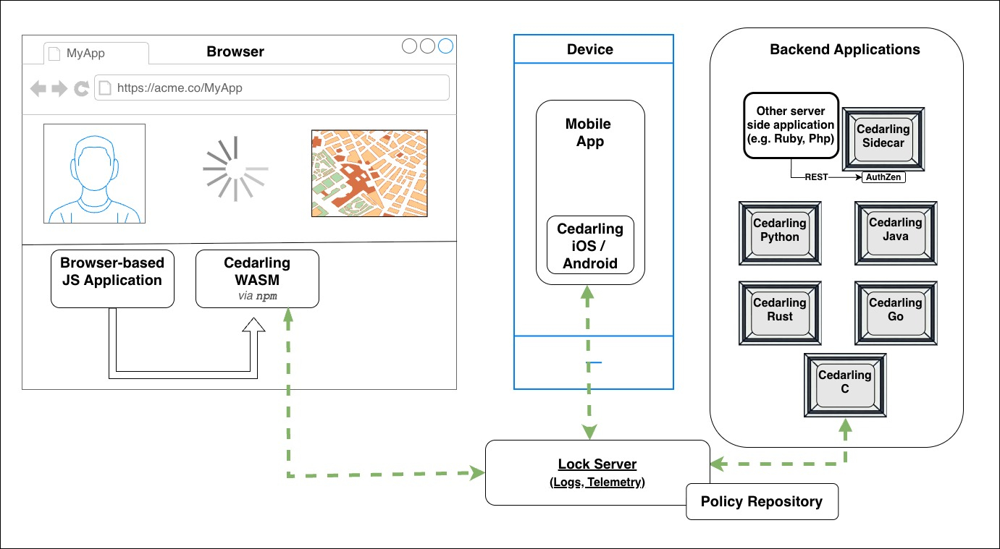
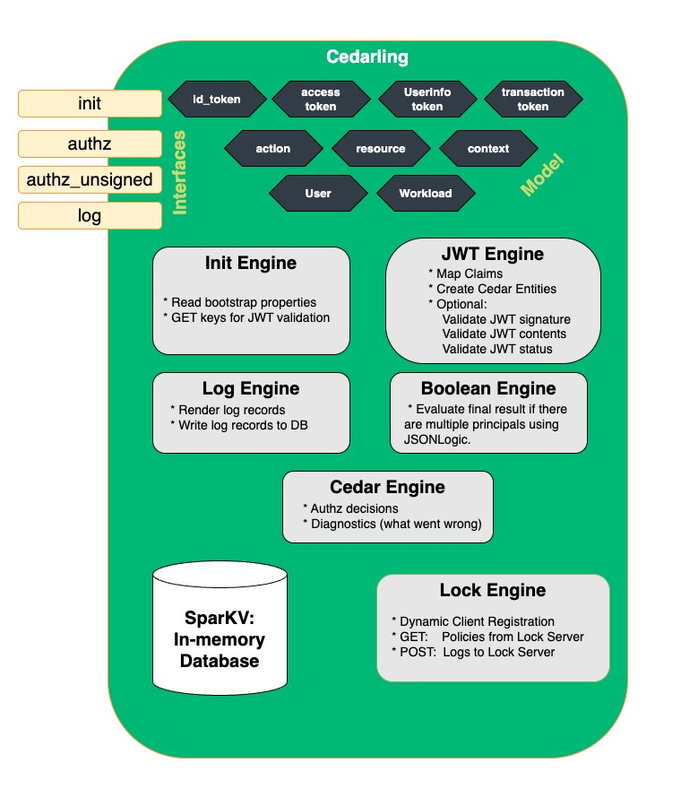
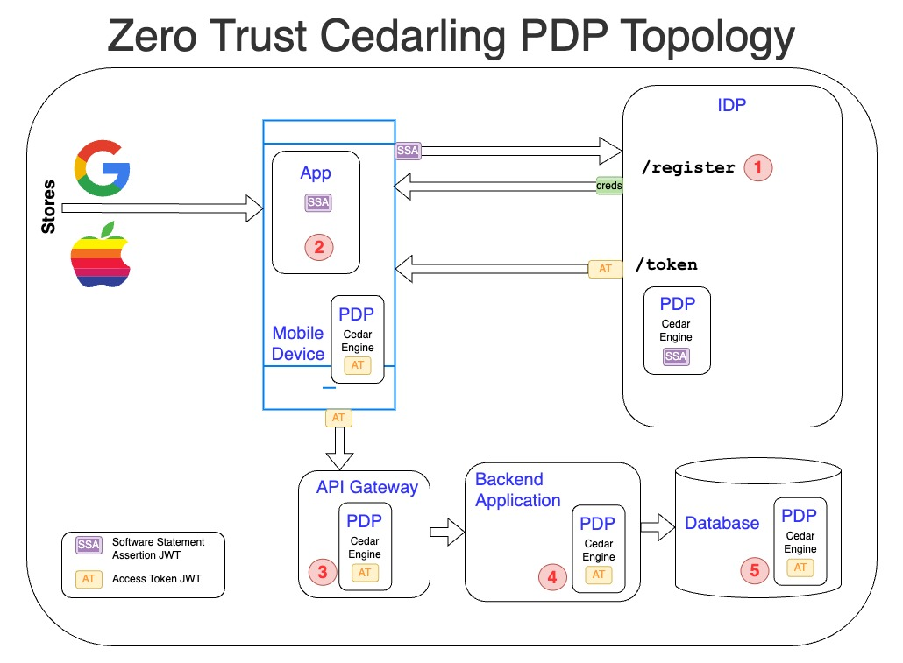

---
tags:
 - administration
 - lock
 - authorization / authz
 - Cedar
 - Cedarling
---

# An Overview of The Cedarling

The Cedarling, powered by the Rust Cedar engine, provides a fast, embeddable, and
self-contained solution for policy-based authorization, designed for both client-side and
server-side enforcement. This makes it particularly well-suited for latency-sensitive
environments like databases, browser-based applications, mobile apps, API gateways, and
embedded devices. At less than 2M in size, it's small enough to load into your browser or
mobile application. When embedded, the Cedarling avoids slow cloud policy decisions,
enabling sub-millisecond performance. The Cedarling never fetches data to make a
decision--this is a performance killer and would make the PDP unreliable. Much of the
data needed for Cedarling authorization decisions is contained in the tokens (e.g. JWTs).
It's also possible to push data into the Cedarling for additional context.

The Cedarling can be:

* Embedded in browsers using the WASM npm package
* Embedded in mobile apps using the iOS or Android SDKs
* Integrated into backend services using the Java, Go, Rust, Python, or C SDKs
* Deployed as a sidecar
* Deployed as a centralized cloud PDP service

The Cedarling is not merely a library--it is an embeddable Policy Decision Point (PDP),
which includes an in-memory cache to enable efficient logging. It connects to a Policy
Repository to obtain its policies. Enterprises may also want to connect the Cedarling to a
Janssen Lock Server to centralize collection of decision logs--a record of allowed or denied
access to a capability. Lock Server can enable enterprises to perform threat detection and
stream the logs to a SIEM or ITDR.

The Cedarling supports JWT validation and claims mapping. Validation includes checking the
signature against a list of trusted issuers, validating the contents of the token (e.g.
check the `exp` and `nbf`), and checking if the JWT is active or revoked via the
[OAuth Status List](https://www.ietf.org/archive/id/draft-ietf-oauth-status-list-19.html)
specification. Claims mapping provides a mechanism to map data from the JWT payload to Cedar
entities, making the data available for policy evaluation.

!!! tip "About Cedar"

    [Cedar](https://www.cedarpolicy.com/en) is a policy syntax invented by Amazon and used by 
    its [Verified Permission](https://aws.amazon.com/verified-permissions/) service. Cedar 
    policies enable developers to implement fine-grain access control and externalize 
    policies. Cedar is a CNCF candidate project. To learn more about why the design of Cedar 
    is **intuitive**, **fast** and **safe**, check out this [article](https://aws.amazon.com/blogs/security/how-we-designed-cedar-to-be-intuitive-to-use-fast-and-safe/) 
    or watch this [video](https://www.youtube.com/watch?v=k6pPcnLuOXY&t=1779s)

    If you're wondering how Cedar compares to Rego or OpenFGA, read this 
    [white paper](https://arxiv.org/pdf/2403.04651).

    These Cedarling docs assume you have a basic understanding of Cedar policy syntax and 
    language features.

On initialization, the Cedarling loads a "policy store" -- a set of policies, a schema,
and a list of trusted token issuers. Policy stores are application-specific, meaning each
store does **not** contain all policies and schema for all applications in your domain.
Each policy store has unique policies and a schema needed only for one specific
application.

### Cedarling Interfaces

At a high level, developers interact with the Cedarling using five core interfaces:

* **Initialization** (`init`) – Loads the policy store and retrieves configuration settings.
* **Authorization** (`authorize_unsigned`) – Evaluates policies with an application-asserted principal.
* **Multi-Issuer Authorization** (`authorize_multi_issuer`) – Evaluates policies based on JWT tokens from one or more issuers.
* **Context Data API** (`data`) – Pushes external data into the evaluation context, making it available in Cedar policies through the `context.data` namespace.
* **Logging** (`log`) – Retrieves decision and system logs for auditing. 

Developers call the `init` interface on startup of their application, causing the
Cedarling to read its [bootstrap properties](./reference/cedarling-properties.md) and load its
[policy store](./reference/cedarling-policy-store.md). If configured for JWT validation, the Cedarling
will fetch the most recent issuer public keys and metadata.

The `authorize_unsigned` method is used when the application asserts the principal identity directly. This is useful when JWTs have already been validated by the application, or when working with non-token based principals. It answers the question: "Is this action, on this resource, given this context, allowed for this principal?" The Cedarling returns the decision--*allow* or *deny*. If denied, the Cedarling returns "diagnostics"--additional context to clarify why the decision was not allowed.

The `authorize_multi_issuer` method is designed for JWT-based authorization. Applications provide one or more JWT tokens, and the Cedarling validates each token, converts them to Cedar entities, and evaluates policies based on the token entities. This approach is useful for federation scenarios, API gateways handling tokens from multiple identity providers, or applications where authorization depends on capabilities asserted by different issuers. Policies can reference individual tokens using predictable naming conventions like `context.tokens.acme_access_token` or `context.tokens.google_id_token`.

The `data` interface enables developers to push external data into the Cedarling's evaluation context. This data is automatically injected under the `context.data` namespace during policy evaluation, allowing policies to make decisions based on dynamically pushed data. Data can be stored with optional TTL (Time To Live) for automatic expiration. See the Cedarling [interfaces](./reference/cedarling-interfaces.md#context-data-api) documentation for more information.

The `log` interface enables developers to retrieve decision and system logs from the Cedarling's
in-memory cache. See the Cedarling [log](./reference/cedarling-logs.md) documentation for more information.

### Cedarling Components

The following diagram is a high-level picture of the Cedarling components:

* **Cedar Engine** a recent release of the Rust Cedar Engine, thanks to Amazon.
* **SparKV** is an in-memory key-value store that supports automatic expiration of data.
* **Interfaces** perform actions described above
* **JWT Engine** is used to validate JWT signatures, JWT content (e.g., `exp`), and to 
  check if the JWT token is revoked (using the Status List JWT) 
* **Lock Engine** is used for enterprise deployments to load the Policy Store from a 
  trusted source and send logs for central storage. 

## Proof-based authorization: Token-Based Access Control (TBAC)

TBAC helps developers implement security based on JWTs from trusted issuers like identity
providers, hardware platforms, and federations.

The Cedarling `authorize_multi_issuer` interface allows the developer to pass not one
token, but several tokens--even if they are signed by different issuers. This enables
the developer to assert not only the human identity, for example an `id_token`, but
other tokens like access tokens or transaction tokens, or whatever new kind of tokens
may next evolve. The Cedarling answers this question: *"Given this bundle of tokens, is this action on this resource allowed in this context?"*
Or you could say more simply, *"Does this bundle of tokens authorize this capability?"*

## Cedarling and Zero Trust

Zero Trust is a modern security model that assumes no implicit trust—every request must be
explicitly authorized based on policies, identity, and context. The Cedarling enables
end-to-end Zero Trust enforcement by embedding fine-grained authorization across the
entire security stack, from client devices to backend services and databases.

### End-to-End Authorization Enforcement

The Cedarling can be deployed **at every layer** to ensure that access decisions are
consistently enforced. The diagram below illustrates how the Cedarling operates in a
hypothetical mobile application architecture:

1. **Identity Provider (IDP) Enforcement**  
  - The IDP can use the Cedarling to determine if a mobile application should be allowed 
    to register.  
  - Example: An IDP policy might restrict registration to applications that present a 
    valid Software Statement Assertion (SSA) or Google Play Integrity Attestation.

2. **Client-Side Authorization in Mobile and Web Apps**  
  - A mobile application can embed the Cedarling to enforce real-time access control 
    before exposing UI components or calling APIs.  
  - Example: A finance app may check if a user's token has elevated risk signals (e.g., 
    logging in from a new device) before enabling high-risk transactions.

3. **API Gateway Enforcement**  
  - API gateways can use the Cedarling to validate JWT claims and scope permissions 
    before forwarding requests to backend services.  
  - Example: A gateway might block API requests missing a valid `admin` scope or ensure 
    an OAuth token is not revoked.

4. **Backend Service Authorization**  
  - The backend server can re-evaluate authorization decisions, ensuring end-to-end 
    security rather than trusting the API gateway or mobile app.  
  - Example: Even if a request passes through an API gateway, the backend can recheck 
    authorization policies to prevent privilege escalation.

5. **Database-Level Policy Enforcement**  
  - The Cedarling can be embedded within databases to filter data at query time, 
    ensuring only authorized records are returned.  
  - Example: A multi-tenant SaaS application may enforce row-level security, so a user 
    can only access their own organization's data.

### Why Zero Trust Needs Cedarlings

Traditional access control models assume network perimeters are secure, leading to
excessive trust in internal components. The Cedarling aligns with Zero Trust by:

- Eliminating implicit trust—each authorization decision is enforced based on real-time 
  policies.
- Improving re-usability of policies across applications to enable multi-layer security
- Ensuring consistent policies—from client devices to backend services and databases, 
  enforcing the same security rules everywhere.

### Cedarling and Threat Detection

Beyond enforcing policies, the Cedarling plays a role in intrusion detection by logging
every decision. These logs can be analyzed in a SIEM (Security Information and Event
Management) system to detect:
- Unusual access patterns (e.g., a user requesting sensitive data from an unrecognized
  location).
- Token misuse (e.g., an expired JWT being replayed).
- Privilege escalation attempts (e.g., a non-admin trying to access admin-only APIs).

### Zero Trust Conclusion

By embedding the Cedarling across multiple layers of the application stack, organizations
can enforce Zero Trust security, reduce unauthorized access, and gain visibility into
access patterns. Whether it's protecting frontend applications, securing API gateways, or
enforcing access policies at the database level, the Cedarling ensures every request is
explicitly authorized everywhere.

!!! tip "Why is it "The Cedarling""

    In every system where it runs, the Cedarling becomes the guardian of policy, the 
    gatekeeper of decisions. It’s lightweight, fast, and embedded close to the action—
    evaluating access at the speed of the web. Like the kernel, the compiler, or the 
    firewall, it earns the definite article because it does something definite. It stands in 
    your stack, quiet but crucial, deciding who gets through. The Cedarling isn’t a library. 
    It’s a presence.
