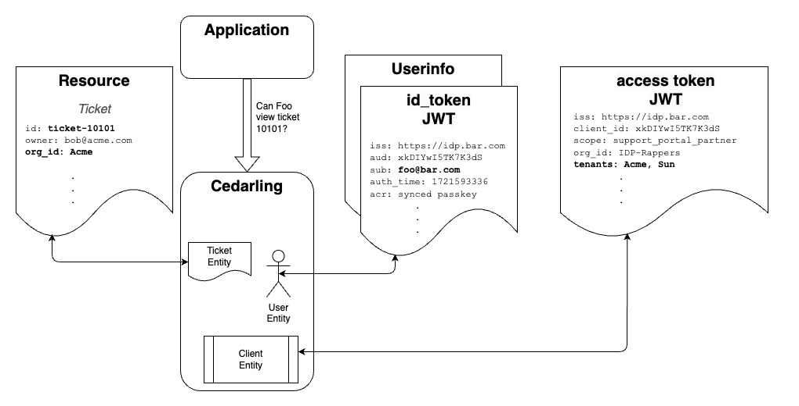

---
tags:
  - administration
  - lock
  - authorization / authz
  - Cedar
  - Cedarling
---

# Authorization Using Cedarling

The __Policy Store__ contains the Cedar Policies, Cedar Schema, and optionally, a list of the
Trusted IDPs. The Cedarling loads its Policy Store during initialization as a static JSON file
or fetched via HTTPS. In enterprise deployments, the Cedarling can retrieve its Policy Store from
a Jans Lock Server OAuth protected endpoint.

Developers need to define Cedar Schema that makes sense for their application. For example, a
developer writing a customer support application might define an "Issue" Resource and Actions like
"Reply" or "Close". Once the schema is defined, developers can author policies to model the fine
grain access controls needed to implement the business rules of their application. The easiest way
to define schema and policies is to use the [AgamaLab](https://cloud.gluu.org/agama-lab) Policy
Designer. This is a free developer tool hosted by [Gluu](https://gluu.org).



The JWTs, Resource, Action, and Context are sent in the authz request. Cedar Pricipals entities
are derived from JWT tokens. The OpenID Connect ("OIDC") JWTs are joined by the Cedarling to create
User and Role entities; the OAuth access token is used to create a Workload entity, which is the
software that is acting on behalf of the Person (or autonomously). The Cedarling validates that
given its policies, Role, Person and Workload are authorized. If one of Role or Person and Workload is authorized then the request is allowed to proceed.

The Cedarling maps "Roles" out-of-the-box. In Cedar, Roles are a special kind of Principal. Instead
of saying "User can perform action", we can say "Role can perform action"--a convenient way to
implement RBAC. Developers can specify which JWT claim is used to map Cedar Roles. For example, one
domain may use the `role` user claim of the OpenID Userinfo token; another domain may use the
`memberOf` claim in the OIDC id_token.

Developers can also express a variety of policies beyond the limitations of RBAC by expressing ABAC
conditions, or combining ABAC and RBAC conditions. For example, a policy like Admins can access a
"private" Resource from the private network, during business hours. In this case "Admins" is the role,
but the other conditions are ABAC. Policy evaluation is fast because Cedar uses the RBAC role to
"slice" the data, minimizing the number of entries on which to evaluate the ABAC conditions.

The OIDC `id_token` JWT represents a Person authentication event. The access token JWT represents a
Workload authentication event. These tokens contain other interesting contextual data. The `id_token`
tells you who authenticated, when they authenticated, how they authenticatated, and optionally other
claims like the User's roles. An OAuth access token can tell you information about the Workload that
obtained the JWT, its extent of access as defined by the OAuth Authorization Server (*i.e.* the
values of the `scope` claim), or other claims--domains frequently enhance the access token to
contain business specific data needed for policy evaluation.

The Cedarling authorizes a Person using a certain piece of software, which is called a "Workload".
From a logical perspective, (`person_allowed` AND `workload_allowed`) must be `True`. The JWT's,
Action, Resource and Context is sent by the application in the authorization request. For example,
this is a sample request from a hypothetical application:

```js
const bootstrap_config = {...};
const cedarling = await init(bootstrap_config);
let input = { 
  "tokens": {
    "access_token": "eyJhbGc....", 
    "id_token": "eyJjbGc...", 
    "userinfo_token": "eyJjbGc...",
  },
  "action": "View",
  "resource": {
    "id": "ticket-10101",
    "type" : "Ticket",
    "owner": "bob@acme.com", 
    "org_id": "Acme"
  },
  "context": {
    "ip_address": "54.9.21.201",
    "network_type": "VPN",
    "user_agent": "Chrome 125.0.6422.77 (Official Build) (arm64)",
    "time": "1719266610.98636",
  }
}

decision_result = await cedarling(input)
```

## Automatically Adding Entity References to the Context

Cedarling simplifies context creation by automatically including certain entities. This means you don't need to manually pass their references when using them in your policies. The following entities are automatically added to the context.

- Workload Entity
- User Entity
- Resource Entity
- Access Token Entity
- ID Token Entity
- Userinfo Token Entity

### Example Policy

Below is an example policy schema that illustrates how entities are used:  

```cedarschema
type Context = {
  "access_token": Access_token, 
  "time": Long, 
  "user": User, 
  "workload": Workload
};

type Url = {
  "host": String, 
  "path": String, 
  "protocol": String
};

entity Access_token = {
  "exp": Long, 
  "iss": TrustedIssuer
};

entity Issue = {
  "country": String, 
  "org_id": String
};

entity Role;

entity TrustedIssuer = {
  "issuer_entity_id": Url
};

entity User in [Role] = {
  "country": String, 
  "email": String, 
  "sub": String, 
  "username": String
};

entity Workload = {
  "client_id": String, 
  "iss": TrustedIssuer, 
  "name": String, 
  "org_id": String
};

action "Update" appliesTo {
  principal: [Role, Workload, User],
  resource: [Issue],
  context: {
    "access_token": Access_token, 
    "time": Long, 
    "user": User, 
    "workload": Workload
  }
};

action "View" appliesTo {
  principal: [Role, Workload, User],
  resource: [Issue],
  context: Context
};
```

With this schema, you only need to provide the fields that are not automatically included. For instance, to define the `time` in the context:

```js
let context = {
  "time": 1719266610.98636,
}
```
