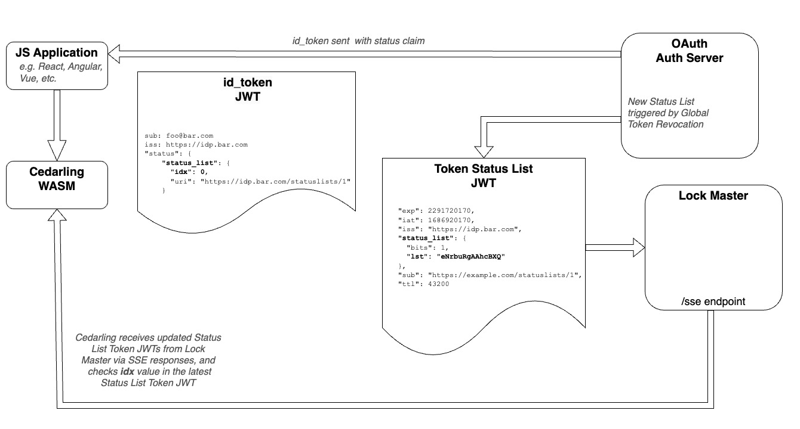

---
tags:
  - administration
  - lock
  - authorization / authz
  - Cedar
  - Cedarling
  - JWT
---

# Cedarling JWT Flow

## Json Web Token Validation

**Note:** Make sure you have specified at least one [Trusted Issuer](./cedarling-policy-store.md#trusted-issuer-schema) in your [Policy Store](./cedarling-policy-store.md).

###  JWT Signature Validation

To enable this feature, set the `CEDARLING_JWT_VALIDATION` bootstrap property to `True`. For development and testing purposes, you can set this property to `False` and submit an unsigned JWT, such as one generated from [JWT.io](https://jwt.io). On init, the Cedarling will fetch the latest public 
keys from the issuers specified in the Policy Store and cache them. The cedarling uses the JWT `iss` claim to select the appropriate keys for validation.

### JWT Content Validation

If timestamps are provided in the context, the Cedaring always verifies: 

- `exp` (expiration)
- `nbf` (not before)

If the Cedarling property `CEDARLING_ID_TOKEN_TRUST_MODE` is `Strict`, the Cedarling will:

- Discard `id_token` if the `aud` claim does not match the `client_id` of the access token
- Discard Userinfo tokens that are not associated with a `sub` claim from the `Id_token`

### JWT Status Validation

The Cedarling can also check for JWT revocation if you have the `CEDARLING_JWT_STATUS_VALIDATION` property `Enabled`. The Cedarling checks the status bit of the Status Token JWT, as described in the [OAuth Status Lists](https://datatracker.ietf.org/doc/draft-ietf-oauth-status-list/) draft. Token status enforcement mitigates account takeover by enabling immediate revocation of all tokens issued to an attacker. 
