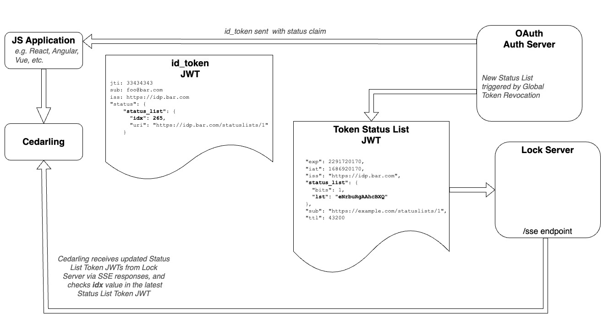

---
tags:
  - administration
  - lock
  - authorization / authz
  - Cedar
  - Cedarling
  - JWT
---

# Cedarling JWT Flow

JWTs (JSON Web Tokens) contain authorization information that is used by the Cedarling to construct the Principal entities. In order to verify the authenticity of this information, the Cedarling can verify the integrity of the JWT by validating its signature and status(active, expired, or revoked). It does so by fetching the public keyset and the list of active tokens from the issuer of the JWT.



## Json Web Token Validation

**Note:** Make sure you have specified at least one [Trusted Issuer](./cedarling-policy-store.md#trusted-issuer-schema) in your [Policy Store](./cedarling-policy-store.md).

###  JWT Signature Validation

To enable this feature, set the `CEDARLING_JWT_VALIDATION` bootstrap property to `True`. For development and testing purposes, you can set this property to `False` and submit an unsigned JWT, such as one generated from [jwt.io](https://jwt.io). On initialization, the Cedarling will fetch the latest public 
keys from the issuers specified in the Policy Store and cache them. The cedarling uses the JWT `iss` claim to select the appropriate keys for validation.

### JWT Content Validation

If timestamps are provided in the context, the Cedaring always verifies: 

- `exp` (expiration)
- `nbf` (not before)

If the Cedarling property `CEDARLING_ID_TOKEN_TRUST_MODE` is `Strict`, the Cedarling will:

- Discard `id_token` if the `aud` claim does not match the `client_id` of the access token
- Discard Userinfo tokens that are not associated with a `sub` claim from the `id_token`

### JWT Status Validation

The Cedarling can also check for JWT revocation if you have the `CEDARLING_JWT_STATUS_VALIDATION` property `Enabled`. The Cedarling checks the status bit of the Status Token JWT, as described in the [OAuth Status Lists](https://datatracker.ietf.org/doc/draft-ietf-oauth-status-list/) draft. Token status enforcement mitigates account takeover by enabling immediate revocation of all tokens issued to an attacker. 

## ID Token Trust Mode

The level of validation for the ID Token JWT can be set to either `None` or `Strict`.

### `None` Mode

Setting the validation level to `None` will not check for the conditions outlined in [Strict Mode](#strict-mode).

### `Strict` Mode

Strict mode requires:

1. The `id_token`'s `aud` matches the `access_token`'s `client_id`;
2. if a Userinfo token is present, the `sub` matches the `id_token`, and that the `aud` matches the access token's `client_id`.

## Local JWKS

A local JWKS can be used by setting the `CEDARLING_LOCAL_JWKS` bootstrap property to a path to a local JSON file. When providing a local Json Web Key Store (JWKS), the file must follow the following schema:

```json
{
    "trusted_issuer_id": [ ... ]
    "another_trusted_issuer_id": [ ... ]
}
```

* Where keys are `Trusted Issuer IDs` assigned to each key store
* and the values contains the JSON Web Keys as defined in [RFC 7517](https://datatracker.ietf.org/doc/html/rfc7517).
* The `trusted_issuers_id` is used to tag a JWKS with a unique identifier and enables using multiple key stores.
