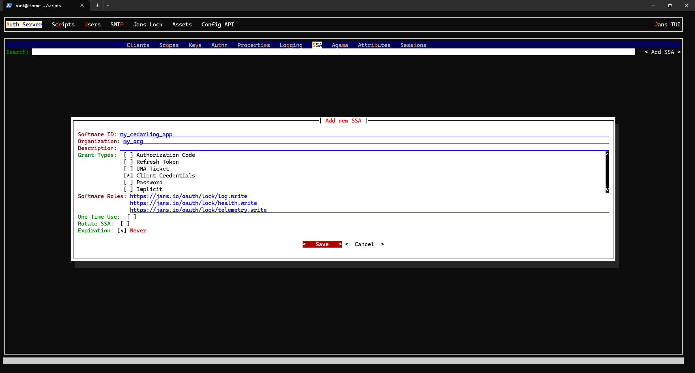

---
tags:
  - cedarling
  - lock server
---

# Cedarling Lock Integration Setup Guide

For a Cedarling client to communicate with the Lock Server, it has to perform [Dynamic Client Registration **(DCR)**](https://datatracker.ietf.org/doc/html/rfc7591) with the Jans Auth Server.

By default, clients cannot obtain the necessary scopes to interact with the lock server. Additional configuration is required on both the Auth Server and the client. 

This guide will walk you through the following setup processes:

- [Auth Server Setup](#auth-server-setup)
- [Client Setup](#client-setup)

---

## Auth Server Setup

### 1. Creating an SSA JWT

First, create a Software Statement Assertion (SSA) for your Cedarling client.

The easiest way to do this is to use the Jans TUI:

```sh
jans tui
```

Navigate to:
    `Auth Server` > `SSA` > `Add SSA`



When creating the SSA, ensure you:

- Add the `Client Credentials` grant type
- Include the following software roles:
    - `https://jans.io/oauth/lock/log.write`
    - `https://jans.io/oauth/lock/health.write`
    - `https://jans.io/oauth/lock/telemetry.write`

After creation, **export the SSA token** and save it securely.

### 2. Setting up the Interception Script

Next, configure an [*interception script*](../janssen-server/developer/interception-scripts.md) to automatically add the required scopes when a Cedarling client registers.

In your server, create a script file at `/opt/jans/jetty/jans-auth/custom/script/add_cedarling_scopes.py` with the following content:

```py
from io.jans.model.custom.script.type.client import ClientRegistrationType
from io.jans.service.cdi.util import CdiUtil
from io.jans.orm.util import ArrayHelper
from io.jans.as.server.service import ScopeService
from io.jans.as.model.util import JwtUtil

class ClientRegistration(ClientRegistrationType):
    def __init__(self, currentTimeMillis):
        self.currentTimeMillis = currentTimeMillis

    def init(self, customScript, configurationAttributes):
        print "Cedarling Client registration. Initialization"
        
        if (not configurationAttributes.containsKey("jwks_uri")):
            print "Cedarling Client registration. Initialization failed. Property jwks_uri is not specified"
            return False
        else:
            self.jwks_uri = configurationAttributes.get("jwks_uri").getValue2()

        if (not configurationAttributes.containsKey("scope_list")):
            print "Cedarling Client registration. Initialization failed. Property scope_list is not specified"
            return False
        else:
            self.scope_list = configurationAttributes.get("scope_list").getValue2().split(" ")

        if (not configurationAttributes.containsKey("trigger_scope")):
            print "Cedarling Client registration. Initialization failed. Property trigger_scope is not specified"
            return False
        else:
            self.trigger_scope = configurationAttributes.get("trigger_scope").getValue2()
        
        # used to check if the scopes we're adding exists in the AS
        self.scopeService = CdiUtil.bean(ScopeService)

        print "Cedarling Client registration. Initialized successfully"
        return True   

    def destroy(self, configurationAttributes):
        print "Cedarling Client registration. Destroy"
        print "Cedarling Client registration. Destroyed successfully"
        return True   

    def createClient(self, context):
        print "Cedarling Client registration. createClient"

        # Check if the request has an SSA
        registerRequest = context.getRegisterRequest()
        ssa = registerRequest.getSoftwareStatement()
        if ssa == "":
            print "Cedarling Client registration. No SSA provided, defaulting"
            return True

        # Check if the request has a trigger_scope (this is set as 'cedarling' by default) in the request.
        # The trigger_scope is used to determine if we should add the scopes needed by Cedarling to the
        # registering client.
        # request_scopes = ArrayHelper.toString(registerRequest.getScope())
        request_scopes = registerRequest.getScope()
        if self.trigger_scope not in request_scopes:
            print "Cedarling Client registration. the scope '%s' was not included in the request, defaulting" % self.trigger_scope
            return True

        # add cedarling scopes
        client = context.getClient()
        scopes = client.getScopes()
        for scope in self.scope_list:
            foundScope = self.scopeService.getScopeById(scope)
            if foundScope is None:
                print "did not find scope '%s' in the AS" % scope
                return False
            if len(scopes) == 0:
                scopes = [foundScope.getDn()]
            else:
                scopes = ArrayHelper.addItemToStringArray(scopes, foundScope.getDn())

        client.setScopes(scopes)

        print "Cedarling Client registration. added Cedarling scopes"
        return True

    def updateClient(self, context):
        print "Cedarling Client registration. UpdateClient method"
        pass

    def getApiVersion(self):
        return 11

    def getSoftwareStatementHmacSecret(self, context):
        return ""

    def getSoftwareStatementJwks(self, context):
        print "SSA Cedarling Client registration. getting jwks from '%s'" %  self.jwks_uri
        jwks = JwtUtil.getJSONWebKeys(self.jwks_uri)
        if jwks is None:
            print "SSA Cedarling Client registration. jwks not found"
        return jwks.toString()

    def modifyPutResponse(self, responseAsJsonObject, executionContext):
        return False

    def modifyReadResponse(self, responseAsJsonObject, executionContext):
        return False

    def modifyPostResponse(self, responseAsJsonObject, executionContext):
        return False
```

* *you can also find a copy of this script in [jans/jans-cedarling/lock-server-script/add_cedarling_scopes.py](../../jans-cedarling/lock-server-script/add_cedarling_scopes.py)*.

Next, create a JSON file named `script_schema.json` with the following content: 

```json
{
  "name": "add_cedarling_scopes",
  "aliases": null,
  "description": "A DCR script that adds the required scopes by a client to interact with the lock server",
  "scriptType": "client_registration",
  "programmingLanguage": "python",
  "moduleProperties": [],
  "configurationProperties": [
	{
		"value1": "jwks_uri",
		"value2": "https://demoexample.jans.io/jans-auth/restv1/jwks",
		"hide": false,
		"description": "JWKS URI used for the SSA validation"
	},
	{
		"value1": "scope_list",
		"value2": "https://jans.io/oauth/lock/log.write https://jans.io/oauth/lock/health.write https://jans.io/oauth/lock/telemetry.write",
		"hide": false,
		"description": "space-separated scopes that will be added by the script"
	},
	{
		"value1": "trigger_scope",
		"value2": "cedarling",
		"hide": false,
		"description": "the scope that must be present for the script to run"
	}
  ],
  "level": 100,
  "revision": 0,
  "enabled": true,
  "scriptError": null,
  "modified": false,
  "internal": false,
  "locationType": "file",
  "locationPath": "add_cedarling_scopes.py"
}
```

* *you can also find a copy of this schema in [jans/jans-cedarling/lock-server-script/script_schema.json](../../jans-cedarling/lock-server-script/script_schema.json)*.

> Note:
>
> Do not change the field ordering; The Jans server expects a specific structure.

Finally, register the script with the Auth Server:

```sh
jans cli --operation-id post-config-scripts --data ./script_schema.json
```

### 3. Testing the Setup

You can verify the setup by initializing a client registration with your SSA:

```sh
curl -kX POST https://demoexample.jans.io/jans-auth/restv1/register \
  -H "Content-Type: application/json" \
  -d '{
    "token_endpoint_auth_method": "client_secret_basic",
    "grant_types": ["client_credentials"],
    "client_name": "cedarling-test",
    "access_token_as_jwt": true,
    "scope": "cedarling",
    "software_statement": "<YOUR_SSA_HERE>"
}'
```

A successful response will contain the following scopes:

```json
{
  "scope": "https://jans.io/oauth/lock/log.write https://jans.io/oauth/lock/health.write https://jans.io/oauth/lock/telemetry.write"
}
```

> Note:
>
> If you want to learn more about configuring the example interception script, see the [reference](../janssen-server/developer/interception-scripts.md).

---

## Client Setup

To enable Lock Server integration in the Cedarling client, configure the appropriate [bootstrap properties](./cedarling-properties.md).

Here's a table of the available properties:

| Property | Description | Allowed Values | Default |
| --- | --- | --- | --- |
| `CEDARLING_LOCK` | Toggles the all the Lock Server integration features. | `enabled`, `disabled` | `disabled` |
| `CEDARLING_LOCK_SERVER_CONFIGURATION_URI` | URI to fetch Lock Server metadata (`.well-known/lock-master-configuration`). Required if `CEDARLING_LOCK` is `enabled`. | String | `""` |
| `CEDARLING_LOCK_DYNAMIC_CONFIGURATION` (WIP) | Toggles listening for Server-Sent Events (SSE) config updates. | `enabled`, `disabled` | `disabled` |
| `CEDARLING_LOCK_SSA_JWT` | SSA JWT used for DCR. This is required if you followed the [auth server setup](#auth-server-setup). | String | `""` |
| `CEDARLING_LOCK_LOG_INTERVAL` | Frequency (in seconds) of sending log messages to the Lock Server. `0` disables transmission. | uint | `0` |
| `CEDARLING_LOCK_HEALTH_INTERVAL` (WIP) | Frequency (in seconds) of sending health messages to the Lock Server. `0` disables transmission. | uint | `0` |
| `CEDARLING_LOCK_TELEMETRY_INTERVAL` (WIP) | Frequency (in seconds) of sending telemetry messages to the Lock Server. `0` disables transmission. | uint | `0` |
| `CEDARLING_LOCK_LISTEN_SSE` (WIP) | Toggles listening for updates from the Lock Server via SSE. | `enabled`, `disabled` | `disabled` |
| `CEDARLING_LOCK_ACCEPT_INVALID_CERTS` | Allows connection to servers with invalid certificates (for testing purposes only; not available for WASM builds).| `enabled`, `disabled` | `disabled` |
