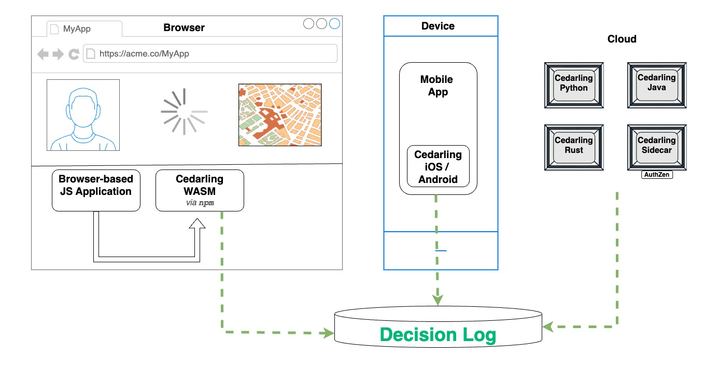
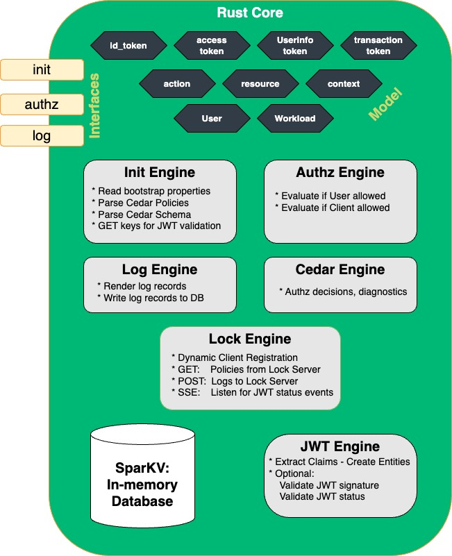
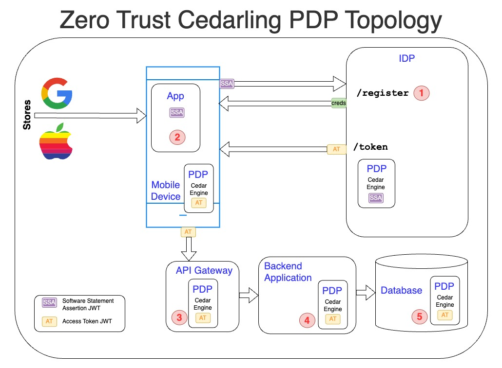

---
tags:
  - administration
  - lock
  - authorization / authz
  - Cedar
  - Cedarling
---

# Cedarling Overview

Modern applications require fine-grained access control, but traditional approaches relying on 
centralized authorization services introduce latency, availability concerns, and operational 
complexity. The Cedarling provides a fast, embeddable, and self-contained solution for policy-based 
authorization, designed for both client-side and server-side enforcement. This makes it 
particularly well-suited for latency-sensitive environments like mobile apps, API gateways, and 
embedded devices. Cedarling is designed for maximum deployment flexibility:

* Embedded in browsers or mobile apps for client-side authorization
* Integrated into backend services using Java or Python SDKs
* Deployed as a sidecar or serverless function in cloud-native environments
* Used within databases and API gateways to enforce fine-grained authorization at multiple layers

The Cedarling is an embeddable Policy Decision Point (PDP), which includes an in-memory cache 
for performance optimization, enabling low-latency access control and efficient logging. The 
Cedarling is built on the Rust Cedar engine, but unlike the standalone Cedar engine, it is a 
full-featured PDP that includes logging, JWT validation, and claims mapping, making it 
more adaptable for real-world applications. It also has optional features to connect 
to enterprise plumbing.

!!! tip "About Cedar"

      [Cedar](https://www.cedarpolicy.com/en) is a policy syntax invented by Amazon and used by their 
      [Verified Permission](https://aws.amazon.com/verified-permissions/) service. Cedar policies
      enable developers to implement fine-grain access control and externalize policies. To learn more
      about why the design of Cedar is **intuitive**, **fast** and **safe**, read this 
      [article](https://aws.amazon.com/blogs/security/how-we-designed-cedar-to-be-intuitive-to-use-fast-and-safe/) 
      or watch this [video](https://www.youtube.com/watch?v=k6pPcnLuOXY&t=1779s)

      These Cedarling docs assume you have a basic understanding of Cedar policy syntax and language features.

The Cedarling is written in Rust with bindings to WASM, iOS, Android, Python and Java. 
This means that web, mobile, and cloud developers can use the Cedarling  to load a 
"policy store"--a set of policies, a schema, and a list of trusted token issuers. 
Policy stores are application specific, meaning each store 
does **not** contain all policies and schema for all applications in your domain. Each policy 
store has the unique policies and schema needed only for one specific application.

The Cedarling is useful for both frontend and backend security. At less then 2M in size, 
it's small enough to load into your browser or mobile application. Backend
applications can use the sidecar via a REST API, deploy the Cedarling in the cloud as a 
serverless component (e.g. cloud WASM), or integrate directly via the Java or Python SDKs. 

The Cedarling is optimized for speed, typically returning authorization decisions in sub-millisecond time. By 
keeping all necessary data locally available, it avoids costly cloud round-trips, ensuring predictable performance.

## Token Based Access Control (TBAC)

Cedarling evaluates authorization requests based on Token-Based Access Control (TBAC), 
answering the question: _"Given this bundle of tokens, is this action on this resource allowed 
in this context?"_ TBAC helps developers implement security based on JWTs from trusted issuers 
like identity providers, hardware platforms, and federations. 

Who is the principal in a TBAC request? A TBAC authorization request may pertain to multiple 
principals, derived from the JWT tokens. For example, let's say a person uses a mobile application 
to request data from a service provider. In this case, there are two principals: the person and 
the mobile application--both of which have unique identities. A business may prevent access to 
content from a mobile application, although allow it for the same User from the company's website.

Don't forget about the "Workload" identity--the software acting on behalf of the "User". Humans don't 
speak tcp/ip! People need digital intermediaries, which need increasing amounts of agency.

### Cedarling Interfaces

Developers interact with Cedarling using three core interfaces:

* **Initialization** (`init`) – Loads the policy store and retrieves configuration settings.
* **Authorization** (`authz`) – Evaluates policies and JWTs to determine access.
* **Logging** (`log`) – Retrieves decision and system logs for auditing. 

Developers call the `init` interface on startup of their application, causing the Cedarling to read
its [bootstrap properties](./cedarling-properties.md) and load its [policy store](./cedarling-policy-store.md).
If configured for JWT validation, the Cedarling will fetch the most recent IDP public keys and status 
list JWT.

The `authz` interface provides the main functionality of the Cedarling: to authorize a request from the 
application by mapping the data and JWTs sent in the request, and evaluating it against the policies using 
the [Rust Cedar Engine](https://github.com/cedar-policy/cedar). 

The authz interface has two variants:

1. `authorize` - Check signature of JWT tokens before making authorization decisions
2. `authorize_unsigned` - Makes authorization decisions by passing a set of principals directly.

The standard `authorize` method answers the question: "Is this action, on this resource, given this context, 
allowed with these JWTs?". The Cedarling returns the decision--*allow* or *deny*. If denied, the 
Cedarling returns "diagnostics"--additional context to clarify why the decision was not allowed. 
During `authz`, the Cedarling can perform two more important jobs: (1) validate JWT tokens; (2) log 
the resulting decision. 

The `authorize_unsigned` variant is used when JWTs have already been validated or when working with 
non-token based principals. It follows the same evaluation logic but skips JWT validation steps.

The `log` interface enables developers to retrieve decision and system logs from the Cedarling's 
in-memory cache. See the Cedarling [log](./cedarling-logs.md) documentation for more information. 

### Cedarling Components

The following diagram is a high level picture of the Cedarling components:

* **Cedar Engine** a recent release of the Rust Cedar Engine thanks to Amazon.
* **SparKV** is an in-memory key-value store that support automatic expiration of data.
* **Init, Authz, and Log Engines** perform actions similar to those described in the interfaces 
above.
* **JWT Engine** is used to validate JWT signatures, JWT content (i.e. `exp`) and to check if the JWT token is revoked (using the Status List JWT) 
* **Lock Engine** is used for enterprise deployments to load the Policy Store from a trusted source and send to store logs for central storage. 

## Cedarling and Zero Trust

Zero Trust is a modern security model that assumes no implicit trust—every request must be explicitly authorized based on policies, identity, and context. The Cedarling enables end-to-end Zero Trust enforcement by embedding fine-grained authorization across the entire security stack, from client devices to backend services and databases.

### End-to-End Authorization Enforcement
The Cedarling can be deployed **at every layer** to ensure that access decisions are consistently enforced. The diagram below illustrates how the Cedarling operates in a hypothetical mobile application architecture:

1. **Identity Provider (IDP) Enforcement**  
  - The IDP can use the Cedarling to determine if a mobile application should be allowed to register.  
  - Example: An IDP policy might restrict registration to applications that present a valid Software Statement Assertion (SSA) or Google Play Integrity Attestation.
  
2. **Client-Side Authorization in Mobile and Web Apps**  
  - A mobile application can embed the Cedarling to enforce real-time access control before exposing UI components or calling APIs.  
  - Example: A finance app may check if a user's token has elevated risk signals (e.g., logging in from a new device) before enabling high-risk transactions.

3. **API Gateway Enforcement**  
  - API gateways can use the Cedarling to validate JWT claims and scope permissions before forwarding requests to backend services.  
  - Example: A gateway might block API requests missing a valid `admin` scope or ensure an OAuth token is not revoked.

4. **Backend Service Authorization**  
  - The backend server can re-evaluate authorization decisions, ensuring end-to-end security rather than trusting the API gateway or mobile app.  
  - Example: Even if a request passes through an API gateway, the backend can recheck authorization policies to prevent privilege escalation.

5. **Database-Level Policy Enforcement**  
  - The Cedarling can be embedded within databases to filter data at query time, ensuring only authorized records are returned.  
  - Example: A multi-tenant SaaS application may enforce row-level security so a user can only access their own organization's data.

### Why Zero Trust Needs Cedarlings
Traditional access control models assume network perimeters are secure, leading to excessive trust in internal components. The Cedarling aligns with Zero Trust by:

- Eliminating implicit trust—each authorization decision is enforced based on real-time policies.
- Improving re-usability of policies across applications to enable multi-layer security
- Ensuring consistent policies—from client devices to backend services and databases, enforcing the same security rules everywhere.

### Cedarling and Threat Detection
Beyond enforcing policies, the Cedarling plays a role in intrusion detection by logging every decision. These logs can be analyzed in a SIEM (Security Information and Event Management) system to detect:
- Unusual access patterns (e.g., a user requesting sensitive data from an unrecognized location).
- Token misuse (e.g., an expired JWT being replayed).
- Privilege escalation attempts (e.g., a non-admin trying to access admin-only APIs).

### Zero Trust Conclusion
By embedding the Cedarling across multiple layers of the application stack, organizations can enforce Zero Trust security, reduce unauthorized access, and gain visibility into access patterns. Whether it's protecting frontend applications, securing API gateways, or enforcing access policies at the database level, the Cedarling ensures every request is explicitly authorized—-verywhere.
