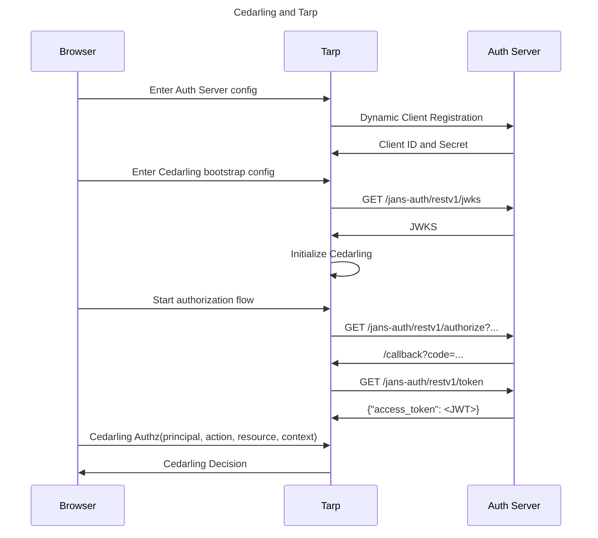

---
tags:
  - administration
  - lock
  - authorization / authz
  - Cedar
  - Cedarling
  - quick start
  - TBAC
---

# Implementing TBAC using Cedarling

This guide shows how to implement
[Token Based Access Control(TBAC)](./README.md#token-based-access-control-tbac-v-application-asserted-identity) using
the Cedarling. To do this, we need 3 things.

1. An Authorization policy
2. A request for user action
3. A running instance of the Cedarling

For `1` above, we will be using [Agama Lab policy designer](https://gluu.org/agama/authorization-policy-designer/) to quickly set up a [Cedar] policy and policy store.

For `2` and `3`, we will use [Janssen Tarp](https://github.com/JanssenProject/jans/blob/main/demos/janssen-tarp/README.md). Janssen Tarp is an easy to install browser plug-in that comes with embedded Cedarling instance (WASM). It also provides user interface to build authorization and authentication requests for testing
purpose.

## Setup

- Install the Janssen Tarp [on Chrome or Firefox](https://github.com/JanssenProject/jans/blob/main/demos/janssen-tarp/README.md#releases).

## Step-1: Create Cedar Policy and Schema

In this guide, we will use a policy that grants access to all actions and all the resources, only to the users with the `SupremeRuler` role. The policy is as follows:

```
@id("allow_supreme_ruler")
permit(
  principal in Jans::Role::"SupremeRuler",
  action,
  resource
);
```

The Cedarling needs policies and a schema to authorize access. These are bundled in a _policy store_ (a JSON file). A demo repository is provided for this quickstart which contains two policy stores. You will be modifying the `tarpDemo` store so that it uses your authorization server. When implementing TBAC, the Cedarling will validate the tokens with the IDP. To be able to this, we need to provide trusted issuer information to the Cedarling. We can do this by adding the trusted issuer information to the demo policy store.

- Go to `https://github.com/JanssenProject/CedarlingQuickstart`
- Click on `Fork`
  - Make sure the `Copy the master branch only` option is **unchecked**
- Fork the repository
- Open the [Agama Lab policy designer](https://cloud.gluu.org/agama-lab/dashboard/policy_store) and select your fork.
- Open the policy store named `tarpDemo`
- Go to `Trusted Issuer` and edit the `testIdp` entry
- Replace the OpenID configuration endpoint with the one from your IDP. This server must:
  - Allow dynamic client registration
  - Allow registered clients to request the `role` scope
  - Have a user with the `role` claim set to the value `SupremeRuler` and return this claim in the userinfo token
- Click Save
- Click on the button named `Copy Link`. You will need this link in the next section.

## Step-2: Configure Tarp with the policy store

In this step, we will add the policy store details in the Janssen Tarp that is
installed in the browser. The Cedarling instance embedded in the Tarp will
use the policy stored in this store to evaluate the authorization result.

1. Open Tarp installed in the Chrome browser
2. Click `Add Client`. Use details below to add a new client.
   - Issuer: The hostname of your IDP
   - Expiry: The day after today
   - Scopes: `openid`, `profile`, `role`
3. Click `Register`
4. Go to `Cedarling` tab and click `Add Configurations`
5. Select `JSON` configuration type and Paste the config as given below.
   Remember to replace `<Policy Store URI>` with
   the URI of your policy store:
   `json
      {
        "CEDARLING_APPLICATION_NAME": "My App",
        "CEDARLING_POLICY_STORE_URI": "<Policy Store URI>",
        "CEDARLING_LOG_TYPE": "std_out",
        "CEDARLING_LOG_LEVEL": "INFO",
        "CEDARLING_USER_AUTHZ": "enabled",
        "CEDARLING_WORKLOAD_AUTHZ": "disabled",
        "CEDARLING_PRINCIPAL_BOOLEAN_OPERATION": {
          "===": [{"var": "Jans::User"}, "ALLOW"]
        },
        "CEDARLING_JWT_SIG_VALIDATION": "enabled",
        "CEDARLING_JWT_STATUS_VALIDATION": "disabled",
        "CEDARLING_MAPPING_USER": "Jans::User",
        "CEDARLING_MAPPING_WORKLOAD": "Jans::Workload",
        "CEDARLING_JWT_SIGNATURE_ALGORITHMS_SUPPORTED": [
          "HS256", "RS256"
        ],
        "CEDARLING_ID_TOKEN_TRUST_MODE": "never"
      }
  `
6. Click `Save` to initialize Cedarling.

This will start the Cedarling in Tarp, fetch and validate your policy store, and configure Cedarling to validate requests based on the User.

## Step-3: Test the policy using the Cedarling

Since we are implementing TBAC, we have to authenticate the user first to get the tokens.

1. In Tarp, under `Authentication flow` tab, click the ⚡ icon to begin authentication
2. Input:
   - ACR: `basic`
   - Scopes: `openid`, `profile`, `role`
3. Login using a user having the `SupremeRuler` role
4. Click `Allow` on the consent screen
5. If the authentication is successful, Tarp will show you a page with token details and `Cedarling Authz Request Form` section
6. Open `Cedarling Signed Authz Form`
7. Use the details below as an input to this form:
   - Principal: select all 3 tokens
   - Action: `Jans::Action::"Read"`
   - Resource:
     ```json
     {
       "cedar_entity_mapping": {
         "entity_type": "Jans::SecretDocument",
         "id": "some_id"
       }
     }
     ```
8. Leave the `Context` blank
9. Click `Cedarling Authz Request`
   ```json title="Sample Response"
   {
     ...
     "decision": true,
     "request_id": "019602f1-c964-7dbb-8a07-5b66b642e502"
   }
   ```

The top-level `decision: true` confirms successful authorization.

## Sequence diagram


