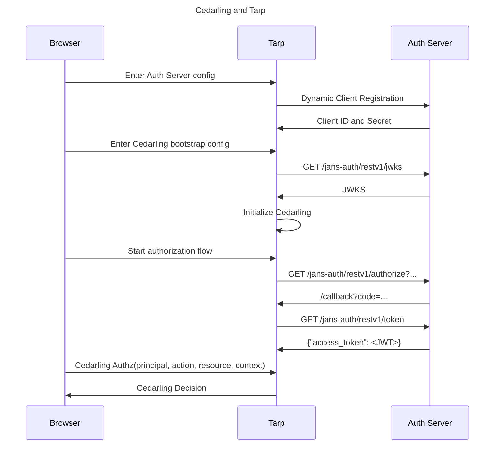

---
tags:
  - administration
  - lock
  - authorization / authz
  - Cedar
  - Cedarling
  - quick start
  - TBAC  
---

# Authorization Using The Cedarling

This quick start guide shows how to quickly test authorization of a user action
using the Cedarling. To do this, we need 3 things.

1. Authorization policy
2. A request for user action
3. A running instance of the Cedarling

For `1` above, we will use a ready demo policy.

For `2` and `3`, we will use [Janssen Tarp](https://github.com/JanssenProject/jans/blob/main/demos/janssen-tarp/README.md). Janssen Tarp is an easy to install browser plug-in that comes with embedded Cedarling instance (WASM). Janssen Tarp also provides user interface to build authorization and authentication requests for testing purpose.

## Prerequisite

- Install the Janssen Tarp [on Chrome or Firefox](https://github.com/JanssenProject/jans/blob/main/demos/janssen-tarp/README.md#releases).


## Two Ways to Perform Authorization Using the Cedarling
   
There are two ways to implement authorization using Cedarling based on 
how to we supply the information regarding the principal. Principal is the 
person or the workload for which the authorization is being checked.

   1. Unsigned JSON: Use JSON string to pass the information related to the pricipal
   2. Signed tokens: Use the tokens signed by the authentication provider to pass 
   the information related to the principal. This is also called Token Based Access Control (TBAC)

Refer to TBAC quick start guide to understand authorization using TBAC.

In this quick start, we will step through authorization when the details of 
the principal is passed as a JSON string. 

### Step-1: Create Cedar Policy and Schema

The Cedarling needs policies and a schema to authorize access. These are bundled in a _policy store_ (a JSON file). To aid in this quick start guide, we have already created a 
[policy store](https://raw.githubusercontent.com/ossdhaval/CedarlingQuickstart/refs/heads/agama-lab-policy-designer/449805c83e13f332b1b35eac6ffa93187fbd1c648085.json) at
[quick start GitHub repository](https://github.com/JanssenProject/CedarlingQuickstart/tree/main).
We will use this policy store to allow/deny the incoming authorization request.

??? tip "Agama Lab: For authoring policies and managing the policy store"

    Agama Lab is a free web tool provided by Gluu. This tool makes it very 
    easy to author, update policies and schema using an user interface. Follow
    the steps below to make changes to the policy that we are using above.

    - Go to the [CedarlingQuickstart repository](https://github.com/JanssenProject/CedarlingQuickstart) where the demo policy store is hosted
        - Click on `Fork`
        - **uncheck** the `Copy the master branch only` option 
    - [Install Agama Lab app and allow access to forked repository](https://gluu.org/agama/how-to-integrate-agama%e2%80%90lab-github-app-with-your-github-account/)
    - Open the [Agama Lab policy designer](https://cloud.gluu.org/agama-lab/dashboard/policy_store).
    - Click on `Change Repository`.
    - Select the option `Manually Type Repository URL`.
    - Paste the URL of your forked repository, then click the `Select` button.
    - This will open the dashboard with two policy stores listed. Open the policy store named `tarpUnsignedDemo`.
    - Now you can update the policy and schema using the 
      [policy designer](https://help.gluu.org/kb/article/34/authorization-policy-designer)

### Step-2: Configure Tarp

In this step, we will add the policy store details in the Janssen Tarp that is
installed in the browser. The Cedarling instance embedded in the Tarp will
use the policy stored in the store (from [Step-1](#step-1-create-cedar-policy-and-schema)) to evaluate the authorization result.

1. Open the Janssen Tarp installed in the browser
2. Navigate to the `Cedarling` tab and click on `Add Configurations`
3. Paste the following configuration parameters as JSON. Make sure to update the `<Policy Store URI>` value to point to your policy store
   ```json
   {
       "CEDARLING_APPLICATION_NAME": "My App",
       "CEDARLING_POLICY_STORE_URI": "<Policy Store URI>",
       "CEDARLING_LOG_TYPE": "std_out",
       "CEDARLING_LOG_LEVEL": "INFO",
       "CEDARLING_USER_AUTHZ": "enabled",
       "CEDARLING_WORKLOAD_AUTHZ": "disabled",
       "CEDARLING_PRINCIPAL_BOOLEAN_OPERATION": {
         "===": [{"var": "Jans::User"}, "ALLOW"]
       },
       "CEDARLING_JWT_SIG_VALIDATION": "enabled",
       "CEDARLING_JWT_STATUS_VALIDATION": "disabled",
       "CEDARLING_MAPPING_USER": "Jans::User",
       "CEDARLING_MAPPING_WORKLOAD": "Jans::Workload",
       "CEDARLING_JWT_SIGNATURE_ALGORITHMS_SUPPORTED": [
         "HS256", "RS256"
       ],
       "CEDARLING_ID_TOKEN_TRUST_MODE": "never"
   }
   ```
4. Click `Save` to initialize Cedarling.

This will start the Cedarling in Tarp, fetch and validate your policy store, and configure Cedarling to validate requests based on the User.

### Step-3: Test the policy using cedarling


1. Go to Tarp, under `Cedarling` tab, click on `Cedarling Unsigned Authz Form`
2. Input the following:

   ```JSON title="Principal"
       [
         {
           "type": "Jans::User",
           "id": "some_id",
           "sub": "some_sub",
           "role": ["SupremeRuler"]
         }
       ]
   ```

   ```JSON title="Actions"
   Jans::Action::"Read"
   ```

   ```JSON title="Resource"
       {
         "entity_type": "resource",
         "type": "Jans::SecretDocument",
         "id": "some_id"
       }
   ```

The request is ready to be sent. To send the request to the Cedarling,
click on `Cedarling Authz Request`

```JSON title="Sample Response"
    {
      "decision": true,
      "request_id": "019602e5-b148-7d0b-9d15-9d000c0d370b",
      ...
    }
```

The top-level `decision: true` confirms successful authorization.

Let's check a scenario where authorization is denied.

```
[
  {
    "type": "Jans::User",
    "id": "some_id",
    "sub": "some_sub",
    "role": [""]
  }
]
```

And click `Cedarling Authz Request` again. Cedarling will return a new result:

```
{
  "decision": false,
  ...
}
```

The top-level `decision: false` shows Cedarling denying authorization.


## Implement TBAC Using Cedarling

Token-Based Access Control (TBAC) in Cedarling involves using JWT tokens from an Identity Provider (IDP) 
to authorize users based on roles.


### Step-1: Create Cedar Policy and Schema

We will use a policy that grants access to all actions and all the resources, only to the users with the `SupremeRuler` role. The policy is as follows:

```
@id("allow_supreme_ruler")
permit(
  principal in Jans::Role::"SupremeRuler",
  action,
  resource
);
```


???+ info "Agama Lab: For authoring policies and managing the policy store"
    
    Agama Lab is a free web tool provided by Gluu. This tool makes it very 
    easy to author, update policies and schema using an user interface. Follow
    the steps below to make changes to the policy that we are using above.

    - Go to the [CedarlingQuickstart repository](https://github.com/JanssenProject/CedarlingQuickstart) where the demo policy store is hosted
        - Click on `Fork`
        - **uncheck** the `Copy the master branch only` option 
    - [Install Agama Lab app and allow access to forked repository](https://gluu.org/agama/how-to-integrate-agama%e2%80%90lab-github-app-with-your-github-account/)
    - Open the [Agama Lab policy designer](https://cloud.gluu.org/agama-lab/dashboard/policy_store).
    - Click on `Change Repository`.
    - Select the option `Manually Type Repository URL`.
    - Paste the URL of your forked repository, then click the `Select` button.
    - This will open the dashboard with two policy stores listed. Open the policy store named `tarpDemo`.
    - Now you can update the policy and schema using the 
      [policy designer](https://help.gluu.org/kb/article/34/authorization-policy-designer)        


- Go to `Trusted Issuer` and edit the `testIdp` entry
- Replace the OpenID configuration endpoint with the one from your IDP. This server must:
    - Allow dynamic client registration
    - Allow registered clients to request the `role` scope
    - Have a user with the `role` claim set to the value `SupremeRuler` and return this claim in the userinfo token
- Click Save
- Click on the button named `Copy Link`. You will need this link in the next section.

### Step-2: Configure Tarp with the policy store

In this step, we will add the policy store details in the Janssen Tarp that is
installed in the browser. The Cedarling instance embedded in the Tarp will
use the policy stored in the store (from [Step-1](#step-1-create-cedar-policy-and-schema_1)) to evaluate the authorization result.


1. Open Tarp installed in the Chrome browser
2. Click `Add Client`. Use details below to add a new client.
    - Issuer: The hostname of your IDP
    - Expiry: The day after today
    - Scopes: `openid`, `profile`, `role`
3. Click `Register`
4. Go to `Cedarling` tab and click `Add Configurations`
5. Select `JSON` configuration type and Paste the config as given below.
   Remember to replace `<Policy Store URI>` with
   the URI of your policy store:
   ```json
         {
           "CEDARLING_APPLICATION_NAME": "My App",
           "CEDARLING_POLICY_STORE_URI": "<Policy Store URI>",
           "CEDARLING_LOG_TYPE": "std_out",
           "CEDARLING_LOG_LEVEL": "INFO",
           "CEDARLING_USER_AUTHZ": "enabled",
           "CEDARLING_WORKLOAD_AUTHZ": "disabled",
           "CEDARLING_PRINCIPAL_BOOLEAN_OPERATION": {
             "===": [{"var": "Jans::User"}, "ALLOW"]
           },
           "CEDARLING_JWT_SIG_VALIDATION": "enabled",
           "CEDARLING_JWT_STATUS_VALIDATION": "disabled",
           "CEDARLING_MAPPING_USER": "Jans::User",
           "CEDARLING_MAPPING_WORKLOAD": "Jans::Workload",
           "CEDARLING_JWT_SIGNATURE_ALGORITHMS_SUPPORTED": [
             "HS256", "RS256"
           ],
           "CEDARLING_ID_TOKEN_TRUST_MODE": "never"
         }
   ```
6. Click `Save` to initialize Cedarling.

This will start the Cedarling in Tarp, fetch and validate your policy store, and configure Cedarling to validate requests based on the User.

### Step-3: Test the policy using the Cedarling

Since we are implementing TBAC, we have to authenticate the user first to get the tokens.

1. In Tarp, under `Authentication flow` tab, click the ⚡ icon to begin authentication
2. Input:
      - ACR: `basic`
      - Scopes: `openid`, `profile`, `role`
3. Login using a user having the `SupremeRuler` role
4. Click `Allow` on the consent screen
5. If the authentication is successful, Tarp will show you a page with token details and `Cedarling Authz Request Form` section
6. Open `Cedarling Signed Authz Form`
7. Use the details below as an input to this form:
      - Principal: select all 3 tokens
      - Action: `Jans::Action::"Read"`
      - Resource:
        ```json
        {
          "entity_type": "resource",
          "type": "Jans::SecretDocument",
          "id": "some_id"
        }
        ```
8. Leave the `Context` blank
9. Click `Cedarling Authz Request`
   ```json title="Sample Response"
   {
     ...
     "decision": true,
     "request_id": "019602f1-c964-7dbb-8a07-5b66b642e502"
   }
   ```

The top-level `decision: true` confirms successful authorization.


### Sequence diagram


