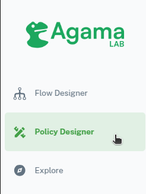
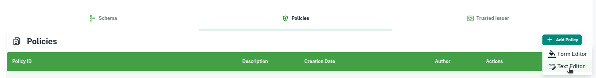

---
tags:
  - administration
  - lock
  - authorization / authz
  - Cedar
  - Cedarling
  - quick start
---

# Cedarling Quick Start Guide

## Introduction

In this guide, we'll demonstrate how to use Cedarling as a sidecar for an API Gateway to authorize requests. 
This setup involves configuring the Cedarling to protect resources based on enterprise policies.

### Sequence diagram


## Prerequisites

Before you begin, make sure you have the following:

* [Firefox](https://www.mozilla.org/en-US/firefox/windows/) or [Google Chrome](https://www.google.com/chrome/index.html)
* The latest release of [Jans Tarp](https://github.com/JanssenProject/jans/releases/tag/nightly). Download the zip file for your browser.

## Policy Store Setup (Agama Lab)

To begin using Cedarling, you need to set up a policy store. We’ll use [Agama Lab](https://cloud.gluu.org/agama-lab/login) for this purpose.

1. Sign in to [Agama Lab](https://cloud.gluu.org/agama-lab/login) using your GitHub account and click on Policy Designer.
   
2. Choose a repository to store your Cedarling policies and schemas. Ensure that the repository has at least one commit on the default branch.
   
3. After initialization, create a policy store named `gatewayDemo`.
   
4. Open the policy store and navigate to Policies.
5. Click `Add Policy`, select `Text Editor`.
    
6. Paste the following Cedar policy:
    ```bash
    @id("allow_one")
    permit(
      principal is Jans::User,
      action in [Jans::Action::"Read"],
      resource
    )
    when {
      principal has userinfo_token.role &&
      principal.userinfo_token.role.contains("developer")
    };
    ```
7. Click `Save`. Agama Lab will validate your policy. 
8. Next, click on `Trusted Issuers` and add the following issuer:
  
    * Name: `Gluu`
    * Description: `Gluu`
    * OpenID Configuration Endpoint: `https://account.gluu.org/.well-known/openid-configuration`
    * Copy the URL for your policy store; you'll need it for the cedarling setup.
    

## Tarp Setup

1. Open Tarp on your browser.
   
2. Click on `Add Client` and fill in the following details:

   * Issuer: `https://account.gluu.org`
   * Client Expiry Date: One day after your current date
   * Scopes: `openid` and `profile`.
3. Click `Register`. 
4. Click on `Cedarling`, then `Add Configurations`
5. Paste in the following configuration, replacing `<Policy Store URI>` with your policy store URL. 
  ```json
  {
      "CEDARLING_APPLICATION_NAME": "My App",
      "CEDARLING_POLICY_STORE_URI": "<Policy Store URI>",
      "CEDARLING_POLICY_STORE_ID": "gICAgcHJpbmNpcGFsIGlz",
      "CEDARLING_LOG_TYPE": "std_out",
      "CEDARLING_LOG_LEVEL": "INFO",
      "CEDARLING_LOG_TTL": null,
      "CEDARLING_USER_AUTHZ": "enabled",
      "CEDARLING_WORKLOAD_AUTHZ": "disabled",
      "CEDARLING_PRINCIPAL_BOOLEAN_OPERATION": {
          "or": [
              {"===": [{"var": "Jans::Workload"}, "ALLOW"]},
              {"===": [{"var": "Jans::User"}, "ALLOW"]}
           ]
      },
      "CEDARLING_LOCAL_JWKS": null,
      "CEDARLING_POLICY_STORE_LOCAL": null,
      "CEDARLING_POLICY_STORE_LOCAL_FN": null,
      "CEDARLING_JWT_SIG_VALIDATION": "disabled",
      "CEDARLING_JWT_STATUS_VALIDATION": "disabled",
      "CEDARLING_MAPPING_USER": "Jans::User",
      "CEDARLING_MAPPING_WORKLOAD": "Jans::Workload",
      "CEDARLING_JWT_SIGNATURE_ALGORITHMS_SUPPORTED": [
          "HS256",
          "RS256"
      ],
      "CEDARLING_TOKEN_CONFIGS": {
          "access_token": {
              "entity_type_name": "Jans::Access_token",
              "iss": "disabled",
              "aud": "disabled",
              "sub": "disabled",
              "nbf": "disabled",
              "exp": "disabled",
              "jti": "disabled"
          },
          "id_token": {
              "entity_type_name": "Jans::id_token",
              "iss": "disabled",
              "aud": "disabled",
              "sub": "disabled",
              "nbf": "disabled",
              "exp": "disabled",
              "jti": "disabled"
          },
          "userinfo_token": {
              "entity_type_name": "Jans::Userinfo_token",
              "iss": "disabled",
              "aud": "disabled",
              "sub": "disabled",
              "nbf": "disabled",
              "exp": "disabled",
              "jti": "disabled"
          }
      },
      "CEDARLING_ID_TOKEN_TRUST_MODE": "none",
      "CEDARLING_LOCK": "disabled",
      "CEDARLING_LOCK_SERVER_CONFIGURATION_URI": null,
      "CEDARLING_LOCK_DYNAMIC_CONFIGURATION": "disabled",
      "CEDARLING_LOCK_SSA_JWT": "",
      "CEDARLING_LOCK_HEALTH_INTERVAL": 0,
      "CEDARLING_LOCK_TELEMETRY_INTERVAL": 0,
      "CEDARLING_LOCK_LISTEN_SSE": "disabled"
  }
  ```
6. Click `Save`. Tarp will validate your bootstrap and initialize Cedarling.

## Authentication Flow

1. On the Authentication Flow screen, click on the lightning icon to trigger an authentication flow.
2. Use the following values for triggering the flow:

    * Acr Value: `agama_io.jans.agamaLab.main`
    * Scopes: `openid` and `profile`
3. You will be redirected to Agama Lab. Login using your GitHub account.
4. On the consent screen, click `Allow`
5. After you are redirected back to Tarp, click on the `Cedarling Authz Request Form`
6. Use the following input:

    * Principal: Select all three tokens
    * Action: `Jans::Action::"Read"`
    * Resource:
    ```
    {
      "type": "Jans::Application",
      "id": "some_id",
      "app_id": "application_id",
      "name": "Some Application",
      "url": {
        "host": "jans.test",
        "path": "/protected-endpoint",
        "protocol": "http"
      }
    }
    ```
7. Click on `Cedarling Authz Request`
8. You will get a decision log back.
