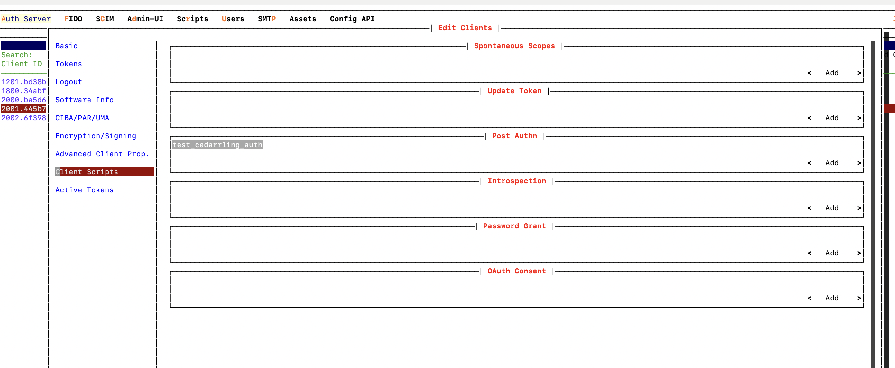

---
tags:
  - cedarling
  - java
  - getting-started
---

# Getting Started with Cedarling Java

- [Installation](#installation)
- [Usage](#usage)
- [Logging](#logging)
- [Recipes](#recipes)

## Installation

### Building from Source

Cedarling Java bindings are generated using [UniFFI](https://mozilla.github.io/uniffi-rs/latest/) (Universal Foreign Function Interface), which simplifies cross-language bindings between Rust and Java/Kotlin.


#### Prerequisites

- Rust: Install it from [the official Rust website](https://www.rust-lang.org/tools/install).
- Java Development Kit (JDK): version 11 or higher
- Apache Maven: Install from the [Apache Maven Website](https://maven.apache.org/download.cgi)


#### Steps

1. Build Cedarling by executing the below command from the `./jans/jans-cedarling` of the cloned jans project:
   ```bash
   cargo build -r -p cedarling_uniffi
   ```
   In `target/release`, you should find the `libcedarling_uniffi.dylib` (if Mac OS), `libcedarling_uniffi.so` (if Linux OS), or `libcedarling_uniffi.dll` (if Windows OS) file, depending on the operating system you are using.
   📦 You can use pre-built `libcedarling_uniffi.so` from the [Jans releases page](https://github.com/JanssenProject/jans/releases).

2. Generate the bindings for Kotlin by running the command below. Replace `{build_file}` with `libcedarling_uniffi.dylib`, `libcedarling_uniffi.so`, or `libcedarling_uniffi.dll`, depending on which file is generated in `target/release`.
   ```bash
   cargo run --bin uniffi-bindgen generate --library ./target/release/{build_file} --language kotlin --out-dir ./bindings/cedarling-java/src/main/kotlin/io/jans/cedarling
   ```
   📦 You can use pre-built kotlin binding (`cedarling_uniffi-kotlin-{version}.zip`) from the [Jans releases page](https://github.com/JanssenProject/jans/releases).

3. Copy the generated `libcedarling_uniffi.dylib`, `libcedarling_uniffi.so`, or `libcedarling_uniffi.dll` file to the resource directory of the `cedarling-java` Maven project. Replace `{build_file}` in the below command with `libcedarling_uniffi.dylib`, `libcedarling_uniffi.so`, or `libcedarling_uniffi.dll`, depending on which file is generated in `target/release`.
   ```bash
   mkdir ./bindings/cedarling-java/src/main/resources
   cp ./target/release/{build_file} ./bindings/cedarling-java/src/main/resources
   ```

4. Change directory to `./bindings/cedarling-java` and run the below command to build the `cedarling-java` jar file. This will generate `cedarling-java-{version}-distribution.jar` at `./bindings/cedarling-java/target/`.
   ```bash
    mvn clean install
   ```
   

### Using Cedarling Java via Maven

If you are using pre-built binaries, add the following `repository` and `dependency` to your `pom.xml`:
```xml
<repositories>
    <repository>
        <id>jans</id>
        <name>Janssen project repository</name>
        <url>https://maven.jans.io/maven</url>
    </repository>
</repositories>

<dependencies>
    <dependency>
        <groupId>io.jans</groupId>
        <artifactId>cedarling-java</artifactId>
        <version>{latest-jans-stable-version}</version>
    </dependency>
</dependencies>
```

## Usage

### Initialization

```java
import uniffi.cedarling_uniffi.*;
import io.jans.cedarling.binding.wrapper.CedarlingAdapter;

String bootstrapJsonStr = """
{
  "CEDARLING_APPLICATION_NAME":   "MyApp",
  "CEDARLING_POLICY_STORE_ID":    "your-policy-store-id",
  "CEDARLING_USER_AUTHZ":         "enabled",
  "CEDARLING_WORKLOAD_AUTHZ":     "enabled",
  "CEDARLING_LOG_LEVEL":          "INFO",
  "CEDARLING_LOG_TYPE":           "std_out",
  "CEDARLING_POLICY_STORE_LOCAL_FN": "/path/to/policy-store.json"
}
""";

try {
    CedarlingAdapter adapter = new CedarlingAdapter();
    adapter.loadFromJson(bootstrapJsonStr);
} catch (Exception e) {
    System.out.println("Unable to initialize Cedarling: " + e.getMessage());
}
```


### Token-Based Authorization

**1. Define the resource:**

This represents the _resource_ that the action will be performed on, such as a protected API endpoint or file.

```java
    String resource = """
        {
          "app_id": "app_id_001",
          "cedar_entity_mapping": {
            "entity_type": "Jans::Issue",
            "id": "admin_ui_id"
          },
          "name": "App Name",
          "permission": "view_clients"
        }
        """;
```

**2. Define the action:**

An _action_ represents what the principal is trying to do to the resource. For example, read, write, or delete operations.

```java
String action = "Jans::Action::\"Update\"";
```

**3. Define Context**

The _context_ represents additional data that may affect the authorization decision, such as time, location, or user-agent.

```java
    String context = """
        {
          "device_health": ["Healthy"],
          "fraud_indicators": ["Allowed"],
          "geolocation": ["America"],
          "network": "127.0.0.1",
          "network_type": "Local",
          "operating_system": "Linux",
          "user_agent": "Linux"
        }
    """;
```

**4. Prepare tokens**

```java
    String accessToken = "<access_token>";
    String idToken = "<id_token>";
    String userinfoToken = "<userinfo_token>";
```

**5. Authorize**

Finally, call the `authorize` function to check whether the principals are allowed to perform the specified action on the resource.

```java
    //Generate Map containing tokens
    Map<String, String> tokens = Map.of(
        "access_token", accessToken,
        "id_token", idToken,
        "userinfo_token", userinfoToken
    );

    // Perform authorization
    AuthorizeResult result = adapter.authorize(tokens, action, new JSONObject(resource), new JSONObject(context));
    if(result.getDecision()) {
        System.out.println("Access granted");
    } else {
        System.out.println("Access denied");
    }
```

### Custom Principal Authorization (Unsigned)

**1. Define principals:**

```java
    String principals = """
        const principals = [
          {
            "cedar_entity_mapping": {
              "entity_type": "Jans::Workload",
              "id": "some_workload_id"
            },
            "client_id": "some_client_id",
          },
          {
            "cedar_entity_mapping": {
              "entity_type": "Jans::User",
              "id": "random_user_id"
            },
            "roles": ["admin", "manager"]
          },
        ];
        """;
```

Similarly, create and initialize String variables with action, resource, and context as done in [Token-Based Authorization](#token-based-authorization).

**2. Authorize**

Finally, call the `authorize` function to check whether the principals are allowed to perform the specified action on the resource.

```java
        List<EntityData> principals = List.of(EntityData.Companion.fromJson(principals));

        AuthorizeResult result = adapter.authorizeUnsigned(principals, action, new JSONObject(resource), new JSONObject(context));
        if(result.getDecision()) {
            System.out.println("Access granted");
        } else {
            System.out.println("Access denied");
        }
```


### Logging

The logs could be retrieved using the pop_logs function.


```java
// Get all logs
List<String> logs = adapter.popLogs();

// Get log IDs
List<String> logIds = adapter.getLogIds();
String logEntry = adapter.getLogById(logIds.get(0));

// Filter by tag
adapter.getLogsByTag("System");

```

## Recipes

### **Recipe 1:** Using the Cedarling Java binding in custom scripts on the Janssen Auth Server (VM installation).

**Note:** This recipe is compatible with Jans's version 1.4.0 and earlier.

- Upload [bootstrap.json](../../cedarling/uniffi/cedarling-sample-inputs.md#bootstrapjson), [policy-store.json](../../cedarling/uniffi/cedarling-sample-inputs.md/#policy-storejson), [action.txt](../../cedarling/uniffi/cedarling-sample-inputs.md/#actiontxt), [context.json](../../cedarling/uniffi/cedarling-sample-inputs.md/#contextjson), [principals.json](../../cedarling/uniffi/cedarling-sample-inputs.md/#principalsjson) and [resource.json](../../cedarling/uniffi/cedarling-sample-inputs.md/#resourcejson) at `/opt/jans/jetty/jans-auth/custom/static` location of the auth server. The [Asset Screen](https://docs.jans.io/v1.6.0/janssen-server/config-guide/custom-assets-configuration/#asset-screen) can be used to upload assets.
- Upload the generated `cedarling-java-{version}-distribution.jar` at `/opt/jans/jetty/jans-auth/custom/libs` location of the auth server.
- The following Post Authn script has been created for calling Cedarling authorization. Add and enable the [Post Authn custom script](../../cedarling/uniffi/cedarling-sample-inputs.md/#sample_cedarling_post_authntxt) (in Java) with the following custom Properties:
   
   |Key|Values|
   |---|------|
   |BOOTSTRAP_JSON_PATH|./custom/static/bootstrap.json|
   |ACTION_FILE_PATH|./custom/static/action.txt|
   |RESOURCE_FILE_PATH|./custom/static/resource.json|
   |CONTEXT_FILE_PATH|./custom/static/context.json|
   |PRINCIPALS_FILE_PATH|./custom/static/principals.json|

- Map the script with client used to perform authentication.
   

- The script runs after client authentication to invoke Cedarling authz.

### **Recipe 2:** Sample Java Maven project using the Kotlin binding

1. Build Cedarling by executing the below command from `./jans/jans-cedarling` of the cloned jans project:
    ```bash
    cargo build -r -p cedarling_uniffi
    ```
   In `target/release`, you should find the `libcedarling_uniffi.dylib` (if Mac OS), `libcedarling_uniffi.so` (if Linux OS), or `libcedarling_uniffi.dll` (if Windows OS) file, depending on the operating system you are using.

2. Generate the bindings for Kotlin by running the command below. Replace `{build_file}` with `libcedarling_uniffi.dylib`, `libcedarling_uniffi.so`, or `libcedarling_uniffi.dll`, depending on which file is generated in `target/release`.
    ```bash
    cargo run --bin uniffi-bindgen generate --library ./target/release/{build_file} --language kotlin --out-dir ./bindings/cedarling_uniffi/javaApp/src/main/kotlin/org/example
    ```

3. Copy the generated `libcedarling_uniffi.dylib`, `libcedarling_uniffi.so`, or `libcedarling_uniffi.dll` file to the resource directory of the sample Java Maven project. Replace `{build_file}` in the below command with `libcedarling_uniffi.dylib`, `libcedarling_uniffi.so`, or `libcedarling_uniffi.dll`, depending on which file is generated in `target/release`.
    ```bash
    cp ./target/release/{build_file} ./bindings/cedarling_uniffi/javaApp/src/main/resources
    ```git add 

4. Change directory to the sample Java project (`./bindings/cedarling_uniffi/javaApp`) and run the below command to run the main method of a Maven project from the terminal.
    ```bash
     mvn clean install
     mvn exec:java -Dexec.mainClass="org.example.Main"
    ```
The method will execute the steps for Cedarling initialization with a sample bootstrap configuration, run authorization with sample tokens, resource and context inputs, and call the log interface to print authorization logs on the console.


## See Also

- [Cedarling TBAC quickstart](../cedarling-quick-start.md#implement-tbac-using-cedarling)
- [Cedarling Unsigned quickstart](../cedarling-quick-start.md#step-1-create-the-cedar-policy-and-schema)

