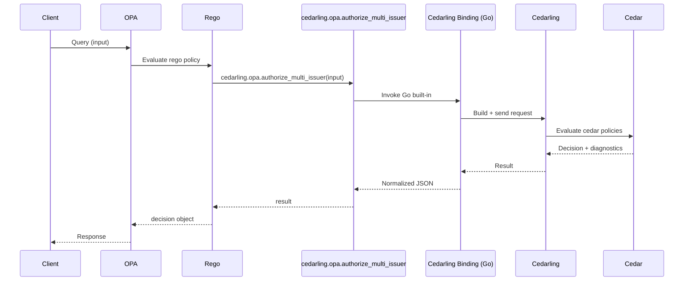
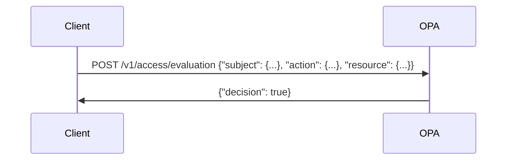

---
tags:
  - Cedar
  - Cedarling
  - OPA
---

# Cedarling OPA Plugin
A policy evaluation plugin for [Open Policy Agent (OPA)](https://www.openpolicyagent.org/) that integrates with Cedarling, allowing users to perform Cedar-based authorization in OPA workflows. In addition, the plugin provides the [AuthZen](https://openid.net/specs/authorization-api-1_0.html#access-evaluation-api) access evaluation functionality.

## Functionality

1. The OPA binary reads rego files and a configuration file containing bootstrap properties and initializes a Cedarling instance accordingly. Then the binary starts in server mode.
1. The user may then send queries to the OPA server over HTTP. OPA will call the Cedarling instance's authorization methods and return responses.

1. For AuthZen access evaluation functionality, the user may call endpoints directly following the AuthZen specification.



## Rego functions

The plugin provides two new Rego functions:

- `cedarling.opa.authorize_multi_issuer(input)`: Calls the [multi-issuer authorization](../reference/cedarling-authz.md#multi-issuer-authorization-authorize_multi_issuer-recommended) interface.
    ```json title="OPA Query Payload"
    {
      "input": {
        "tokens": [
          {
            "mapping": "Jans::Access_token",
            "payload": "<base64url-encoded JWT>"
          },
          {
            "mapping": "Jans::id_token",
            "payload": "<base64url-encoded JWT>"
          }
        ],
        "action": "Jans::Action::\"Read\"",
        "resource": {
          "cedar_entity_mapping": {
            "entity_type": "Jans::SecretDocument",
            "id": "f865a1c0b8f37b0b5506be23de923d60"
          }
        },
        "context": {
          "network": "127.0.0.1",
          "current_time": 1776826458
        }
      }
    }
    ```
- `cedarling.opa.authorize_unsigned(input)`: Calls the [unsigned authorization](../reference/cedarling-authz.md#unsigned-authorization-authorize_unsigned) interface.
    ```json title="OPA Query Payload"
    {
      "input": {
        "principal": {
          "cedar_entity_mapping": {
            "entity_type": "Jans::User",
            "id": "2773c228886ad3c1202d4e5b59bc74dc"
          },
          "sub": "68971523-c8bd-474c-a712-c7dc7e41296a",
          "role": [
            "Teacher"
          ]
        },
        "action": "Jans::Action::\"Read\"",
        "resource": {
          "cedar_entity_mapping": {
            "entity_type": "Jans::SecretDocument",
            "id": "1d096225ac65fc42dff462f910df1eee"
          }
        },
        "context": {
          "network": "127.0.0.1",
          "current_time": 1776826458
        }
      }
    }
    ```
The result from these functions will be in the following format:
```json title="Output schema"
{
  "decision": true,
  "reasons": ["policy-1"],
  "errors": [],
  "request_id": "a1484f38-253f-41a2-8f54-5c0d07b62784"
}
```
and can be stored in a variable to perform Rego operations on.

### Response schema
The response from the `cedarling.opa.*` functions contain the following fields:

- **decision**: `true` if overall authorization decision from Cedarling is `allow`, otherwise `false`.
- **reasons**: array of strings containing policy ID(s) that resulted in the decision.
- **errors**: array of strings containing zero or more errors during authorization. This field being populated will result in decision being `false`.
- **request_id**: ID of the authorization request performed.

### Example Rego policy
```rego
package cedarling_opa

default allow := false

result := cedarling.opa.authorize_multi_issuer(input)

allow if {
        result.decision == true
}

deny_reasons := result.reasons
```

## AuthZen functionality

The plugin provides the following endpoints:

- `/.well-known/authzen-configuration` - AuthZen metadata endpoint
- `/access/v1/evaluation` - Access evaluation endpoint
- `/access/v1/evaluations` - Multiple access evaluation endpoint

To use these endpoints, the user needs to provide information for cedarling to build the entities, either for unsigned or multi-issuer authorization. The cedarling subject and resource needs to be supplied in JSON format via the `properties` field of the AuthZen [subject](https://openid.net/specs/authorization-api-1_0.html#name-subject) and [resource](https://openid.net/specs/authorization-api-1_0.html#name-resource) types respectively. The action string can be sent in the `name` field of the [action](https://openid.net/specs/authorization-api-1_0.html#name-action) type. The context can be sent directly as-is, corresponding to the [context](https://openid.net/specs/authorization-api-1_0.html#name-context) type.

An example of an AuthZen request for multi-issuer authorization:

```json title="AuthZen evaluation payload"
{
  "subject": {
    "type": "Tokens",
    "id": "ID",
    "properties": {
      "tokens": [
        {
          "mapping": "Jans::Userinfo_token",
          "payload": "ey...AZgA"
        }
      ]
    }
  },
  "resource": {
    "type": "Application",
    "id": "",
    "properties": {
      "cedar_entity_mapping": {
        "entity_type": "Jans::Application",
        "id": "some_id"
      },
      "app_id": "application_id",
      "name": "Some Application",
      "url": {
        "host": "jans.test",
        "path": "/protected-endpoint",
        "protocol": "http"
      }
    }
  },
  "action": {
    "name": "Jans::Action::\"Read\""
  },
  "context": {
    "device_health": [
      "Healthy"
    ],
    "fraud_indicators": [
      "Allowed"
    ],
    "geolocation": [
      "America"
    ],
    "network": "127.0.0.1",
    "network_type": "Local",
    "operating_system": "Linux",
    "user_agent": "Linux",
    "current_time": 1
  }
}
```

The same method is used for unsigned authorization. Each entity has to be provided in JSON format in the properties field. For example:

```json title="AuthZen unsigned evaluation payload"
{
  "subject": {
    "type": "Entities",
    "id": "ID",
    "properties": {
      "cedar_entity_mapping": {
        "entity_type": "Jans::User",
        "id": "random_id"
      },
      "role": [
        "admin"
      ],
      "country": "US",
      "sub": "random_sub"
    }
  },
  "resource": {
    "type": "Application",
    "id": "",
    "properties": {
      "cedar_entity_mapping": {
        "entity_type": "Jans::Application",
        "id": "some_id"
      },
      "app_id": "application_id",
      "name": "Some Application",
      "url": {
        "host": "jans.test",
        "path": "/protected-endpoint",
        "protocol": "http"
      }
    }
  },
  "action": {
    "name": "Jans::Action::\"Update\""
  },
  "context": {
    "device_health": [
      "Healthy"
    ],
    "fraud_indicators": [
      "Allowed"
    ],
    "geolocation": [
      "America"
    ],
    "network": "127.0.0.1",
    "network_type": "Local",
    "operating_system": "Linux",
    "user_agent": "Linux",
    "current_time": 1
  }
}
```

!!! note
    Following AuthZen specification, any errors during authorization will result in a false decision, and error details will be provided in the context field of the response.

## Building

!!! note
    The FFI binding and OPA plugin can be built on Windows, macOS and Linux, but building on Linux is recommended and documented below. To build on Windows or macOS, simply follow the build instructions without Makefile and replace the binding library name as such:

    - Windows: `cedarling_go.dll`, `cedarling_go.dll.lib`
    - macOS: `libcedarling_go.dylib`
    
    For instructions on dynamic linking on Windows and macOS, please refer to the binding [documentation](https://github.com/JanssenProject/jans/tree/main/jans-cedarling/bindings/cedarling_go#build-your-go-application-with-dynamic-linking).

Required:

- Go 1.26+
- Rust toolchain 1.95+

Optional:

- Make (used to simplify the build process via provided Makefile)

**Build steps**:

1. Clone the `jans-cedarling` folder of the Janssen Repository:
    ```bash
    git clone --filter blob:none --no-checkout https://github.com/JanssenProject/jans
    cd jans
    git sparse-checkout init --cone
    git checkout main
    git sparse-checkout set jans-cedarling
    cd jans-cedarling/cedarling_opa
    ```
1. Build the plugin (if using Make)
    ```bash
    make
    ```
    The Makefile will build the Rust and Go artifacts and place them in the appropriate folders. To clean up, run `make clean`
1. OR run build steps manually:
    ```bash
    cargo build --release -p cedarling_go
    cp ../target/release/libcedarling_go.so plugins/cedarling_opa/
    mkdir -p build
    export CGO_ENABLED=1
    export CGO_LDFLAGS="-Lplugins/cedarling_opa"
    go build -o build/opa-cedarling
    ```

## Running

1. Set the library path so the plugin can find the Rust binding by running this from the `cedarling_opa` directory:

    ```bash
    export LD_LIBRARY_PATH=$(pwd)/plugins/cedarling_opa:$LD_LIBRARY_PATH
    ```

1. Create or edit the plugin configuration file `demo/opa-config.json`

    ```json title="OPA Config"
    
    {
        "plugins": {
            "cedarling_opa": {
                "stderr": false,
                "bootstrap_config": {} // fill with values
            }
        }
    }
    ```

    - `stderr`: Whether or not the **plugin** emits errors to stdout or stderr
    - `bootstrap_config`: Bootstrap configuration dictionary for the Cedarling instance. Refer to the documentation for [bootstrap](../reference/cedarling-properties.md) and [policy store](../reference/cedarling-policy-store.md) configuration.

1. Finally, run the binary with the plugin and provided rego examples:
    ```bash
    ./build/opa-cedarling run --server --config-file ./demo/opa-config.json ./demo/rego
    ```
OPA will boot with the provided configuration, read the rego files, and start server mode at `127.0.0.1:8181`.

## Querying

To interact with the OPA server, we can send queries for specific rules with the input. Let us assume we're using this Rego policy:

```rego
package cedarling_opa

default allow := false

result := cedarling.opa.authorize_multi_issuer(input)

allow if {
        result.decision == true
}

deny_reasons := result.reasons
```

alongside this cedar policy configured in a policy store:
```cedar
@id("allow_student_read")
permit (
  principal,
  action in [Jans::Action::"Read"],
  resource
)
when {
  context has tokens.jans_userinfo_token &&
  context.tokens.jans_userinfo_token.hasTag("role") &&
  context.tokens.jans_userinfo_token.getTag("role").contains("Student")
};
```
Multi-issuer authorization places the fields of the token payloads in the context, which is how we access those fields in the policy.

To perform a Rego query we can send:
```bash
$ curl -X POST http://localhost:8181/v1/data/cedarling_opa/result \
    -H "Content-Type: application/json" \
    -d '{
      "input": {
        "tokens": [
            {
                "mapping": "Jans::Userinfo_token",
                "payload":"<base64url-encoded JWT>"
            }
        ],
        "action": "Jans::Action::\"Read\"",
        "resource": {
          "cedar_entity_mapping": {
            "entity_type": "Jans::SecretDocument",
            "id": "bcd6e035ce2aabad2db27fb963facd41"
          }
        },
        "context": {
          "network": "127.0.0.1",
          "current_time": 1776826458
        }
      }
    }'
```
Where `<base64url-encoded JWT>` contains the following payload:
```json title="JWT Payload"
{
  "sub": "98iLfSWKxF_E1xGeu3sULkk0_y6xIwBP5b3OGUV33S0",
  "aud": "60dc2b2a-dc74-4b4c-bd9e-33d6ae95dae1",
  "nbf": 1776740629,
  "role": [
    "Student"
  ],
  "iss": "https://test.jans.org",
  "exp": 1776744229,
  "iat": 1776740629,
  "jti": "cq7B4lTgQM2ITbK65mkM0A",
  "client_id": "60dc2b2a-dc74-4b4c-bd9e-33d6ae95dae1"
}
```
And we get a response:
```json title="Response"
{
  "result": {
    "decision": true,
    "errors": [],
    "reasons": [
      "allow_student_read"
    ],
    "request_id": "019dadff-2481-7d0d-b3fc-cce7e05ef2c0"
  }
}
```

## Use Cases

The following examples show end-to-end uses of the Cedarling-OPA plugin with realistic authorization models:

- [Gating Terraform with Cedarling-OPA](./terraform-authz.md) — role-based control over `terraform plan / apply / destroy` across dev, staging, and production workspaces, enforced by a shell wrapper before any cloud change is made.
- [Terraform Authorization with GitHub Actions OIDC JWTs](./terraform-authz-jwt.md) — CI/CD-first variant using `authorize_multi_issuer`; Cedarling validates GitHub OIDC tokens and evaluates Cedar policies that check JWT claims (`repository`, `ref`, `environment`) to gate Terraform operations with no service-account secrets.

## Docker
A Dockerfile is provided to allow building a docker image embedded with the bootstrap configuration and rego files. To build and run this image:

- Edit `demo/opa-config.json` to your specification
- Place your rego files in `demo/rego`
- Build:
```bash
docker build . -t opa-cedarling:latest
```
- And run:
```bash
docker run -p 8181:8181 opa-cedarling:latest
```
