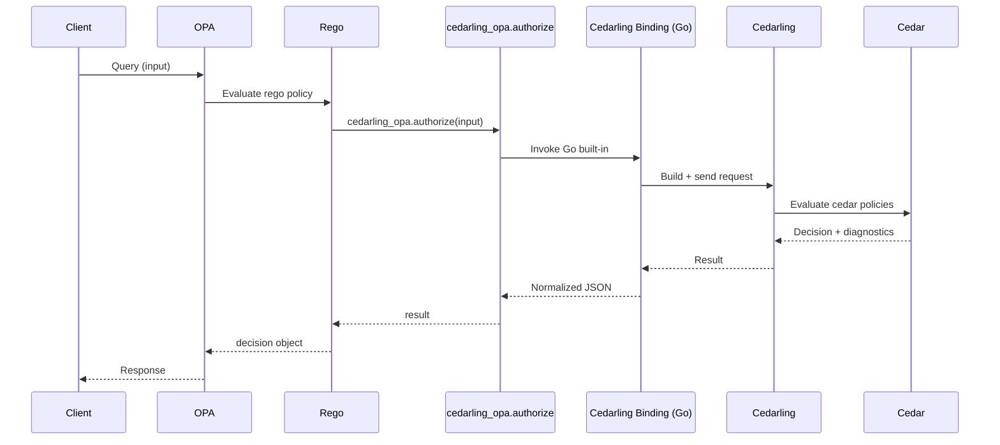

---
tags:
  - Cedar
  - Cedarling
  - OPA
---

# Cedarling OPA Plugin
A policy evaluation plugin for [Open Policy Agent (OPA)](https://www.openpolicyagent.org/) that integrates with Cedarling, allowing users to perform Cedar-based authorization in OPA workflows.

## Functionality

1. The OPA binary reads rego files (if provided) and the configuration file containing bootstrap properties and initializes a Cedarling instance accordingly. Then the binary starts in server mode.
1. The user may then send queries to the OPA server over HTTP. OPA will call the Cedarling instance's authorization methods and return responses.



## Rego functions

The plugin provides two new Rego functions:

- `cedarling_opa.authorize(input)`: Calls the [multi-issuer authorization](../reference/cedarling-authz.md#multi-issuer-authorization-authorize_multi_issuer-recommended) interface.
    ```json title="Input interface"
    {
      "input": {
        "tokens": [
          {
            "mapping": "Jans::Access_token",
            "payload": "abcdef"
          }
        ],
        "action": "Jans::Action::\"Read\"",
        "resource": {
          "cedar_entity_mapping": {
            "entity_type": "Jans::SecretDocument",
            "id": "some_id"
          }
        },
        "context": {}
      }
    }
    ```
- `cedarling_opa.authorize_unsigned(input)`: Calls the [unsigned authorization](../reference/cedarling-authz.md#unsigned-authorization-authorize_unsigned) interface.
    ```json title="Input interface"
    {
      "input": {
        "principal": {
          "cedar_entity_mapping": {
            "entity_type": "Jans::User",
            "id": "some_id"
          },
          "sub": "some_sub",
          "role": [
            "Teacher"
          ]
        },
        "action": "Jans::Action::\"Read\"",
        "resource": {
          "cedar_entity_mapping": {
            "entity_type": "Jans::SecretDocument",
            "id": "some_id"
          }
        },
        "context": {}
      }
    }
    ```
The result from these functions will be in the following format:
```json title="Output schema"
{
  "decision": true,
  "reasons": ["policy-1"],
  "errors": [],
  "request_id": "uuid"
}
```
and can be stored in a variable to perform Rego operations on.

### Example Rego policy
```rego
package cedarling_opa

default allow := false

result := cedarling_opa.authorize(input)

allow if {
	result.decision == true
}

deny_reasons := result.reasons
```

## Building

To build the plugin you need the following:

- Go 1.25+
- Rust toolchain 1.56+
- Make (for building the plugin. This build process is currently Linux only).

1. Clone the `jans-cedarling` folder of the Janssen Repository:
    ```bash
    git clone --filter blob:none --no-checkout https://github.com/JanssenProject/jans
    cd jans
    git sparse-checkout init --cone
    git checkout main
    git sparse-checkout set jans-cedarling
    cd jans-cedarling/cedarling_opa
    ```
1. Build the plugin
    ```bash
    make
    ```
The Makefile will build the Rust and Go artifacts and place them in the appropriate folders. To clean up, run `make clean`

## Running

1. Set the library path so the plugin can find the Rust binding by running this from the `cedarling_opa` directory:

    ```
    export LD_LIBRARY_PATH=$(pwd)/plugins/cedarling_opa:$LD_LIBRARY_PATH
    ```

1. Create or edit the plugin configuration file `demo/opa-config.json`

    ```json
    
    {
        "plugins": {
            "cedarling_opa": {
                "stderr": false,
                "bootstrap_config": {}
            }
        }
    }
    ```

    - `stderr`: Whether or not the **plugin** emits errors to stdout or stderr
    - `bootstrap`: Bootstrap configuration dictionary for the Cedarling instance. Refer to the documentation for [bootstrap](../reference/cedarling-properties.md) and [policy store](../reference/cedarling-policy-store.md) configuration.

1. Finally, run the binary with the plugin and provided rego examples:
    ```bash
    ./build/opa-cedarling run \\ 
      --server --config-file ./demo/opa-config.json \\ # configuration
      ./demo/rego # rego file(s)
    ```
OPA will boot with the provided configuration, read the rego files, and start server mode at `127.0.0.1:8181`.

## Querying

To interact with the OPA server, we can send queries for specific rules with the input. Let us assume we're using the Rego policy shown [here](#example-rego-policy). To query the value of the `result` variable we can send:
```bash
# for demonstration purposes we send no tokens
$ curl -X POST http://localhost:8181/v1/data/cedarling_opa/result \
    -H "Content-Type: application/json" \
    -d '{
      "input": {
        "tokens": [],
        "action": "Jans::Action::\"Read\"",
        "resource": {
          "cedar_entity_mapping": {
            "entity_type": "Jans::SecretDocument",
            "id": "some_id"
          }
        },
        "context": {}
      }
    }'
```
And we get a response:
```json
{
  "result": {
    "decision": false,
    "errors": [
      "Authorize failed: Empty token array"
    ],
    "reasons": [],
    "request_id": ""
  }
}
```

## Docker
A Dockerfile is provided to allow building a docker image embedded with the bootstrap configuration and rego files. To build and run this image:

- Edit `demo/opa-config.json` to your specification
- Place your rego files in `demo/rego`
- Build:
```
docker build . -t opa-cedarling:latest
```
- And run:
```
docker run -p 8181:8181 opa-cedarling:latest
```
