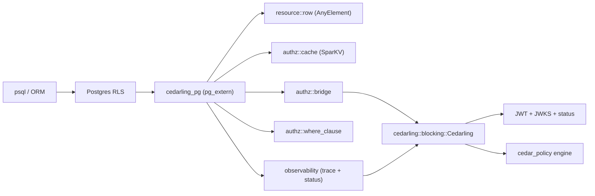

---
tags:
  - Cedar
  - Cedarling
  - PostgreSQL
  - Row Level Security
---

# Cedarling PostgreSQL Extension

`cedarling_pg` is a [PostgreSQL extension](https://www.postgresql.org/docs/current/extend-extensions.html)
that embeds a Cedarling Policy Decision Point inside the database backend. Once
loaded, a Cedar authorization check becomes a SQL function call, so policy
enforcement can be expressed directly in
[Row-Level Security](https://www.postgresql.org/docs/current/ddl-rowsecurity.html)
policies or in plain `WHERE` clauses without round-tripping rows to the
application tier.

The extension is built with [pgrx](https://github.com/pgcentralfoundation/pgrx)
and depends on the in-tree `cedarling` crate, so JWT signature verification,
JWKS rotation, status-list checks, and trusted-issuer health are delegated to
Cedarling itself — the extension only adds the Postgres-shaped surface
(typed row introspection, predicate pushdown, schema validation, masking,
observability, packaging).

## Functionality



A typical authorization flow:

1. A `SELECT` against a protected table fires its RLS policy.
2. The policy invokes a `cedarling_*` function (for example
   `cedarling_authorized_row(students, 'Read')`).
3. The extension materializes the row as a Cedar entity, attaches the
   transaction-local token bundle (`cedarling.tokens`), and asks the embedded
   Cedarling engine for a decision.
4. The decision (`true` / `false`) is returned to RLS; a row-level trace is
   pushed into the in-memory ring buffer for `cedarling_last_trace`.

## Requirements

- PostgreSQL **13 – 18** (the extension ships a pgrx feature per major).
- **Prebuilt tarballs** are published for every supported major on linux x86_64
  (see [Installing prebuilt binaries](#installing-prebuilt-binaries)).
- Other platforms, or hosts that need a different CPU arch, must
  [build from source](#building-from-source).
- JWT signature validation is the responsibility of Cedarling, not this
  extension. Set `CEDARLING_JWT_SIG_VALIDATION: enabled` in the bootstrap
  YAML you point `cedarling.bootstrap_config` at, and keep
  `CEDARLING_LOCAL_JWKS` or the trusted-issuer list populated.

You do **not** need a Rust toolchain to install a prebuilt tarball. Building
from source requires Rust stable, `cargo-pgrx`, and the Postgres development
headers for the target major.

### Why one tarball per PostgreSQL major?

PostgreSQL extensions are native libraries (`.so` files). A `cedarling_pg.so`
built for PG 16 cannot be loaded by PG 17 — the ABI and catalog layout differ.
Each release therefore ships a **matched set** per major:

| File | Role |
| --- | --- |
| `cedarling_pg.so` | Native library compiled against that PG major |
| `cedarling_pg.control` | Extension metadata (`default_version`, `module_pathname`, …) |
| `cedarling_pg--*.sql` | SQL that creates functions and catalog tables |

Always install all three from the **same** `pgNN` artifact. Mixing a PG 16
`.so` with PG 17 SQL files will not work.

## Installation overview

| Goal | Command |
| --- | --- |
| Install a release tarball | [`scripts/install.sh binary …`](#installing-prebuilt-binaries) |
| Compile and install locally | [`scripts/install.sh source …`](#building-from-source) |
| Enable in SQL after files are copied | [`CREATE EXTENSION`](#enable-the-extension) |

Both install paths use the same helper script:
[`jans-cedarling/cedarling_pg/scripts/install.sh`](https://github.com/JanssenProject/jans/blob/main/jans-cedarling/cedarling_pg/scripts/install.sh).

## Installing prebuilt binaries

The `build_cedarling_pg` job in
[`.github/workflows/build-packages.yml`](https://github.com/JanssenProject/jans/blob/main/.github/workflows/build-packages.yml)
publishes cosign-signed tarballs to each Jans release (`v*` / `nightly` tags).
Each artifact is built with `cargo pgrx package --features pgNN`.

Asset names:

```text
cedarling_pg-{version}-pg{13|14|15|16|17|18}-linux-x86_64.tar.gz
cedarling_pg-{version}-pg{13|14|15|16|17|18}-linux-x86_64.tar.gz.bundle
```

Browse them on the
[Janssen releases page](https://github.com/JanssenProject/jans/releases).

### Step 1 — download (and optionally verify)

```bash
TAG=v1.0.0                         # Jans release tag
VER="${TAG#v}"                     # embedded in the asset file name
PG=16                              # must match your server major
ARCHIVE="cedarling_pg-${VER}-pg${PG}-linux-x86_64.tar.gz"

curl -fSLO "https://github.com/JanssenProject/jans/releases/download/${TAG}/${ARCHIVE}"
curl -fSLO "https://github.com/JanssenProject/jans/releases/download/${TAG}/${ARCHIVE}.bundle"

# Optional but recommended.
cosign verify-blob \
  --bundle "${ARCHIVE}.bundle" \
  --certificate-oidc-issuer-regexp='https://token.actions.githubusercontent.com' \
  "${ARCHIVE}"
```

### Step 2 — install with `install.sh binary`

Point `PG_CONFIG` at the Postgres instance you are extending, then run the
helper. It unpacks the tarball, finds the matched `.so` / `.control` / `.sql`
set for your PG major, and copies them into the directories reported by
`pg_config`:

```bash
export PG_CONFIG=/usr/lib/postgresql/16/bin/pg_config   # example

# From the repo root (where ARCHIVE was downloaded):
./jans-cedarling/cedarling_pg/scripts/install.sh binary "${ARCHIVE}"
```

You can also pass an already-extracted directory instead of the `.tar.gz`:

```bash
tar -xzf "${ARCHIVE}"
./jans-cedarling/cedarling_pg/scripts/install.sh binary "cedarling_pg-${VER}-pg${PG}-linux-x86_64"
```

The script uses `sudo install` automatically when `pg_config` directories are
not writable by the current user.

### Manual install (without the script)

If you prefer not to use the helper, the tarball unpacks to:

```text
cedarling_pg-{version}-pg{NN}-linux-x86_64/
  usr/lib/postgresql/{NN}/lib/cedarling_pg.so
  usr/share/postgresql/{NN}/extension/cedarling_pg.control
  usr/share/postgresql/{NN}/extension/cedarling_pg--*.sql
```

Copy those files into `pg_config --pkglibdir` and
`pg_config --sharedir`/extension yourself. Do not mix files from different
`pgNN` directories.

## Building from source

Use this path on unsupported platforms, during development, or when you need
a PG major before a tarball is published.

Prerequisites:

- Rust stable
- [`cargo-pgrx`](https://crates.io/crates/cargo-pgrx) at the version pinned in
  `jans-cedarling/cedarling_pg/Cargo.toml` (currently `0.18.0`)
- Postgres build dependencies: `build-essential libreadline-dev zlib1g-dev
  flex bison libxml2-dev libxslt-dev libssl-dev libxml2-utils xsltproc
  pkg-config protobuf-compiler`

One-time pgrx setup for **each PG major** you plan to build against (run the
`init` line once per major — building for pg17 requires `--pg17`, not just
`--pg16`):

```bash
cargo install --locked cargo-pgrx --version 0.18.0
cargo pgrx init --pg16 download          # repeat --pg13, --pg14, --pg17, … as needed
```

Then build and install with the helper script:

```bash
cd jans-cedarling/cedarling_pg

# Default PG major is pg16; override with PG_VERSION=pg17.
PG_VERSION=pg16 ./scripts/install.sh source --release
```

`install.sh source` wraps `cargo pgrx install`, then runs a short psql health
check (`CREATE EXTENSION`, catalog tables present, core functions registered).
Pass `--skip-health` to skip the database check.

When `pg_config` is not on `$PATH`, the script resolves the pgrx-managed
Postgres for `PG_VERSION` via `cargo pgrx info pg-config`. To install into a
system Postgres instead, set `PG_CONFIG` (for example
`/usr/lib/postgresql/17/bin/pg_config`). Re-run once per major you support —
the extension must be compiled against the exact server version it will load
into.

To produce the same tarball layout CI publishes:

```bash
cargo pgrx package --features pg16
# archive target/release/cedarling_pg-pg16/
```

Trigger the `build_cedarling_pg` job via `workflow_dispatch` on an existing
release tag to attach those artifacts to a Jans release without cutting a new
tag.

## Enable the extension

Once the binaries are in place, the SQL part is the same on every install path.

`CREATE EXTENSION cedarling_pg` must be run as a **superuser** (the extension
control file sets `superuser = true` because catalog DDL and bootstrap
filesystem reads require elevated privileges).

```sql
CREATE EXTENSION cedarling_pg;

-- Point the extension at a Cedarling bootstrap (superuser-only GUC).
ALTER SYSTEM SET cedarling.bootstrap_config =
    '/etc/cedarling/bootstrap.yaml';
SELECT pg_reload_conf();
```

`pg_reload_conf()` reloads the GUC value, but it does **not** rebuild an engine
that is already loaded in a backend. After changing bootstrap YAML on disk,
either restart affected backends or call `cedarling_use_policy()` with the new
bootstrap path (or a registered version name) so Cedarling reloads policy in
place.

## SQL function reference

All functions are created in the `public` schema; catalog tables live in
`cedarling`. The full generated DDL is checked in at
[`sql/cedarling_pg--0.1.0.sql`](https://github.com/JanssenProject/jans/blob/main/jans-cedarling/cedarling_pg/sql/cedarling_pg--0.1.0.sql)
and CI fails the build if it drifts from the live `#[pg_extern]` set.

### Authorization

| Function | Purpose |
| --- | --- |
| `cedarling_authorized(resource_json text, token_bundle text, action text) → bool` | JWT / multi-issuer authorization. Token resolution order: non-empty `token_bundle` argument → else `cedarling.tokens` GUC → else fail-closed configuration error. Pass `NULL` or `''` to use the GUC. |
| `cedarling_authorize_unsigned(principal_json text, resource_json text, action text, context_json text) → bool` | Unsigned authorization (no tokens). |
| `cedarling_authorized_row(record anyelement, action text, context jsonb) → bool` | RLS-friendly form: materializes the composite row, looks up its Cedar entity mapping, asks the engine. `action` must not be SQL `NULL`. SQL has no `DEFAULT` on `context`; pass `NULL` for an empty object. |
| `cedarling_authorized_row(resource jsonb, action text, context jsonb) → bool` | JSONB overload for callers that already have a Cedar `EntityData` document. `action` must not be SQL `NULL`. Pass `NULL` for `{}` on `context`. |
| `cedarling_authorized_row_jwt(record anyelement, action text) → bool` | Same as `cedarling_authorized_row` but uses `cedarling.tokens` to drive `authorize_multi_issuer`. `action` must not be SQL `NULL`. |
| `cedarling_build_resource_row(record anyelement) → text` | Materializes a composite row into the canonical Cedar `EntityData` JSON string that `cedarling_authorized_row` would use — useful for debugging. Aborts the statement on invalid rows; do not use inside RLS policies. |
| `cedarling_build_resource(resource jsonb, entity_type text, entity_id text) → text` | Builds `EntityData` JSON from an existing JSONB document; optional `entity_type` / `entity_id` override or inject `cedar_entity_mapping`. Same abort-on-error semantics as the row variant. |
| `cedarling_where(table_name text, action text, tokens text) → text` | Predicate pushdown: lowers matching Cedar policies into a SQL `WHERE` fragment. On parse/engine errors returns `'FALSE'`. When at least one matched policy can't be lowered, returns the fragment chosen by `cedarling.where_partial_fallback` (default `'deny'` → `'FALSE'`; set to `'permit'` for the legacy `'TRUE'` behavior, safe only when paired with row-by-row RLS). Always emits a `WARN` listing the unhandled policy ids. |

### Tokens (session / transaction scoped)

| Function | Purpose |
| --- | --- |
| `cedarling_set_tokens(tokens jsonb) → void` | Sets `cedarling.tokens` for the current transaction (`set_config(..., is_local := true)`). |
| `cedarling_clear_tokens() → void` | Clears the transaction-scoped token bundle. |
| `cedarling_current_tokens() → jsonb` | Returns the current token bundle, or `NULL` if unset. |

### Policy version management

| Function | Purpose |
| --- | --- |
| `cedarling_register_policy_version(name text, bootstrap_path text) → bool` | Upsert a named policy version into `cedarling.policy_versions`. |
| `cedarling_use_policy(name_or_path text) → bool` | Resolve `name` against the registry, fall back to treating it as a filesystem path; rebuild the engine and record the change in `cedarling.policy_history`. |
| `cedarling_rollback_policy() → bool` | Restore the previous policy version (also recorded in `cedarling.policy_history`). |
| `cedarling_diff_policies(old text, new text) → jsonb` | Structural per-policy-id diff via `cedar_policy::PolicySet` (default), or line diff when `cedarling.diff_mode = 'lines'`. |

### Schema and entity mapping

| Function | Purpose |
| --- | --- |
| `cedarling_validate_schema(table regclass, cedar_schema_path text) → jsonb` | Real `cedar_policy::Schema` parse + `pg_attribute` type compatibility check. Reports `missing_in_table`, `missing_in_schema`, `type_mismatches`. |
| `cedarling_validate_schema(table_name text, cedar_schema_path text) → jsonb` | `text` overload for backwards compatibility. |
| `cedarling_register_entity_map(table regclass, entity_type text, id_columns text[]) → bool` | Override the default `table → Cedar entity type` mapping used by row helpers. |

### Masking

| Function | Purpose |
| --- | --- |
| `cedarling_set_mask_config(table_name text, column_name text, mask_type text, mask_value text) → bool` | Upsert into `cedarling.mask_rules`. `mask_type` is one of `null`, `redact`, `partial`, `range`, `hash`, `fixed`. |
| `cedarling_test_masking(original_value text, data_type text, mask_type text, mask_config text) → text` | Apply a single mask and return the result. The hash salt comes from `cedarling.mask_hash_salt` (GUC), not a function argument. |
| `cedarling_mask_plan(table_name text, action text DEFAULT NULL) → jsonb` | List masking rules for `table_name`. The optional `action` is echoed in the JSON metadata only (reserved for future action-scoped rules). |
| `cedarling_mask_row(row jsonb, table_name text) → jsonb` | Apply masks to a JSONB row using table/column rules and the default registry. |

### Observability

| Function | Purpose |
| --- | --- |
| `cedarling_status() → jsonb` | Health classification (`healthy` / `degraded` / `unhealthy`), trusted-issuer counts, request totals, allowed/denied/error counts, cache hit-rate, last error, last policy update. `first_request_time` is when the first authorize call ran in this backend (not extension load time). |
| `cedarling_last_trace() → jsonb` | The most recent `AuthorizationTrace` (request id, decision, matched policy ids, diagnostic errors, cache-hit flag, shadow flag, duration, `policy_version` at evaluation time). |
| `cedarling_recent_traces(limit int) → jsonb` | The trailing window of traces from the ring buffer. |
| `cedarling_explain(resource_json text, action text) → jsonb` | One-off authorization that bypasses the cache and the request counters, returning the full enriched trace plus matched policies. |

### Catalog tables (in the `cedarling` schema)

- `cedarling.mask_rules` — per-(table, column) mask configuration.
- `cedarling.policy_history` — audit trail of policy swaps.
- `cedarling.entity_map` — table → Cedar entity overrides.
- `cedarling.policy_versions` — named policy version registry.

## Configuration (GUCs)

All knobs are standard PostgreSQL [GUCs](https://www.postgresql.org/docs/current/config-setting.html)
and can be set per-session (`SET ...`), per-transaction (`SET LOCAL ...`),
or cluster-wide (`ALTER SYSTEM SET ...; SELECT pg_reload_conf();`).

| GUC | Type | Default | Purpose |
| --- | --- | --- | --- |
| `cedarling.bootstrap_config` | text (superuser) | — | Path to the Cedarling bootstrap YAML. Required for any `#[pg_extern]` that talks to the engine. Only superusers can set it. |
| `cedarling.mode` | enum | `enforcement` | `enforcement` / `instrumentation` / `shadow`. Shadow always returns `true` and writes a trace. |
| `cedarling.strategy` | enum | `filter` | `filter` (exclude unauthorized rows) or `mask` (return the row with masked columns). |
| `cedarling.fail_mode` | enum | `closed` | `closed` (deny on engine errors) or `open` (allow on engine errors). A single `SET cedarling.fail_mode = 'open'` turns Cedarling outages into wholesale `ALLOW` for the session. |
| `cedarling.log_level` | enum | `info` | `debug` / `info` / `warn` / `error`. |
| `cedarling.cache_ttl` | int | `300` | Decision cache TTL in seconds. |
| `cedarling.cache_size` | int | `8192` | Maximum cached decisions per backend. Set to `0` to disable. |
| `cedarling.audit_fail_open` | bool | `on` | Whether to emit an audit log entry when `cedarling.fail_mode = 'open'` allows a request after an authorization error. |
| `cedarling.tokens` | text | — | Transaction- or session-scoped JWT bundle. |
| `cedarling.context` | text | — | Optional ambient Cedar `context` JSON object. |
| `cedarling.policy_version` | text (superuser) | — | Pinned policy version; participates in the decision-cache key. Only superusers can set it; values are truncated in `cedarling_status()`. |
| `cedarling.trace_buffer_size` | int | `1024` | Ring-buffer capacity for `cedarling_recent_traces` (range `0..=65536`); runtime `SET` changes apply immediately in the current backend. |
| `cedarling.policy_history_size` | int | `16` | Maximum rows retained in `cedarling.policy_history`. |
| `cedarling.diff_mode` | enum | `structural` | `structural` (per-policy-id diff, default) or `lines` (legacy line diff). |
| `cedarling.where_partial_fallback` | enum | `deny` | Fragment `cedarling_where` returns when at least one matched policy can't be lowered. `deny` (default) → `'FALSE'`, safe for standalone use. `permit` → `'TRUE'`, safe only when paired with row-by-row RLS. |
| `cedarling.schema_validate_strict` | bool | `on` | When `on`, `cedarling_validate_schema` uses the real Cedar parser; `off` falls back to lexical identifier extraction. |
| `cedarling.mask_hash_salt` | text (superuser) | — | Salt used by `MaskType::Hash`. When unset, `hash` masks return a sentinel and emit one warning. Superuser-only like `bootstrap_config` and `policy_version`. |

## Quick start

### Authorize a JWT-protected row

```sql
CREATE EXTENSION cedarling_pg;

ALTER SYSTEM SET cedarling.bootstrap_config = '/etc/cedarling/bootstrap.yaml';
SELECT pg_reload_conf();

CREATE TABLE students (
    id          int PRIMARY KEY,
    name        text NOT NULL,
    grad_year   int  NOT NULL
);
INSERT INTO students VALUES
    (1, 'Ada',   2024),
    (2, 'Linus', 2027);

ALTER TABLE students ENABLE ROW LEVEL SECURITY;
ALTER TABLE students FORCE ROW LEVEL SECURITY;

-- Drive auth from the session-scoped token bundle.
CREATE POLICY students_rls ON students
    FOR SELECT
    USING (cedarling_authorized_row_jwt(students, 'Read'));

-- Application code attaches its JWT bundle once per session:
SELECT cedarling_set_tokens('[
  {"mapping":"Acme::Access_Token","payload":"<jwt>"},
  {"mapping":"Acme::Id_Token","payload":"<jwt>"}
]'::jsonb);

SELECT * FROM students;
```

### Inspect what happened

```sql
SELECT cedarling_last_trace();
-- {
--   "request_id":   "01J...",
--   "action":       "Acme::Action::\"Read\"",
--   "resource_type":"Student",
--   "resource_id":  "1",
--   "decision":     true,
--   "policy_hits":  ["allow_admissions"],
--   "cache_hit":    false,
--   "duration_ms":  3
-- }

SELECT cedarling_status();
-- {
--   "status":"healthy",
--   "trusted_issuers_loaded": 2,
--   "trusted_issuers_failed": 0,
--   "total_requests": 17,
--   "allowed": 12, "denied": 5, "errors": 0,
--   "cache_hit_rate": 0.41,
--   "policy_version": "v1.0"
-- }
```

### Predicate pushdown

`cedarling_where` is an **optimization hint only** — never the sole
authorization gate. Pair it with a row-level check (`cedarling_authorized_row*`
or an RLS policy) so every row is still evaluated by Cedarling.

```sql
SELECT count(*)
  FROM students
 WHERE cedarling_authorized_row_jwt(students, 'Read')
   AND (cedarling_where('students', 'Acme::Action::"Read"', NULL))::bool;
```

`cedarling_where` lowers matching Cedar policies into SQL where it can
(equalities, comparisons, boolean combinations over `resource.<col>`). When
at least one matched policy isn't representable, the function emits a
`WARN` listing the unhandled policy ids and returns the fragment chosen by
`cedarling.where_partial_fallback`:

- **`deny` (default)** → `'FALSE'`. Safe for standalone callers that do not
  pair `cedarling_where` with a per-row authorization predicate.
- **`permit`** → `'TRUE'`. Use only when the query also has a row-by-row
  `cedarling_authorized*` predicate (or RLS using one) so every row is
  still evaluated by Cedarling — otherwise unhandled policies become a
  silent fail-open.

### Mask instead of filter

`cedarling.strategy = 'mask'` flips RLS behaviour: instead of dropping rows
that Cedar denies, `cedarling_authorized_row` returns `true` so the row
survives RLS, and the trace records `masked=true`. The function does **not**
rewrite columns — it only changes the authorization verdict. To actually
redact sensitive values, pair it with `cedarling_mask_row()` in the SELECT
list (or wrap the table in a view):

```sql
-- 1. Configure the masking rule (or rely on the default registry —
--    columns named "email", "phone", "ssn", "credit_card", "password",
--    or "salary" get a sensible mask automatically).
SELECT cedarling_set_mask_config(
    'students', 'email',
    'partial', '***@***.com'
);

-- 2. Switch the deny-time strategy.
ALTER DATABASE app SET cedarling.strategy = 'mask';

-- 3. In queries / views, materialise the row through cedarling_mask_row()
--    so denied rows still appear but with sensitive columns redacted.
CREATE VIEW students_safe AS
SELECT (cedarling_mask_row(to_jsonb(s), 'students')).*  -- redacted columns
  FROM students s;                                       -- RLS still applies
```

Why the two-step shape: the actual transformation is a pure function of
`(row, mask_rules)`, so Postgres can mark it `STABLE PARALLEL SAFE` and the
planner is free to parallelise the SELECT. Folding the mask into the
RLS predicate would have required process-global mutable state, which can't
be shared correctly across parallel workers.

## Security notes

- **JWTs are never written to logs, traces, status, or error messages.**
  The extension translates every `cedarling::AuthorizeError` into a redacted
  string at the authorize boundary, and there is a dedicated unit test
  (`classifier_outputs_are_static_redacted_strings`) that fails the build if
  that invariant regresses.
- **Fail-safe by default.** Every error path in `enforcement` mode returns
  `false`. `shadow` mode always returns `true` and records a trace.
- **`fail_mode = open` is a deliberate escape hatch.** When the engine is
  down or a request fails validation, `open` returns `true` instead of
  denying. That is one GUC change away from bypassing authorization for
  every row. Keep the default `closed` in production; treat `open` as a
  break-glass setting with change control.
- **Fail-open audit entries bypass `cedarling.log_level`.** When
  `fail_mode = open` converts an error into an allow and
  `cedarling.audit_fail_open` is `on`, the extension emits a structured
  `WARNING` audit line regardless of `cedarling.log_level`. The audit
  channel is gated solely by `cedarling.audit_fail_open` — `log_level`
  controls routine diagnostics only and cannot silence the audit record
  of a security-relevant fail-open decision.
- **JWT validation lives in Cedarling.** Toggle it on with
  `CEDARLING_JWT_SIG_VALIDATION: enabled` in the bootstrap YAML; this
  extension does not implement its own JWT parser.
- **Authorization functions stay `VOLATILE` / `PARALLEL UNSAFE`.** Read-only
  observers (`cedarling_status`, `cedarling_last_trace`, `cedarling_recent_traces`)
  are marked `STABLE`, but `cedarling_authorized*` and `cedarling_where` mutate
  per-backend counters and traces. Do not mark them
  `PARALLEL SAFE` until shared-memory aggregation exists (see review §13.8).
- **Sensitive GUCs and policy lifecycle are superuser-gated.**
  `cedarling.bootstrap_config`, `cedarling.policy_version`, and
  `cedarling.mask_hash_salt` are `Suset` (superuser-only). `EXECUTE` on
  `cedarling_use_policy`, `cedarling_register_policy_version`,
  `cedarling_rollback_policy`, and `cedarling_diff_policies` is revoked from
  `PUBLIC` — grant only to superusers (or roles that can set
  `cedarling.policy_version`). Non-superuser callers of the policy-swap
  functions get `false` and the engine change is rolled back if the GUC update
  fails.
- **`cedarling.mask_rules.condition_sql` is not executed.** Non-empty
  `condition_sql` values are ignored (fail-closed for that column) so
  arbitrary SQL cannot be injected through mask configuration. Use RLS or
  Cedar policies for conditional masking.

## Source and CI

- Crate root:
  [`jans-cedarling/cedarling_pg`](https://github.com/JanssenProject/jans/tree/main/jans-cedarling/cedarling_pg)
- CI exercises the extension through the `postgres_extension_tests` job in
  [`.github/workflows/test-cedarling.yml`](https://github.com/JanssenProject/jans/blob/main/.github/workflows/test-cedarling.yml),
  which builds with `cargo pgrx`, runs the `#[pg_test]` suite against a real
  Postgres backend, and gates the committed `sql/cedarling_pg--0.1.0.sql` so
  the packaged extension SQL stays in lock-step with the `#[pg_extern]` set.
- Prebuilt linux x86_64 tarballs (pg13–pg18) are published by the
  `build_cedarling_pg` job in
  [`.github/workflows/build-packages.yml`](https://github.com/JanssenProject/jans/blob/main/.github/workflows/build-packages.yml)
  alongside the other Cedarling release assets on each Jans `v*` / `nightly`
  tag. Each tarball is cosign-signed; SLSA v3 provenance is attached as
  `cedarling-pg.intoto.jsonl` on the same release.
