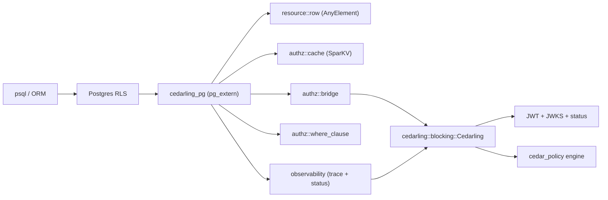

---
tags:
  - Cedar
  - Cedarling
  - PostgreSQL
  - Row Level Security
---

# Cedarling PostgreSQL Extension

`cedarling_pg` is a [PostgreSQL extension](https://www.postgresql.org/docs/current/extend-extensions.html)
that embeds a Cedarling Policy Decision Point inside the database backend. Once
loaded, a Cedar authorization check becomes a SQL function call, so policy
enforcement can be expressed directly in
[Row-Level Security](https://www.postgresql.org/docs/current/ddl-rowsecurity.html)
policies or in plain `WHERE` clauses without round-tripping rows to the
application tier.

The extension is built with [pgrx](https://github.com/pgcentralfoundation/pgrx)
and depends on the in-tree `cedarling` crate, so JWT signature verification,
JWKS rotation, status-list checks, and trusted-issuer health are delegated to
Cedarling itself — the extension only adds the Postgres-shaped surface
(typed row introspection, predicate pushdown, schema validation, masking,
observability, packaging).

## Functionality



A typical authorization flow:

1. A `SELECT` against a protected table fires its RLS policy.
2. The policy invokes a `cedarling_*` function (for example
   `cedarling_authorized_row(students, 'Read')`).
3. The extension materializes the row as a Cedar entity, attaches the
   transaction-local token bundle (`cedarling.tokens`), and asks the embedded
   Cedarling engine for a decision.
4. The decision (`true` / `false`) is returned to RLS; a row-level trace is
   pushed into the in-memory ring buffer for `cedarling_last_trace`.

## Requirements

- PostgreSQL 13 – 18 (binaries are published for every major).
- Linux x86_64 or aarch64 (other platforms must build from source —
  see [Building from source](#building-from-source-contributors-only)).
- JWT signature validation is the responsibility of Cedarling, not this
  extension. Set `CEDARLING_JWT_SIG_VALIDATION: enabled` in the bootstrap
  YAML you point `cedarling.bootstrap_config` at, and keep
  `CEDARLING_LOCAL_JWKS` or the trusted-issuer list populated.

You do **not** need a Rust toolchain, `cargo`, or `pgrx` to install or run
cedarling_pg. Pick whichever installation path matches your environment.

## Installing prebuilt binaries

Every tagged `cedarling_pg-v*` release publishes:

- Tarballs (`.tar.gz`) for each (PG major × linux arch) combination
- Debian/Ubuntu packages (`.deb`) for each (PG major × linux arch) combination
- A multi-arch Docker image per PG major on GitHub Container Registry

Browse them on the
[Janssen releases page](https://github.com/JanssenProject/jans/releases?q=cedarling_pg)
or use one of the install paths below.

### One-line installer (Linux)

The installer detects your PostgreSQL major (via `pg_config`) and CPU
architecture, downloads the matching tarball from the latest release, verifies
its SHA256, and copies the files into the directories reported by `pg_config`:

```bash
curl -fsSL \
  https://github.com/JanssenProject/jans/releases/latest/download/install-binary.sh \
  | bash
```

Common overrides:

```bash
# Pin a specific release.
CEDARLING_PG_VERSION=0.1.0 bash install-binary.sh

# Use a non-default pg_config (e.g. when several PG majors are installed).
PG_CONFIG=/usr/lib/postgresql/17/bin/pg_config bash install-binary.sh
```

The installer needs write access to `pg_config --sharedir` and
`pg_config --pkglibdir`; it will use `sudo` automatically if those directories
are root-owned (the usual case for packaged Postgres installs).

### Debian / Ubuntu (.deb)

```bash
# Replace 16 with your installed PG major, and amd64 with arm64 on ARM hosts.
VER=0.1.0
PG=16
ARCH=amd64
curl -fSLO https://github.com/JanssenProject/jans/releases/download/cedarling_pg-v${VER}/cedarling_pg-${VER}-pg${PG}-x86_64-unknown-linux-gnu.deb
sudo apt-get install -y ./cedarling_pg-${VER}-pg${PG}-x86_64-unknown-linux-gnu.deb
```

The package is named `postgresql-<MAJOR>-cedarling-pg` and depends on
`postgresql-<MAJOR>`, so `apt-get install` will pull the matching server if
it isn't already present.

### Docker

The release pipeline publishes a multi-arch image to
[GitHub Container Registry](https://github.com/orgs/JanssenProject/packages/container/package/cedarling_pg)
per PG major. The image is the official `postgres:<NN>` image with
cedarling_pg preinstalled and auto-created on first start.

```bash
docker run --rm -d \
  --name cedarling-pg \
  -e POSTGRES_PASSWORD=postgres \
  -p 5432:5432 \
  -v /etc/cedarling:/etc/cedarling:ro \
  ghcr.io/janssenproject/jans/cedarling_pg:latest-pg16

docker exec -it cedarling-pg psql -U postgres -c "SELECT cedarling_status();"
```

To pin a specific cedarling_pg version, use the
`ghcr.io/janssenproject/jans/cedarling_pg:<version>-pg<major>` tag.

### Manual tarball install

If you'd rather avoid the one-line installer:

```bash
VER=0.1.0
PG=16
TRIPLE=x86_64-unknown-linux-gnu     # aarch64-unknown-linux-gnu on ARM
ASSET=cedarling_pg-${VER}-pg${PG}-${TRIPLE}.tar.gz

curl -fSLO https://github.com/JanssenProject/jans/releases/download/cedarling_pg-v${VER}/${ASSET}
curl -fSLO https://github.com/JanssenProject/jans/releases/download/cedarling_pg-v${VER}/${ASSET}.sha256
sha256sum -c <(printf '%s  %s\n' "$(cat ${ASSET}.sha256)" "${ASSET}")

tar -xzf ${ASSET}
cd cedarling_pg-${VER}-pg${PG}-${TRIPLE}
./install.sh    # uses pg_config to pick the right install paths
```

### Enable the extension

Once the binaries are in place, the SQL part is the same on every install path:

```sql
CREATE EXTENSION cedarling_pg;

-- Point the extension at a Cedarling bootstrap (cluster-wide; needs reload).
ALTER SYSTEM SET cedarling.bootstrap_config =
    '/etc/cedarling/bootstrap.yaml';
SELECT pg_reload_conf();
```

## SQL function reference

All functions are created in the `public` schema; catalog tables live in
`cedarling`. The full generated DDL is checked in at
[`sql/cedarling_pg--0.1.0.sql`](https://github.com/JanssenProject/jans/blob/main/jans-cedarling/cedarling_pg/sql/cedarling_pg--0.1.0.sql)
and CI fails the build if it drifts from the live `#[pg_extern]` set.

### Authorization

| Function | Purpose |
| --- | --- |
| `cedarling_authorized(resource_json text, token_bundle text, action text) → bool` | JWT / multi-issuer authorization. `token_bundle` may be `NULL`; the extension then falls back to `cedarling.tokens`. |
| `cedarling_authorize_unsigned(principal_json text, resource_json text, action text, context_json text) → bool` | Unsigned authorization (no tokens). |
| `cedarling_authorized_row(record anyelement, action text, context jsonb DEFAULT NULL) → bool` | RLS-friendly form: materializes the composite row, looks up its Cedar entity mapping, asks the engine. |
| `cedarling_authorized_row(resource jsonb, action text, context jsonb DEFAULT NULL) → bool` | JSONB overload for callers that already have a Cedar `EntityData` document. |
| `cedarling_authorized_row_jwt(record anyelement, action text DEFAULT 'Read') → bool` | Same as `cedarling_authorized_row` but uses `cedarling.tokens` to drive `authorize_multi_issuer`. |
| `cedarling_build_resource(record anyelement) → jsonb` | Returns the canonical Cedar `EntityData` JSON that `cedarling_authorized_row` would have produced — useful for debugging. |
| `cedarling_where(table_name text, action text, tokens text) → text` | Predicate pushdown: lowers matching Cedar policies into a SQL `WHERE` fragment. Falls back to `'TRUE'` (with a `WARN` listing unhandled policy ids) when a policy can't be lowered, and to `'FALSE'` on parse/engine errors. |

### Tokens (session / transaction scoped)

| Function | Purpose |
| --- | --- |
| `cedarling_set_tokens(tokens jsonb) → void` | Sets `cedarling.tokens` for the current transaction (`set_config(..., is_local := true)`). |
| `cedarling_clear_tokens() → void` | Clears the transaction-scoped token bundle. |
| `cedarling_current_tokens() → jsonb` | Returns the current token bundle, or `NULL` if unset. |

### Policy version management

| Function | Purpose |
| --- | --- |
| `cedarling_register_policy_version(name text, bootstrap_path text) → bool` | Upsert a named policy version into `cedarling.policy_versions`. |
| `cedarling_use_policy(name_or_path text) → bool` | Resolve `name` against the registry, fall back to treating it as a filesystem path; rebuild the engine and record the change in `cedarling.policy_history`. |
| `cedarling_rollback_policy() → bool` | Restore the previous policy version (also recorded in `cedarling.policy_history`). |
| `cedarling_diff_policies(old text, new text) → jsonb` | Structural per-policy-id diff via `cedar_policy::PolicySet` (default), or line diff when `cedarling.diff_mode = 'lines'`. |

### Schema and entity mapping

| Function | Purpose |
| --- | --- |
| `cedarling_validate_schema(table regclass, cedar_schema_path text) → jsonb` | Real `cedar_policy::Schema` parse + `pg_attribute` type compatibility check. Reports `missing_in_table`, `missing_in_schema`, `type_mismatches`. |
| `cedarling_validate_schema(table_name text, cedar_schema_path text) → jsonb` | `text` overload for backwards compatibility. |
| `cedarling_register_entity_map(table regclass, entity_type text, id_columns text[]) → bool` | Override the default `table → Cedar entity type` mapping used by row helpers. |

### Masking

| Function | Purpose |
| --- | --- |
| `cedarling_set_mask_config(table_name text, column_name text, mask_type text, mask_value text) → bool` | Upsert into `cedarling.mask_rules`. `mask_type` is one of `null`, `redact`, `partial`, `range`, `hash`, `fixed`. |
| `cedarling_test_masking(mask_type text, mask_value text, input text, salt text DEFAULT NULL) → text` | Apply a single mask and return the result. Useful from a `psql` REPL. |
| `cedarling_mask_plan(table_name text, action text DEFAULT NULL) → jsonb` | Show the masks that would be applied for a given (table, action) pair. |
| `cedarling_mask_row(row jsonb, table_name text, action text DEFAULT NULL) → jsonb` | Apply masks to a JSONB row representation. |
| `cedarling_get_masked_row() → jsonb` | Retrieve the most recently masked row produced by `cedarling.strategy = mask`. |

### Observability

| Function | Purpose |
| --- | --- |
| `cedarling_status() → jsonb` | Health classification (`healthy` / `degraded` / `unhealthy`), trusted-issuer counts, request totals, allowed/denied/error counts, cache hit-rate, last error, last policy update. |
| `cedarling_last_trace() → jsonb` | The most recent `AuthorizationTrace` (request id, decision, matched policy ids, diagnostic errors, cache-hit flag, shadow flag, duration). |
| `cedarling_recent_traces(limit int) → jsonb` | The trailing window of traces from the ring buffer. |
| `cedarling_explain(resource_json text, action text) → jsonb` | One-off authorization that bypasses the cache and the request counters, returning the full enriched trace plus matched policies. |

### Catalog tables (in the `cedarling` schema)

- `cedarling.mask_rules` — per-(table, column) mask configuration.
- `cedarling.policy_history` — audit trail of policy swaps.
- `cedarling.entity_map` — table → Cedar entity overrides.
- `cedarling.policy_versions` — named policy version registry.

## Configuration (GUCs)

All knobs are standard PostgreSQL [GUCs](https://www.postgresql.org/docs/current/config-setting.html)
and can be set per-session (`SET ...`), per-transaction (`SET LOCAL ...`),
or cluster-wide (`ALTER SYSTEM SET ...; SELECT pg_reload_conf();`).

| GUC | Type | Default | Purpose |
| --- | --- | --- | --- |
| `cedarling.bootstrap_config` | text | — | Path to the Cedarling bootstrap YAML. Required for any `#[pg_extern]` that talks to the engine. |
| `cedarling.mode` | enum | `enforcement` | `enforcement` / `instrumentation` / `shadow`. Shadow always returns `true` and writes a trace. |
| `cedarling.strategy` | enum | `filter` | `filter` (exclude unauthorized rows) or `mask` (return the row with masked columns). |
| `cedarling.fail_mode` | enum | `closed` | `closed` (deny on engine errors) or `open` (allow reads on engine errors). |
| `cedarling.log_level` | enum | `info` | `debug` / `info` / `warn` / `error`. |
| `cedarling.cache_ttl` | int | `300` | Decision cache TTL in seconds. |
| `cedarling.cache_size` | int | `8192` | Maximum cached decisions per backend. Set to `0` to disable. |
| `cedarling.audit_fail_open` | bool | `on` | Whether audit-log failures (extension log writes) are fatal. |
| `cedarling.tokens` | text | — | Transaction- or session-scoped JWT bundle. |
| `cedarling.context` | text | — | Optional ambient Cedar `context` JSON object. |
| `cedarling.policy_version` | text | — | Pinned policy version; participates in the decision-cache key. |
| `cedarling.trace_buffer_size` | int | `1024` | Ring-buffer capacity for `cedarling_recent_traces` (range `0..=65536`). |
| `cedarling.policy_history_size` | int | `16` | Maximum rows retained in `cedarling.policy_history`. |
| `cedarling.diff_mode` | enum | `structural` | `structural` (per-policy-id diff, default) or `lines` (legacy line diff). |
| `cedarling.schema_validate_strict` | bool | `on` | When `on`, `cedarling_validate_schema` uses the real Cedar parser; `off` falls back to lexical identifier extraction. |
| `cedarling.mask_hash_salt` | text | — | Salt used by `MaskType::Hash`. When unset, `hash` masks return a sentinel and emit one warning. |

## Quick start

### Authorize a JWT-protected row

```sql
CREATE EXTENSION cedarling_pg;

ALTER SYSTEM SET cedarling.bootstrap_config = '/etc/cedarling/bootstrap.yaml';
SELECT pg_reload_conf();

CREATE TABLE students (
    id          int PRIMARY KEY,
    name        text NOT NULL,
    grad_year   int  NOT NULL
);
INSERT INTO students VALUES
    (1, 'Ada',   2024),
    (2, 'Linus', 2027);

ALTER TABLE students ENABLE ROW LEVEL SECURITY;
ALTER TABLE students FORCE ROW LEVEL SECURITY;

-- Drive auth from the session-scoped token bundle.
CREATE POLICY students_rls ON students
    FOR SELECT
    USING (cedarling_authorized_row_jwt(students, 'Read'));

-- Application code attaches its JWT bundle once per session:
SELECT cedarling_set_tokens('[
  {"mapping":"Acme::Access_Token","payload":"<jwt>"},
  {"mapping":"Acme::Id_Token","payload":"<jwt>"}
]'::jsonb);

SELECT * FROM students;
```

### Inspect what happened

```sql
SELECT cedarling_last_trace();
-- {
--   "request_id":   "01J...",
--   "action":       "Acme::Action::\"Read\"",
--   "resource_type":"Student",
--   "resource_id":  "1",
--   "decision":     true,
--   "policy_hits":  ["allow_admissions"],
--   "cache_hit":    false,
--   "duration_ms":  3
-- }

SELECT cedarling_status();
-- {
--   "status":"healthy",
--   "trusted_issuers_loaded": 2,
--   "trusted_issuers_failed": 0,
--   "total_requests": 17,
--   "allowed": 12, "denied": 5, "errors": 0,
--   "cache_hit_rate": 0.41,
--   "policy_version": "v1.0"
-- }
```

### Predicate pushdown

```sql
SELECT count(*)
  FROM students
 WHERE (cedarling_where('students', 'Acme::Action::"Read"', NULL))::bool;
```

`cedarling_where` lowers matching Cedar policies into SQL where it can
(equalities, comparisons, boolean combinations over `resource.<col>`) and
falls back to `'TRUE'` with a warning when a policy isn't representable —
RLS continues to evaluate those policies row-by-row.

### Mask instead of filter

```sql
ALTER DATABASE app SET cedarling.strategy = 'mask';
SELECT cedarling_set_mask_config(
    'students', 'email',
    'partial', '***@***.com'
);
-- Or rely on the default registry: a column named "email", "phone", "ssn",
-- "credit_card", "password", or "salary" gets a sensible mask automatically.
```

## Security notes

- **JWTs are never written to logs, traces, status, or error messages.**
  The extension translates every `cedarling::AuthorizeError` into a redacted
  string at the authorize boundary, and there is a dedicated unit test
  (`classifier_outputs_are_static_redacted_strings`) that fails the build if
  that invariant regresses.
- **Fail-safe by default.** Every error path in `enforcement` mode returns
  `false`. `shadow` mode always returns `true` and records a trace.
- **JWT validation lives in Cedarling.** Toggle it on with
  `CEDARLING_JWT_SIG_VALIDATION: enabled` in the bootstrap YAML; this
  extension does not implement its own JWT parser.

## Building from source (contributors only)

End users should not need this section — prefer one of the prebuilt install
paths above. If you are hacking on cedarling_pg itself, you'll need:

- Rust stable
- [`cargo-pgrx`](https://crates.io/crates/cargo-pgrx) at the version pinned in
  `jans-cedarling/cedarling_pg/Cargo.toml` (currently `0.18.0`)
- The Postgres build dependencies (`build-essential libreadline-dev zlib1g-dev
  flex bison libxml2-dev libxslt-dev libssl-dev pkg-config`)

```bash
# One-time pgrx setup (downloads the Postgres builds it manages).
cargo install --locked cargo-pgrx --version 0.18.0
cargo pgrx init

# Build + install into the pgrx-managed Postgres + run a health check.
cd jans-cedarling/cedarling_pg
scripts/install.sh                       # build + install + health check
scripts/install.sh --release             # release build
PG_VERSION=pg17 scripts/install.sh       # target a different major
```

To produce the same artifacts the release workflow does without a tag push,
trigger the `Release cedarling_pg` workflow manually
(`workflow_dispatch`) — it builds tarballs, `.deb`s, and a Docker image for
every supported PG major.

## Source and CI

- Crate root:
  [`jans-cedarling/cedarling_pg`](https://github.com/JanssenProject/jans/tree/main/jans-cedarling/cedarling_pg)
- CI exercises the extension through the `postgres_extension_tests` job in
  [`.github/workflows/test-cedarling.yml`](https://github.com/JanssenProject/jans/blob/main/.github/workflows/test-cedarling.yml),
  which builds with `cargo pgrx`, runs the `#[pg_test]` suite against a real
  Postgres backend, gates the committed `sql/cedarling_pg--0.1.0.sql` so
  the packaged extension SQL stays in lock-step with the `#[pg_extern]` set,
  and runs the end-user `install-binary.sh` path against a freshly packaged
  artifact so the binary install never silently breaks.
- Release packaging lives in
  [`.github/workflows/release-cedarling-pg.yml`](https://github.com/JanssenProject/jans/blob/main/.github/workflows/release-cedarling-pg.yml).
  Push a tag of the form `cedarling_pg-v<version>` (e.g. `cedarling_pg-v0.1.0`)
  to trigger a full matrix build of tarballs, `.deb`s, and Docker images
  attached to a GitHub release.
