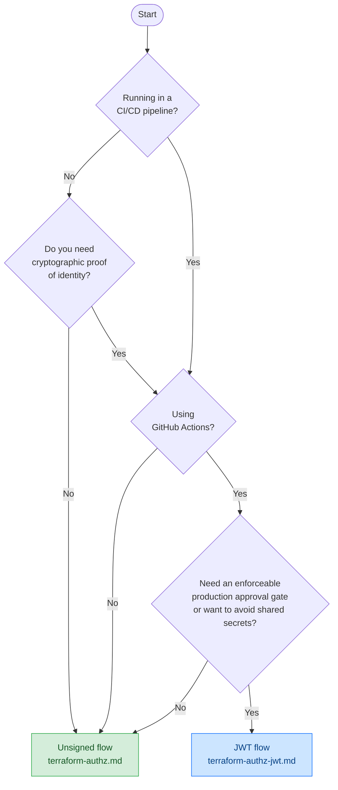

---
tags:
  - Cedar
  - Cedarling
  - OPA
  - Terraform
  - Infrastructure
---

# Terraform Authorization with Cedarling-OPA

This page is the starting point for gating Terraform operations with Cedar policies and the Cedarling-OPA plugin. Two flows are available — read the comparison table below to choose the one that fits your situation, then follow the linked guide.

## Which flow should I use?

| | **[Unsigned flow](./terraform-authz.md)** | **[JWT flow](./terraform-authz-jwt.md)** |
|---|---|---|
| **Identity source** | Environment variables asserted by the caller | Signed GitHub Actions OIDC token |
| **Signature validation** | None — `CEDARLING_JWT_SIG_VALIDATION: "disabled"` | Cryptographic — Cedarling fetches GitHub's JWKS and verifies every token |
| **Trusted issuer config** | Not required — no `trusted-issuers/` directory needed | Required — `policy-store/trusted-issuers/github-actions.json` must declare the issuer endpoint |
| **Principal model** | `Infra::User` with asserted `role` attribute | `CI::GitHubWorkflow` with verified JWT claims (`repository`, `ref`, `environment`) |
| **Cedarling built-in** | `authorize_unsigned` | `authorize_multi_issuer` |
| **Secret management** | Requires `TF_USER_ID` / `TF_USER_ROLES` set by the operator | No secrets — GitHub issues the OIDC token automatically |
| **Production approval gate** | Role-based policy only | `environment` JWT claim proves GitHub Environment approval by a human reviewer |
| **Best suited for** | Local development, human operators, simple setups | CI/CD pipelines (GitHub Actions), automated deployments requiring cryptographic identity |

**Choose the unsigned flow** if you are running Terraform locally or in a simple script where the caller's identity is trusted by convention and you do not need cryptographic proof of origin.

**Choose the JWT flow** if you are deploying from a CI/CD pipeline and want Cedarling to verify the pipeline's identity cryptographically — eliminating the need for shared secrets and enabling enforceable production approval gates.

## Quick-decision flowchart

Not sure which flow fits? Work through the three questions below:

## What both flows share

Both demos are built on the same foundation:

- The **[Cedarling-OPA plugin](./cedarling-opa.md)** — a custom OPA plugin that embeds Cedarling as a built-in function.
- The **same Cedar policy store format** — `metadata.json`, `schema.cedarschema`, and a `policies/` subdirectory.
- The **same OPA binary** — only the Rego built-in call and the principal model differ.
- **Cedar's default-deny posture** — any action not explicitly permitted by a `permit` rule is denied without requiring a `forbid` rule.

## Next steps

- **[Unsigned Terraform authorization guide](./terraform-authz.md)** — role-based access control for human operators using `authorize_unsigned`.
- **[JWT Terraform authorization guide](./terraform-authz-jwt.md)** — cryptographic identity for CI/CD pipelines using `authorize_multi_issuer` with GitHub Actions OIDC tokens.
